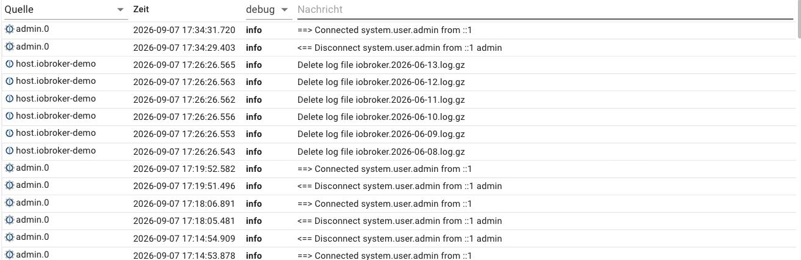

# Tab Protocols

This is where system messages are displayed. The newest one is at the top. If something isn't working, this is the first place to check.

Does the menu item appear? **Protocols** Red indicates an error. The number next to it indicates the count.

## The toolbar

| No. | function                                                                                                                                                      |
| --- | ------------------------------------------------------------------------------------------------------------------------------------------------------------- |
| 1   | **Update log.**                                                                                                                                               |
| 2   | **Pause output.** Instead of the symbol, the number of new, undisplayed messages appears. This is useful if you want to read a specific line at your leisure. |
| 3   | **Delete log**: only clears the display in the browser.                                                                                                       |
| 4   | **Permanently delete from disk**: deletes the log file on the host.                                                                                           |
| 5   | **Show/hide process ID.**                                                                                                                                     |
| 6   | **Show/hide colors**: highlights errors in red and warnings in yellow.                                                                                        |
| 7   | **Reverse output direction**: newest message at the top or bottom.                                                                                            |
| 8   | **Show only errors.** The number next to it indicates the number of errors present.                                                                           |
| 9   | **Display errors and warnings.**                                                                                                                              |
| 10  | **Download log**: loads the complete daily file `/opt/iobroker/log`.                                                                                          |
| 11  | The **Size** the current log file.                                                                                                                            |

The host is standing to the right. In a
[Multi-host system](/docs/config/multihost.md)
The system switches between hosts. Only the messages from the selected host are displayed.

## The list

The columns are **source** (the instance or host), **Time**, the
**Log level** and the **News**The fields in the header allow filtering: by source, by minimum log level, and by text within the message.

Log levels from most detailed to most concise:

| Level                                 | For what                                                       |
| ------------------------------------- | -------------------------------------------------------------- |
| `silly` (in dialogue) **Everything**) | Absolutely every single report. Only if `debug` is not enough. |
| `debug`                               | Internal processes too. For troubleshooting, then reset.       |
| `info`                                | The normal procedure: Start, Stop, Connections.                |
| `warn`                                | Something is unusual, but it continues.                        |
| `error`                               | Something went wrong.                                          |

The level is displayed for each instance in the tab
[Instance](/docs/admin/instances.md)
discontinued, the requirement for new instances in the
[System settings](/docs/admin/settings.md).

Long lines are truncated in the list. Anyone who wants to get to the bottom of a message should download the log file and look there. Often the actual cause is in the lines preceding it.

## If there is an error in the log

Two things almost always help:

1. **Look for the first error message, not the last.** One mistake often leads to further mistakes; the beginning of the chain is interesting.
2. **The log level of the affected instance is at `debug` place**, restart the instance and review the messages again.

If that doesn't help, this might help.
[forum](https://forum.iobroker.net/)That's where the extract from the downloaded log file belongs, not a screenshot of the list.