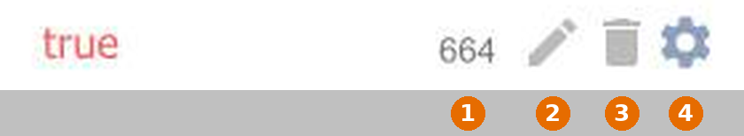

# Objects tab

This tab contains all the objects managed by ioBroker. Each instance creates its own namespace here, containing its devices, channels, and data points. Objects can also be created, edited, and deleted manually, and entire subtrees can be saved as JSON files and restored.

What objects and states actually are is explained under
[objects](/docs/basics/objects.md) and
[Conditions](/docs/basics/states.md).

## The toolbar

The most important commands are located at the top. Each icon has a tooltip; simply hover your mouse cursor over it for a moment.

| No. | function                                                                                           |
| --- | -------------------------------------------------------------------------------------------------- |
| 1   | **Update tree.** If newly created objects are not yet visible, clicking here will help.            |
| 2   | **Configure.** Specifies which columns the table displays and how wide they are.                   |
| 3   | **Open or close all knots.**                                                                       |
| 4   | **Expand one level.**                                                                              |
| 5   | **Fold down one level.**                                                                           |
| 6   | **Switch status view** (see below).                                                                |
| 7   | **Show/hide object descriptions.** Displays the object's description text in addition to its name. |
| 8   | **Add new object** (see below).                                                                    |
| 9   | **Add object tree from a JSON file.**                                                              |
| 10  | **Save the object tree as a JSON file.** The currently selected subtree is saved.                  |

The number of objects and states, as well as the wrench icon, are located on the far right of the toolbar. **Edit custom configuration**This will change the recording settings for **all** Data points were set that exactly match the filter criteria.

Before clicking the wrench icon, be sure to check which filters are set. Otherwise, settings will be applied to far more data points than intended.

## The page content

The objects are listed in a table. The input fields and selection menus below the column headers filter the display.

| No. | Split        | Meaning                                                                                                                                                                |
| --- | ------------ | ---------------------------------------------------------------------------------------------------------------------------------------------------------------------- |
| 1   | **ID**       | The object hierarchy. At the top are the namespaces, below them devices, channels, and data points. The filter field may contain... `*` They are used as placeholders. |
| 2   | **name**     | The object's name, preceded by a symbol indicating its hierarchy level. The name can be edited directly.                                                               |
| 3   | **type**     | Device, channel, state, or directory. The selection menu can be used, for example, to restrict the search to specific states.                                          |
| 4   | **role**     | Tells surfaces like vis what the data point represents (`switch.lock`, `indicator.alarm`, `button` …). Editable, with a suggestion list; free text input is allowed.   |
| 5   | **Space**    | The assigned room. Clicking on the field opens the list of created rooms.                                                                                              |
| 6   | **function** | The assigned trade, for example lighting or heating.                                                                                                                   |
| 7   | **Value**    | The current value is shown for data points. **Red** means: not yet confirmed by the device (`ack = false`).                                                            |
| 8   | **right**    | The object's access rights are expressed as an octal number, similar to Linux file permissions.                                                                        |
| 9   |              | The buttons in the row (see below).                                                                                                                                    |

Rooms and trades are listed in the tab
[Categories](/docs/admin/enums.md) created.

## The status view

symbol **6** displays additional columns for each state: who last set it, its quality, the timestamp, and the time of the last change.

?> `0x00 - good` This means the value is valid. Other values indicate a problem, for example... `0x20 - substitute` for a replacement value.

## Create a new object

symbol **8** Creates an object below the currently selected entry.

As a type **Condition**, **channel**, **Device** and **directory** Available for states is the state type: logic value, number, string, value list, field, object, or a combination thereof. The following structures are permitted: directory → state, directory → channel → state, directory → device → channel → state, device → channel → state, and channel → state.

Without expert mode, custom objects can only be used under `0_userdata.0` and `alias.0`
They will be created. This is not a limitation, but rather the correct place: Objects in the adapters' namespaces will be overwritten the next time they are started.

## The buttons in a row

1. The **right** of the object.
2. The **Pencil** Opens the object editor with all properties. Changes here take effect immediately. Only use if you understand the consequences.
3. The **trash can** This deletes the object and everything below it in the hierarchy. A confirmation prompt will appear beforehand.
4. The **gear** opens the _Custom setting&#x73;_&#x54;his section determines whether and how the data point is recorded. It only appears if at least one instance of history, InfluxDB, or SQL is installed.