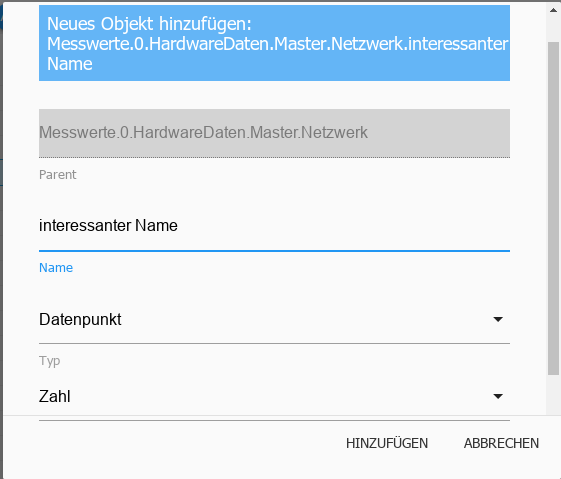

All managed objects are located under this tab. A folder is created for each instance in which the data points created by it are located in a hierarchical structure. Objects can also be created and deleted manually here. Entire object structures can be uploaded or downloaded. Another button enables the expert view to be displayed.

## The title line
In the title bar there are icons for the most important processes. There is context help for each icon. Simply hold the mouse over the icon for a while.

### 1 - Refresh view
If objects that have just been created are not visible, clicking on this icon will help update the status of the page.

### 2 - Change display
This button changes the display of objects on this page.

When the button is active, all objects are listed alphabetically by ID. If this button is not active, the objects are displayed hierarchically alphabetically by instance as a tree structure.

In both cases, self-created namespaces are displayed at the top.

>Attention! Changing views can take a long time

The next two icons are then visible in the tree structure.

### 3 - Close all topics
### 4 - Expand all subject areas
With these two buttons the entire tree structure can be expanded or collapsed.

### 5 - Status view
This button displays further information about the respective states of the data points. (Toggle mode)

Here with the menu bar collapsed

> Attention: Due to the immense flood of data, using this view may cause the display to freeze in list view.

### 6 - Administrator mode
When you select this icon, additional objects are displayed (toggle function).

These objects (and their directories) are system objects and should not be used for normal use, as a change/update by the admin may result in a structural change and thus a loss of personal data.

### 7 - Sort alphabetically
This sorts the folders either by ID or name.

### 8 - Add
After selecting this icon, additional objects can be added.
If a folder is selected, it is adopted as the parent in the object structure. A configuration window opens:

The name for the new object must now be selected, with a device, a channel or a data point being available as the type according to the hierarchical structure. The data point types available are logic value, switch, character string, number, value list, field, object and mixed.

As soon as you confirm the input window with OK, another window opens:

Some data can be entered here. For example, a role and an icon can be added to the object.

The other tabs contain further properties of the object. This type of information is available for every object.

To create a completely new namespace, two things have to be considered:

* No object may be selected. This can be achieved by

Objects tab reopens.

* The topmost object must end with a dot and a number (e.g. MyNamespace.0).

The next levels can then be created in this.

### 9 - Upload
This button uploads a complete object structure as a json file to the ioBroker server

### 10 - Download
With this button, the selected object structure is downloaded as a json file from the ioBroker server and can be saved.

## The page content

The existing objects are displayed in tabular form on the page.

The table consists of the following columns (the fields under column headers 1 and 2 as well as the pull-down menus of the other columns serve as filter criteria). The table in the image is arranged according to hierarchy and some sub-points (nodes) have been expanded:

### 1 - ID
These are the top levels of the object hierarchy. The top level is the name of the instance, for example, and the respective structure of the data is created below it.

### 2 - Name
The name of the object is given in this column. In addition, an icon in front of it shows which hierarchy level it is (device, channel or data point).

The values in this column are editable.

### 3 - Type
The type in the hierarchy level, which was already visible in the Name column by the icon in front, is explicitly mentioned here again. The pulldown menu in the column header can be used to filter by these types and, for example, only display all data points.

### 4 - Role
The role specifies how user interfaces such as .vis and material should handle this data point. This is essentially the function of this object briefly described using a term. This can then be used for filtering.

The values in this column are editable. Clicking on the field brings up a pull-down menu with many entries, but free entries are also possible.

### 5 - Room
If this object has already been assigned to a room, this will be displayed here.
This is also used, among other things, for filtering when searching for objects.

The values in this column are editable. This means that objects can be assigned to rooms at a later date. If you click on the field, a popup opens with the rooms that have been created so far.

### 6 - Function
This column contains the trade to which the corresponding object is assigned.

The values in this column are editable. This means that the objects can be assigned to trades at a later date. If you click on the field, a pop-up opens with the trades that have been created so far.

### 7 - Value
If the object is a data point, the current value of this data point is displayed here.

### 8 - Settings

1.) Clicking on the pencil icon opens a window with the properties of this object. It is the same window that appeared above when creating a new object. Properties of the object can be changed here. This function should be used with extreme caution and only if you know exactly what you are doing with it.

2.) Clicking on the trash can icon deletes this object and all objects below it in the hierarchy. To be on the safe side, a window appears in which the deletion must be confirmed again.

3.) The wrench icon only appears if at least one history instance is installed (History, InfluxDB or SQL). Here the data point for logging historical data can be configured.
Further information can be found in the description of the history adapter.

Using the wrench in the title bar, this action can be performed simultaneously for all data points that match the current filter criteria. It is therefore important to carefully check whether the filter criteria for this page are selected in such a way that only the desired data points are included.

The pulldown menu for filtering this column refers to data points with logged data. With, without and all as well as the installed history instances are available.