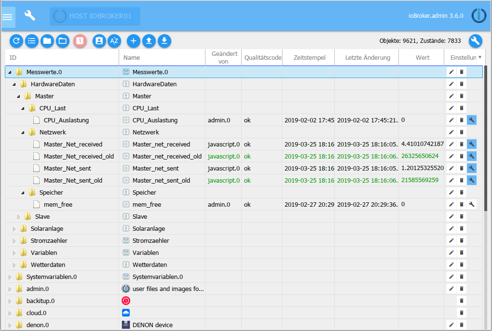
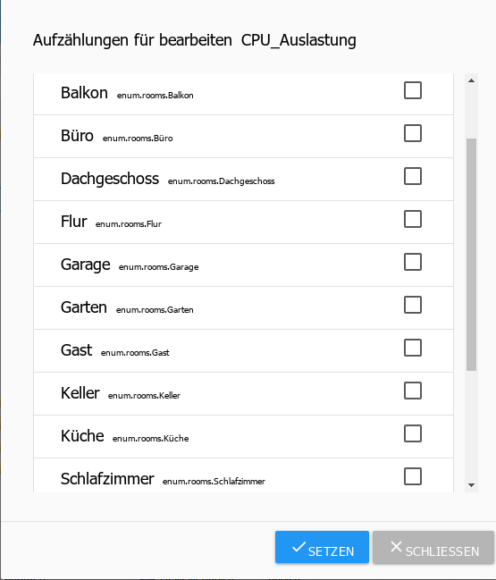
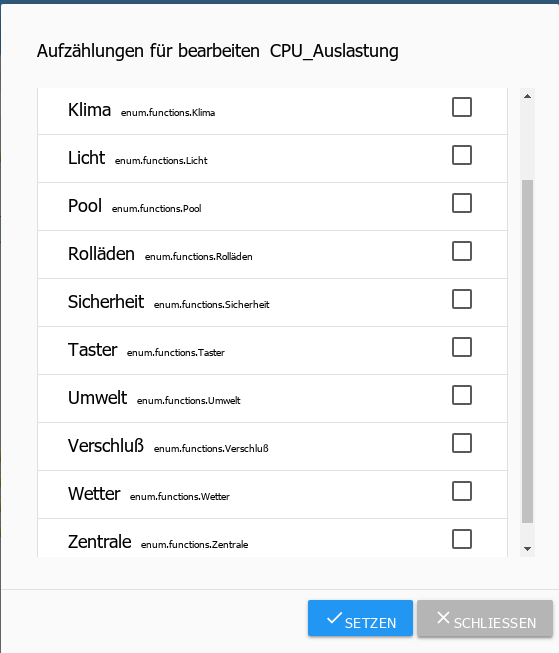

All managed objects are located under this tab. A folder is created for each instance in which the data points created by it are located in a hierarchical structure. Objects can also be created and deleted manually here. Entire object structures can be uploaded or downloaded. Another button enables the expert view to be displayed.

## The title line
In the title line there are icons for the most important processes. There is context help for each icon. To do this, simply hold the mouse on the icon for a while.

### 1 - update view
If objects that have just been created are not visible, clicking this icon helps to bring the status of the page up to date.

### 2 - change display
This button changes the display of the objects on this page.

When the button is active, all objects are sorted alphabetically by ID and listed one below the other. If this button is not active, the objects are displayed hierarchically alphabetically according to instances as a tree structure.

In both cases, self-created namespaces are shown at the top.

> Attention! Changing views can take a long time

The next two icons are then also visible in the tree structure.

### 3 - Close all subject areas
### 4 - Expand all subject areas
With these two buttons the entire tree structure can be opened or closed.
be closed.

### 5 - status view
This button displays further information on the respective states of the data points. (Toggle mode)

Here with the menu bar folded up

> Attention: Due to the immense flood of data, the display may hang up when using this view> in the list view.

### 6 - Administrator mode
If you select this icon, further objects are displayed (toggle function).

These objects (and their directories) are system objects and should not be used for normal use, since a change / update by the admin can lead to a structural change and thus to a loss of personal data.

### 7 - Sort alphabetically
This is used to sort within the folder either by ID or name.

### 8 - Add
After selecting this icon, further objects can be added.
If a folder is selected, it is adopted as the parent in the object structure. A configuration window opens:

The name for the new object must now be selected here, whereby a device, a channel or a data point is available as the type according to the hierarchical structure. Logic value, switch, character string, number, value list, field, object and mixed are available as data point types.

As soon as you confirm the input window with ok, another window opens:

Some data can still be entered here. A role and an icon can be added to the object.

The other tabs contain further properties of the object. There is such information for every object.

To create a completely new namespace, two things must be observed:

* No object may be selected. This can be achieved by using the

New objects tab opens.

* The top item must end with a period and a number (e.g. MyNamespace.0).

The next levels can then be created there.

### 9 - upload
With this button, a complete object structure is uploaded to the ioBroker server as a json file

### 10 - download
With this button the selected object structure is downloaded as a json file from the ioBroker server and can be saved.

## The page content

The existing objects are displayed in a table on the page.

The table consists of the following columns (the fields under column headers 1 and 2 as well as the pull-down menus of the other columns serve as filter criteria). The table in the picture is arranged according to hierarchy and some sub-items (nodes) have been opened:

### 1 - ID
These are the top levels of the object hierarchy. Here, the name of the instance, for example, and the respective structure of the data are created as the top level.

### 2 - name
The name of the object is given in this column. In addition, a preceding icon shows which hierarchy level is involved here (device, channel or data point)

The values in this column can be edited.

### 3 - type
The type in the hierarchy level, which was already visible in the Name column from the preceding icon, is explicitly mentioned again here. The pull-down menu in the column header can be used to filter for these types and, for example, only display all data points.

### 4 - role
The role specifies how user interfaces such as .vis and material should handle this data point. This is basically the function of this object briefly described using a term. You can then filter again.

The values in this column can be edited. Clicking on the field brings up a pull-down menu with a large number of entries, but free entries are also possible.

### 5 - room
If this object has already been assigned to a room, this is displayed here.
This is also used, among other things, to filter when searching for objects.

The values in this column can be edited. In this way, the objects can still be assigned to rooms at a later date. If you click on the field, a popup opens with the rooms that have been created so far.

### 6 - function
This column contains the trade to which the corresponding object is assigned.

The values in this column can be edited. In this way, the objects can still be assigned to trades at a later date. If you click on the field, a popup opens with the trades created so far.

### 7 - value
If the object is a data point, the current value of this data point is displayed here.

### 8 - settings

1.) Clicking on the pencil icon opens a window with the properties of this object. It is the same window that appeared above when creating a new object. Properties of the object can be changed here. This function must be used with extreme caution and only if you know exactly what you are doing with it.

2.) Clicking on the trash can icon deletes this object and all objects below it in the hierarchy. To be on the safe side, a window appears in which the deletion has to be confirmed again.

3.) The wrench icon only appears if at least one history instance is installed (History, InfluxDB or SQL). The data point for logging the historical data can be configured here.
More information can be found in the description of the history adapter.

This action can be carried out simultaneously for all data points that meet the current filter criteria using the wrench in the title bar. It is therefore important to check carefully whether the filter criteria on this page are selected in such a way that only the desired data points are included.

The pull-down menu for filtering this column refers to data points with logged data. With, without and all as well as the installed history instances are available here.