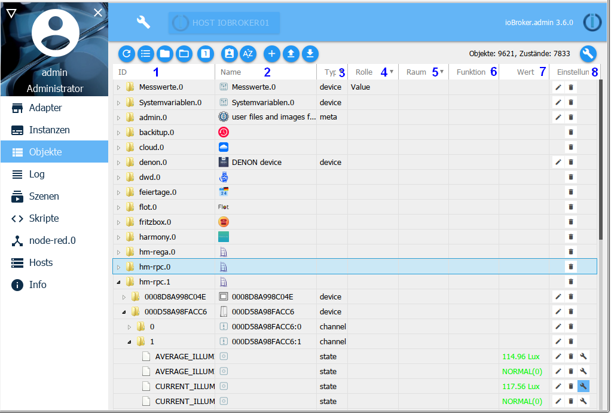
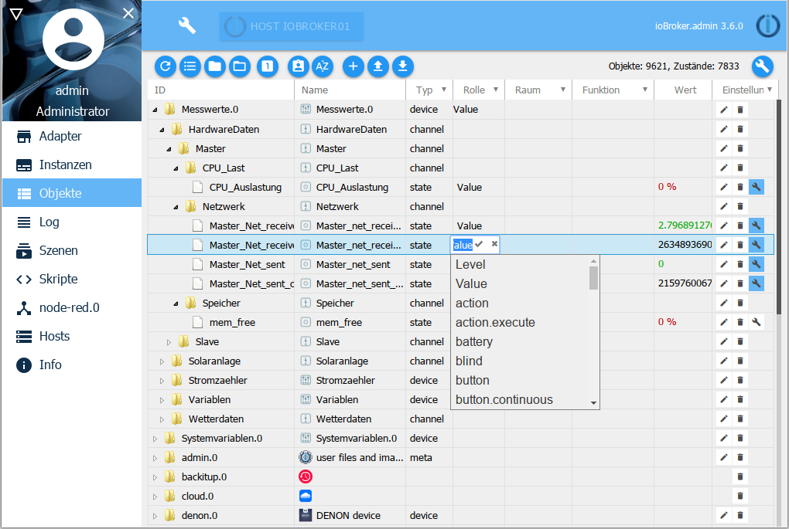
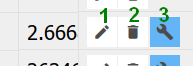

All managed objects are located under this tab. A folder is created for each instance in which the data points created by it are located in a hierarchical structure. Objects can also be created and deleted manually here. Entire object structures can be uploaded or downloaded. Another button enables the expert view to be displayed.

## The title line
The title bar contains icons for the most important processes. There is context help for each icon. Simply hold the mouse on the icon for a while.

### 1 - Refresh view
If objects that have just been created are not visible, clicking on this icon will help update the status of the page.

### 2 - Change Appearance
This button changes the way objects are displayed on this page.

When the button is active, all objects are listed one below the other, sorted alphabetically by ID. If this button is not active, the objects are displayed hierarchically alphabetically according to instances as a tree structure.

In both cases, self-created namespaces are displayed at the top.

>Attention! Changing views can take a long time

The next two icons are then also visible in the tree structure.

### 3 - Collapse all topics
### 4 - Expand all subject areas
The entire tree structure can be expanded or collapsed with these two buttons.
be closed.

### 5 - Status view
With this button, further information on the respective states of the data points is displayed. (toggle mode)

Here with the menu bar collapsed

> Attention: Due to the immense flood of data, when using this view > in the list view, the display may hang up.

### 6 - Administrator mode
When you select this icon, further objects are displayed (toggle function).

These objects (and their directories) are system objects and should not be used for normal use, since a change / update by the admin can result in a structural change and thus loss of personal data.

### 7 - Sort alphabetically
This is used to sort within the folders either by ID or name.

### 8 - Add
After selecting this icon, further objects can be added.
If a folder is selected, it is adopted as the parent in the object structure. A configuration window opens:

The name for the new object must now be selected here, whereby a device, a channel or a data point is available as a type according to the hierarchical structure. Logic value, switch, character string, number, value list, field, object and mixed are available as data point types.

As soon as you confirm the input window with ok, another window opens:

Some data can still be entered here. A role and an icon can be added to the object.

The other tabs contain further properties of the object. There is such information for every object.

To create a completely new namespace, two things must be observed:

* No object may be selected. This is achieved by using the

Objects tab reopens.

* The top object must end with a period and a digit (e.g. MyNamespace.0).

The next levels can then be created there.

### 9 - Upload
With this button, a complete object structure is uploaded to the ioBroker server as a json file

### 10 - Download
With this button, the selected object structure is downloaded as a json file from the ioBroker server and can be saved.

## The page content

The existing objects are displayed in tabular form on the page.

The table consists of the following columns (the fields under column headers 1 and 2 and the pull-down menus of the other columns serve as filter criteria). The table in the picture is arranged according to hierarchy and some sub-items (nodes) have been expanded:

### 1-ID
These are the top levels of the object hierarchy. The name of the instance, for example, is created here as the top level, with the respective structure of the data below it.

### 2 - name
The designation of the object is specified in this column. In addition, a preceding icon shows which hierarchy level is involved (device, channel or data point)

The values of this column can be edited.

###3 - Type
The type in the hierarchy level, which was already evident in the Name column from the preceding icon, is explicitly named here again. You can use the pull-down menu in the column header to filter by these types, e.g. only display all data points.

### 4 - role
The role specifies how user interfaces such as .vis and material should handle this data point. In principle, this is the function of this object briefly described using a term. This can be filtered again.

The values of this column can be edited. Clicking on the field brings up a pull-down menu with a large number of entries, but free entries are also possible.

### 5 - space
If this object has already been assigned to a room, this is displayed here.
This is also used, among other things, for filtering when searching for objects.

The values of this column can be edited. In this way, the objects can still be assigned to rooms at a later date. If you click on the field, a popup opens with the previously created rooms.

### 6 - function
This column contains the trade to which the corresponding object is assigned.

The values of this column can be edited. In this way, the objects can still be subsequently assigned to trades. If you click on the field, a popup opens with the previously created trades.

### 7 - value
If the object is a data point, the current value of this data point is displayed here.

### 8 - Settings

1.) Clicking on the pencil icon opens a window with the properties of this object. It is the same window that appeared above when creating a new object. Properties of the object can be changed here. This function should be used with extreme caution and only if you know exactly what you are doing with it.

2.) Clicking on the trash can icon deletes this object and all objects below it in the hierarchy. To be on the safe side, a window appears in which the deletion must be confirmed again.

3.) The wrench icon only appears if at least one history instance is installed (History, InfluxDB or SQL). The data point for logging historical data can be configured here.
More information can be found in the description of the history adapter.

This action can be carried out simultaneously for all data points that match the current filter criteria using the wrench in the title bar. It is therefore important to check carefully whether the filter criteria on this page have been selected in such a way that only the desired data points are included.

The pull-down menu for filtering this column applies to data points with logged data. With, without and all as well as the installed history instances are available here.