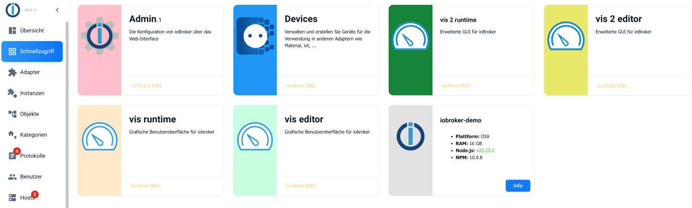
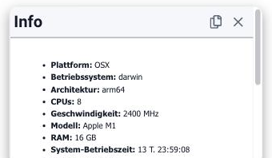
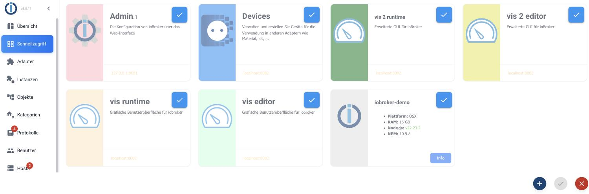

# Overview and quick access

## Tab Overview

The overview is the admin's homepage. It answers the question of whether the system is healthy at a glance and links from there to the relevant tabs.

The host to which the ad refers is shown in the upper right corner, next to it whether it **on-line**
is. Below are four tiles:

| tile          | Meaning                                                                                         |
| ------------- | ----------------------------------------------------------------------------------------------- |
| System status | Collective message from running instances, storage, and log. `OK` This means: no errors remain. |
| adapter       | How many adapters are installed, and how many of them are actively used.                        |
| Instance      | How many instances have been created and how many of them have been started.                    |
| objects       | Number of objects and their describable states.                                                 |

The block **System information** Displays the host's data: platform, architecture, Node.js and NPM version, runtime since the last restart, and current RAM and CPU usage.

If the RAM indicator is constantly maxed out or the Node.js version is not the correct one
[recommended LTS version](/docs/install/nodejs.md)
If that corresponds to the situation, then that's the first point to start with.

Below are the **Active adapter** with its version and its state as well as the last lines from the **System log**. Above _Show all_ does it go into the complete [Instance list](/docs/admin/instances.md)
or into the [Protocols](/docs/admin/log.md).

## Quick Access Tabs

The quick access feature gathers all adapters that have their own web interface as tiles. Clicking on a tile opens that interface at the address shown at the bottom of the tile.

Ultimately, there is one tile per host of the system. In a standard installation, this is the one ioBroker server; in a
[Multi-host system](/docs/config/multihost.md)
the master and all other hosts. The button **info** This tile displays the host's hardware and system information:

## Customize tiles

You can freely choose which tiles are displayed. To do this, click on the pencil icon in the bottom right corner. Each tile will then have a checkmark that can be selected or deselected.

In edit mode, there are three buttons in the bottom right corner:

- **+** Creates a separate tile, for example for a device in the network that does not run via ioBroker.
- **Hook** The selection is saved.
- **X** rejects her.