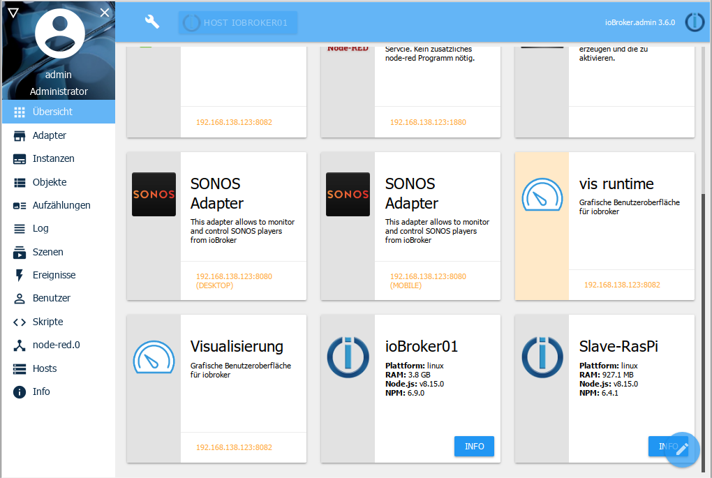
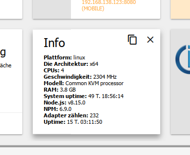

# Overview tab
Information about all adapters with their own web interface as well as about the hosts is displayed here.

If you click on a tile you will be directed to the corresponding website, the address of which is located at the bottom of the tile.

At the very end there is a tile for each host in the system. For standalone installations this is **the** ioBroker server, for multi-host installations these are the master and the slaves.

If you click on the info button on such a tile, further information about the respective host appears:

You can customize the content of this tab according to your own wishes. To do so, click on the pencil icon at the bottom right:

You can then tick off any tiles you don't want. Then confirm your selection with the tick icon or cancel with the X.