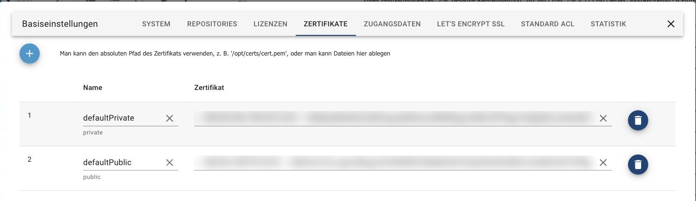

# System settings

The system settings apply to the entire installation. They can be accessed via the **"System"** item at the very bottom of the menu bar and are divided into several tabs.

## system

Here are the basic settings, which the adapters also refer to.


| Attitude                                  | Meaning                                                                                                                                                                                        |
| ----------------------------------------- | ---------------------------------------------------------------------------------------------------------------------------------------------------------------------------------------------- |
| **Plant name**                            | Appears in the admin's header. Useful when managing multiple ioBroker installations.                                                                                                           |
| **System language**                       | The language of the interface. Not every adapter is fully translated.                                                                                                                          |
| **temperature unit**                      | °C or °F. Some adapters use either.                                                                                                                                                            |
| **Currency symbol**                       | For example`€` .                                                                                                                                                                               |
| **Date format**                           | Applies to admin and vis.                                                                                                                                                                      |
| **Floating divisor characters**           | Comma or period for decimal numbers.                                                                                                                                                           |
| **Standard history**                      | Which instance records values when multiple instances of history, SQL, or InfluxDB are installed.                                                                                              |
| **Expert mode**                           | Whether expert mode is already enabled when opening the admin interface. The switch in the bottom left of the menu bar only applies to the current browser session; this setting is permanent. |
| **Standard protocol level**               | The log level that **new** instances receive. Existing instances remain unchanged.                                                                                                             |
| **First day of the week**                 | For calendar and schedule displays.                                                                                                                                                            |
| **Country, city, latitude and longitude** | The location of the system. Adapters for sunrise and sunset, weather, or astronomical time schedules are included. The map next to it is for reference only.                                   |

Anyone using schedules like "half an hour after sunset" should first set the correct location, otherwise ioBroker will use the preset location.

## Repositories

ioBroker retrieves its adapter list from a repository. Two are included by default:


- **Stable** : the tested versions. This is the right choice for a system that needs to run reliably.
- **beta** (also _Latest_ ): the latest versions, not yet fully tested.

The checkmark in the **Active** column determines which repository is used. If _beta_ is active, a corresponding warning appears in the Adapter tab.

If there are additional entries from an old installation, they should be removed. They are no longer maintained.

The " **Allow only the automatic execution of the following upgrades"** setting determines whether ioBroker Adapter is allowed to update itself and up to which version level.

## Certificates

The certificates for HTTPS are located here. They are used by admin, web, simple-api and socketio.



Ex-works`defaultPrivate` and`defaultPublic` These default certificates are the same in every installation and therefore **insecure** : they only allow an encrypted connection without any verification capabilities. For external access, you need your own certificates, either self-generated, purchased, or from Let's Encrypt.

A certificate can be stored as a file or specified as an absolute path, for example`/opt/certs/cert.pem` .

!> Try new certificates first with the **web** adapter, not with the admin adapter. Otherwise, you might lock yourself out.

### Rights to the certificate files

If a path is specified, the user must`iobroker` be allowed to read the file:`644` for the file,`755` for the parent directories. If the necessary permissions are missing, the log will report something like:

```
web.0 (24704) Cannot create webserver: Error: error:0909006C:PEM routines:get_name:no start line
```

This can be checked by the user.`iobroker` :

```bash
su iobroker
ls -l /pfad/zum/zertifikat
```

At the beginning of the line,`-rw-r--r--` stand. Otherwise as`root` :

```bash
chmod 644 /pfad/zum/zertifikat
chmod 755 /pfad/zum
```

If the entry points to a symbolic link, the rights of the target apply.

## Let's Encrypt SSL

[Let's Encrypt](https://letsencrypt.org/) issues free certificates. ioBroker can request and renew them automatically; this option is available in almost every adapter that starts a web server with HTTPS.

The process: ioBroker creates an account with the email address entered here and starts a small web server on **port 80** the first time the address is accessed. Let's Encrypt stores a verification string there and reads it from...`http://<adresse>/.well-known/acme-challenge/` It then sends the certificate. It is valid for approximately 90 days and is then automatically renewed.

Port 80 must be free and accessible from the outside. If another service is using it, the check will fail.

If that doesn't work or no port should be opened: For access from anywhere, the [IoT adapter](/adapters/iot) is the easier way because it doesn't require open ports.

## Standard ACL

Specifies which rights **newly created** objects, states and files receive, separated by owner, group and everyone else.


This page does not change the permissions of existing objects. Users and groups themselves are managed in the [Users](/docs/admin/users.md) tab.

## statistics

ioBroker can send anonymous usage statistics to the project.


On the left, you select the scope of data transfer; on the right, you'll find a clear description of what would actually be transmitted: from the installation ID and node version to the platform and a list of installed adapters. No personal data is included. This analysis helps the project identify which adapters and platforms are actually being used.

## Other riders

- **Licenses** : License keys for paid adapters are stored here. Information on which adapters require a license and what the license is tied to can be found under [Adapter Licenses](/docs/licenses/adapter.md) .
- **Access data** : central login data that multiple adapters can access, instead of storing it individually.