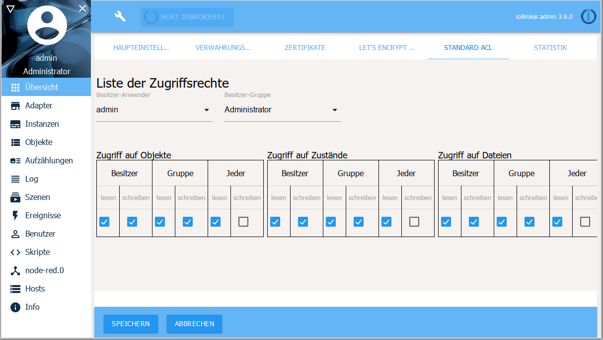

The system settings can be accessed from any menu item in the admin via the wrench icon in the title bar of the screen.

## System settings
In the main settings, basic parameters for ioBroker are set, which are also used by the adapters in ioBroker.

Some parameters are already taken from the settings of the host.

**System language**

this allows you to choose between different system languages. It is possible that not all languages are fully supported yet.

**Temperature unit**

this value is used by some adapters. Possible is °C or °F.

**Currency**

The desired currency format, e.g. €, can be entered here. At the moment it doesn't use an adapter.

**Date Format**

The selection made is displayed in admin and vis.

**Float Divider Character**

Comma or period for float values

**Default History**

If the adapter for logging data points is installed, the corresponding adapter is selected here

If only one history adapter (SQL/History/InfluxDB) is installed, it will be used. If there are several, you can select one.

**Expert Mode**

tbd

**Default log level**

tbd

**First day of the week**

tbd

**Local Settings**

tbd

## Repositories

ioBroker can get the adapter list from different sources. The following sources are entered during installation:

* stable: http://download.iobroker.net/sources-dist.json
* beta: http://download.iobroker.net/sources-dist-latest.json

If other repositories from an older installation are entered here, they should be deleted as they are no longer maintained.

## Licenses

## Certificates

This is the central location for the certificates used for SSL/HTTPS communication. The certificates are used by admin, web, simple-api, socketio. Standard certificates are installed by default. You can't verify anything with that. They are only used for SSL communication. Because the certificates are open, you should use your own (self-signed) certificates, buy real certificates, or switch to Let's Encrypt. Communication with default certificates is not secure and if someone wants to read the traffic, this could be done. Be sure to install your own certificates.
E.g. under linux.

Certificates can either be specified as a path or uploaded completely using drag and drop

It is generally a good idea to test new certificates with the web adapter and not directly with the admin adapter, so as not to lock yourself out of the system.

When specifying a path, the correct permissions for the iobroker user must be present.

For the file itself 644, for the parent directories 755.

If the rights are wrong, an error message appears like:

``web.0 (24704) Cannot create webserver: Error: error:0909006C:PEM routines:get_name:no start line``

You can check access by logging into the server as user root, then switching to the iobroker user and listing the certificate file:

``su iobroker``

``ls -l /Pfad/zum/Zertifikat``

You should see **-rw-r--r--** at the beginning of the line.

If the actual certificate is linked, the rights of the link target must be checked.

Here comes a message like

``ls: Zugriff auf '/Pfad/zum/Zertifikat' nicht möglich: Keine Berechtigung``

The rights must be adjusted.

As root user for the file:

``chmod 644 /Pfad/zum/Zertifikat``

For the parent directories:

``chmod 755 /Pfad/zum``

## Let's Encrypt SSL

Let's Encrypt is a free, automated and open source certificate authority from the independent Internet Security Research Group (ISRG).

For more information on Let's Encrypt see [here](https://letsencrypt.org/).

Some installations use Dynamic DNS or similar to reach their own domain via an address assigned from there. ioBroker supports the automatic request and renewal of certificates from the Let's Encrypt organization.

The option to use Let's Encrypt's free certificates exists in almost every adapter that can start a web server and supports HTTPS.

If you activate the option to use certificates, but not the automatic update, the corresponding instance tries to work with saved certificates.

If automatic updates are enabled, the instance tries to request certificates from Let's Encrypt and updates them automatically.

The certificates are requested for the first time when the corresponding address is called up for the first time. This means that if you configure e.g. "sub.domain.com" as an address and then call up https://sub.domain.com, the certificates are requested for the first time, which can take a while before the answer comes.

Issuing the certificates is a complex procedure, but by following the explanation below, getting the free certificates should be easy.

**Method:**

A new account with the entered email address must be created (setup for this in the system settings)

A random key is generated as a password for the account.

When the account is created, the system opens a small website on port 80 to verify the address.

Let's encrypt always uses port 80 to check the address.

If port 80 is already being used by another service, point 4 applies – i.e. assign a different port to the other service!

When the small web server is started, the request for the certificates for the addresses specified in the system settings is sent to the Let's encrypt server.

The Let's Encrypt server sends back a challenge phrase in response to the request and after a while tries to read this challenge phrase at the address "http://yourdomain:80/.well-known/acme-challenge/".

When the server gets this challenge phrase back from our side, the Let's Encrypt server sends the certificates. These are saved in the directory that is entered in the system settings.

This sounds complex, but all you have to do is check a few checkboxes and enter the email address and web address in the system settings.

The certificates received are valid for approximately 90 days. After these certificates have been issued for the first time, another task is started that automatically extends the validity.

This topic is quite complex and thousands of things can go wrong. If that doesn't work, we recommend using the IoT adapter for access when you're on the go.

Let's Encrypt only works with a node.js version >=4.5

## Default ACL

In this sub-page, the access rights for different areas can be defined for all users/groups

## Statistics

So that we have a little overview of the installations (adapters used) and the geographic distribution, we would be very happy if we got this information.

You can send different amounts of information. This scope can be selected on the left.

The right-hand side then shows which data is being sent.
This data is evaluated absolutely anonymously.