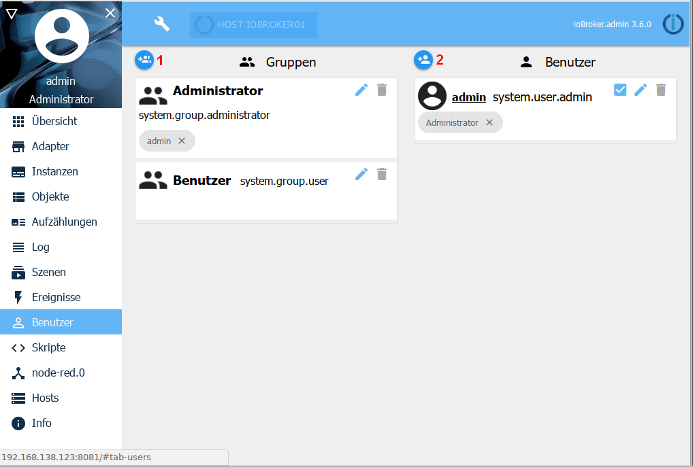
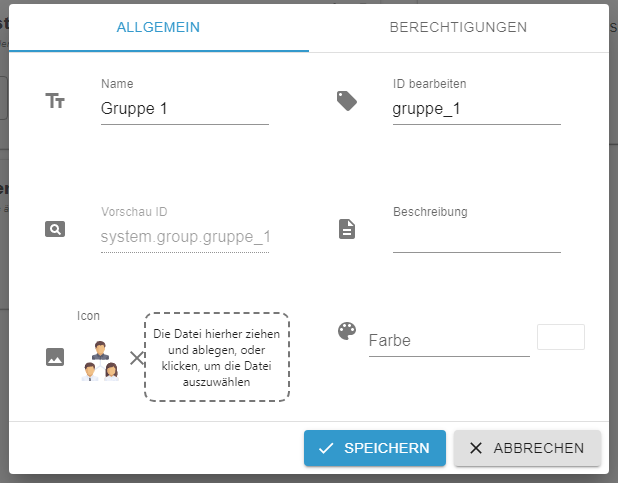
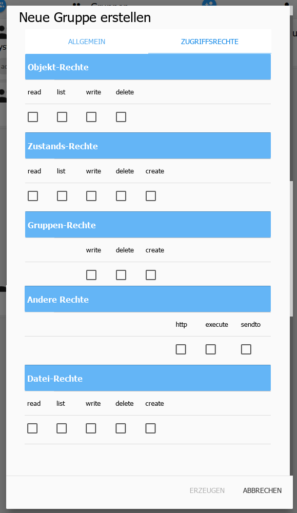
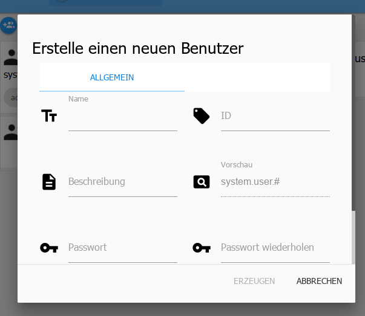

# The User page
On this page, users and groups can be created and rights for the groups can be assigned.

On the left side are the existing groups, on the right side are the users.

Users can be added to groups by simply dragging and dropping.

## 1.) new group
After clicking this icon, another window opens:

This window consists of two sub-units.

### Generally
The basic things are entered here:

**Name** - The name of the group. This name can be freely chosen, but must be unique.

**ID** - The ID is filled in automatically

**Description** - This field can be used to provide an explanation of the tasks of this group.

**Preview** - Automatically displayed and contains the full ID `system.group.groupname`.

An icon can be added using the [+] button, but it can also be dragged and dropped onto the window.

**Color** - The color set there will be used to underline the tile of the group.

### Access rights
The rights are assigned to groups. In order for users to have certain rights, they must be assigned to the corresponding group.

This is where access rights for the various tasks are assigned.

## 2.) new user
After clicking this icon, another window opens:

**Name** - The name of the user. This name can be freely chosen, but must be unique.

**ID** - The ID is filled in automatically

**Description** - In this field you can enter an explanation about the user.

**Preview** - Automatically displayed and contains the full ID sytem.group.Username.

**Password** - The user's password

**Repeat password** - To avoid typos, the password must be entered here a second time