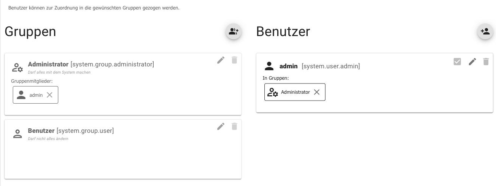

# User tab

This is where users and groups are managed. Groups are listed on the left, users on the right; a user is assigned to a group by dragging their mouse onto the group.

There are two groups available from the factory:

| group                                             | right                                                   |
| ------------------------------------------------- | ------------------------------------------------------- |
| **Administrator** (`system.group.administrator` ) | Anything is allowed. The user is located here.`admin` . |
| **Users** (`system.group.user` )                  | Limited rights.                                         |

A new user is created using the button in the upper right corner, and a new group using the button on the left. The pencil icon opens the editing interface: name, description, icon, color, and, for users, the password. Group permissions are also set there, separately for objects, states, users, files, and some special permissions. The meaning of each permission is explained under [Access Management](/docs/config/userrights.md) .

These users are **not** the operating system users. They only apply within ioBroker: for logging into the admin interface, the vis interface, and the web adapters.

The permissions that **newly created** objects receive are specified in the [system settings](/docs/admin/settings.md) under _Standard ACL_ .

## How long a registration is valid

If authentication is enabled, two values in the admin instance configuration determine how long you remain logged in:

| Attitude                                 | Meaning                                                                                                                               |
| ---------------------------------------- | ------------------------------------------------------------------------------------------------------------------------------------- |
| **Duration of the registration session** | The lifespan of the access token. It does not expire while the admin interface is open: the interface renews the token automatically. |
| **Stay logged in for**                   | How many days the login will remain active without requiring a new password if the admin interface is closed in between.              |

Both values were previously fixed at one hour and one week. Users running the admin interface on a wall-mounted tablet set the second value higher; those accessing it remotely set it lower.

In a fresh installation, login to the admin interface is not enabled. Anyone on the network can access the interface. To make ioBroker accessible beyond the home network, enable authentication in the admin instance configuration and assign a password.`admin` More information can be found under [User Rights](/docs/config/userrights.md) .