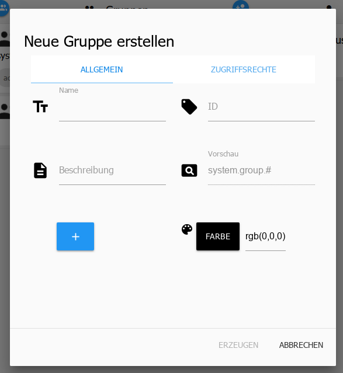

# The Users page
Users and groups can be created on this page and rights can be assigned for the groups.

The existing groups are on the left and the users are on the right.

Users can be dragged into the groups with a simple drag and drop.

## 1.) new group
After clicking on this icon, another window opens:

This window consists of two sub-units.

### General
The basic things are entered here:

**Name** - The name of the group. This name can be freely selected, but must be unique.

**ID** - The ID will be filled in automatically

**Description** - An explanation of this group's responsibilities can be entered in this field.

**Preview** - Automatically displayed and contains the full ID `system.group.groupname`.

An icon can be added via the [+] button, but this can also be dragged and dropped onto the window.

**Color** - The tile of the group is highlighted with the color set there.

### Access Rights
The rights are assigned for groups. In order for users to have certain rights, they must be assigned to the appropriate group.

The access rights for the various tasks are assigned here.

## 2.) new user
After clicking on this icon, another window opens:

**Name** - The user's name. This name can be freely selected, but must be unique.

**ID** - The ID will be filled in automatically

**Description** - A description of the user can be entered in this field.

**Preview** - Automatically displayed and contains the full ID system.group.Username.

**Password** - The user's password

**Repeat password** - To protect against typing errors, the password must be entered a second time here