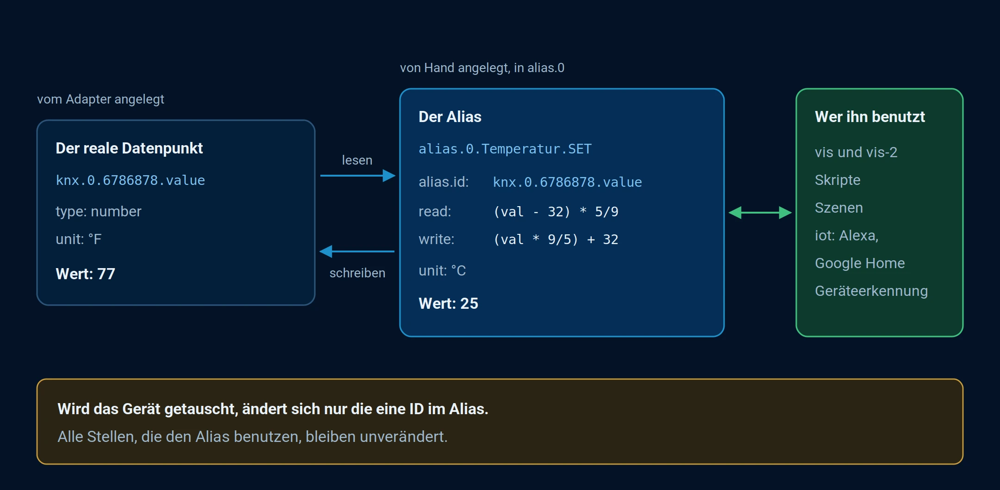

# Alias

An alias (pseudonym) is a virtual data point that is linked to a real data point.

## Use cases

Often the actual devices are defective and the user has to replace them. In addition to replacing the hardware, the device's address is also changed. For example, from`hm-rpc.0.ABC123` in`hm-rpc.0.QJU978` .

Since the old address was used in many places such as vis, Javascript, scenes or others, the user now has to find all these places and replace it there.

This function allows the user to assign an alias to the data point of a physical device and use this alias in all cases. If the device needs to be replaced, only the ID in the alias needs to be changed.

Another use case for this function is supporting devices in special smart adapters such as IoT or Material. Aliases can be used to create the necessary status structure, but the values are read from physical devices.



_The alias acts as an intermediary between the real data point and everything that uses it. It performs conversions during reading and writing._

## Explanation

All data points that are in the object namespace`alias.0` Data points that are created are managed as alias data points.

The value of the alias is read from the linked data point (target), but object properties (such as common, native) are themselves read from the alias data point.

In fact, a`alias` The object's value is that of the target object. If permitted, both values can be changed and are automatically synchronized by the ioBroker core system. Both states can also be used to subscribe to scripts and should behave identically.

Here is an example of such an object:

```
{
  "_id": "alias.0.Light.Device_1.WORKING",
  "type": "state",
  "common": {
    "alias": {
      "id": "admin.0.connected"
    },
    "name": "WORKING",
    "role": "indicator.working",
    "type": "boolean"
  },
  "native": {}
}
```

`native` is always empty because there is no device behind the alias and all settings are in`common` be saved.

In the`common.alias.id` The ID of the data point whose value needs to be read or written is stored.

Alias automatically converts the value if min/max settings are defined for both objects (alias and target).

For example, if the alias`min=0,max=100` and the goal`min=0,max=255` When reading, the value 10 from the target status is converted to 3.9215686274509802 and the value written to the alias 10 is converted to 25.5.

The types are also converted automatically: from string to number, from number to boolean, and so on. It depends on the alias and target types.

Additionally, writing and reading functions can be integrated into`common.alias` to be defined:

```
{
  "_id": "alias.0.Temperature.SET",
  "type": "state",
  "common": {
    "alias": {
      "id": "knx.0.6786878.value",
      "write": "(val * 9/5) + 32",
      "read": "(val − 32) * 5/9"
    },
    "unit": "°C",
    "name": "Temperature",
    "role": "value.temperature",
    "type": "number"
  },
  "native": {}
}
```

Goal

```
{
  "_id": "knx.0.6786878.value",
  "type": "state",
  "common": {
    "unit": "°F",
    "name": "Temperature",
    "role": "value.temperature",
    "type": "number"
  },
  "native": {}
}
```

If conversion functions are defined, automatic conversion is disabled. For read-only functions, the write function could be omitted, and similarly for write-only functions, the read function could be omitted.

Z.

```
{
  "_id": "alias.0.button",
  "type": "state",
  "common": {
    "alias": {
      "id": "knx.0.6786879.value",
      "write": "val ? 1 : 0"
    },
    "name": "Button",
    "role": "button",
    "type": "boolean"
  },
  "native": {}
}
```

Goal

```
{
  "_id": "knx.0.6786879.value",
  "type": "state",
  "common": {
    "name": "KNX Switch",
    "role": "value",
    "type": "number",
    "min": 0,
    "max": 1
  },
  "native": {}
}
```

Subscriptions are managed automatically. When an alias is subscribed to, the target ID is also subscribed to.

The target device ID can be dynamically changed (via the administrator), and the subscription will be updated for a new target ID.

Since version 3.0 of the js-controller, separate status and command data points can be merged in the alias:

- \`alias.id.write\` contains the ID of the data point that is set when the alias is written.
- \`alias.id.read\` contains the ID of the data point that is mirrored by the alias.

```
{
    _id: "alias.0.aliasName",
    common: {
        name: 'Test AliasC',
        type: 'number',
        role: 'state',
        min: -10,
        max: 10,
        alias: {
            id: {
                read: 'state.id.to.read.from',
                write: 'state.id.to.write.to'
            }
            read: 'val * 10 + 1',
            write: '(val - 1) / 10'
        }
    },
    native: {},
    type: 'state'
}
```