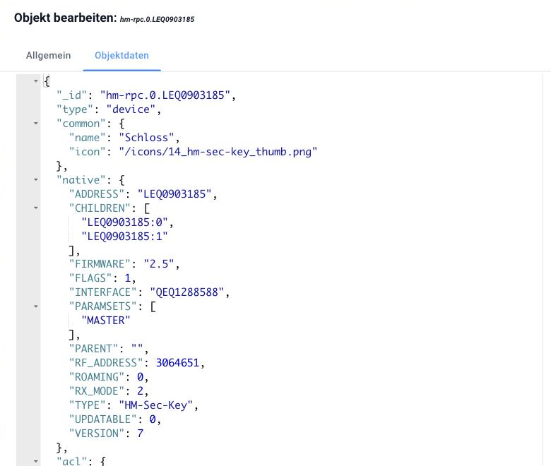

# objects

In ioBroker there are two types of information, and the difference between them explains almost everything else:

- **objects** describe, _What_ Something is. They rarely change: a name, a unit, the indication of whether something may be read or written.
- **Conditions** The values themselves are - 23.5 °C, `true`"Living rooms." They are constantly changing. They are on a separate page:
  [Conditions](/docs/basics/states.md).

A thermometer is therefore not "21.3". It is an object that says: _Here comes a number, it has the unit °C, it is readable but not writable, and it is called "living room temperature"._ The value 21.3 depends on that.

## The address: the ID

Each object has an ID. It is hierarchically structured and separated by periods - like a file path, only with periods instead of slashes.

```
hm-rpc.1.ABC110022.2.VALUE
```

| Part        | Meaning                                               |
| ----------- | ----------------------------------------------------- |
| `hm-rpc`    | the adapter                                           |
| `1`         | its instance - the second one, counting starts from 0 |
| `ABC110022` | the device address                                    |
| `2`         | the canal                                             |
| `VALUE`     | the data point                                        |

Everything that an adapter creates lies within its own namespace.
`<adapter>.<instanz>.`In addition, there are some fixed namespaces:

| namespace                       | Contents                                                                        |
| ------------------------------- | ------------------------------------------------------------------------------- |
| `system.`                       | everything that concerns ioBroker itself                                        |
| `system.adapter.`               | the configuration of the adapters and their instances                           |
| `system.host.`                  | the computers on which ioBroker is running                                      |
| `system.user.`, `system.group.` | Users and groups                                                                |
| `enum.`                         | Rooms, trades and other groups                                                  |
| `alias.`                        | [Aliase](/docs/basics/alias.md) - custom, stable names for external data points |
| `0_userdata.0.`                 | Space for your own objects - see below                                          |
| `scripts.js.`                   | the scripts of the javascript adapter                                           |

IDs can be up to 240 bytes long. The following characters are not allowed:
``[ ] * , ; ' " ` < > \ ?``; from `^ $ ( ) /` It is not recommended. Those creating their own data points are best advised to stick to letters, numbers, underscores, and periods.

## The structure of an object

Each object has four fields:

| Field    | What it contains                                                                                   |
| -------- | -------------------------------------------------------------------------------------------------- |
| `_id`    | the address from above                                                                             |
| `type`   | what type of object it is (see below)                                                              |
| `common` | ioBroker's view: Name, type, unit, role, read and write permissions                                |
| `native` | The target system's perspective: everything that only the connected device or service understands. |



The image shows a Homematic door lock. `common` It states what ioBroker needs to know about it – the name and a symbol. `native` The device's world is defined: address, firmware, radio address, device type. ioBroker doesn't read any of this; the adapter needs all of it.

The separation of `common` and `native` This is the reason why a widget in the visualization can handle a Homematic data point just as well as a Zigbee data point: What ioBroker needs is always located in the same place in
`common`As far as the device itself is concerned, it remains in `native` and doesn't bother anyone.

## The types of objects

In everyday life, you will encounter primarily the first five:

| type            | What it is                                           |
| --------------- | ---------------------------------------------------- |
| `state`         | a data point - the location where a value is stored  |
| `channel`       | summarizes several data points that belong together  |
| `device`        | combines channels into one device                    |
| `folder`        | a folder, purely for organizational purposes         |
| `enum`          | a grouping: room, trade, own category                |
| `adapter`       | the template of an installed adapter                 |
| `instance`      | a running copy of it                                 |
| `host`          | a computer running ioBroker                          |
| `user`, `group` | Users and groups                                     |
| `script`        | a script                                             |
| `meta`          | Rarely changing additional information of an adapter |
| `config`        | settings, for example `system.config`                |
| `chart`         | the description of a diagram                         |

Device, channel, and data point do not form a mandatory hierarchy – some adapters create devices and channels, others only data points in folders. Both are permitted.

## Where you can see them

In the admin area under _object&#x73;_&#x54;he tree there is exactly this structure: Each level between two points is a row. The tool icon at the end of a row allows you to edit the object, while the magnifying glass lets you view the raw content – and that is often more instructive for understanding than any description.


This is how the image should be read from top to bottom: `hm-rpc` is the adapter `0` his instance, `LEQ0903185` a device (“lock”), including two channels, and in the channel `1` The data points are located in the column. _type_ names the type of object and the column for each row. _role_ It says what a data point represents, and the current value is on the far right.

The namespace `system.` is only in **Expert mode** Visible (the switch at the top of the toolbar). This is intentional: there's nothing there that you would normally interact with.

Objects created by an adapter belong to that adapter. Manually modifying them will result in the changes being overwritten the next time the instance is started. If a data point should permanently have its own name or entity, a
[Alias](/docs/basics/alias.md) the right way.

## Own objects: `0_userdata.0`

For objects that do not originate from an adapter—a marker for a script, a self-maintained setpoint, a clipboard between two automations—there is a separate namespace: **`0_userdata.0`**.

It doesn't belong to any adapter and isn't overwritten by any. That's precisely why it's the right place. Data points placed in an adapter's namespace might be gone the next time the instance starts.

They are created in the admin area under _objects_ via the plus sign, or from a script - there with the **complete** ID:

```js
createState('0_userdata.0.Heizung.Sollwert', 21, { type: 'number', unit: '°C', read: true, write: true });
```

Without the full path, it `createState` the data point below the script instance (`javascript.0.…`This works, but the data then remains on an adapter that doesn't own it.

## Where the objects are located

Objects and states are in **two separate databases** They are held separately – that's why they sometimes appear separately in the interface. Both are managed by the js-controller, and both come in several versions:

| Filing  | For what                                                                                           |
| ------- | -------------------------------------------------------------------------------------------------- |
| `jsonl` | the default since js-controller 4 - files `objects.jsonl` and `states.jsonl` in the data directory |
| `file`  | the older file format, still found in older installations                                          |
| `redis` | a database in memory, for large systems                                                            |

Both databases will be used in this process. **separated** It is therefore possible, and even the usual way, to only put the states into Redis and the objects in
`jsonl` To allow: the states change constantly, the objects almost never.
`iobroker status` shows what is currently in use.

For the vast majority of installations, this setting is correct. Only if the js-controller consistently consumes a lot of processing power and the system appears sluggish is it worth looking into other options.
[Redis](/docs/config/redis.md).

These two databases only ever hold the **current** Current status. A data point doesn't know its value yesterday. If you need a historical record, for example for a chart, activate recording, see below.
[Data recording](/docs/config/history.md).

## Read more

- [Conditions](/docs/basics/states.md) - the values themselves and the ack flag
- [Roll](/docs/basics/roles.md) - what `common.role` means
- [Enumerations](/docs/basics/enums.md) - Rooms and trades
- [Object structure](/docs/dev/objectsschema.md) - the complete reference for developers