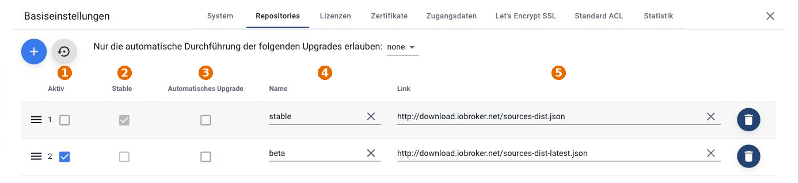
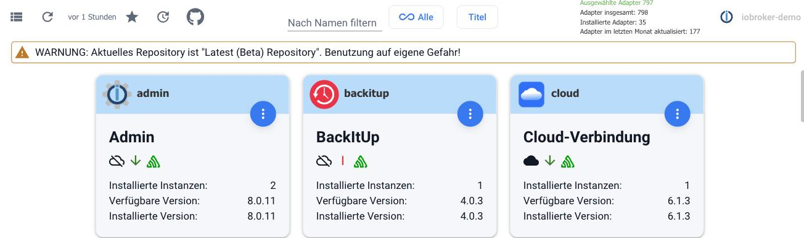

# What is a repository?

A repository is a central storage location for software. The adapters that the administrator offers for installation come from such a repository.

ioBroker comes with two:

| Repository | Contents                                                                                                         |
| ---------- | ---------------------------------------------------------------------------------------------------------------- |
| **stable** | Adapter versions that have been tested and can be used on a production system. Pre-configured.                   |
| **beta**   | Versions that are still in the testing phase and may contain bugs. This repository was formerly called _latest_. |

For an installation that is to run reliably, the following is essential: **always** The stable repository has been discontinued. The versions in the beta repository may contain bugs that affect the entire system.

## Select the repository

The setting is in the
[System settings](/docs/admin/settings.md)
in the rider **Repositories**They are opened via the point **system** at the very bottom of the admin menu bar.

| No. | Split                                                                                               |
| --- | --------------------------------------------------------------------------------------------------- |
| 1   | **Active**: here you select which repository is used.                                               |
| 2   | **Stable**: is automatically set on the first read if ioBroker recognizes the repository as stable. |
| 3   | **Automatic upgrade**: whether adapters from this repository may be updated independently.          |
| 4   | **name**: freely selectable.                                                                        |
| 5   | **link**: the address of the adapter list.                                                          |

The top left corner places the **+** another repository. The button with the arrow next to it sets the paths of _stable_ and _beta_ reverts to the default settings and also deletes any repositories that you have added yourself.

The default paths are:

- stable: `http://download.iobroker.net/sources-dist.json`
- beta: `http://download.iobroker.net/sources-dist-latest.json`

If the beta repository is active, the tab indicates
[adapter](/docs/admin/adapter.md) with a warning:

## A single adapter from the beta repository

Previously, this meant switching from stable to beta, installing the adapter, and then switching back, although the latter step was often forgotten. This is no longer necessary.

- The **Expert mode** turn it on (the icon in the bottom left of the menu bar).
- In the rider **adapter** on **Install from your own source** Go. The symbol with the Octocat.
- In the rider **From npm** Select the desired adapter.

This allows you to install the latest version of a single adapter without having to change the repository. All other adapters continue to come from the stable repository.

!> **Dependencies are not checked using this method.** And you only install an adapter directly from GitHub if the developer explicitly requests it, for example for testing or bug fixing. Such versions are still under development and may not even work in the meantime.

## How an adapter gets into the repository

Long before an adapter appears in the admin area, the developer submits a request for inclusion. Experienced developers review the source code and provide feedback on what still needs to be done.

A new adapter will be available first in **beta**-repository and is tested there by testers. Once the reported bugs are fixed, the version moves to the main repository.
**Stable**-Repository. After a major change in functionality, an adapter usually goes through the same process again.