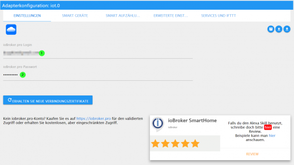
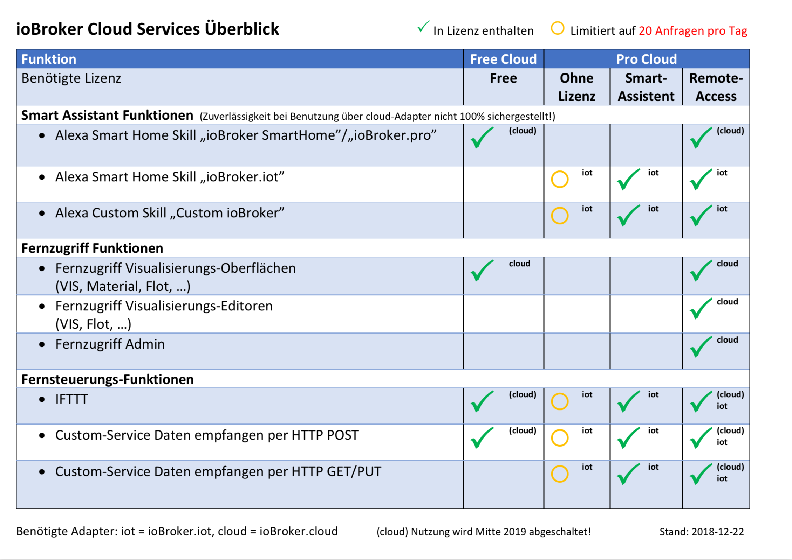

# IoT Cloud
Origin: https://forum.iobroker.net/topic/17834/ank%C3%BCndigung-weihnachtsaktion-assisten-service-iobroker-iot-reloaded-alexa-und-services

Controlling your devices via Alexa will be easier than ever.
Learn how to use the cloud adapter to seamlessly connect with Alexa to make your home smarter. Unfortunately, it has become clear that existing solutions cannot always keep up with the growing number of users.
That's why we introduce you to the IoT service, a future-proof solution specifically designed for smooth integration with Alexa and other assistants.

To ensure that the setup of the IoT instance and the connection to it works, the new assistant license package can only be purchased once a connection has been successfully created, the link is successful and the control of at least one device has also worked.
So don't be surprised that nothing is available in the Pro Cloud account.

Therefore, please follow the updated instructions first:

1. If there is no Pro account yet, register an account at https://iobroker.pro/intro.

Otherwise just use the existing pro account.

Newly created accounts have a 7 day “trial version” of the assistant license with a limit of 20,000 requests per month.
However, a purchased assistant license starts immediately, so no remaining days are taken into account! After the 7 days without purchasing an assistant license, up to 20 requests per day will be transferred free of charge.
Then it is closed for the day.

Existing Pro accounts without a license can also test the assistant package for 7 days when the campaign starts - these 7 days start when the IoT service user is created by entering the login data in the IoT adapter.

Pro accounts with an existing Assistant or Remote Access license also have 20,000 requests per month.

2. Then install the ioBroker.IoT adapter (Cloud-IoT connection) from the normal repository - simply filter for "IoT".

When configuring the adapter, please enter the login data from https://iobroker.pro (email in lower case and password! No app key or anything!).
The “Get new connection certificates” or “Recreate IoT credentials” buttons are only needed in error cases.

If the IoT adapter is already installed, please check whether updates are available and update to 0.2.2.

Continue to make all the necessary settings here and check smart devices.
Normally, the same devices should be listed in the IoT adapter as in the previous cloud adapter.
If this is not the case, then you may have defined the devices only for the previous cloud adapter instance using the “Own settings (pro only)” option.
Then the devices must be re-stored in IoT! It is also recommended to create groups in the ioBroker IoT adapter rather than on Amazon, as groups on Amazon cause unnecessary traffic because Amazon sends its own control command for each device!

3. The adapter should now connect to the IoT service and turn green.

If that doesn't work and the adapter is yellow, for example, then please check the log file and see the FAQ below.
Restarting the instance can also help.
Most of the time it's simple things like incorrect login details (note: also pay attention to upper and lower case letters!)! The error messages in the log have been improved and should now better explain what the problem is.

If you have previously used the cloud adapter and only Alexa control is necessary, it is best to deactivate the cloud adapter as it is no longer needed!

4. After the first connection, an Alexa account will be automatically created with the same password as ioBroker.pro.

The iobroker.iot instance must be “green”.

5. It may happen that the passwords containing the `#` symbol do not work yet.

The problem is being investigated, so please do not use `#` in the password.

5. Then install the new "ioBroker.iot" [Skill](https://www.amazon.de/ioBroker-ioBroker-iot/dp/B07L66BFF9) and click on "Activate".

The IoT service login mask should then appear.
Use the email address and password of the Pro Cloud account here.

**Please write the login in lower case: `MyEmail@gmx.de` is incorrect; `myemail@gmx.de` is correct!**

Anyone who already uses the IoT services (earlier or with the custom skill) simply logs in directly with their IoT access data when the skill is activated.

After a successful login, a success message appears and the skill is activated.
If not, please check your login details and try again.

6. Amazon should now offer you the device search.

After this has run, all devices stored in the IoT adapter should also be found in Amazon.

7. Please check now whether your devices can be switched via voice or Alexa app.

This step is important and at least one switching action must have been successful before you can move on to the next step!

8. Now it's best to go to Amazon and give the skill 5 stars (because everything worked) :)

Good reviews (real ones of course, this is not a call to fake reviews!) and thus the skill placement also have a certain influence on the costs of the Amazon services used by the IoT service!

9. So if you have successfully connected the IoT adapter, activated the skill and can successfully control your devices,

You now have to decide whether you want to buy the assistant package as part of the Christmas campaign or whether the 20 requests per day might even be enough for you.
If you want to buy the package, please go to https://iobroker.pro in your browser and log in there with your Pro Cloud access data.
If you don't see a menu, click on the avatar icon at the top right and then select "Remote Access" in the menu.

Remote access to admin and the editors does not work with this license!

It is also not possible to update remotely later. That would then be a new purchase of the remote license.

If you need full remote access (including editors) to ioBroker, you can also buy the remote license (at a price of €5.49/month or e.g. €44.99/year (=€3.75/month)), Smart assistant support (Alexa, Google Home) is automatically included there.

You can find an overview of the licenses and functions in the following image:

The Smart Assistant license costs €15.99 for 6 months (€2.67 per month) and €23.99 (€1.99 per month) for one year.

Prices may still change (in both directions), depending on how the exact operating costs for the necessary infrastructure develop!

## Problem search
If the password from ioBroker.pro does not fit in Alexa skill, please check:

- ioBroker.iot adapter is installed and the instance is "green",
- Login is entered in lowercase letters,
- the password does not have a `#` character,
- If none of this helps, please press this button:

 After that, ioBroker.iot should restart itself and then try to activate the ioBroker.iot skill again.