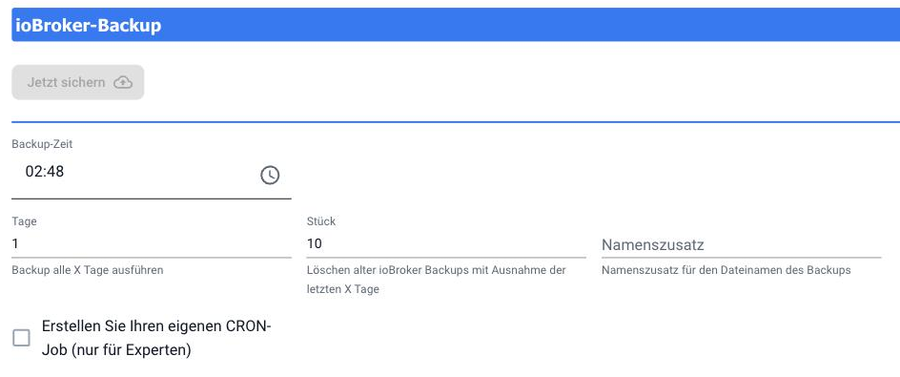

# Data backup

An ioBroker installation grows over months: instances, objects, scripts, visualizations, recorded values. A defective SD card or a failed update can wipe it all out. Therefore, the question is not... **whether**
is secured, but **when the first backup is created**, and the answer is: before anything happens.

## What belongs in a fuse

An ioBroker backup contains both databases, i.e., all **objects** and
**Conditions**It contains the list of installed adapters with their configurations, as well as the file storage containing scripts and visualizations. **not** The adapters themselves; these are downloaded again when restoring.

Anything an adapter stores outside of these databases is not included and requires its own backup: the database of `influxdb` or `sql`, the files of the `history`-adapter, the network card of the Zigbee stick, the configuration of a Homematic central unit, a Node-RED flow. The fuse adapter has dedicated switches for precisely these purposes, and these are not set by default.

This applies especially to the **recorded values**A restore reverts a fully configured system, in which all diagrams are empty if the corresponding switch was missing. The location of each setting is described below.
[Data recording](/docs/config/history.md).

## BackItUp

The usual way is the adapter.
[BackItUp](/adapters/backitup)He adds a separate menu item. **Backup** with:


At the top, you'll find the times of the last and next backups, as well as the active backup and storage options. Below that, you can manually initiate backups and view the history; at the very bottom, you can restore from a previous backup.

### Furnish

In the instance configuration `backitup.0` is in the rider
**Main settings** under _What needs to be secured?_ The list of possible components: besides `ioBroker` These include Homematic, Redis, JavaScript, Zigbee, Zigbee2MQTT, history data, InfluxDB, MySQL, PostgreSQL, SQLite3, Grafana, Node-RED, and Yahka. Check the box for anything that actually runs on your system.

These are listed below _Storage locations_ The destinations: NAS or copying, FTP, Dropbox, Google Drive, WebDAV and OneDrive.

!> At least one goal **outside** Select the ioBroker computer. A backup that is only stored on the same SD card will be deleted along with that card.

The schedule is in the tab **ioBroker**:



| Field           | Meaning                                                                                             |
| --------------- | --------------------------------------------------------------------------------------------------- |
| **Backup time** | Time of backup. An odd time is better than a full hour because then not everything happens at once. |
| **days**        | Distance in days. `1` means daily.                                                                  |
| **Piece**       | How many backups are retained. Older ones are deleted.                                              |
| **Name suffix** | It goes into the filename. Useful when backing up multiple systems to the same destination.         |

Those who need their own rhythm switch **Create your own cron job** a.

The complete description of all backup types and storage destinations can be found in the [Adapter documentation](/adapters/backitup).

## Without an adapter, via the command line

ioBroker can also back up without an additional adapter:

```bash
iobroker stop
iobroker backup
```

The file is stored as `<Datum>_backupIoBroker.tar.gz` in the directory
`/opt/iobroker/backups`The game is played back using:

```bash
iobroker stop
iobroker restore <Name oder Pfad der Sicherung>
iobroker start
```

Called without parameters, it lists `iobroker restore` the existing fuses.

ioBroker must be stopped for both commands. A backup performed while the system is running may be incomplete.

## What makes a fuse a fuse

A backup that has never been restored is a gamble. It's worthwhile to practice a backup scenario in a safe environment, either on a second computer or in a virtual machine. Step-by-step instructions are available at \[link/reference].
[Restore](/docs/tutorial/restore.md).

A backup is also essential. **before** Every major update, especially before changing the Node.js version or the js-controller.