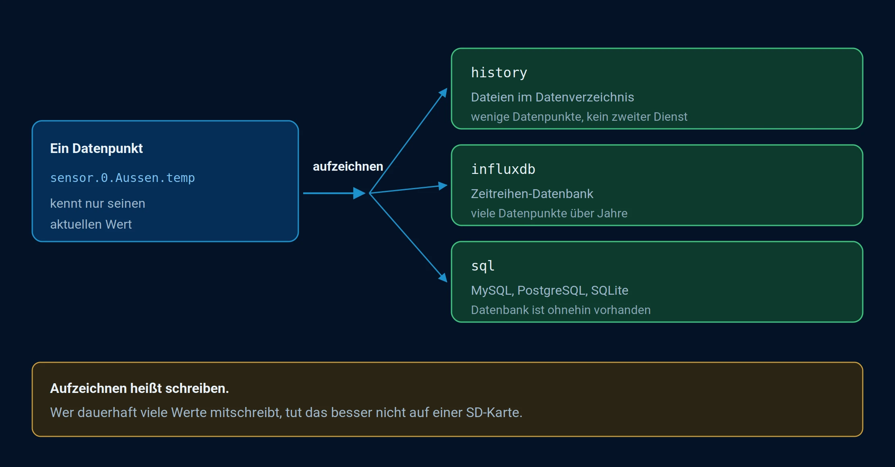

# Data recording

A data point only knows its current value. Anyone wanting to know how warm it was last night or how much electricity was consumed last week needs an adapter that records data. Three are available, and the decision should be made early because switching later requires extra work.

Not to be confused with the two **internal** databases for objects and states. Those maintain the current state of the system and are handled under [Redis](/docs/config/redis.md) . This concerns the history.



_A data point only knows its current value. Anyone needing the historical data can activate recording and choose where it should be recorded._

## What the course is and what it isn't

A state has exactly one value: its current one. When a new one occurs, the old one disappears. The state database is a piece of paper that always contains the latest status, not a booklet in which the pages remain.

A recording adapter is attached alongside: It listens to the data points you specify and writes down each new value along with a timestamp. Only then does a trend emerge that can be plotted in a graph.

This leads to four things that regularly cause surprises:

- **Recording begins from the moment the device is switched on.** There is no retrospective recording, not even from yesterday.
- **The data is recorded at each individual point.** The system itself is not switched on; instead, each individual value that you want to view later is recorded.
- **The history is not stored in the internal databases.** Objects and states represent the current state; the history is located elsewhere, see [Redis](/docs/config/redis.md) .
- **The ioBroker backup does not automatically include it.** It backs up objects, states, and configurations. The recorded values are a separate item in [BackItUp](/docs/config/backup.md) .

In the [system settings,](/docs/admin/settings.md) under _Default History_ , you can see which instance is suggested when a dialog or chart asks for the source. This is a default setting, not a recorded history: the source will still be selected per data point.

## Which adapter

| adapter      | Put it down                          | It fits if                                                                            |
| ------------ | ------------------------------------ | ------------------------------------------------------------------------------------- |
| **history**  | Files in the ioBroker data directory | Few data points, manageable time periods, no additional service desired               |
| **influxdb** | InfluxDB, a time series database     | Many data points over years. The usual approach for established systems.              |
| **sql**      | MySQL, PostgreSQL, MS-SQL or SQLite  | Such a database already exists, or the data is intended to be read by other programs. |

**The history function** stores data in two stages: the values are first stored in RAM and only written to files when a predefined threshold is reached. This protects the card, but also means that the most recently collected values are lost in the event of a hard power outage.

The files are located in a folder below `/opt/iobroker/iobroker-data`, without providing their own information in `history`, and within that, one subfolder for each day. An absolute path like `/mnt/history` This is also possible, for example, on an attached storage device. The location of the data is important for backup purposes; see below.

For starters, **history** . It doesn't need a second service, and switching to InfluxDB is possible later, see below.

Recording means writing, and writing uses up an SD card. Anyone who regularly records large amounts of data should not do so on an SD card, but rather on an SSD or in a database on another computer.

## Turn on

The adapter is installed, an instance is created, and then a decision is made **for each data point** whether it is recorded. This is done in the [Objects](/docs/admin/objects.md) tab via the gear icon at the end of the line.


_The gear icon opens this dialog. Each installed recording instance gets its own section here; checking the **"Enabled"** box activates the data point and displays the settings below\._

The instance configuration contains the default settings that apply to each newly activated data point. These settings can be overridden at the data point itself.

Recording begins **from the moment the device is switched on** . There is no retrospective recording.

The step-by-step process is described under ["Recording Values"](/docs/tutorial/history.md) .

## The settings that matter

| Attitude                | Effect                                                                                                              |
| ----------------------- | ------------------------------------------------------------------------------------------------------------------- |
| **Record only changes** | Almost always correct. Otherwise, data would be generated even when nothing is happening.                           |
| **Minimal deviation**   | Only when this difference is reached does the data start being recorded. This eliminates the noise from the sensor. |
| **Debounce time**       | Locks shortly after a write operation. Helps with values that fluctuate every second.                               |
| **storage**             | How long the values will be retained. Without a limit, the storage capacity grows indefinitely.                     |

The complete description of all fields can be found in the documentation of the respective adapter: [history](/adapters/history) , [influxdb](/adapters/influxdb) , [sql](/adapters/sql) .

## What should be recorded and what shouldn't

The most common reason for a system becoming sluggish after a year is not insufficient computing power, but that someone has written everything down because they might need it someday.

- **Useful** : Temperatures, consumption, fill levels, switching states, where you want to be able to read later when something happened.
- **Not useful** : internal data points of the adapters, counters that already contain a history, and anything you will never look at.

## Switching from the history adapter to a database

The history adapter includes scripts for this purpose, which are located in the directory `/opt/iobroker/node_modules/iobroker.history/converter` lie and with `node` to be called up. The recommended procedure:

**1. Set up and run the new target.** Configure the new adapter and enable the same data points there. Verify that the values are being received. During this time, data will be written twice: once to the history and once to the new target. This is intentional and the reason why nothing is lost during the migration.

**2. Analyze the existing data.** The analysis script determines which data already exists in the target and saves the results in JSON files. It is called in the converter directory:

```bash
cd /opt/iobroker/node_modules/iobroker.history/converter
node analyzeinflux.js influxdb.0 info --deepAnalyze
```

For an SQL database, accordingly:

```bash
node analyzesql.js sql.0 info
```

The first parameter is the target instance, the second is the protocol level. `--deepAnalyze` Additionally, it records which values already exist for each day. Without this information, only the earliest value is determined. The difference is relevant if there are already gaps in the target data that need to be filled.

**3. Stop and convert the history adapter.**

```bash
node history2db.js
```

The script reads the JSON files from step 2 and only transfers what is not already present. It then continues writing the files, so a second run usually doesn't create duplicates. It can also be called without prior analysis; in this case, a start date must be specified as a parameter, and everything before that date will be converted. This process can take a long time.

**4. Only then should you clean up.** Once the values in the target are complete and the logs confirm this: delete the history data and deactivate the adapter.

Create a [backup](/docs/config/backup.md) before migrating. Only delete the old data once the new data is demonstrably complete, and to verify this, check a graph that goes back a long way.

The complete parameter list for the three scripts can be found in the [documentation for the history adapter](/adapters/history) .

## What happens during a fuse

There's a common misconception here that can be costly: **an ioBroker backup does not contain the recorded values.** It saves objects, states, and the file storage—that is, the current state of the system. The history is stored elsewhere, and this applies to all three adapters.

- In the **history section,** the files are indeed located below\... `iobroker-data` However, these are not part of the ioBroker backup. With an absolute path, they are located outside the backup anyway.
- With **InfluxDB** and **SQL,** the data is stored in a separate database, often even on a different computer.

[BackItUp](/docs/config/backup.md) therefore lists them as **separate backup types** , created in addition to the ioBroker backup: _History Data_ , _InfluxDB_ , _MySQL_ , _PostgreSQL_ , and _SQLite3_ . These switches are **not** set by default.

Anyone recording data must also activate the appropriate switch on the backup adapter. Otherwise, after a restore, a fully configured system will be present in which all diagrams are empty.

## Where you use the history

Recording is one thing, retrieving it is another. There are several ways to do this, and they all ask the same question: **from which source** ? Anyone using more than one recording adapter must specify each time whether the values are from `history`, `influxdb` or `sql` The instance that is suggested can be found in the [system settings](/docs/admin/settings.md) under _Default History_ .

### As a diagram in the admin

The usual way. The adapter `echarts` It adds a dedicated tab to the admin panel. There, you create a chart, assign a recorded data point to each line, and save the result as **a preset** . This preset is then used for all subsequent steps.


_On the left are all data points for which recording is in progress, grouped by the instance that is writing them. Clicking on one records the history. In the upper right, you can set the time period, aggregation, and update frequency._

As long as nothing is being recorded, the list on the left is empty. This is the most common reason why a diagram cannot be built.

The step-by-step instructions are shown under [Diagrams](/docs/tutorial/flot.md) .

### On a separate page

A saved preset can be accessed directly without visualization, via the `web` -Adapter:

```
http://IP:8082/echarts/index.html?preset=echarts.0.MEINE-VOREINSTELLUNG
```

That's sufficient for a wall-mounted tablet that only needs to display a diagram, or for a bookmark on a computer.

### In the visualization

For [vis and vis-2,](/docs/viz/vis-2.md) there is a widget that displays a preset. You select it from a list; that's all there is to it.

In addition, there are widgets that display the trend alongside the data without a dedicated chart. For example, in the [Material widgets,](/docs/viz/widgets-material.md) _the current value is shown with a chart_ : two measured values are displayed, with the trend represented as an area below. Such widgets remain empty as long as the data point is not being recorded.

### In the script

The [JavaScript adapter](/docs/logic/javascript.md) reads the history with `getHistory`:

```javascript
const ende = Date.now();

getHistory(
    'history.0',
    {
        id: 'hm-rpc.0.ABC123.1.TEMPERATURE',
        start: ende - 24 * 3600000,
        end: ende,
        aggregate: 'average',
        step: 3600000,
    },
    (fehler, werte) => {
        if (fehler) {
            console.error(fehler);
            return;
        }
        werte.forEach(w => log(`${new Date(w.ts).toLocaleString()}: ${w.val}`));
    },
);
```

If you omit the instance, the default history from the system settings will be used. This allows you to access values that should not be displayed in a chart: the previous month's consumption for a report, the daily maximum for a comparison, and the meter reading at midnight.

### In Blockly

The same can be done without code. In [Blockly](/docs/logic/blockly.md) , you use the **\`sendTo\` ** block and enter the command as a command. `getHistory` The command specifies the instance as the target and the same parameters as above. The result is returned as a list.

### Send as an image

`echarts` It can draw a preset **on the server** and return it as an image without involving a browser. This allows a diagram to be included in a Telegram message or an email.

```javascript
sendTo(
    'echarts.0',
    {
        preset: 'echarts.0.MEINE-VOREINSTELLUNG',
        renderer: 'png',
        width: 1024,
        height: 300,
        theme: 'dark',
    },
    ergebnis => {
        if (ergebnis.error) {
            console.error(ergebnis.error);
            return;
        }
        // ergebnis.data ist das Bild als Base64-Adresse
    },
);
```

The format is `svg`, `png`, `jpg` and `pdf` for the election. With `fileName` Instead, the adapter stores the image in the file storage, with `fileOnDisk` on the hard drive.

### With other programs

Who `influxdb` or `sql` The values are stored in a standard database. **Grafana** reads them directly from there, without ioBroker in between, and is worthwhile when dealing with large volumes of analysis.

For those who prefer to write the chart themselves, there is the [flexcharts](/adapters/flexcharts) adapter. It provides Apache ECharts without a user interface: the chart description is created in the script or as JSON in a data point.

### The aggregation

Each of these methods queries this information, and it determines whether a chart is readable or crashes the browser. The idea behind this is that the time period is divided into equal segments, and only **one** value is returned per segment instead of all of them.

| Aggregation  | Result per section                                                                      |
| ------------ | --------------------------------------------------------------------------------------- |
| `average`    | The average. The usual choice for temperatures.                                         |
| `min`, `max` | the smallest or largest value                                                           |
| `minmax`     | Start, end, minimum, and maximum. Also displays outliers without retrieving all values. |
| `total`      | The total. For consumption                                                              |
| `count`      | the number of values                                                                    |
| `none`       | No summary, all raw values                                                              |

You specify the size of the sections with `step` in milliseconds or with `count` as the desired number. Without both, there are 500 sections.

?>`none` It's tempting because it provides the real values. With a year's worth of temperature readings taken minute by minute, that's over half a million points, and every browser struggles with that. For longer periods, a summary is essential.

!> In every aggregation except `none` The first and last points are calculated from values **outside** the time period. Anyone calculating further with these figures, for example to calculate a monthly total, should omit these two points.