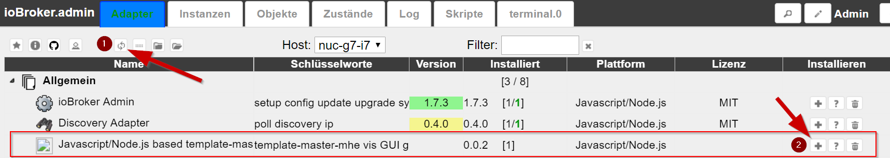
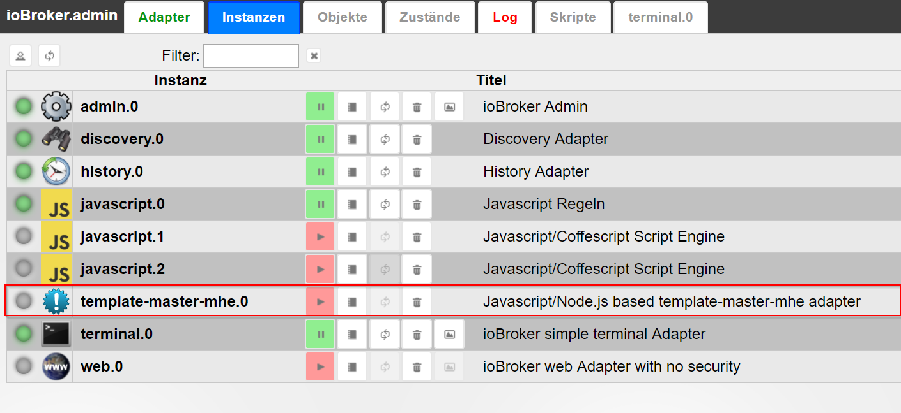
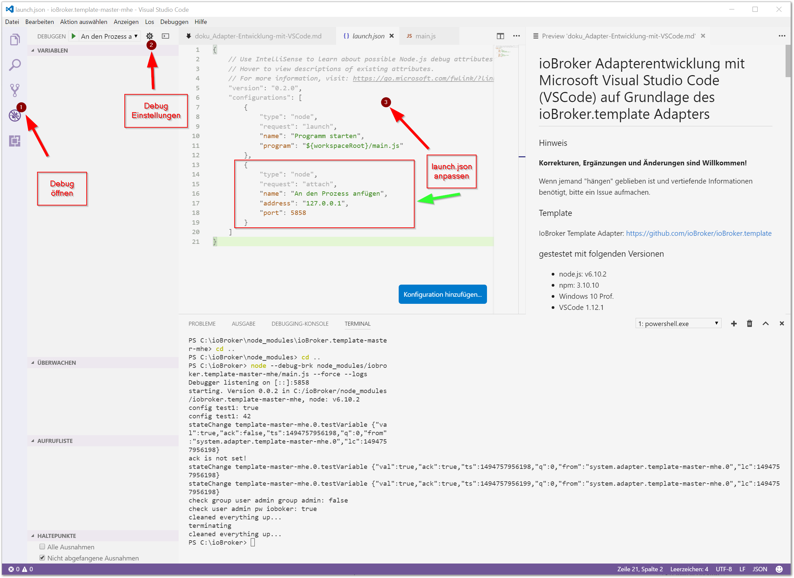
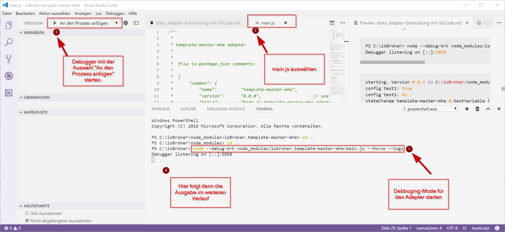

# VS code
ioBroker adapter development with Microsoft Visual Studio Code (VSCode) based on the ioBroker.template adapter

!> Corrections, additions and changes are welcome!

The documentation is created without any experience with VSCode in connection with node.js/ioBroker. Should the procedure need improvement, I would be grateful for any hint.

Stumbling blocks: If someone "got stuck" and needs more detailed information, please open an issue so that the documentation can be supplemented and refined.

The adapter name in the examples is **iobroker.template-master-mhe**.

## Template
ioBroker Template Adapter: [https://github.com/ioBroker/ioBroker.template](https://github.com/ioBroker/ioBroker.template)

## Tested in the following environment
- ioBroker, installed locally
- ioBroker.js controller: 1.0.0
- node.js: v6.10.2
- npm: 3.10.10
- Windows 10 Prof.
- VSCode 1.12.1

## Accompanying information for adapter development in general and with VSCode
- [ioBroker Forum: Debug adapters with VSCode](http://forum.iobroker.net/viewtopic.php?f=20&t=4564&p=61310&hilit=visual+studio+code#p44156)
- [ioBroker Adapter Template on Github](https://github.com/ioBroker/ioBroker.template#iobrokertemplate)
- General information on adapter development in German: [ioBroker AdapterDev Usertreffen 2017.pdf](http://forum.iobroker.net/download/file.php?id=11259) from [Apollon77](http://forum.iobroker. net/memberlist.php?mode=viewprofile&u=378).
- [ioBroker Adapter Development Documentation](https://github.com/ioBroker/ioBroker/wiki/Adapter-Development-Documentation)
- [First steps of adapter development using a Webstrom IDE as an example](https://github.com/ioBroker/ioBroker/wiki/Installation,-setup-and-first-steps-with-an-ioBroker-Development-Environment)

## General procedure - use a template for an adapter
### 1. Download template
- [https://github.com/ioBroker/ioBroker.template#iobrokertemplate](https://github.com/ioBroker/ioBroker.template#iobrokertemplate)
    - execute point 1.) there, e.g.: unpack and save the template in a folder

### 2. Run "npm install" in the folder
- installs the required npm modules in the copy of the template
- Folder node-modules is created in the template folder
- [https://github.com/ioBroker/ioBroker.template#iobrokertemplate](https://github.com/ioBroker/ioBroker.template#iobrokertemplate)
    - carry out point 2.) there

### 3. executed grunt // changes the settings in the template in the existing project
- [https://github.com/ioBroker/ioBroker.template#iobrokertemplate](https://github.com/ioBroker/ioBroker.template#iobrokertemplate)
    - carry out point 3.) there
- Install grunt globally if not already installed
- run in terminal:

```
grunt rename --name=template-master-mhe --email=iobroker@digheim.de --author="Michael Herwig"
```

- Adapter name, author and email address is changed via grunt at the necessary places in the code

### 4. Load adapter folder into VSCode
- Customize folder name. Here in the example of ioBroker.template-master in iobroker.template-master-mhe
- VSCode: open file/folder // or **CTRL+K, CTRL+O**

### 5. Adjusted the version of the template in VSCode (from 0.5.0 to 0.0.2)
- changed in io-package.json from 0.5.0 to 0.0.2 // used by ioBroker
- changed in package.json from 0.5.0 to 0.0.2 // used by npm

### 6. copied to ioBroker and adjusted path/name
- **Path:** .../iobroker/node_modules
- **Name:** ioBroker.template-master-mhe
- [https://github.com/ioBroker/ioBroker.template#iobrokertemplate](https://github.com/ioBroker/ioBroker.template#iobrokertemplate)
- there point 5.)

### 7. Close folder in VSCode
- VSCode: close file/folder // or **CTRL+K F**

### 8. ioBroker/Admin -> update
- click on Update in the ioBroker Admin GUI

### 9. Picked out adapter and added instance
- in the ioBroker Admin GUI press the plus on the adapter



- Instance of the adapter is installed and displayed



- Stop the installed adapter to debug

### 10. Open ioBroker's installed folder in VSCode
- VSCode: open file/folder // or **CTRL+K, CTRL+O**
- Select **../node_modules/iobroker.template-master-mhe**
- the adapter can now be developed and debugged here

---

## Debug
### 1.) Adapt VSCode launch.json
Unique for all adapters must be the settings

- **SHIFT+CTRL+P**: and then type: >debug launch.json
- or via the editor GUI: on the beetle and then on the cogwheel at the top



launch.json settings for debugging ioBroker adapters:

```javascript
{
    // Use IntelliSense to learn about possible Node.js debug attributes.
    // Hover to view descriptions of existing attributes.
    // For more information, visit: https://go.microsoft.com/fwlink/?linkid=830387
    "version": "0.2.0",
    "configurations": [
        {
            "type": "node",
            "request": "launch",
            "name": "Programm starten",             // Name, der im VSCode Auswahlmenü neben dem grünen Play angezeigt wird
            "program": "${workspaceRoot}/main.js"
        },
        {
            "type": "node",
            "request": "attach",
            "name": "An den Prozess anfügen",       // Name, der im VSCode Auswahlmenü neben dem grünen Play angezeigt wird
            "address": "127.0.0.1",                 // Adresse, an dem der node.js Prozess läuft (bei Remote Debug, der Remote-Rechner)
            "port": 5858                            // Port, auf dem der node.js Debugger lauscht, der mit node --debug-brk ... gestartet wird
        }
    ]
}
```

- **Remote Debugging** on a remote ioBroker is also possible. The IP address must then be adjusted from 127.0.0.1.

### 2.) Open the terminal and start the debugger
- **CTRL+ö** // opens the integrated terminal (the key combination depends on the operating system and the VSCode version)

- stop the newly installed adapter in the terminal

cd /opt/iobroker iobroker stop template-master-mhe

- Start the debugger in the terminal (for remote debugging, a connection via SSH must first be established in the terminal):

        node --debug-brk node_modules/iobroker.template-master-mhe/main.js --force --logs

    Where **iobroker.template-master-mhe** is the name of the adapter.

Display in the integrated terminal (note: an external terminal program can also be used):

``` cmd
PS C:\ioBroker> node --debug-brk node_modules/iobroker.template-master-mhe/main.js --force --logs
Debugger listening on [::]:5858
```



Output in the terminal after starting the debugger:

``` cmd
starting. Version 0.0.2 in C:/ioBroker/node_modules/iobroker.template-master-mhe, node: v6.10.2
config test1: true
config test1: 42
stateChange template-master-mhe.0.testVariable {"val":true,"ack":false,"ts":1494753342714,"q":0,"from":"system.adapter.template-master-mhe.0","lc":1494753342714}
ack is not set!
stateChange template-master-mhe.0.testVariable {"val":true,"ack":true,"ts":1494753342715,"q":0,"from":"system.adapter.template-master-mhe.0","lc":1494753342714}
stateChange template-master-mhe.0.testVariable {"val":true,"ack":true,"ts":1494753342715,"q":0,"from":"system.adapter.template-master-mhe.0","lc":1494753342714}
check group user admin group admin: false
check user admin pw ioboker: true
stateChange template-master-mhe.0.testVariable {"val":null,"ack":true,"ts":1494753367809,"q":0,"from":"system.adapter.template-master-mhe.0","lc":1494753367809}
```

- Cancel with **CTRL+C** in the terminal

Output in the terminal after stopping the debugger:

``` cmd
cleaned everything up...
terminating
cleaned everything up...
PS C:\ioBroker>
```

- Go to Debug in VSCode and select "Attach to process" under Debug and start
- the output is carried out in the Terminal tab of the integrated terminal
- Cancel with CTRL+C in the terminal

---

## Experiences
- The adapter icon of the template was adapted (renamed) to Grunt, but not displayed in ioBroker/Admin
- the correct icon will only be displayed after the adapter has been published

---

### To do
- Use VSCode with Github
- Example of an own adapter
- clarify: Debug only with node.js > 6.x or is 4.x also possible?

---

### Documentation online
#### To Visual Studio Code
- [VSCode basics article](https://www.microsoft.com/germany/techwiese/know-how/visual-studio-code-01-die-Basics.aspx)

#### To node.js
#### On Git & Github
- [Git Book - free basic book on Git](https://git-scm.com/book/de/v1)
- [Git for Windwos - download page](https://git-scm.com/download/win)

---

## General Tips & Tricks
### SSH with Windows
- [Git for Windwos - Downloadseite](https://git-scm.com/download/win) installs the bash, with which you can also use ssh with the help of openSSH.

---

## Miscellaneous
- my settings in settings.json for VSCode:

```
// Platzieren Sie Ihre Einstellungen in dieser Datei, um die Standardeinstellungen zu überschreiben.
{
    "window.zoomLevel": 0,
    "editor.minimap.enabled": true,                 // zeigt die kleine Codeübersichtskarte rechts neben dem Code an
    "editor.dragAndDrop": true,                     // ermöglicht markierte Codeteile per Drag und Drop zu verschieben0
    "workbench.editor.closeOnFileDelete": false,
    "files.autoSave": "afterDelay",                 // Auotmatisches Speichern der Dateien einstellen
    "files.autoSaveDelay": 1000,                    // Autosave nach 1000 ms
    "[javascript]": {},                             // Einstellungen für die SPrache "Javascript"
    "telemetry.enableCrashReporter": false,         //
    "workbench.colorTheme": "Quiet Light",          // Farbschema des Editors
    "telemetry.enableTelemetry": false,
    "workbench.iconTheme": "vs-seti",               // Icons für bekannte Dateieendungen. Wenn ja, welches Icon-Set soll verwendet werden
    "javascript.implicitProjectConfig.checkJs": true
}
```