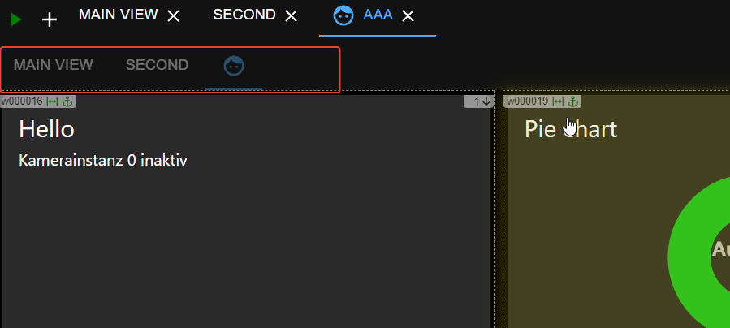
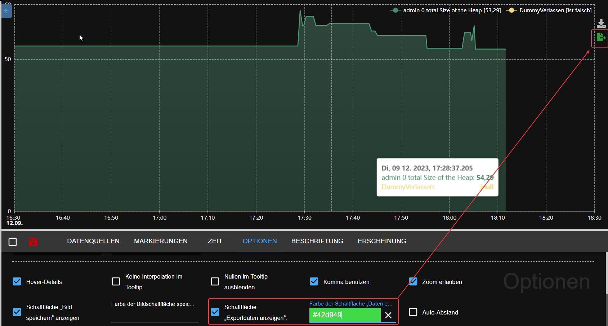
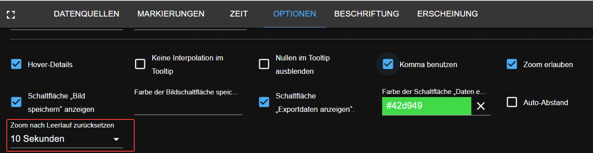
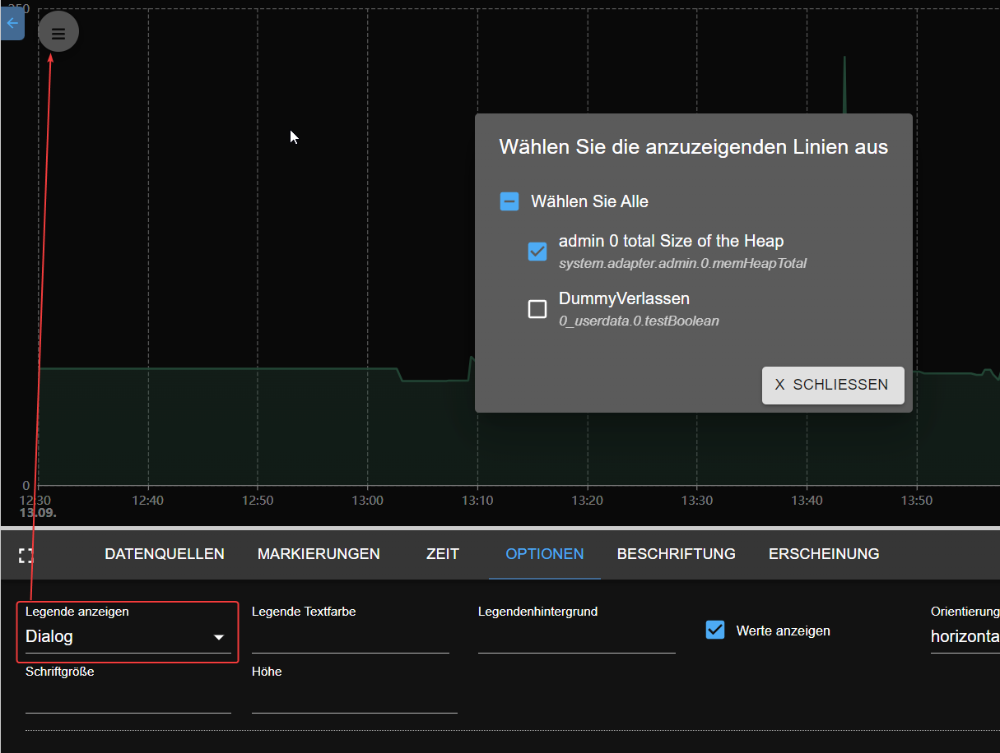

# What's new

## Instructions for writers
- Please define the header as
  ## AdapterName (YYYY-MM-DD) - [short description]
- Shot description could be: 
  - new adapter
  - stable release
  - new feature
  - new widget
- if your news about the new adapter, please add a GitHub link and a logo of the adapter
  Example:
``` 
    ## frigate (2023-08-20) - new adapter
    https://github.com/Bettman66/ioBroker.frigate
   
    
```


## frigate (2023-08-20) - new adapter
https://github.com/Bettman66/ioBroker.frigate


Frigate is an open source NVR built around real-time AI object detection. This adapter parses Frigate's MQTT messages and creates data objects from them

## notification-manager (2023-08-21) - new adapter
https://github.com/foxriver76/ioBroker.notification-manager


Manage ioBroker notifications, e.g., by sending them as messages

## procon-ip (2023-08-24)
https://github.com/ylabonte/ioBroker.procon-ip


ioBroker adapter for basic support of the `ProCon.IP` swimming pool control unit.

## deyeicd (2023-08-29)
https://github.com/raschy/ioBroker.deyeidc


Data Collector vor `Deye`-compatible Inverter

## acme (2023-09-01)
https://github.com/iobroker-community-adapters/ioBroker.acme


This adapter generates certificates using ACME challenges.

## admin (2023-09-01)
Context menu:
- e.g., easy creation of aliases
  

## javascript (2023-09-01)
Playground for JavaScript code:
- You can use ChatGPT (required API key) to generate the script. It is only to test the possibilities of ChatGPT
  

## cec2 (2023-09-06)
https://github.com/iobroker-community-adapters/ioBroker.cec2


Adapter for HDMI CEC - You can monitor / control devices using HDMI CEC. Most modern TVs and multimedia devices support CEC to some extent.

## alexa2 (2023-09-09)
* (Apollon77) Update Alexa2 adapter to adjust to the changed Push-Notification system from Amazon to allow getting history and interaction information again

## vis-2-widgets-material (2023-09-10)
* (bluefox) Door lock widget has been added
  
  

## pushbullet (2023-09-10) 


* (bluefox) API has been updated to version 3
* (bluefox) JSON configuration was added
  

## JSON config Dokumentation
* (bluefox) JSON-Config documentation has been added to the ioBroker website [hinzugefügt](https://www.iobroker.net/#en/documentation/dev/adapterjsonconfig.md).

## telegram-menu (2023-09-11)
https://github.com/MiRo1310/ioBroker.telegram-menu


Easily create Telegram Menus

## vis-2 (2023-09-12)
* (bluefox) Horizontaler Menü
  

## echarts (2023-09-12)
* (bluefox) Added the ability to export the data to JSON file
  
* (bluefox) Added the ability to restore zoom and pan after X seconds of inactivity
  
* (bluefox) Show legend as dialog
  

## js-controller (2023-09-14)
* (foxriver76) Release js-controller 5 to stable
* (foxriver76) Upgrade installer to just allow Node.js 16.x+

## apg-info (2023-09-16)
https://github.com/HGlab01/ioBroker.apg-info - new adapter


This adapter provides the peak-times for the Austrian Power Grid, where power consumption shall be avoided. In addition, the adapter provides the PHELIX-AT Day-Ahead (EPEX Spot) prices for Austria.

## tinymqttbroker (2023-09-16) - new adapter
https://github.com/HGlab01/ioBroker.tinymqttbroker


This is a very tiny MQTT broker which is not managing any objects/states in iobroker but offers a central MQTT broker instance to publish an subscribe topics as MQTT client. 

## awtrix-light (2.10.2023) - new adapter
https://github.com/klein0r/ioBroker.awtrix-light


Integrate your Awtrix Light device (e.g. Ulanzi TC001) via HTTP

## webui (3.10.2023) - new adapter
https://github.com/iobroker-community-adapters/ioBroker.webui


This is a complete visualization system for ioBroker.
* completely based on webcomponents
* wysiwyg editor for UI, but you can also switch to source view, or split view
* multi window ui in edit view, like in visal studio
* bindings per drag/drop of ioBroker objects on ui-elments or properties
* complex bindings with javascript inside, and converters
* simple script language wich could be created via ui

## heizungssteuerung (4.10.2023) - new adapter
https://github.com/jbeenenga/ioBroker.heizungssteuerung


This adapter can be used to manage heating systems.
You can choose between cooling and heating mode and activate boost or pause for one room.
Furthermore, you can overwrite the target temperature for one room.

## admin and mqtt (11.10.2023) - new feature
Admin and MQTT adapters now check if they are reachable from the public internet if no authentication is enabled. If not, they will show warning in the log and in the admin.

This is a useful feature, as not all users understand how to secure their adapters, and it is hazardous to have MQTT or admin adapter open to the internet without authentication.

## iobroker (11.10.2023) - new feature
Now it is possible to update your node.js via command line: `iob nodejs-update`
https://forum.iobroker.net/topic/69067/neuer-befehl-iob-nodejs-update

You can update to a suggested version (current 18) without additional parameters or specify a version: `iob nodejs-update 20`

## vis-2-widgets-material (13.10.2023) - new widget
Vacuum cleaner widget has been added.

This widget is primary for Xiaomi vacuum cleaner.
But it can be used for any other vacuum cleaner too.
The only difference is that Xiaomi supports room cleaning.


## welcome (17.10.2023) - new adapter
https://github.com/ioBroker/ioBroker.welcome


This adapter shows all web and admin instances of ioBroker on one page on port 80 (configurable)


## govee-local (20.10.2023) - new adapter
https://github.com/boergegrunicke/ioBroker.govee-local


Control Govee devices via local access (no cloud)

