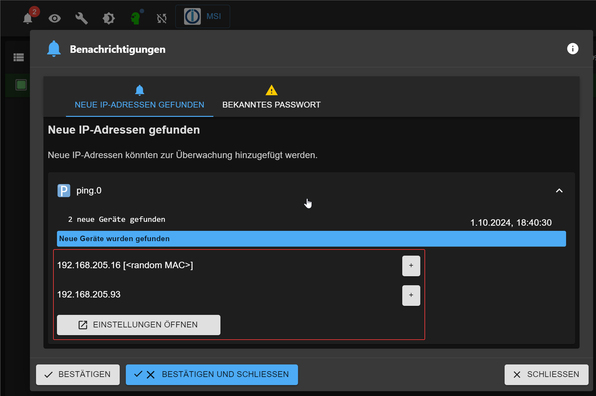
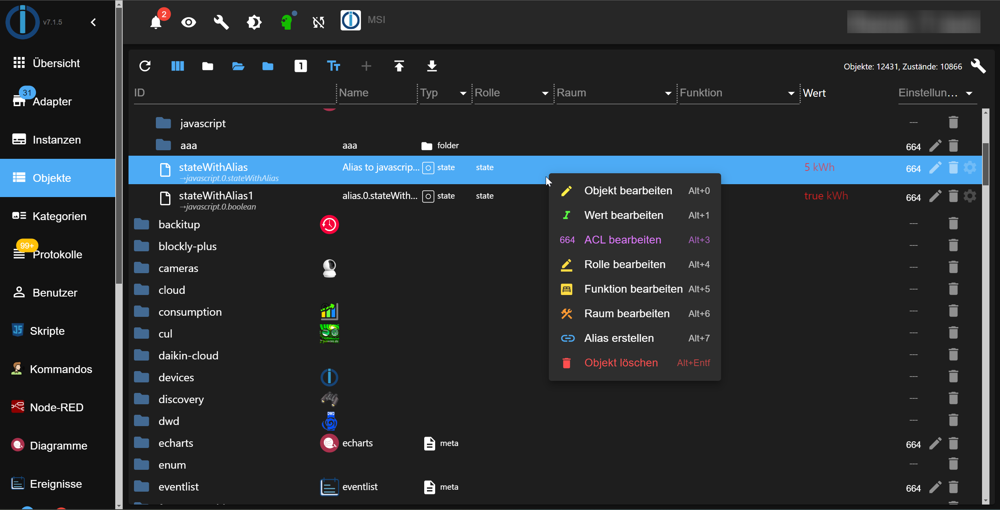
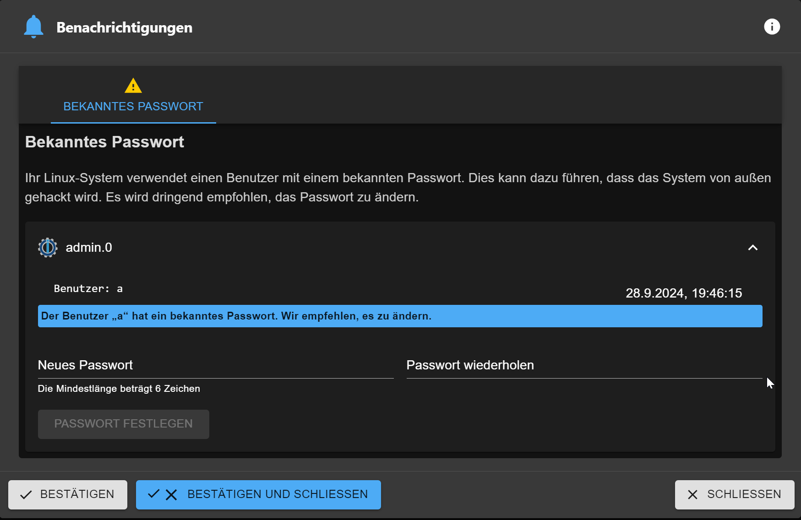
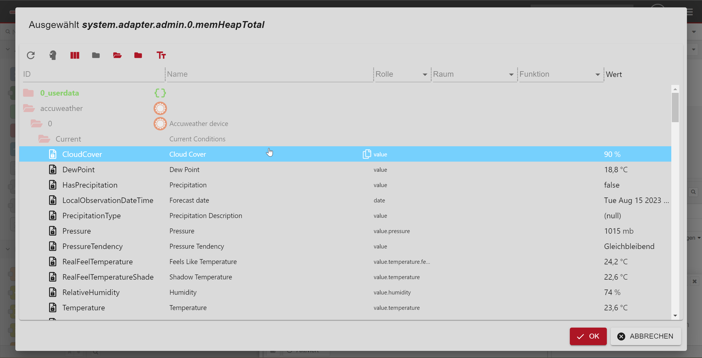

# What's new

## Instructions for writers
- Please define the header as
  ## AdapterName (YYYY-MM-DD) - [short description]
- Shot description could be: 
  - new adapter
  - stable release
  - new feature
  - new widget
- if your news about the new adapter, please add a GitHub link and a logo of the adapter
  Example:
``` 
    ## frigate (2023-08-20) - new adapter
    https://github.com/Bettman66/ioBroker.frigate
   
    
```

## ecoflow-mqtt (2024-10-14) - new adapter
https://github.com/foxthefox/ioBroker.ecoflow-mqtt


   
ioBroker adapter for connection to the Ecoflow MQTT Server (emulating the App communication), provides also a Home Assistant Gateway via discovery function.

## frigate (2023-08-20) - new adapter
https://github.com/Bettman66/ioBroker.frigate


Frigate is an open source NVR built around real-time AI object detection. This adapter parses Frigate's MQTT messages and creates data objects from them

## notification-manager (2023-08-21) - new adapter
https://github.com/foxriver76/ioBroker.notification-manager


Manage ioBroker notifications, e.g., by sending them as messages

## procon-ip (2023-08-24)
https://github.com/ylabonte/ioBroker.procon-ip


ioBroker adapter for basic support of the `ProCon.IP` swimming pool control unit.

## deyeicd (2023-08-29)
https://github.com/raschy/ioBroker.deyeidc


Data Collector vor `Deye`-compatible Inverter

## acme (2023-09-01)
https://github.com/iobroker-community-adapters/ioBroker.acme


This adapter generates certificates using ACME challenges.

## admin (2023-09-01)
Context menu:
- e.g., easy creation of aliases
  

## javascript (2023-09-01)
Playground for JavaScript code:
- You can use ChatGPT (required API key) to generate the script. It is only to test the possibilities of ChatGPT
  

## cec2 (2023-09-06)
https://github.com/iobroker-community-adapters/ioBroker.cec2


Adapter for HDMI CEC - You can monitor / control devices using HDMI CEC. Most modern TVs and multimedia devices support CEC to some extent.

## alexa2 (2023-09-09)
* (Apollon77) Update Alexa2 adapter to adjust to the changed Push-Notification system from Amazon to allow getting history and interaction information again

## vis-2-widgets-material (2023-09-10)
* (bluefox) Door lock widget has been added
  
  

## pushbullet (2023-09-10) 


* (bluefox) API has been updated to version 3
* (bluefox) JSON configuration was added
  

## JSON config Dokumentation
* (bluefox) JSON-Config documentation has been added to the ioBroker website [hinzugefügt](https://www.iobroker.net/#en/documentation/dev/adapterjsonconfig.md).

## telegram-menu (2023-09-11)
https://github.com/MiRo1310/ioBroker.telegram-menu


Easily create Telegram Menus

## vis-2 (2023-09-12)
* (bluefox) Horizontaler Menü
  

## echarts (2023-09-12)
* (bluefox) Added the ability to export the data to JSON file
  
* (bluefox) Added the ability to restore zoom and pan after X seconds of inactivity
  
* (bluefox) Show legend as dialog
  

## js-controller (2023-09-14)
* (foxriver76) Release js-controller 5 to stable
* (foxriver76) Upgrade installer to just allow Node.js 16.x+

## apg-info (2023-09-16)
https://github.com/HGlab01/ioBroker.apg-info - new adapter


This adapter provides the peak-times for the Austrian Power Grid, where power consumption shall be avoided. In addition, the adapter provides the PHELIX-AT Day-Ahead (EPEX Spot) prices for Austria.

## tinymqttbroker (2023-09-16) - new adapter
https://github.com/HGlab01/ioBroker.tinymqttbroker


This is a very tiny MQTT broker which is not managing any objects/states in ioBroker but offers a central MQTT broker instance to publish an subscribe topics as MQTT client. 

## awtrix-light (2.10.2023) - new adapter
https://github.com/klein0r/ioBroker.awtrix-light


Integrate your Awtrix Light device (e.g. Ulanzi TC001) via HTTP

## webui (3.10.2023) - new adapter
https://github.com/iobroker-community-adapters/ioBroker.webui


This is a complete visualization system for ioBroker.
* completely based on web-components
* wysiwyg editor for UI, but you can also switch to source view, or split view
* multi window ui in edit view, like in visual studio
* bindings per drag/drop of ioBroker objects on ui-elements or properties
* complex bindings with JavaScript inside, and converters
* simple script language which could be created via ui

## heizungssteuerung (4.10.2023) - new adapter
https://github.com/jbeenenga/ioBroker.heizungssteuerung


This adapter can be used to manage heating systems.
You can choose between cooling and heating mode and activate boost or pause for one room.
Furthermore, you can overwrite the target temperature for one room.

## admin and mqtt (11.10.2023) - new feature
Admin and MQTT adapters now check if they are reachable from the public internet if no authentication is enabled. If not, they will show warning in the log and in the admin.

This is a useful feature, as not all users understand how to secure their adapters, and it is hazardous to have MQTT or admin adapter open to the internet without authentication.

## iobroker (11.10.2023) - new feature
Now it is possible to update your node.js via command line: `iob nodejs-update`
https://forum.iobroker.net/topic/69067/neuer-befehl-iob-nodejs-update

You can update to a suggested version (current 18) without additional parameters or specify a version: `iob nodejs-update 20`

## vis-2-widgets-material (13.10.2023) - new widget
Vacuum cleaner widget has been added.

This widget is primary for Xiaomi vacuum cleaner.
But it can be used for any other vacuum cleaner too.
The only difference is that Xiaomi supports room cleaning.


## welcome (17.10.2023) - new adapter
https://github.com/ioBroker/ioBroker.welcome


This adapter shows all web and admin instances of ioBroker on one page on port 80 (configurable)


## govee-local (20.10.2023) - new adapter
https://github.com/boergegrunicke/ioBroker.govee-local


Control Govee devices via local access (no cloud)

## pylontech (23.10.2023) - new adapter
https://github.com/PLCHome/ioBroker.pylontech


Query the cell voltages and the status of pylontech batteries via the console.

## signifylights (26.10.2023) - new adapter
https://github.com/disaster123/ioBroker.signifylights


Signify Lights adapter for all Types of Signify WLAN lights like WIZ, Philips WLAN and many more...

## esphome (01.11.2023) - new feature
In a significant development for home automation enthusiasts,
the ESPHome documentation has officially acknowledged the integration of ioBroker with its native API.
This update follows the acceptance of a recent PR,
placing ioBroker alongside Home Assistant as one of the exclusive home automation systems
to utilize ESPHome's native API for direct client communication.

The native API, known for its highly optimized network protocol,
offers numerous benefits over traditional MQTT methods,
streamlining the way smart devices interact within the ecosystem.
With this recognition, ESPHome reaffirms its commitment to providing efficient
and robust communication channels for the smart home industry.

## vis (06.11.2023) - new feature
The license of vis has been changed to MIT. This means that you can use vis for free in commercial projects and no license is required.

## welcome (07.11.2023) - new feature
Added possibility to add custom links to the welcome page. The pages will be checked if they are alive.


## echarts (08.11.2023) - new feature
Vis-2 widget was added. Now, additionally to the presets, you can use the object ID with history data directly.


## renacidc (17.11.2023) - new adapter
https://github.com/raschy/ioBroker.renacidc


Reading the data from renacpower solar inverters

## weather-warnings (24.11.2023) - new adapter
https://github.com/ticaki/ioBroker.weather-warnings


This adapter accesses weather warnings of different weather services and outputs them as text or voice messages. Additionally, it creates States grouped by type, which can be used to react to current warnings.

## tractive-gps (06.12.2023) - new adapter
https://github.com/iobroker-community-adapters/ioBroker.tractive-gps


This adapter allows you to connect to the Tractive GPS service and retrieve the location of your pets.

## admin (06.12.2023) - new feature
It is possible to change menu colors in admin


## emporia (07.12.2023) - new adapter
https://github.com/Chris-656/ioBroker.emporia


This adapter retrieves data from emporia energy system.

## reolink (27.12.2023) - new adapter
https://github.com/aendue/ioBroker.reolink


Adapter for ioBroker Plattform to get Reolink camera information..

## vis-2 (08.01.2024) - new adapter
https://github.com/ioBroker/ioBroker.vis-2

vis-2 is now in a stable repository. It is a new generation of vis. It is based on ReactJS and has many new features.

## artnet-recorder (08.01.2024) - new adapter
https://github.com/Bannsaenger/ioBroker.artnet-recorder


Record Art-Net data to a file for later playback

## energiefluss (25.01.2024) - new adapter
https://github.com/SKB-CGN/ioBroker.energiefluss


It provides an animated energyflow of the current consumption for photovoltaics, battery, house-consumption, grid-feed-in (grid-consumption), car charge and up to 10 possible elements (circle or rectangle).

## amtronwallbox (28.01.2024) - new adapter
https://github.com/rg-engineering/ioBroker.amtronwallbox


The adapter serves as an interface to various Amtron wallboxes. The data provided by the box is read out and made available as a state in the adapter. The data is only processed locally, a cloud connection is not necessary.

## zendure-solarflow (30.01.2024) - new adapter
https://github.com/nograx/ioBroker.zendure-solarflow


This project is an ioBroker Adapter to read data from the Zendure Solarflow Cloud API. It uses the official API provided by Zendure.

## echarts (03.02.2024) - new feature
Added "radar" chart type


## soliscloud (3.2.2024) - new adapter
https://github.com/Trixx34/ioBroker.soliscloud


This adapter will read multiple values available from the soliscloud API and store them for use in ioBroker. 

## sun2000-modbus (8.2.2024) - new adapter
https://github.com/daolis/ioBroker.sun2000-modbus


Read data from Huawei SUN2000 inverter and LUNA2000 Storage using Modbus TCP. 

## scenes (10.2.2024) - new feature
It is possible to use categories in scenes


## solaredge (15.2.2024) – new adapter
https://github.com/iobroker-community-adapters/ioBroker.solaredge


Get data from solaredge monitoring portal. Currently, only the /overview data point is used to get the current power and day/month/year/lifetime energy readings.

## elgato-key-light (18.2.2024) – new adapter
https://github.com/iobroker-community-adapters/ioBroker.elgato-key-light


This adapter allows you to control Elgato Key Lights via ioBroker.

## myuplink (18.2.2024) – new adapter
https://github.com/sebilm/ioBroker.myuplink


This ioBroker adapter receives data from myUplink.com.

## sun2000 (19.2.2024) – new adapter
https://github.com/bolliy/ioBroker.sun2000


Read register data from Huawei SUN2000 inverter and LUNA2000 battery using Modbus TCP.

## opcua (21.2.2024) – new feature
The adapter has now free license.

## senec (25.2.2024) – new adapter
https://github.com/nobl/ioBroker.senec


Initially targeted at the Senec Home V2.1 System. In the Senec.Home system, only selected values can be changed by the adapter. Senec currently also no longer provides a reliable way to influence peak shaving via the web interface. Whether other systems (e.g. V3) also work with it depends on whether they are also based on lala.cgi and provide the same JSON information.

## energiefluss-erweitert (11.3.2024) – new adapter
https://github.com/SKB-CGN/ioBroker.energiefluss-erweitert


Adapter provides an animated energyflow for all elements, you add. This could be: photovoltaics, battery, house-consumption, grid-feed-in (grid-consumption), car charge etc.

## nmea (17.3.2024) – new adapter
https://github.com/ioBroker/ioBroker.nmea


This adapter allows connecting ioBroker to NMEA-2000 yacht bus. You can read SOG, COG, GPS position, depth, wind, temperature, and many other data from the NMEA-2000 bus.
And even control the Raymarine autopilot.


## vis-homekittiles (25.3.2024) – new adapter
https://github.com/Standarduser/ioBroker.vis-homekittiles


Homekit Tiles is a widget set based on the design of Apple HomeKit. The special feature of the widgets is that they do not contain any fixed style elements, but everything is formatted using CSS. As a result, there are no separate settings in the VIS editor for the position and/or size of the icons, labels, etc. The design is adjusted by changing the CSS code. For this purpose, the CSS code from the file /widgets/homekittiles/css/style.css can be used as a template. The code is inserted into the CSS tab in the VIS editor and can be customized as desired. It is also possible to add your own CSS classes via the VIS editor in the "General" section of the widgets.

The widgets are designed for VIS 1.x.

## scheduler (05.4.2024) – new feature
Scheduler supports now holidays and custom types.

## admin (6.4.2024) – new feature
Admin now supports the includes in JSONConfig files:

```json5
{
    "tabs": {
        "tab1": {
            "type": "panel", // data will be combined with the content of "tab1.json". If the same attribute is defined in both files, the value from the included file will be used.
            "#include": "tab1.json"
        }
    }
}
```

https://github.com/ioBroker/ioBroker.admin/blob/master/packages/jsonConfig/SCHEMA.md#includes

## smoothed (8.4.2024) – new adapter
https://github.com/BenAhrdt/ioBroker.smoothed


This Adapter make it easy to select some icons to smooth it according to a selected allgorithem and the smoothtime (filtertime). You can select one id more times to smooth it in defferent allgorithems and or times. The destination is an id in the directory of the flger, wicht delivers you the smoothed values. You can limit the min- or max- values. Limit the decimal places. Or ignore values with a high standard deviation.

## heizoel24-mex (14.4.2024) – new adapter
https://github.com/ltspicer/ioBroker.heizoel24-mex


The MEX is a heating oil level measuring device. This adapter reads the MEX data from the Heizoel24 server.

## hydrawise (17.4.2024) – new adapter
https://github.com/SentiQ/ioBroker.hydrawise


Integrate your Hydrawise controller into ioBroker. You can see all controller information, schedules and sensors. It is also possible to suspend planned watering by x seconds.

## tedee (17.4.2024) – new adapter
https://github.com/TA2k/ioBroker.tedee


Adapter for Tedee Locks. This Adapter uses the local bridge API to control a tedee lock.
All Lock devices by Tedee are supported.

## pid (22.4.2024) – new adapter
https://github.com/mcm4iob/ioBroker.pid


This adapter provides the functionality of a PID controller.


## unifi-protect (28.4.2024) – stable release
https://github.com/iobroker-community-adapters/ioBroker.unifi-protect


Connects to Unifi Protect Controller and pulls all Data from added Cameras.

## air-q (1.5.2024) – new adapter
https://github.com/CorantGmbH/ioBroker.air-q


This ioBroker Adapter is used in connection with our air-Q device. It polls the values from our sensors and displays them for you in the ioBroker environment.

## boschindego (4.5.2024) – new adapter
https://github.com/iobroker-community-adapters/ioBroker.boschindego


Adapter for Bosch Indego Mower to show the state of the mower and control the mower.

## Windows installer (20.5.2024) – new feature
There is a new version for Windows installer available: 3.1.0
New features:
- Update/Upgrade of JS-Controller implemented
- Some bugfixes

## radar-trap (29.5.2024) – new adapter at stable
https://github.com/Steiger04/ioBroker.radar-trap


Adapter to detect speed traps and obstacles.

##  waterkotte-easycon (12.4.2024) – new adapter at latest
https://github.com/theknut/ioBroker.waterkotte-easycon


Adapter for Gree and C&H conditioners.

## vis-2-widgets-inventwo (25.4.2024) – new adapter at latest
https://github.com/inventwo/ioBroker.vis-2-widgets-inventwo


Adds switches, buttons, sliders, and more as widgets for ioBroker VIS 2.0.

## webui (3.10.2023) - new adapter
https://github.com/iobroker-community-adapters/ioBroker.webui


This is a complete visualization system for ioBroker.
* completely based on web-components
* wysiwyg editor for UI, but you can also switch to source view, or split view
* multi window ui in edit view, like in visual studio
* bindings per drag/drop of ioBroker objects on ui-elements or properties
* complex bindings with JavaScript inside, and converters
* simple script language which could be created via ui
## hiob (22.5.2024) – new adapter at latest
https://github.com/moba15/ioBroker.hiob


This app allows you to control your ioBroker Smarthome system via the hiob app. It is a simpler and faster alternative to comparable projects with fewer configuration possibilities. It is mainly intended for Android devices, but also works on Windows and Linux desktops.

## notificationforandroidtv (22.5.2024) – new adapter at latest
https://github.com/DNAngelX/ioBroker.notificationforandroidtv


Notification integration for IoBroker includes support for Notifications for Android TV and Notifications for Fire TV. With this integration, you can send notifications to your Android TV device. It enables an overlay displaying the message content for a customizable duration before disappearing. Additionally, it supports sending images, such as those from security cameras, and custom icons. Icons function similarly to images, appearing smaller and to the left of the notification, while images display larger and above the notification.

These notifications operate within the global scope of your Android TV device, appearing regardless of the active application.

## IOB Mobile App for Android und iOS (04.6.2024) - new app


Wiki: https://github.com/peter9teufel/iobmobile-issues/wiki/IOB-Mobile-Quickstart

## gree-hvac (10.6.2024) – new adapter at stable
https://github.com/XHunter74/ioBroker.gree-hvac


Adapter for Gree and C&H conditioners.

## Admin (10.6.2024) – new feature
- Log tab was improved. (Mostly layout and GUI)
- Added support for the adapter's auto-update option. New version of js-controller required.
- Only installed adapters in the adapter tab or first 100 adapters are shown. To see more adapters, the user must enter some filter.

## opcua (13.6.2024) – new adapter at stable
https://github.com/ioBroker/ioBroker.opcua


ioBroker OPC-UA Adapter.

## e3oncan (25.7.2024) – new adapter at stable
https://github.com/MyHomeMyData/ioBroker.e3oncan


Viessmann E3 series devices (One Base) are doing a lot of data exchanges on CAN bus. This adapter can listen to this communication and extract much useful information. Energy meters E380CA and E3100CB also are supported. This mode of operation is called `Collect`.  

Note: This adapter is supported on linux systems only.

## egigeozone2 (6.8.2024) – new adapter at stable
https://github.com/obakuhl/ioBroker.egigeozone2


This is an ioBroker adapter for Android geofencing app "EgiGeoZone". It is able to receive geofence events as HTTP requests when entering or leaving a defined area with your mobile device.

## hiob (17.8.2024) – new adapter at stable
https://github.com/moba15/ioBroker.hiob


This app allows you to control your ioBroker Smarthome system via the hiob app. It is a simpler and faster alternative to comparable projects with fewer configuration possibilities. It is mainly intended for Android devices, but also works on Windows and Linux desktops.

## extron (17.8.2024) – new adapter at stable
https://github.com/Bannsaenger/ioBroker.extron


Control devices from Extron. This Adapter is designed to control some of the Extron Audio Video Products via the Simple Instruction Set Protocol. The functional scope of the devices is tremendous. Not all of the features make sense to be supported with the adapter and the interaction with ioBroker.

## ping (23.08.2024) - new feature
Ping adapter can detect the range of IP addresses if the range has less than 4096 addresses.

Users can add the IP-Addresses directly from notification.



## admin (23.08.2024) - new feature
States could be controlled directly from JSON Config to start range detection or something similar.

## admin (01.09.2024) - new feature


Some users may already be familiar with the context menu in the ioBroker Admin Object Browser. However, we want to remind everyone that a simple left-click provides quick access to the context menu, allowing you to perform various operations on objects, such as creating an alias for them.

## gotify-ws (4.9.2024) – new adapter at stable
https://github.com/simatec/ioBroker.gotify-ws


Gotify-WS is an adapter that establishes a websocket connection to a Gotify server and can therefore receive and process all messages from the server.

## wifilight (05.09.2024) - new feature
The wifilight adapter was completely rewritten and now supports compact mode and JSON config.

## rainbird (17.9.2024) – new adapter at stable
https://github.com/iobroker-community-adapters/ioBroker.rainbird


An ioBroker adapter for Rain Bird with LNK WiFi adapter. This project has no affiliation with Rain Bird.

## vis-2-widgets-rssfeed (18.9.2024) – new adapter at stable
https://github.com/oweitman/ioBroker.vis-2-widgets-rssfeed


This adapter contains only the vis-2 widgets for the adapter rssfeed. For a detailed description of the widgets and functionality see Adapter rssfeed.

## kisshome-research (19.9.2024) – new adapter at stable
https://github.com/ioBroker/ioBroker.kisshome-research


This special adapter was developed for the KISSHome research project. It is not intended for general use.

## admin (21.09.2024) - new feature


Users can jump from alias target to alias itself.

## admin (28.09.2024) - new feature


Admin checks now on Linux systems if the system user with a well-known password exist and asks to change it if such a user was found.

Admin supports dynamic notification's GUI.

## node-red (30.09.2024) - new feature


Node-red got at least the same select ID dialog as other adapters.
It requires running admin instance on the same host.

Node-red package version was increased from 3 to 4.0.3

## ecoflow-mqtt (14.10.2024) – new adapter at stable
https://github.com/foxthefox/ioBroker.ecoflow-mqtt


This adapter connects to products of Ecoflow ([https://www.ecoflow.com])

## remeha-home (28.10.2024) – new adapter at stable
https://github.com/simatec/ioBroker.remeha-home


The ioBroker.remeha-home adapter enables the integration and control of Remeha heating systems via the Remeha Home platform. The adapter continuously connects to the Remeha Home API and retrieves current data to make it available in the ioBroker system. This allows the heating system to be optimally monitored and controlled.

