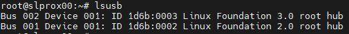
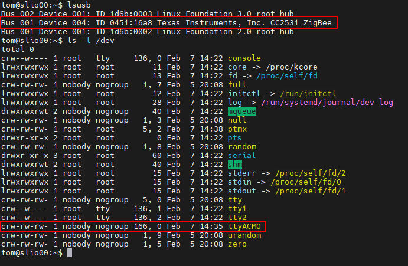
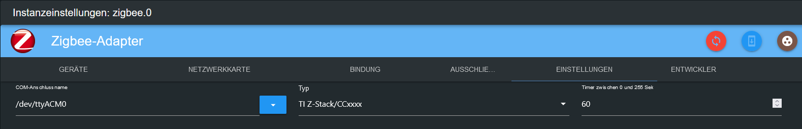

# Proxmox

## Proxmox installation
Proxmox Virtual Environment (Proxmox VE for short) is a Debian-based virtualization platform. The virtualization technology at Proxmox is based on QEMU/KVM.

Proxmox “packs” QEMU/KVM into its own web interface, making administration quite easy (and also supports Linux Containers – LXC). This makes Proxmox, on the one hand, beginner-friendly, but on the other hand, it is so powerful that it can also be used in a professional environment.

This section uses an example to show the installation and basic configuration of Proxmox in the free version (non-subscription).

For clarity, image descriptions and additional information can be opened.

### Requirements

requirements

- 64 bit CPU
- CPU and motherboard must support Intel VT/AMD-V for virtualization and must be activated in the BIOS.
- 1 GB RAM (only for Proxmox) – depending on the number of virtual machines to be operated, more RAM is of course required here. Therefore, a minimum of 8 GB, or even better, 16 GB of RAM is recommended.

### Create ISO image/bootable USB stick
First you need an ISO image, which can be downloaded from [Proxmox download page](https://www.proxmox.com/de/downloads/category/iso-images-pve).

Proxmox Iso

For installation, a bootable USB stick must be created with this ISO image. This should have at least 2 GB of memory. There are several ways to create a bootable stick, see [Prepare installation media](https://pve.proxmox.com/wiki/Prepare_Installation_Media#_instructions_for_windows)

### Installation
The system must be configured in the UEFI/BIOS so that it can boot from a USB device. After inserting the USB stick, the Proxmox installation menu appears after a short time (if not, you can also manually specify the USB stick as the start medium (on most mainboards you can do this with F8 or F11).

Simply select **Install Proxmox VE** in the installation menu.

Installation menu

The next step is to agree to the terms of use (EULA).

Eula

This is followed by choosing the hard drive on which Proxmox should be installed. If several hard drives are installed on the server, you should make sure to choose the right hard drive!

Hard drive selection

You can also specify additional parameters for the installation hard drive using the **Options** button:

Advanced options hard drive

Proxmox uses the [Logical Volume Manager](https://de.wikipedia.org/wiki/Logical_Volume_Manager) (LVM). With the advanced options here, the LVM can be configured in detail, among other things.
The installer creates a Volume Group (VG) with the name pve and additional Logical Volumes (LVs) with the names root (here Proxmox itself is installed), data (storage on which the virtual disks of the VMs are stored) and swap (here the swap file is stored).

With the advanced settings, certain parameters can be specified here:

- File system: Here you can choose the file system. The default here is ext4 and in most cases this is a good choice. If there are several hard drives available on the host system (and a lot of RAM), the zfs option with the appropriate RAID level makes perfect sense. In this case you should have fundamentally dealt with ZFS.
- hdsize: Specifies the total hard drive size that should be used for Proxmox. Here you usually select the entire hard drive size, unless you want to add more partitions later.
- swapsize: Determines the size of the swap volume. The standard here is the same size as the built-in memory, but a minimum of 4 GB and a maximum of 8 GB.
- maxroot: Specifies the maximum size of the root volume (Proxmox itself). **It should be mentioned here that in the basic installation, later required templates and iso images are also stored here.**
- minfree: Space to be freed on the LVM Volume Group pve. If the disk is larger than 128 GB, 16 GB is left free by default (LVM always needs some free memory for snapshot creation).
- maxvz: Sets the maximum size of the data volume.

Normally you can leave all options at the default setting (i.e. nothing is specified here). These are already optimally set for most installations.

After selecting the hard drive for Proxmox, the localization options are requested (country, time and the associated keyboard layout):

Localization

The root user’s password is then entered. An email address is also requested here. This is used to send an email to the address specified here in the event of important system messages. However, this does not necessarily have to be a real email address (then as an admin you will no longer be notified of important system events via email).

Password and email

The next step of the installer deals with the network settings. You can choose from the respective interface. Host name can be freely chosen, but the DNS domain must also be specified.
As an example for Fritzbox users, it would be `hostname.fritz.box`.
For IP address, a static IP address should preferably be specified (no DHCP). This includes the IP address itself (as CIDR notation), the gateway IP (usually the IP address of the router) and the DNS server to be used (in private environments usually also the IP address of the router). Proxmox usually detects the network automatically.

network

At the end a summary of the installation is displayed:

Summary

The system is installed by checking the settings and clicking on Install.

installation

After a short wait, the installation is complete and the system must be rebooted (to do this, first remove the USB stick with the ISO image).

You will then see the terminal. The instructions on how to access the system are already displayed here:

console

Now it continues in the browser (for example https://10.1.1.89:8006). However, a warning is displayed first. This is because a self-signed certificate was generated during the installation, which of course is not known to the browser. You can safely ignore this message at this point - the connection is definitely encrypted via HTTPS. The message itself is browser dependent. In this example, click on **Advanced** and then click on **Continue to 10.1.1.89(unsafe)**

Data protection error

You then log in with the user root and the password chosen during installation. You can change the language here **first** to German, otherwise the Proxmox interface will be displayed in English and you won't have to enter your user name and password a second time.

Registration

Immediately after logging in, you will be greeted by a message that you do not have a valid subscription for this server. This message is first confirmed by clicking OK.

Subscription

Now the Proxmox package sources must be adapted so that you can receive updates.

Package sources

To do this, the **Non-Subscription Repository** is added to the package sources. This can be done in the menu of the Proxmox instance under `Updates > Repositories`. The non-subscription repository can be added using the Add button:

Non-subscription

Now the **Enterprise repository** should be deactivated. To do this, simply select the pve-enterprise repo in the repository view and click on the **Deactivate** button.

The configuration of the repositories then looks like this:

Enterprise repository

### Updates
After the package sources have been changed, an initial system update should be carried out. The best way to do this is via the web interface:

Updates

Simply select the desired Proxmox node (e.g. “pve”) and then click on **Update** under Updates. The so-called task viewer opens here, which is always displayed when any activities are carried out on the system. The task viewer can now be closed again. By the way, when the task viewer is displayed, you don't have to wait until the task has been completed ("TASK OK"); this dialog can always be closed again directly - the task itself continues to run in the background.
If updates are now available, they can be installed by clicking on **Upgrade**.

The web console then opens here and you can monitor the progress.

Web console

It is of course also possible to update the Proxmox server via the command line (e.g. via SSH):

~~~ apt update && apt dist-upgrade ~~~

The only important thing here is that you use an **apt dist-upgrade** (on “normal” Debian/Ubuntu machines you tend to use apt upgrade). However, the “dist-upgrade” is important for Proxmox because it better resolves dependencies that are needed to operate Proxmox.

In this respect, Proxmox is now complete in its basic configuration. If you want to deal with Proxmox in more detail, it's worth taking a look at [Proxmox Wiki](https://pve.proxmox.com/wiki/Main_Page) or in the [official forum](https://forum.proxmox.com/).

---

## Proxmox - Creating a virtual Qemu/KVM machine (VM) + ioBroker installation afterwards
This example guide shows how to create a [VM](https://pve.proxmox.com/wiki/Qemu/KVM_Virtual_Machines) (debian11) and then install ioBroker in it.

It is of course possible to use Ubuntu instead of Debian, but make sure to use an Ubuntu Server **LTS version**.

For clarity, image descriptions and additional information can be opened.

### 1 - Download ISO image
First you need a [ISO image](https://www.debian.org/distrib/) (64-bit PC Netinst ISO), which must be loaded into the root directory (local) in the basic installation (if no additional drives have been created).

To do this, go to local > ISO images. There are two options there.

- Using the **Upload** button, the ISO, which was previously stored on the computer, can be uploaded to the Proxmox host.
- **Download from URL** it is possible to download the ISO directly to the host via URL. To do this, copy the link address of the 64-bit PC Netinst ISO (right mouse button), paste the URL and click on **Query URL** to retrieve it. With a final click on **Download**, the ISO will now be downloaded directly.

Download ISO

### 2 - Create VM
By clicking on the blue **Create VM** button, a window opens in which the following settings must be made.

- General: Assignment of the host name and password, ID is specified (starts with 100), can be changed, but not later.
- OS: Storage selection (local) and ISO image (debian-11-netinst.iso)
- System: everything remains in the default setting, **check Qemu Agent**
- Disks: Storage local-lvm, disk size 10GB (10-20GB should be sufficient, changing it later is possible, but is not described further here).
- CPU: Depends on how powerful the computer is (can also be adjusted at any time, VM must be restarted)
- Memory: RAM size in MiB (can also be adjusted at any time, VM must be restarted)
- Network: vmbr0, everything else remains as specified
- Confirm: Here you can see a summary again (tick **Start after creation**) and then click on **Finish** to create the VM.

Image series Create VM

### 3 - Debian Install
After the VM has started, go to the VM's console and start the **Install**.

console

You will be guided through the installation and have to make some settings during this process. You need the tab, space and arrow keys to operate it. Due to the size, various shots can be found in the series of images.

**DANGER! - No root password may be assigned.**

A notice:

Do not select **iobroker** as your username, as this is already used internally in the system.

Image series Debian Install

### 4 - Setup VM
Restart the VM, then log in with the “username” and “password” assigned from the installation. This is then followed by the command

~~~ ip addr ~~~

the IP address was found. This is needed to connect to the VM remotely via ssh, as in the next step.

ip addr

The VM can now be accessed via ssh (e.g. Putty). Here you also log in again with “username” and “password”.
The network address can then be changed from **dhcp** to **static**. (which is recommended for server operation)

~~~ sudo nano /etc/network/interfaces ~~~

network/interfaces

Changes in the editor are saved with the key combination CTRL + o , then ENTER, CTRL + x exits the editor.

Changes to the IP will only take effect after restarting the VM. Before that, however, it is checked whether the Qemu guest agent is active

~~~ sudo systemctl status qemu-guest-agent ~~~

Guest agent

**DANGER! - For Ubuntu installations, the Qemu guest agent must be installed and started.**

Commands for this:

~~~ sudo apt-get install qemu-guest-agent sudo systemctl start qemu-guest-agent ~~~

Furthermore, in order to be able to install iobroker, **curl** must be reinstalled.
~~~ sudo apt install curl ~~~

Reinstall curl

To pass devices (USB) through in a VM, select the VM > Hardware > Add > USB Devices > Manufacturer/Device ID. All connected devices are listed here.

USB devices

In order for the VM to start automatically even after a reboot of the computer (Proxmox), this must be activated in the VM options.

Boot option

The installation and setup of the VM is now complete. Now the VM can be restarted and ioBroker can then be installed.

---

## Proxmox - Creating a Linux container (LXC) + ioBroker installation afterwards
This example guide shows how to create a [LXC containers](https://pve.proxmox.com/wiki/Linux_Container) (debian11) and then install ioBroker in it.

For clarity, image descriptions and additional information can be opened.

### 1 - Download container template
First, a template is required, which must be loaded into the root directory (local) in the basic installation (if no additional drives have been created).

To do this, go to local > Container Templates. By clicking on **Templates** a selection list opens. Here you select debian-11-standard(bullseye) and click download.

Download template

### 2 - Create LXC
By clicking on the blue **Create CT** button, a window opens in which the following settings must now be made.

- General: Assignment of the host name and password, ID is specified (starts with 100), but can be changed.
- Template: Storage selection (local) and template (debian-11-standard)
- Disks: Assignment of the disk size (don't be too generous, you can enlarge it at any time)
- CPU: Depends on how powerful the computer is (can also be adjusted at any time)
- Memory: RAM/Swap allocation (can be adjusted at any time, even during operation)
- Network: static IP/CIDR assignment, gateway, if no IPv6 is set up, this is set to SLAAC
- DNS: usually nothing is changed (use values from the host)
- Confirm: Summary, (tick **Start after creation**) then click on **Finish** to create the container.

Image series Create CT

### 3 - Set up LXC
Now that the container has been started, go to the LXC console

console

Here you first log in as root with the previously assigned password that was assigned when creating the LXC and bring it up to date.

~~~ apt update && apt upgrade ~~~

Upgrade

This directly points out that the time zone still needs to be set.

~~~ dpkg-reconfigure tzdata ~~~

Time zone

Now **sudo** and **curl** will be installed. Sudo is required in order to correctly create a user that will be used on the console in the future, as in the next step. Curl is necessary to retrieve the ioBroker installation script in the last step.

~~~ apt install sudo curl ~~~

Reinstall

Now you create the future user. Replace “username” in this case. Password assignment for the user. The rest can be confirmed with ENTER.

A notice:

Do not select **iobroker** as your username, as this is already used internally in the system.

~~~ adduser username ~~~

The user then has to be assigned to the sudo group.

~~~ usermod -aG sudo username ~~~

Create user

In the last step, before ioBroker is installed, log out once

~~~ exit ~~~

and then log in with the new user. iobroker can now be installed.

log out and log in with user

In order for the LXC to start automatically even after a reboot of the computer (Proxmox), this must be activated in the container options.

Boot option

---

## Install ioBroker
All you need to install ioBroker is a single command.

~~~ curl -sLf https://iobroker.net/install.sh | bash - ~~~

The installation steps are divided into 4 steps, which are fully automatic.

- Installing prerequisites (1/4)
- Creating ioBroker user and directory (2/4)
- Installing ioBroker (3/4)
- Finalizing installation (4/4)

Installer

The installation has been completed successfully when the following appears at the end.

~~~ ioBroker was installed successfully Open http://10.1.1.222:8081 in a browser and start configuring! ~~~

This also means that ioBroker can now be accessed in the browser via the address. If everything worked without any problems, you will be greeted with the ioBroker setup. Now there are just a few more steps that the assistant will guide you through.

Image series ioBroker Assistant

You then have the option of searching for devices and services. Required adapters/instances can be created automatically.

Image series device/service search

The ioBroker installation is now complete. Additional adapters can be installed at any time depending on the application and wishes.

---

## Proxmox - LXC (Linux Containers) -> Pass USB devices through
This part of the instructions explains step by step how to pass a USB device (USB passthrough) in Proxmox to an LXC (Linux container).

With a VM, it is possible to pass a USB device directly via the Proxmox web interface; with a Linux container, the lxc configuration file currently has to be edited manually.

The instructions describe how to integrate a **Texas Instruments Inc. CC2531** Zigbee stick, but the same steps can be used analogously for other Zigbee sticks (ConBee, CC2652P etc.) or for other USB devices with the exception of USB network devices ( Bluetooth/Wlan) can be used.

* Proxmox version 7.1 was used for this part of the instructions.

### 1.) Collect information about the USB device

Establishing an SSH connection to Proxmox:

~~~ ssh root@IP address ~~~

**If the USB device is already connected to the Proxmox Host, unplug the device for now.**

The following command lists all currently connected USB devices on the Proxmox host:

~~~ lsusb ~~~

Now the USB device to be integrated is plugged into the Proxmox host and the lsusb command is executed again

In the screenshot you can see that a new device with the USB bus number: **001** and the device number: **003** is listed.

This information is needed to use the following command, among other things: output the **major device number** from the device:

~~~ ls -l /dev/bus/usb/001/003 ~~~

It is important to use the output of your USB bus number and device number in the command!

***ls -l /dev/bus/usb/USB-Bus-Number/Device-Number***

In this example, the USB device has the major device number **189**, write down the value of your device in a text file with the note: #1

Next, we output the unique id of the USB device and note the output value in the text file with the note: #2

~~~ ls /dev/serial/by-id/ ~~~

As a final step, the major device number of the ttyACM is output and noted with the note: #3:

~~~ ls -l /dev/ttyACM* ~~~

>*If there is no output, check with “ls -l /dev/serial/by-id/” whether the USB device is integrated by the system as ttyUSB, if so replace all the following commands that refer to **ttyACM…* * obtained through **ttyUSB…** if no output appears, it is not a USB CDC class device (serial communication) so all points for integrating the ttyACM can be ignored.*

So we have noted **three** values from the USB device that are needed for integration into the lxc configuration file.

### 2.) Edit LXC configuration file

Switch to the LXC configuration directory on the Proxmox host with:

~~~ cd /etc/pve/lxc ~~~

The configuration file has the same ID number that was assigned when the lxc was created!

Before editing the configuration file, a backup copy should be created:

~~~ cp 201.conf 201.conf.backup ~~~

Now the configuration file is edited with vi or nano:

~~~ nano 201.conf ~~~

The following is added to the end of the configuration file:

~~~ lxc.cgroup2.devices.allow: c 189:* rwm lxc.mount.entry: usb-Texas_Instruments_TI_CC2531_USB_CDC___0X00124B0012023529-if00 dev/serial/by-id/usb-Texas_Instruments_TI_CC2531_USB_CDC___0 X00124B0012023529-if00 none bind,optional,create=file

lxc.cgroup2.devices.allow: c 166:* rwm lxc.mount.entry: /dev/ttyACM0 dev/ttyACM0 none bind,optional,create=file ~~~

Replace the marked values with the noted entries from your note!

* The first line refers to the major device number **189** Note: #1
* In the second line, the unique id (usb-Texas_Instruments_TI_CC2531_USB_CDC___0X00124B0012023529-if00) from note: #2 is specified individually and with the absolute path, note that the entire text is written in one line without a line break.
* The third line shows the major device number **166** of ttyACM from note: #3.

Save the configuration file (in the Nano Editor with the key combination: CTRL + o & CTRL + x to exit the editor)

 

**DANGER! - If your container has active snapshots:**

Then the lxc.cgroup code does not belong at the end of the config file but before the first entry of a snapshot.

**DANGER! - Proxmox installation before version 7.0:**

Replace the entries with

~~~ lxc.cgroup2 ~~~

through

~~~ lxc.cgroup ~~~

  Finally, issue the following command to set the required rights for ttyACM0:

~~~ chmod o+rw /dev/ttyACM* ~~~

To apply the adjustments to the lxc, perform a cold boot from the container with **pct stop id / pct start id**:

~~~ pct stop 201 ~~~

~~~ pct start 201 ~~~

 

**Tip, it is best to store a copy of your working config file externally, as e.g. B. the integrated Proxmox backup service does not back up the contents of your config!**

 

### 3.) Check LXC USB passthrough & Zigbee instance configuration

Establishing an SSH connection to the LXC:

~~~ ssh user@IP address ~~~

With the commands:

~~~ lsusb ~~~

&

~~~ ls -l /dev ~~~

It checks whether the adjustments to the configuration file were successful.

* As you can see in the screenshot, the container now has access to the USB device.

* It is important that ttyACM0 has the same rights in the screenshot, i.e. **crw-rw-rw- 1 nobody nogroup**

>***If you don't check whether all values in the configuration file are set as described, the rights should still not match, jump to point 5.***

* In the screenshot you can also see that the device number of the cc2531 has changed from the value 3 to 4, this is because the stick was unplugged and plugged back in in the meantime. However, since the unique ID and not the bus/device number is specified in the configuration file, the USB passthrough continues to work.

If a Zigbee stick is passed through to the container as described above, it must be in the iobroker in the settings of the Zigbee adapter under the item COM port name

~~~ /dev/ttyACM0 ~~~

must be specified so that the correct device is addressed by the adapter.

### 4.) UDEV rule for permanent rights adjustment of ttyACM0

At the end of step 3 was with the command

~~~ chmod o+rw /dev/ttyACM* ~~~

The appropriate rights for ttyACM0 are set, but these rights changes are reset when the Proxmox host is restarted. A udev rule is required on the Proxmox host for permanent adjustment.

With lsusb we list the currently connected USB devices again:

~~~ lsusb ~~~

This time we write down the numerical values by ID in this case **0451:16a8**

* The first value: ***0451*** stands for the **idVendor** and the second value: ***16a8*** for **idProduct**.

Now use vi or nano to create the udev rule under /etc/udev/rules.d:

~~~ nano /etc/udev/rules.d/50-myusb.rules ~~~

and the following content added:

~~~ SUBSYSTEMS=="usb", ATTRS{idVendor}=="0451", ATTRS{idProduct}=="16a8", GROUP="users", MODE="0666" ~~~

Finally, run the following command to activate the udev rule:

~~~ udevadm control --reload ~~~

### 5.) Troubleshooting

**Error:** ttyACM0 rights in the lxc do not fit or are lost after a short time (ConBee II).

~~~ ls -l /dev/ttyACM0 c--------- 0 nobody nogroup 166, 0 Feb 7 14:29 ttyACM0 ~~~

 

**Solution:** Create a persistent binding for the container using mknod.

To do this, the folder **devices** is created in the path **"/var/lib/lxc/CONTAINERID"** and the binding is created in this folder with mknod:

~~~ mkdir /var/lib/lxc/201/devices ~~~

~~~ cd /var/lib/lxc/201/devices ~~~

~~~ mknod -m 666 ttyACM0 c 166 0 ~~~

+ *mknod creates a file called ttyACM0 in the path (as long as the file exists, the device is bound to the lxc)*

***major device number and ttyACM.. adjust if necessary***

The entry in the lxc configuration file must then be adjusted:

~~~ lxc.mount.entry: /dev/ttyACM0 dev/ttyACM0 none bind,optional,create=file ~~~

is replaced by:

~~~ lxc.mount.entry: /var/lib/lxc/CONTAINERID/devices/ttyACM0 dev/ttyACM0 none bind,optional,create=file ~~~

---

## Set up USB stick/disk for backups
So that future backups can be saved separately, it is possible to integrate a USB device in the form of a stick or disk on the Proxmox host.
To do this, the device must have a specific format.
Common [File systems](https://wiki.ubuntuusers.de/Dateisystem/) are **vFAT** or **NTFS**. Both can be read by Linux as well as Windows or MacOS.
For pure Linux usually **EXT4**.

If the data carrier is still unpartitioned or you would like to reformat it, you can do this on a Windows PC (ntfs) or directly on the Proxmox server.
Once the data carrier is prepared, it can then be mounted in the system and then added as a storage (directory) directly via the Proxmox Gui.

**DANGER! - When reformatting, all previous data on the data carrier is deleted

The following example instructions refer to setting up directly on the Proxmox host. You can also use ssh/putty.

**Please note, the following commands require root. If a separate user is used on the host, the commands below must be executed with sudo in front.**

### Prepare device
### 1 - Identify device
First you locate the device using [lsblk](https://wiki.ubuntuusers.de/lsblk/). It is advisable to execute the command once before and after plugging in. This makes the device easier to identify.

~~~ lsblk ~~~

It then looks something like this (letters vary depending on how many devices are integrated)

~~~ sdd 8:48 0 119.2G 0 disk ├─sdd1 8:49 0 119.2G 0 part └─sdd9 8:57 0 8M 0 part sde 8:64 0 931.5G 0 disk <-- This is the disk / dev/sde └─sde1 8:65 0 931.5G 0 part <-- This is the first partition /dev/sde1, if already formatted sr0 11:0 1 1024M 0 rom sr1 11:1 1 1024M 0 rom ~~~

### 2 - Partitioning
The drive is partitioned with the menu-driven [cfdisk](https://wiki.ubuntuusers.de/fdisk/)

~~~ cfdisk /dev/sde ~~~

### 3 - Create file system
Now the previously created partition still needs to be formatted. As mentioned above, there are different options depending on the intended use.
The partition is formatted with the command [mkfs](https://wiki.ubuntuusers.de/Formatieren/) and the appropriate parameters.

~~~ mkfs.vfat /dev/sde1 ~~~

### 4 - Mount drive
In order to be able to use the completed data carrier, it must be [mounted](https://wiki.ubuntuusers.de/mount/).

To do this, a suitable mount point is created and so that the data carrier is automatically re-mounted after a reboot, you also need a suitable entry in the [/etc/fstab](https://wiki.ubuntuusers.de/fstab/).

To do this, the unique **UUID** of the drive must be read.

Create mountpoint ~~~ mkdir /media/ext_usb ~~~

Mount disk ~~~ mount /dev/sde1 /media/ext_usb ~~~

Determine UUID ~~~ blkid | grep -i sde ~~~ results in ~~~ /dev/sde1: LABEL="Export_Images" UUID="136b058d-f0c8-406d-a82b-2adcc00b72bf" UUID_SUB="951e8519-8478-4d64-b093-c3597147f989" BLOCK_SIZE=" 4096" TYPE="btrfs" PARTUUID="00011a10-01" ~~~

Edit entry in */etc/fstab* with nano ~~~ nano /etc/fstab ~~~ now this entry is added and then saved ~~~ UUID="136b058d-f0c8-406d-a82b-2adcc00b72bf" /media/ ext_usb vfat defaults 0 0 ~~~

### 5- Add storage in Proxmox
A directory can now be added under Data Center>Storage. The ID name can be freely chosen, e.g. *usb-backup*.

The path is specified in the *Directory* column, in this case */media/ext_usb*.

Under *Content* you just have to select the desired request.