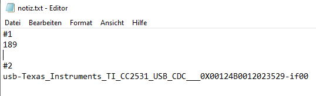
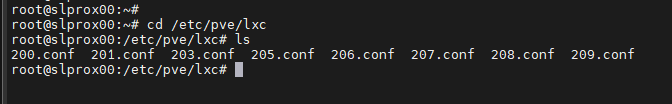
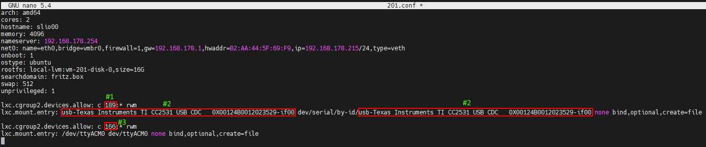

# Proxmox


## Proxmox Installation
Proxmox Virtual Environment (Proxmox VE for short) is a virtualization platform based on Debian. The virtualization technology in Proxmox is based on QEMU/KVM.

Proxmox "packages" QEMU/KVM in its own web interface, making administration quite easy (and also supports Linux Containers - LXC). This makes Proxmox beginner-friendly on the one hand, but also powerful enough to be used in a professional environment.

This section shows an example of the installation and basic configuration of Proxmox in the free version (non-subscription).

For clarity, image descriptions and additional information can be opened.

### Requirements
<details><summary>requirements</summary>

- 64-bit CPU
- CPU and motherboard must support Intel VT/AMD-V for virtualization and be activated in the BIOS.
- 1 GB RAM (only for Proxmox) – depending on the number of virtual machines to be operated, more RAM is of course required. Therefore, a minimum of 8 GB, or even better, 16 GB RAM is recommended.

</details>

### Create ISO image/bootable USB stick
First you need an ISO image, which can be downloaded from [Proxmox download page](https://www.proxmox.com/de/downloads/category/iso-images-pve).

<details><summary>Proxmox Iso</summary>


</details>

To install, you need to create a bootable USB stick with this ISO image. This should have at least 2 GB of storage. There are several ways to create a bootable stick, see [Preparing installation media](https://pve.proxmox.com/wiki/Prepare_Installation_Media#_instructions_for_windows)

### Installation
The system must be configured in the UEFI/BIOS so that it can be booted from a USB device. After plugging in the USB stick, the Proxmox installation menu will appear after a short time (if not, you can also manually specify the USB stick as the boot medium (on most motherboards you can do this with F8 or F11).

In the installation menu, simply select **Install Proxmox VE**.

<details><summary>installation menu</summary>


</details>

In the next step you must agree to the terms of use (EULA).

<details><summary>Eula</summary>


</details>

Next, you select the hard drive on which Proxmox is to be installed. If several hard drives are installed on the server, you should make sure to select the right hard drive!

<details><summary>hard drive selection</summary>


</details>

With the **Options** button you can also specify further parameters for the installation hard disk:

<details><summary>Advanced Options Hard Drive</summary>


</details>

Proxmox uses the [Logical Volume Manager](https://de.wikipedia.org/wiki/Logical_Volume_Manager) (LVM). The advanced options here can be used to configure the LVM in detail, among other things.
The installer creates a volume group (VG) with the name pve and additional logical volumes (LVs) with the names root (this is where Proxmox itself is installed), data (storage on which the virtual disks of the VMs are stored) and swap (this is where the swap file is stored).

<details><summary>With the advanced settings, certain parameters can be specified here:</summary>

- Filesystem: Here you can choose the file system. The default is ext4 and in most cases this is a good choice. If there are several hard drives available on the host system (and a lot of RAM), the zfs option with the corresponding RAID level makes sense. In this case, however, you should have a basic understanding of ZFS.
- hdsize: Specifies the total hard disk size to be used for Proxmox. Normally you choose the entire hard disk size here, unless you want to add more partitions later.
- swapsize: Determines the size of the swap volume. The default is the same size as the installed memory, but a minimum of 4 GB and a maximum of 8 GB.
- maxroot: Specifies the maximum size of the root volume (Proxmox itself). **It should be noted that in the basic installation, later required templates and ISO images are also stored here.**
- minfree: Space to leave free on the LVM volume group pve. If the disk is larger than 128 GB, 16 GB is left free here by default (LVM always needs some free space for creating snapshots).
- maxvz: Sets the maximum size of the data volume.

</details>

Normally you can leave all options at the default setting (i.e. nothing is specified here). These are already optimally set for most installations.

After selecting the hard drive for Proxmox, the localization options are requested (country, time and the corresponding keyboard layout):

<details><summary>localization</summary>


</details>

The root user's password is then entered. An email address is also requested here. This is used to send an email to the address specified here when important system messages are received. This does not necessarily have to be a real email address (but then you as an admin will no longer be notified of important system events by email).

<details><summary>password and email</summary>


</details>

The next step of the installer deals with the network settings. The respective interface is available for selection. The host name can be freely chosen, but the DNS domain must also be specified.
As an example for Fritzbox users, it would be `hostname.fritz.box`.
For IP address, it is preferable to specify a static IP address (no DHCP). This includes the IP address itself (as CIDR notation), the gateway IP (normally the IP address of the router) and the DNS server to be used (in private environments usually also the IP address of the router). Proxmox usually recognizes the network automatically.

<details><summary>network</summary>


</details>

At the end, a summary of the installation is displayed:

<details><summary>Summary</summary>


</details>

The system will be installed by checking the settings and clicking on Install.

<details><summary>installation</summary>


</details>

After a short wait, the installation is complete and the system must be rebooted (first remove the USB stick with the ISO image).

You will then see the terminal. This will show you the instructions on how to access the system:

<details><summary>console</summary>


</details>

Now continue in the browser (for example https://10.1.1.89:8006). However, a warning is displayed first. This is because a self-signed certificate was created during installation, which of course is not known to the browser. This message can be safely ignored at this point - the connection is encrypted via HTTPS in any case. The message itself depends on the browser. In this example, click on **Advanced** and then on **Continue to 10.1.1.89(unsafe)**

<details><summary>data protection errors</summary>


</details>

You then log in with the root user and the password you chose during installation. You can **first** change the language to German here, otherwise the Proxmox interface will be displayed in English and you do not have to enter your user name and password a second time.

<details><summary>Registration</summary>


</details>

Immediately after logging in, you will be greeted with a message that you do not have a valid subscription for this server. This message must first be confirmed by clicking OK.

<details><summary>subscription</summary>


</details>

Now the Proxmox package sources must be adjusted so that updates can be received.

<details><summary>package sources</summary>


</details>

To do this, the **non-subscription repository** is added to the package sources. This can be done in the menu of the Proxmox instance under `Updates > Repositories`. The non-subscription repository can be added using the Add button:

<details><summary>Non-Subscription</summary>


</details>

Now the **Enterprise repository** should be deactivated. To do this, simply select the pve-enterprise repository in the repository view and click on the **Deactivate** button.

The configuration of the repositories then looks like this:

<details><summary>enterprise repository</summary>


</details>

### Updates
After the package sources have been changed, a first system update should be carried out. The best way to do this is via the web interface:

<details><summary>updates</summary>


</details>

Simply select the desired Proxmox node (e.g. "pve") and then click on **Update** under Updates. This will open the so-called Task Viewer, which is always displayed when any activity is carried out on the system. The Task Viewer can now be closed again. By the way, when the Task Viewer is displayed, you do not have to wait until the task has been completed ("TASK OK"), but this dialog can always be closed again straight away - the task itself continues to run in the background.
If updates are now available, they can be installed by clicking on **Upgrade**.

The web console will then open and you can monitor the progress.

<details><summary>web console</summary>


</details>

It is of course also possible to update the Proxmox server via the command line (e.g. via SSH):

```bash
apt update && apt dist-upgrade
```

The only important thing here is that you use an **apt dist-upgrade** (on "normal" Debian/Ubuntu machines you tend to use apt upgrade). However, the "dist-upgrade" is important for Proxmox, as it better resolves dependencies that are needed to run Proxmox.

In this respect, Proxmox is now complete in its basic configuration. If you want to learn more about Proxmox, it is worth taking a look at [Proxmox Wiki](https://pve.proxmox.com/wiki/Main_Page) or the [official forum](https://forum.proxmox.com/).

---

## Proxmox - Creating a virtual Qemu/KVM machine (VM) + ioBroker installation afterwards
This example tutorial shows how to create a [VM](https://pve.proxmox.com/wiki/Qemu/KVM_Virtual_Machines) (debian stable (as of October 30, 2024 = Debian 12 'Bookworm')) and then install ioBroker in it.

It is of course possible to use Ubuntu instead of Debian, but make sure to use an Ubuntu Server **LTS version**.

For clarity, image descriptions and additional information can be opened.

### 1 - Download ISO image
First, a [ISO image](https://www.debian.org/distrib/) (64-bit PC Netinst ISO) is required, which must be loaded into the root directory (local) in the basic installation (if no additional drives have been created).

To do this, go to local > ISO images. There are two options there.

- Using the **Upload** button, the ISO that was previously saved on the computer can be loaded onto the Proxmox host.
- **Download from URL** it is possible to load the ISO directly onto the host via URL. To do this, copy the link address of the 64-bit PC Netinst ISO (right mouse button), paste the URL and click on **Query URL** to retrieve it. Finally, click on **Download** to download the ISO directly.

<details><summary>Download ISO</summary>


</details>

### 2 - Create VM
By clicking on the blue button **Create VM** a window opens in which the following settings must be made.

- General: Assignment of hostname and password, ID is specified (starts with 100), can be changed, but not subsequently.
- OS: Storage selection (local) and ISO image (debian-11-netinst.iso)
- System: everything stays in the default setting, **Check Qemu Agent**
- Disks: Storage local-lvm, disk size 10GB (10-20GB should be sufficient, changing this later is possible but is not described further here).
- CPU: Depends on how powerful the computer is (can also be adjusted at any time, VM must be restarted)
- Memory: RAM size in MiB (can also be adjusted at any time, VM must be restarted)
- Network: vmbr0, everything else remains as specified
- Confirm: Here you can see a summary again (check **Start after creation**) then the VM is created by clicking on **Finish**.

<details><summary>Image series Create VM</summary>


</details>

### 3 - Debian Install
After the VM has started, go to the VM console and start the **Install**.

<details><summary>console</summary>


</details>

You will be guided through the installation and will have to make some settings during the process. You will need the tab, space and arrow keys to operate the program. Due to the scope, various settings can be found in the picture series.

<span style="color:red">**ATTENTION! - No root password may be assigned.**</span>

A notice:

Do not choose **iobroker** as the user name, as this is already used internally in the system.
The user name should only consist of lowercase letters and the numbers 0-9 and should start with a letter. The hyphen is also permitted, but not as the first character.

<details><summary>Debian Install picture series</summary>


</details>

### 4 - Setting up a VM
Restart the VM, then log in with the "user name" and "password" assigned during installation. Then use the command

```bash
ip addr
```

the IP address was found. This is needed to connect remotely to the VM via ssh, as in the next step.

<details><summary>ip addr</summary>


</details>

Now you can access the VM via ssh (e.g. PuTTY). Here you log in again with "user name" and "password".
The network address can then be changed from **dhcp** to **static**. (which is recommended for server operation)

```bash
sudo nano /etc/network/interfaces
```

<details><summary>network/interfaces</summary>


</details>

Changes in the editor are saved with the key combination CTRL + o , then ENTER, CTRL + x closes the editor.

Changes to the IP will only take effect after the VM is restarted. Before this, however, the Qemu guest agent is checked to see if it is active.

```bash
sudo systemctl status qemu-guest-agent
```

<details><summary>guest agent</summary>


</details>

<span style="color:orange">**ATTENTION! - For Ubuntu installations, the Qemu guest agent must be installed and started..**</span>

Commands for this:

```bash
sudo apt-get install qemu-guest-agent
sudo systemctl start qemu-guest-agent
```

Furthermore, in order to install iobroker, **curl** must be installed.

```bash
sudo apt install curl
```

<details><summary>reinstall curl</summary>


</details>

To pass through devices (USB) in a VM, select the VM > Hardware > Add > USB Devices > Manufacturer/Device ID. All connected devices are listed here.

<details><summary>USB devices</summary>


</details>

In order for the VM to start automatically after a reboot of the computer (Proxmox), this must be activated in the VM options.

<details><summary>option boot</summary>


</details>

This completes the installation and setup of the VM. The VM can now be restarted and ioBroker can then be installed.

---

## Proxmox - Creating a Linux Container (LXC) + ioBroker Installation afterwards
This example tutorial shows how to create a [LXC Container](https://pve.proxmox.com/wiki/Linux_Container) (debian11) and then install ioBroker in it.

For clarity, image descriptions and additional information can be opened.

### 1 - Download container template
First, a template is required, which must be loaded into the root directory (local) in the basic installation (if no additional drives have been created).

To do this, go to local > Container Templates. Clicking on **Templates** opens a selection list. Here you select debian-11-standard(bullseye) and click on download.

<details><summary>Download template</summary>


</details>

### 2 - Create LXC
By clicking on the blue button **Create CT** a window opens in which the following settings must be made.

- General: Assignment of hostname and password, ID is predefined (starts with 100), but can be changed.
- Template: Storage Selection(local) and Template(debian-11-standard)
- Disks: Assignment of disk size (don't be too generous, you can increase it at any time)
- CPU: Depends on how powerful the computer is (can also be adjusted at any time)
- Memory: Ram/Swap allocation (can be adjusted at any time, even during operation)
- Network: static IP/CIDR assignment, gateway, if no IPv6 is set up, this will be set to SLAAC
- DNS: usually nothing is changed (use values from the host)
- Confirm: Summary, (check **Start after creation**) then the container is created by clicking on **Finish**.

<details><summary>Image series Create CT</summary>


</details>

### 3 - Setting up LXC
After the container has been started, go to the console of the LXC

<details><summary>console</summary>


</details>

Here you first log in as root with the password that was previously assigned when creating the LXC and then update it.

```bash
apt update && apt upgrade
```

<details><summary>upgrade</summary>


</details>

It is immediately pointed out that the time zone still needs to be set.

```bash
dpkg-reconfigure tzdata
```

<details><summary>time zone</summary>


</details>

Now **sudo** and **curl** are installed. Sudo is required to correctly create a user, as in the next step, with which you will work on the console in the future. Curl is required to call the ioBroker installation script in the last step.

```bash
apt install sudo curl
```

<details><summary>reinstalling</summary>


</details>

Now you create the future user. Replace "Username" in this case. Assign a password for the user. The rest can be confirmed with ENTER.

A notice:

Do not select **iobroker** as the user name, as it is already used internally in the system.

```bash
adduser benutzername
```

The user must then be assigned to the sudo group.

```bash
usermod -aG sudo benutzername
```

If a user is to be created subsequently, he or she must still

```bash
usermod -aG adm,dialout,sudo,audio,video,plugdev,users,iobroker benutzername
```

be added to the relevant groups.

<details><summary>Create user</summary>


</details>

In the last step, before installing ioBroker, log out once

```bash
exit
```

and then log in with the new user. iobroker can now be installed.

<details><summary>log out and log in with user</summary>


</details>

In order for the LXC to start automatically after a reboot of the computer (Proxmox), this must be activated in the container options.

<details><summary>option boot</summary>


</details>

### Optional: Fix warnings / error messages regarding services not starting
When calling iob diag, for example, the error messages below can be found in the output.
Sometimes they only appear in non-privileged containers, sometimes also in privileged containers.

~~~ .... ***FAILED SERVICES***

  UNIT LOAD ACTIVE SUB DESCRIPTION

* run-rpc_pipefs.mount loaded failed failed RPC Pipe File System
* sys-kernel-config.mount loaded failed failed Kernel Configuration File System
* systemd-networkd-wait-online.service loaded failed failed Wait for Network to be Configured

...
~~~

If you want to clean up the container before installing iobroker, you get the "FAILED SERVICES" as follows:

```bash
systemctl list-units --failed
```

Here is a collection of troubleshooting steps:

#### Failed service run-rpc_pipefs.mount
```bash
sudo systemctl mask run-rpc_pipefs.mount
sudo systemctl mask var-lib-nfs-rpc_pipefs.mount
```

#### Failed service sys-kernel-config.mount
Add the following line to the container configuration file in the directory `/etc/pve/lxc`:

~~~ lxc.cap.drop: "sys_rawio audit_read" ~~~

#### Failed service systemd-networkd-wait-online.service
Replacing `ifupdown` service with `ifupdown2`:

```bash
sudo systemctl disable --now systemd-networkd-wait-online.service
sudo systemctl disable --now systemd-networkd.service
sudo systemctl disable --now ifupdown-wait-online
sudo apt-get update
sudo apt-get upgrade
sudo apt-get install ifupdown2
```

---

## Install ioBroker
To install ioBroker you only need a single command.

```bash
curl -sLf https://iobroker.net/install.sh | bash -
```

The installation steps are divided into 4 steps, which are fully automatic.

- Installing prerequisites (1/4)
- Creating ioBroker user and directory (2/4)
- Installing ioBroker (3/4)
- Finalizing installation (4/4)

<details><summary>installer</summary>


</details>

The installation is completed successfully when the following appears at the end.

~~~ ioBroker was installed successfully Open http://10.1.1.222:8081 in a browser and start configuring! ~~~

This also means that ioBroker can now be accessed in the browser using the address. If everything worked without problems, you will be greeted with the ioBroker setup. Now there are just a few steps left that you will be guided through with the assistant.

<details><summary>Image series ioBroker Assistant</summary>


</details>

You then have the option of searching for devices and services. The required adapters/instances can then be created automatically.

<details><summary>Image series Device/Service Search</summary>


</details>

This completes the ioBroker installation. Additional adapters can be installed at any time, depending on the application and requirements.

---

## Proxmox - LXC (Linux Containers) -> Pass USB devices through
This part of the manual explains step by step how to pass a USB device (USB passthrough) in Proxmox to an LXC (Linux Container).

With a VM, it is possible to pass through a USB device directly via the Proxmox web interface; with a Linux container, the lxc configuration file currently has to be edited manually.

The instructions describe how to integrate a **Texas Instruments Inc. CC2531** Zigbee stick, but the same steps can be used for other Zigbee sticks (ConBee, CC2652P etc.) or for other USB devices with the exception of USB network devices (Bluetooth/Wi-Fi).

* For this part of the guide, Proxmox version 7.1 was used.

### 1.) Collect information about the USB device
<details>

Establishing an SSH connection to Proxmox:

```bash
ssh root@IP-Adresse
```

<span style="color:red">**If the USB device is already connected to the Proxmox host, unplug the device for now.**</span>

The following command lists all currently connected USB devices on the Proxmox host:

```bash
lsusb
```


Now the USB device to be mounted is plugged into the Proxmox host and the lsusb command is executed again


The screenshot shows that a new device with the USB bus number: **001** and the device number: **003** is listed.

This information is required to output the **major device number** from the device using the following command:

```bash
ls -l /dev/bus/usb/001/003
```

Important: Use the output of your USB bus number and device number in the command!

***ls -l /dev/bus/usb/USB-Bus-Number/Device-Number***


In this example, the USB device has the major device number **189**, write down the value of your device in a text file with the note: #1


Next, we output the unique id of the USB device and note the output value in the text file with the note: #2

```bash
ls /dev/serial/by-id/
```




As a last step, the major device number of the ttyACM is output and noted with the note: #3:

```bash
ls -l /dev/ttyACM*
```


>*If no output is produced, check with "ls -l /dev/serial/by-id/" whether the USB device is mounted by the system as ttyUSB, if so, replace all following commands that refer to **ttyACM…** with **ttyUSB…** if no output is produced, it is not a USB CDC class device (serial communication) so all points for mounting the ttyACM can be ignored.*

Thus, we have noted **three** values from the USB device that are needed for integration into the lxc configuration file.


</details>

### 2.) Edit LXC configuration file
<details>

On the Proxmox host, change to the LXC configuration directory with:

```bash
cd /etc/pve/lxc
```

The configuration file has the same ID number that was assigned when the lxc was created!




Before editing the configuration file, a backup copy should be created:

```bash
cp 201.conf 201.conf.backup
```


Now edit the configuration file with vi or nano:

```bash
nano 201.conf
```


The following is added to the end of the configuration file:

~~~ lxc.cgroup2.devices.allow: c 189:* rwm lxc.mount.entry: usb-Texas_Instruments_TI_CC2531_USB_CDC___0X00124B0012023529-if00 dev/serial/by-id/usb-Texas_Instruments_TI_CC2531_USB_CDC__ _0X00124B0012023529-if00 none bind,optional,create=file

lxc.cgroup2.devices.allow: c 166:* rwm lxc.mount.entry: /dev/ttyACM0 dev/ttyACM0 none bind,optional,create=file ~~~

Replace the marked values with the noted entries from your note!



* The first line refers to the major device number **189** Note: #1
* In the second line, the unique id (usb-Texas_Instruments_TI_CC2531_USB_CDC___0X00124B0012023529-if00) from note #2 is specified individually and with the absolute path, note that the complete text is written on one line without line breaks.
* The third line specifies the major device number **166** of ttyACM from note #3.

Save the configuration file (in the Nano Editor with the key combination: CTRL + o & CTRL + x to exit the editor)

</br>

<span style="color:orange">**ATTENTION! - If your container has active snapshots:**</span>

<details>

Then the lxc.cgroup code does not belong at the end of the config file but before the first entry of a snapshot.


</details>

<span style="color:orange">**ATTENTION! - Proxmox installation before version 7.0:**</span>

<details>

Replace the entries with

~~~ lxc.cgroup2 ~~~

through

~~~ lxc.cgroup ~~~

</details>

</br> Finally, issue the following command to set the required permissions for ttyACM0:

```bash
chmod o+rw /dev/ttyACM*
```

To apply the adjustments to the lxc, perform a cold boot from the container with **pct stop id / pct start id**:

```bash
pct stop 201
```

```bash
pct start 201
```

</br>

<span style="color:green">**Tip: It is best to save a copy of your working config file externally, as the integrated Proxmox backup service, for example, does not save the contents of your config!**</span>

</br>

</details>

### 3.) Check LXC USB Passthrough & Zigbee instance configuration
<details>

Establishing an SSH connection to the LXC:

```bash
ssh Benutzer@IP-Adresse
```

With the commands:

```bash
lsusb
```

&

```bash
ls -l /dev
```

it is checked whether the adjustments to the configuration file were successful.


* As you can see in the screenshot, the container now has access to the USB device.

* It is important that ttyACM0 has the same rights as in the screenshot, i.e. **crw-rw-rw- 1 nobody nogroup**

>***If you do not check whether all values in the configuration file are set as described, if the rights still do not match, skip to point 5.***

* The screenshot also shows that the device number of the cc2531 has changed from 3 to 4. This is because the stick was unplugged and plugged in again. However, since the configuration file specifies the unique ID and not the bus/device number, the USB passthrough still works.

If a Zigbee stick is passed through to the container as described above, the settings of the Zigbee adapter in iobroker under the item COM port name

~~~ /dev/ttyACM0 ~~~

must be specified so that the correct device is addressed by the adapter.


</details>

### 4.) UDEV rule for permanent rights adaptation of ttyACM0
<details>

At the end of step 3, the command

```bash
chmod o+rw /dev/ttyACM*
```

the appropriate rights for ttyACM0 are set, but these rights changes are reset when the Proxmox host is restarted. For a permanent adjustment, a udev rule is required on the Proxmox host.

With lsusb we list the currently connected USB devices again:

```bash
lsusb
```


This time we note the numerical values by ID in this case **0451:16a8**

* The first value: ***0451*** stands for the **idVendor** and the second value: ***16a8*** for **idProduct**.

Now use vi or nano to create the udev rule under /etc/udev/rules.d:

```bash
nano /etc/udev/rules.d/50-myusb.rules
```

and the following content was inserted:

~~~ SUBSYSTEMS=="usb", ATTRS{idVendor}=="0451", ATTRS{idProduct}=="16a8", GROUP="users", MODE="0666" ~~~


Finally, execute the following command to activate the udev rule:

```bash
udevadm control –-reload
```

</details>

### 5.) Troubleshooting
<details>

**Error:** ttyACM0 rights in lxc do not match or are lost after a short time (ConBee II).

```bash
ls -l /dev/ttyACM0
 c--------- 0 nobody nogroup 166, 0 Feb  7 14:29 ttyACM0
```

</br>

**Solution:** Use mknod to create a persistent bind for the container.

To do this, create the folder **devices** in the path **"/var/lib/lxc/CONTAINERID"** and create the binding in this folder using mknod:

```bash
mkdir /var/lib/lxc/201/devices
```

```bash
cd /var/lib/lxc/201/devices
```

```bash
mknod -m 666 ttyACM0 c 166 0
```

+ *mknod creates a file called ttyACM0 in the path (as long as the file exists the device is bound to the lxc)*


***major device number and ttyACM.. adjust if necessary***

Then the entry in the lxc configuration file must be adjusted:

~~~ lxc.mount.entry: /dev/ttyACM0 dev/ttyACM0 none bind,optional,create=file ~~~

is replaced by:

~~~ lxc.mount.entry: /var/lib/lxc/CONTAINERID/devices/ttyACM0 dev/ttyACM0 none bind,optional,create=file ~~~

</details>

---

## Set up USB stick/disk for backups
So that future backups can be saved separately, it is possible to integrate a USB device in the form of a stick or disk on the Proxmox host.
The device must have a specific format for this.
Common [file systems](https://wiki.ubuntuusers.de/Dateisystem/) are **vFAT** or **NTFS**. Both can be read by Linux, Windows or MacOS.
For pure Linux, usually **EXT4**.

If the data carrier is not yet partitioned or you want to reformat it, you can do this on a Windows PC (ntfs) or directly on the Proxmox server.
When the data carrier is prepared, it can then be mounted in the system and then added as storage (directory) directly via the Proxmox GUI.

<span style="color:orange">**ATTENTION! - When reformatting, all previous data on the storage device will be deleted</span>

The following example instructions refer to setting up directly on the Proxmox host. Ssh/putty can also be used.

**Please note that the following commands require root. If you use your own user on the host, the commands below must be executed with sudo in front.**

### Prepare device
### 1 - Identify device
First, locate the device using [lsblk](https://wiki.ubuntuusers.de/lsblk/). It is advisable to execute the command once before and after plugging it in. This makes it easier to identify the device.

```bash
lsblk
```

looks something like this (letters vary depending on how many devices are connected)

~~~ sdd 8:48 0 119.2G 0 disk ├─sdd1 8:49 0 119.2G 0 part └─sdd9 8:57 0 8M 0 part sde 8:64 0 931.5G 0 disk <-- This is the disk /dev/sde └─sde1 8:65 0 931.5G 0 part <-- This is the first partition /dev/sde1, if already formatted sr0 11:0 1 1024M 0 rom sr1 11:1 1 1024M 0 rom ~~~

### 2 - Partitioning
The menu-driven [cfdisk](https://wiki.ubuntuusers.de/fdisk/) partitions the drive

```bash
cfdisk /dev/sde
```

### 3 - Create file system
Now the partition you created previously needs to be formatted. As mentioned above, there are various options, depending on the intended use.
The partition is formatted using the command [mkfs](https://wiki.ubuntuusers.de/Formatieren/) and the appropriate parameters.

```bash
mkfs.vfat /dev/sde1
```

### 4 - Mount drive
In order to use the finished data carrier, it must be [mounted](https://wiki.ubuntuusers.de/mount/).

For this purpose, a suitable mount point is created and in order for the data carrier to be automatically mounted again after a reboot, a suitable entry is required in the [/etc/fstab](https://wiki.ubuntuusers.de/fstab/).

To do this, the unique **UUID** of the drive must be read.

Create mount point

```bash
mkdir /media/ext_usb
```

Mount disk

```bash
mount /dev/sde1 /media/ext_usb
```

Determine UUID

```bash
blkid | grep -i sde
```

results in ~~~ /dev/sde1: LABEL="Export_Images" UUID="136b058d-f0c8-406d-a82b-2adcc00b72bf" UUID_SUB="951e8519-8478-4d64-b093-c3597147f989" BLOCK_SIZE="4096" TYPE="btrfs" PARTUUID="00011a10-01" ~~~

Edit entry in */etc/fstab* with nano

```bash
nano /etc/fstab
```

now this entry is added and then saved ~~~ UUID="136b058d-f0c8-406d-a82b-2adcc00b72bf" /media/ext_usb vfat defaults 0 0 ~~~

### 5- Add storage in Proxmox
A directory can now be added under Data Center>Storage. The ID name can be freely selected, e.g. *usb-backup*.

The *Directory* column specifies the path, in this case */media/ext_usb*.

Under *Content* you only have to select the desired issue.