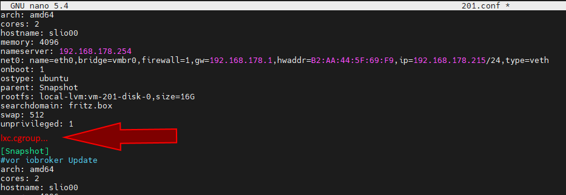
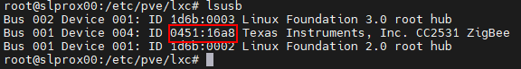

# Proxmox


## Proxmox - ioBroker installation in a VM (Virtual Machine)
?> ***This is a placeholder***.<br><br> Help ioBroker and expand this article. Please note the [ioBroker Style Guide](community/styleguidedoc) so that the changes can be adopted more easily.

<details>

</details>

## Proxmox - ioBroker installation in a LXC (Linux container)
?> ***This is a placeholder***.<br><br> Help ioBroker and expand this article. Please note the [ioBroker Style Guide](community/styleguidedoc) so that the changes can be adopted more easily.

<details>

</details>

## Proxmox - LXC (Linux Containers) -> Pass through USB devices
### Foreword
This part of the guide explains step by step how to pass through a USB device (USB passthrough) in Proxmox to an LXC (Linux container).

With a VM, it is possible to pass on a USB device directly via the Proxmox web interface. With a Linux container, the configuration file of the lxc currently has to be edited manually for this.

The instructions describe how to integrate a **Texas Instruments Inc. CC2531** Zigbee Stick, but the same steps can be used analogously for other Zigbee Sticks (ConBee, CC2652P etc.) or for other USB devices with the exception of USB network devices ( Bluetooth/Wlan) can be used.

* Proxmox version 7.1 was used for this part of the instructions.

<details>

### 1.) Gather information about the USB device
Establishing an SSH connection to Proxmox:

```
ssh root@IP-Adresse
```

<span style="color:red">If the USB device is already connected to the Proxmox Host, unplug the device for the time being.</span>

The following command lists all currently connected USB devices on the Proxmox host:

```
lsusb
```


Now the USB device to be integrated is plugged into the Proxmox host and the lsusb command is executed again


In the screenshot you can see that a new device with the USB bus number: **001** and the device number: **003** is listed.

This information is required to use the following command to e.g. output the **major device number** from the device:

```
ls -l /dev/bus/usb/001/003
```

It is important to use the output of your USB bus number and device number with the command!

***ls -l /dev/bus/usb/usb-bus-number/device-number***


The USB device in this example has the major device number **189**, write down the value of your device in a text file with the comment: #1


Next we output the unique id of the USB device and note the output value in the text file with the note: #2

```
ls /dev/serial/by-id/
```


As a last step, the major device number of the ttyACM is output and noted with the note: #3:

```
ls -l /dev/ttyACM*
```


>If there is no output, check with "ls -l /dev/serial/by-id/" whether the USB device is integrated by the system as ttyUSB, if so replace all the following commands that refer to **ttyACM...** obtain by **ttyUSB…** should no output appear it is not a USB CDC class device (serial communication) so all points to include from ttyACM can be ignored.

So we wrote down **three** values from the USB device that are needed for the integration into the configuration file of the lxc.


### 2.) Edit LXC configuration file
Change to the LXC configuration directory on the Proxmox host with:

```
cd /etc/pve/lxc
```

The configuration file has the same ID number that was assigned when the lxc was created!


Before editing the configuration file, a backup copy should be created:

```
cp 201.conf 201.conf.backup
```


Now the configuration file is edited with vi or nano:

```
nano 201.conf
```


The following is added to the end of the configuration file:

```
lxc.cgroup2.devices.allow: c 189:* rwm
lxc.mount.entry: usb-Texas_Instruments_TI_CC2531_USB_CDC___0X00124B0012023529-if00 dev/serial/by-id/usb-Texas_Instruments_TI_CC2531_USB_CDC___0X00124B0012023529-if00 none bind,optional,create=file

lxc.cgroup2.devices.allow: c 166:* rwm
lxc.mount.entry: /dev/ttyACM0 dev/ttyACM0 none bind,optional,create=file
```

Replace the marked values with the noted entries from your note!


* The first line refers to the major device number **189** Note: #1
* In the second line, the unique id (usb-Texas_Instruments_TI_CC2531_USB_CDC___0X00124B0012023529-if00) from Note: #2 is given individually and with the absolute path, note that the complete text is written in one line without line breaks.
* In the third line, the major device number **166** from ttyACM from Note: #3 is given.

Save the configuration file (in the nano editor with the key combination: CTRL + o & CTRL + x to exit the editor)

> ATTENTION! If your container has active snapshots:

<details>Then the lxc.cgroup code does not belong at the end of the config file but before the first entry of a snapshot.



</details>

> ATTENTION! Proxmox installation before version 7.0

<details>

Replace the entries with

```
lxc.cgroup2
```

through

```
lxc.cgroup
```

</details>

Finally, issue the following command to set the required rights for ttyACM0:

```
chmod o+rw /dev/ttyACM*
```

To apply the adjustments to the lxc, perform a cold boot from the container with **pct stop id / pct start id**:

```
pct stop 201
```

```
pct start 201
```

> Tip, it is best to store a copy of your working config file externally, since e.g. B. the integrated Proxmox backup service does not back up the content of your config!

### 3.) Check LXC USB passthrough & zigbee instance configuration
Establishing an SSH connection to the LXC:

```
ssh Benutzer@IP-Adresse
```

With the commands:

```
lsusb
```

&

```
ls -l /dev
```

it is checked whether the adjustments to the configuration file were successful.


* As can be seen in the screenshot, the container now has access to the USB device.

* It is important that ttyACM0 has the same rights in the screenshot, i.e. **crw-rw-rw- 1 nobody nogroup**

>***If you don't check whether all values in the configuration file are set as described, the rights should still not match then jump to point 5.***

* The screenshot also shows that the device number of the cc2531 has changed from 3 to 4, this is because the stick has been unplugged and plugged in again in the meantime. However, since the unique ID and not the bus/device number is specified in the configuration file, the USB passthrough continues to work.

If, as described above, a Zigbee stick is passed through to the container, it must be entered in iobroker in the Zigbee adapter settings under COM port name

```
/dev/ttyACM0
```

specified so that the correct device is addressed by the adapter.


### 4.) UDEV rule for permanent rights Adjustment of ttyACM0
At the end of step 3 was using the command

```
chmod o+rw /dev/ttyACM*
```

the appropriate rights are set for ttyACM0, but these rights changes are reset when the Proxmox host is restarted. A udev rule is required on the Proxmox host for permanent adjustment.

With lsusb we list the currently connected USB devices again:

```
lsusb
```



This time we write down the numerical values after ID, so in this case **0451:16a8**

* The first value: ***0451*** stands for the **idVendor** and the second value: ***16a8*** for **idProduct**.

Now the udev rule is created under /etc/udev/rules.d with vi or nano:

```
nano /etc/udev/rules.d/50-myusb.rules
```

and added the following content:

```
SUBSYSTEMS=="usb", ATTRS{idVendor}=="0451", ATTRS{idProduct}=="16a8", GROUP="users", MODE="0666"
```


Finally, run the following command to activate the udev rule:

```
udevadm control –reload
```

### 5.) Troubleshooting
**Error:** ttyACM0 rights in the lxc do not match or are lost after a short time (ConBee II).

```
ls -l /dev/ttyACM0
 c--------- 0 nobody nogroup 166, 0 Feb  7 14:29 ttyACM0
```

**Solution:** Use mknod to create a persistent binding to the container.

<details>

To do this, the **devices** folder is created in the path **"/var/lib/lxc/CONTAINERID"** and the binding is created in this folder with mknod:

```
mkdir /var/lib/lxc/201/devices
```

```
cd /var/lib/lxc/201/devices
```

```
mknod -m 666 ttyACM0 c 166 0
```

mknod creates a file named ttyACM0 in the path (as long as the file exists the device is bound to the lxc)


***major device number and ttyACM.. adjust if necessary***

Then the entry in the lxc configuration file must be adjusted:

```
lxc.mount.entry: /dev/ttyACM0 dev/ttyACM0 none bind,optional,create=file
```

is replaced by:

```
lxc.mount.entry: /var/lib/lxc/CONTAINERID/devices/ttyACM0 dev/ttyACM0 none bind,optional,create=file
```

</details>

</details>