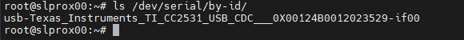
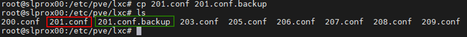

# Proxmox

## Proxmox installation
Proxmox Virtual Environment (Proxmox VE for short) is a Debian-based virtualization platform. The virtualization technology at Proxmox is based on QEMU/KVM.

Proxmox "packages" QEMU/KVM in its own web interface and thus makes administration quite easy (and also supports Linux Containers - LXC). This makes Proxmox on the one hand beginner-friendly, but on the other hand so powerful that it can also be used in a professional environment.

This section shows an example of the installation and basic configuration of Proxmox in the free version (non-subscription).

For the sake of clarity, image descriptions and additional information can be opened.

### Requirements

requirements

- 64-bit CPU
- CPU and mainboard must support Intel VT/AMD-V for virtualization and be activated in the bios.
- 1 GB RAM (only for Proxmox) - depending on the number of virtual machines to be operated, more RAM is of course required here. Therefore, a minimum of 8 GB, better still 16 GB of RAM is recommended.

### Create ISO image/bootable USB stick
First you need an ISO image, which can be downloaded from [Proxmox download page](https://www.proxmox.com/de/downloads/category/iso-images-pve).

Proxmox Iso

For installation, a bootable USB stick must be created with this ISO image. This should have at least 2 GB of memory. There are several ways to create a bootable stick, see [Prepare installation media](https://pve.proxmox.com/wiki/Prepare_Installation_Media#_instructions_for_windows)

### Installation
The system must be configured in the UEFI/BIOS so that it can be started from a USB device. After inserting the USB stick, the Proxmox installation menu will appear after a short time (if not, you can also specify the USB stick as the boot medium manually (on most mainboards you can do this with F8 or F11).

**Install Proxmox VE** is now simply selected in the installation menu.

Installation menu

The next step is to agree to the terms of use (EULA).

owl

The next step is to choose the hard drive on which Proxmox is to be installed. If several hard disks are installed on the server, you should make sure to choose the right hard disk!

Selection of the hard disk

With the **Button Options** you can also specify other parameters for the installation hard drive:

Advanced hard disk options

Proxmox uses the [Logical Volume Manager](https://de.wikipedia.org/wiki/Logical_Volume_Manager) (LVM). With the extended options at this point, the LVM can be configured in detail, among other things.
The installer creates a Volume Group (VG) named pve and additional Logical Volumes (LVs) named root (here Proxmox itself is installed), data (storage where the virtual disks of the VMs are stored) and swap (here the swap file is stored).

With the advanced settings, certain parameters can be specified here:

- File system: Here you can choose the file system. The default here is ext4 and in most cases this is a good choice. If several hard disks are available on the host system (and a lot of RAM), the zfs option with the appropriate RAID level makes sense here. In this case, however, you should have fundamentally dealt with ZFS.
- hdsize: Specifies the hard disk size that should be used for Proxmox in total. Here you normally choose the complete hard disk size, unless you want to add more partitions later.
- swapsize: Determines the size of the swap volume. The standard here is the same size as the built-in memory, but a minimum of 4 GB and a maximum of 8 GB.
- maxroot: Specifies the maximum size of the root volume (Proxmox itself). **It should be mentioned here that in the basic installation, later required templates and ISO images are also stored here.**
- minfree: Space left free on the LVM volume group pve. If the disk is larger than 128 GB, 16 GB is left free here by default (LVM always needs some free space for creating snapshots).
- maxvz: Specifies the maximum size of the data volume.

Normally you can leave all options on the default setting (i.e. nothing is specified here). These are already optimally set for most installations.

After selecting the hard drive for Proxmox, the localization options are queried (country, time and the associated keyboard layout):

localization

The password of the root user is then entered. An e-mail address is also requested here. This is used to send an e-mail to the address specified here in the event of important system messages. However, this does not necessarily have to be a real e-mail address (then, as an admin, you will no longer be notified of important system events by e-mail).

password and email

The next step of the installer deals with the network settings. A static IP address must be entered here (no DHCP). This includes the IP address itself (in CIDR notation), the gateway IP (usually the IP address of the router) and the DNS server to be used (in the private environment usually also the IP address of the router). Proxmox usually detects the network automatically.

network

At the end a summary of the installation is displayed:

summary

The system is installed by checking the settings and clicking on Install.

installation

After a short wait, the installation is complete and the system must be rebooted (remove the USB stick with the ISO image beforehand).

Then you see the terminal. The instructions are already displayed here on how the system can now be accessed:

console

Now it continues in the browser (example https://10.1.1.89:8006). First, however, a warning is displayed. This is due to the fact that a self-signed certificate was generated during installation, which of course is not known to the browser. You can safely ignore this message at this point - the connection is encrypted via HTTPS in any case. The message itself depends on the browser. In this example, click **Advanced** and then click **Continue to 10.1.1.89(unsafe)**

privacy error

The login then takes place with the user root and the password selected during installation. You can switch the language to German here **first**, otherwise the Proxmox interface will be displayed in English and you don't have to enter your username and password a second time.

registration

Immediately after this login you will be greeted by a message that you do not have a valid subscription for this server. This message is first confirmed by clicking on OK.

subscription

Now the Proxmox package sources have to be adjusted so that updates can be received.

package sources

To do this, the **Non-Subscription-Repository** is added to the package sources. This can be done in the Proxmox instance menu under `Updates > Repositories`. The non-subscription repository can be added using the Add button:

Non Subscription

Now the **Enterprise Repository** should be deactivated. To do this, simply select the pve-enterprise repo in the repository view and click on the **Deactivate** button.

The configuration of the repositories then looks like this:

Enterprise Repository

### Updates
After the package sources have been changed, a first system update should be carried out. The best way to do this is via the web interface:

updates

Simply select the desired Proxmox node (e.g. "pve") and then click on **Update** under Updates. This is where the so-called Task Viewer opens, which is always displayed when any activities are being carried out on the system. The Task Viewer can now be closed again. Incidentally, when the task viewer is displayed, you do not have to wait until the task has been completed ("TASK OK"), but this dialog can always be closed again directly - the task itself continues to run in the background.
If updates are now available, they can be imported by clicking on **Upgrade**.

The web console opens here and you can monitor the progress.

web console

It is of course also possible to update the Proxmox server via the command line (e.g. via SSH):

~~~ apt update && apt dist-upgrade ~~~

The only important thing here is that you use an **apt dist-upgrade** (on “normal” Debian/Ubuntu machines, you tend to use apt upgrade). However, the "dist upgrade" is important with Proxmox, since dependencies that are required to operate Proxmox are resolved better here.

In this respect, Proxmox is now complete in its basic configuration. If you want to deal more extensively with Proxmox, it's worth taking a look at [Proxmox Wiki](https://pve.proxmox.com/wiki/Main_Page) or to the [official forum](https://forum.proxmox.com/).

---

## Proxmox - Creation of a virtual Qemu/KVM machine (VM) + ioBroker installation afterwards
This example guide shows how to create a [VM](https://pve.proxmox.com/wiki/Qemu/KVM_Virtual_Machines) (debian11) and then install ioBroker in it.

It is of course possible to use Ubuntu instead of Debian, but make sure to use an Ubuntu Server **LTS Version**.

For the sake of clarity, image descriptions and additional information can be opened.

### 1 - Download ISO image
First, a [ISO image](https://www.debian.org/distrib/)(64-bit PC Netinst-ISO) is required, which must be loaded into the root directory (local) in the basic installation (if no other drives have been created).

To do this, go to local > ISO images. There are two options there.

- The ISO, which was previously stored on the computer, can be loaded onto the Proxmox host via the **Upload** button.
- **Download from URL** it is possible to upload the ISO directly to the host via URL. To do this, copy the link address of the 64-bit PC Netinst-ISO (right mouse button), insert the URL and click on **Query URL** to retrieve it. With a final click on **Download**, the ISO is now downloaded directly.

Download ISO

### 2 - Create VM
Clicking on the blue button **Create VM** opens a window in which the following settings must be made.

- General: assignment of the hostname and password, ID is given (starts with 100), can be changed, but not later.
- OS: Storage selection(local) and ISO image(debian-11-netinst.iso)
- System: everything stays in the default setting, **check Qemu Agent**
- Disks: Storage local-lvm, disk size 10GB (10-20GB should be sufficient, changing it later is possible, but is not described further here).
- CPU: Depends on how powerful the computer is (can also be adjusted at any time, VM must be restarted for this)
- Memory: RAM size in MiB (can also be adjusted at any time, VM must be restarted for this)
- Network: vmbr0, everything else stays as default
- Confirm: Here you can see a summary again (check **Start after creation**) and then click on **Finish** to create the VM.

Series of images Create VM

### 3 - Debian Install
After the VM has been started, go to the VM console and start the **Install**.

console

You will be guided through the installation and have to make some settings during this process. To use it, you need the tab, space and arrow keys. Due to the scope, various shots of the series of images can be found.

**DANGER! - No root password may be assigned.**

Image series Debian Install

### 4 - Set up VM
Restart the VM, then log in with the "Username" and "Password" assigned from the installation. Then with the command

~~~ ip addr ~~~

found the IP address. This is required to connect to the VM remotely via ssh, as in the next step.

ip addr

The VM can now be accessed via ssh (e.g. Putty). Here you log in again with "user name" and "password".
Then the network address can be changed from **dhcp** to **static**. (which is recommended for server operation)

~~~ sudo nano /etc/network/interfaces ~~~

network/interfaces

Changes in the editor are saved with the key combination CTRL + o , then ENTER, CTRL + x exits the editor.

Changes to the IP only take effect after a restart of the VM. Before that, however, it is checked whether the Qemu Guest Agent is active using

~~~ sudo systemctl status qemu-guest-agent ~~~

Guest Agent

**DANGER! - For Ubuntu installations, the Qemu Guest Agent must be installed and started..**

Commands for this:

~~~ sudo apt-get install qemu-guest-agent sudo systemctl start qemu-guest-agent ~~~

Furthermore, in order to be able to install iobroker, **curl** has to be installed afterwards.
~~~ sudo apt install curl ~~~

reinstall curl

To pass through devices (USB) in a VM, select the VM > Hardware > Add > USB Devices > Vendor/Device ID. All connected devices are listed here.

USB devices

In order for the VM to start automatically after a reboot of the computer (Proxmox), this must be activated in the VM options.

boot option

This completes the installation and setup of the VM. Now the VM can be restarted and then ioBroker can be installed.

---

## Proxmox - Creation of a Linux container (LXC) + ioBroker installation afterwards
This example guide shows how to create a [LXC containers](https://pve.proxmox.com/wiki/Linux_Container) (debian11) and then install ioBroker in it.

For the sake of clarity, image descriptions and additional information can be opened.

### 1 - Download container template
First, a template is required, which must be loaded into the root directory (local) in the basic installation (if no other drives have been created).

To do this, go to local > Container Templates. A click on **Templates** opens a selection list. Here you select debian-11-standard(bullseye) and click on download.

Download template

### 2 - Create LXC
A click on the blue button **Create CT** opens a window in which the following settings must now be made.

- General: Assignment of hostname and password, ID is given (starts with 100), but can be changed.
- Template: Storage Selection(local) and Template(debian-11-standard)
- Disks: Assignment of the disk size (do not be too generous, you can enlarge it at any time)
- CPU: Depends on how powerful the computer is (can also be adjusted at any time)
- Memory: Ram/Swap assignment (can be adjusted at any time, even during operation)
- Network: static IP/CIDR assignment, gateway, if no IPv6 is set up, this is set to SLAAC
- DNS: usually nothing is changed (use values from the host)
- Confirm: Summary (tick **Start after creation**) then click on **Finish** to create the container.

Image series Create CT

### 3 - Set up LXC
Now that the container has been started, go to the console of the LXC

console

Here you first log in as root with the previously assigned password, which was assigned when creating the LXC, and first update it.

~~~ apt update && apt upgrade ~~~

upgrade

It is pointed out directly that the time zone still has to be set.

~~~ dpkg-reconfigure tzdata ~~~

time zone

Now **sudo** and **curl** will be installed. Sudo is required, as in the next step, to correctly create a user that will be used in the future to work on the console. Curl is necessary to call the ioBroker installation script in the last step.

~~~ apt install sudo curl ~~~

reinstall

Now create the future user. Replace "username" in that case. Password assignment for the user. The rest can be confirmed with ENTER.

~~~ adduser username ~~~

The user must then be assigned to the sudo group.

~~~ usermod -aG sudo username ~~~

Create users

In the last step, before ioBroker is installed, log out once

~~~ exit ~~~

and then log in with the new user. iobroker can now be installed.

log out and login as user

In order for the LXC to start automatically after a reboot of the computer (Proxmox), this must be activated in the container options.

boot option

---

## Install ioBroker
All you need to install ioBroker is a single command.

~~~ curl -sLf https://iobroker.net/install.sh | bash-~~~

The installation steps are divided into 4 steps, which run fully automatically.

- Installing prerequisites (1/4)
- Creating ioBroker user and directory (2/4)
- Installing ioBroker (3/4)
- Finalizing installation (4/4)

installers

The installation is successfully completed when the following appears at the end.

~~~ ioBroker was installed successfully Open http://10.1.1.222:8081 in a browser and start configuring! ~~~

At the same time, this also means that ioBroker can now be called up in the browser via the address. If everything worked without any problems, you will be greeted with the ioBroker setup. Now there are only a few more steps that you will be guided through with the assistant.

Series of images ioBroker Assistant

You can then search for devices and services. Required adapters/instances can be created automatically.

Image series device/service search

This completes the ioBroker installation. Additional adapters can be installed at any time depending on the application and desire.

---

## Proxmox - LXC (Linux Containers) -> Pass through USB devices
This part of the guide explains step by step how to pass through a USB device (USB passthrough) in Proxmox to an LXC (Linux container).

With a VM, it is possible to pass on a USB device directly via the Proxmox web interface. With a Linux container, the configuration file of the lxc currently has to be edited manually for this.

The instructions describe how to integrate a **Texas Instruments Inc. CC2531** Zigbee stick, but the same steps can be used analogously for other Zigbee sticks (ConBee, CC2652P etc.) or for other USB devices with the exception of USB network devices ( Bluetooth/Wlan) can be used.

* Proxmox version 7.1 was used for this part of the instructions.

### 1.) Gather information about the USB device

Establishing an SSH connection to Proxmox:

~~~ ssh root@ip address ~~~

**If the USB device is already connected to the Proxmox Host, unplug the device for now.**

The following command lists all currently connected USB devices on the Proxmox host:

~~~ lsusb ~~~

Now the USB device to be integrated is plugged into the Proxmox host and the lsusb command is executed again

In the screenshot you can see that a new device with the USB bus number: **001** and the device number: **003** is listed.

This information is required to use the following command to e.g. output the **major device number** from the device:

~~~ ls -l /dev/bus/usb/001/003 ~~~

It is important to use the output of your USB bus number and device number with the command!

***ls -l /dev/bus/usb/usb-bus-number/device-number***

The USB device in this example has the major device number **189**, write down the value of your device in a text file with the comment: #1

Next we output the unique id of the USB device and note the output value in the text file with the note: #2

~~~ ls /dev/serial/by-id/ ~~~

As a last step, the major device number of the ttyACM is output and noted with the note: #3:

~~~ ls -l /dev/ttyACM* ~~~

>*If there is no output, check with "ls -l /dev/serial/by-id/" whether the USB device is integrated by the system as ttyUSB, if so replace all the following commands that refer to **ttyACM...* * obtain from **ttyUSB…** if there is no output it is not a USB CDC class device (serial communication) so all points to include from ttyACM can be ignored.*

So we wrote down **three** values from the USB device that are needed for the integration in the configuration file of the lxc.

### 2.) Edit LXC configuration file

Change to the LXC configuration directory on the Proxmox host with:

~~~ cd /etc/pve/lxc ~~~

The configuration file has the same ID number that was assigned when the lxc was created!

Before editing the configuration file, a backup copy should be created:

~~~ cp 201.conf 201.conf.backup ~~~

Now the configuration file is edited with vi or nano:

~~~ nano 201.conf ~~~

The following is added to the end of the configuration file:

~~~ lxc.cgroup2.devices.allow: c 189:* rwm lxc.mount.entry: usb-Texas_Instruments_TI_CC2531_USB_CDC___0X00124B0012023529-if00 dev/serial/by-id/usb-Texas_Instruments_TI_CC2531_USB_CDC___0X00124B00124B00124B001202=052 create

lxc.cgroup2.devices.allow: c 166:* rwm lxc.mount.entry: /dev/ttyACM0 dev/ttyACM0 none bind,optional,create=file ~~~

Replace the marked values with the noted entries from your note!

* The first line refers to the major device number **189** Note: #1
* In the second line, the unique id (usb-Texas_Instruments_TI_CC2531_USB_CDC___0X00124B0012023529-if00) from Note: #2 is given individually and with the absolute path, note that the complete text is written in one line without line breaks.
* In the third line, the major device number **166** from ttyACM from Note: #3 is given.

Save the configuration file (in the nano editor with the key combination: CTRL + o & CTRL + x to exit the editor)

 

**DANGER! - If your container has active snapshots:**

Then the lxc.cgroup code does not belong at the end of the config file but before the first entry of a snapshot.

**DANGER! - Proxmox installation before version 7.0:**

Replace the entries with

~~~ lxc.cgroup2 ~~~

through

~~~ lxc.cgroup ~~~

  Finally, issue the following command to set the required rights for ttyACM0:

~~~ chmod o+rw /dev/ttyACM* ~~~

To apply the adjustments to the lxc, perform a cold boot from the container with **pct stop id / pct start id**:

~~~ pct stop 201 ~~~

~~~ pct start 201 ~~~

 

**Tip it is best to store a copy of your working config file externally, since e.g. B. the integrated Proxmox backup service does not back up the content of your config!**

 

### 3.) Check LXC USB passthrough & Zigbee instance configuration

Establishing an SSH connection to the LXC:

~~~ ssh user@ip address ~~~

With the commands:

~~~ lsusb ~~~

&

~~~ ls -l /dev ~~~

it is checked whether the adjustments to the configuration file were successful.

* As can be seen in the screenshot, the container now has access to the USB device.

* It is important that ttyACM0 has the same rights in the screenshot, i.e. **crw-rw-rw- 1 nobody nogroup**

>***If you don't check whether all values in the configuration file are set as described, the rights should still not match then jump to point 5.***

* The screenshot also shows that the device number of the cc2531 has changed from 3 to 4, this is because the stick has been unplugged and plugged in again in the meantime. However, since the unique ID and not the bus/device number is specified in the configuration file, the USB passthrough continues to work.

If, as described above, a Zigbee stick is passed through to the container, it must be entered in iobroker in the Zigbee adapter settings under COM port name

~~~ /dev/ttyACM0 ~~~

specified so that the correct device is addressed by the adapter.

### 4.) UDEV rule for permanent rights Adjustment of ttyACM0

At the end of step 3 was using the command

~~~ chmod o+rw /dev/ttyACM* ~~~

the appropriate rights are set for ttyACM0, but these rights changes are reset when the Proxmox host is restarted. A udev rule is required on the Proxmox host for permanent adjustment.

With lsusb we list the currently connected USB devices again:

~~~ lsusb ~~~

This time we write down the numerical values after ID, so in this case **0451:16a8**

* The first value: ***0451*** stands for the **idVendor** and the second value: ***16a8*** for **idProduct**.

Now the udev rule is created under /etc/udev/rules.d with vi or nano:

~~~ nano /etc/udev/rules.d/50-myusb.rules ~~~

and added the following content:

~~~ SUBSYSTEMS=="usb", ATTRS{idVendor}=="0451", ATTRS{idProduct}=="16a8", GROUP="users", MODE="0666" ~~~

Finally, run the following command to activate the udev rule:

~~~ udevadm control --reload ~~~

### 5.) Troubleshooting

**Error:** ttyACM0 rights in the lxc do not match or are lost after a short time (ConBee II).

~~~ ls -l /dev/ttyACM0 c--------- 0 nobody nogroup 166, 0 Feb 7 14:29 ttyACM0 ~~~

 

**Solution:** Use mknod to create a persistent binding for the container.

To do this, the **devices** folder is created in the path **"/var/lib/lxc/CONTAINERID"** and the binding is created in this folder with mknod:

~~~ mkdir /var/lib/lxc/201/devices ~~~

~~~ cd /var/lib/lxc/201/devices ~~~

~~~ mknod -m 666 ttyACM0 c 166 0 ~~~

+ *mknod creates a file named ttyACM0 in the path (as long as the file exists, the device is bound to the lxc)*

***major device number and ttyACM.. adjust if necessary***

Then the entry in the lxc configuration file must be adjusted:

~~~ lxc.mount.entry: /dev/ttyACM0 dev/ttyACM0 none bind,optional,create=file ~~~

is replaced by:

~~~ lxc.mount.entry: /var/lib/lxc/CONTAINERID/devices/ttyACM0 dev/ttyACM0 none bind,optional,create=file ~~~

