# Check requirements
Before installation, please check whether the system meets all necessary [Installation requirements](./requirements.md).

Problems with the Windows Installer can be discussed here in the forum: https://forum.iobroker.net/topic/63610/test-iobroker-unter-windows-installieren-2023-edition

# The ioBroker Windows Installer
With the ioBroker Windows Installer, ioBroker can be installed on Windows PCs with just a few clicks. The installer itself does not include any software packages. Required software is downloaded automatically during installation. An internet connection is therefore mandatory.

Once ioBroker is installed, the installer can be used for the following actions:

1. Update Node.js to the currently recommended version
2. Run the ioBroker Fixer
3. Delete or create rules for the Windows Firewall so that ioBroker can also be accessed from outside
4. Specify whether ioBroker starts automatically when Windows starts.

The installer installs itself and can be found in the Windows start menu under "ioBroker automation platform" - "ioBroker Setup".

## IoBroker on Windows - does it even make sense?
ioBroker generally runs just as well on Windows systems as it does on Linux systems. However, Windows systems may have inherent disadvantages for 24/7 use, which each user must weigh up for themselves.
Windows is particularly well-suited for quickly trying out ioBroker on an existing Windows PC.

## Install ioBroker
First, you need to download the installer. The latest version is always available on the official download page: https://www.iobroker.net/#de/download

Then, double-click to launch the installer. First, select the language you want to use:

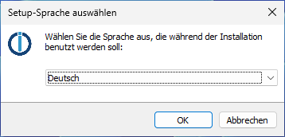

The welcome page then appears:

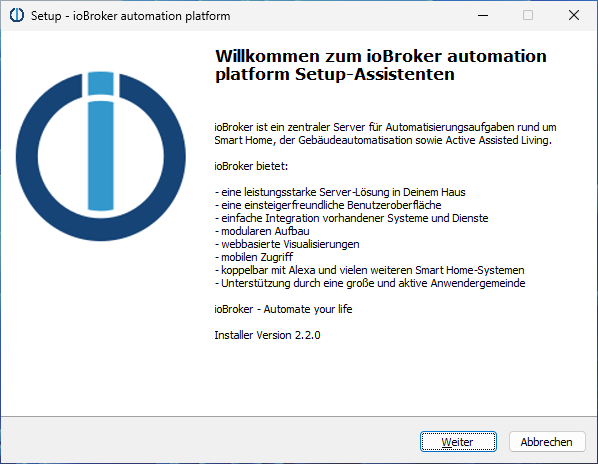

After clicking on "Next" the license page appears:

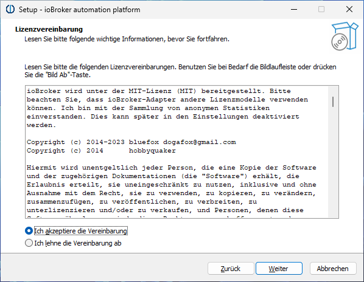

We have to accept the license and then click "Next" again. On the following page, we can now select the installation folder for our ioBroker installation:

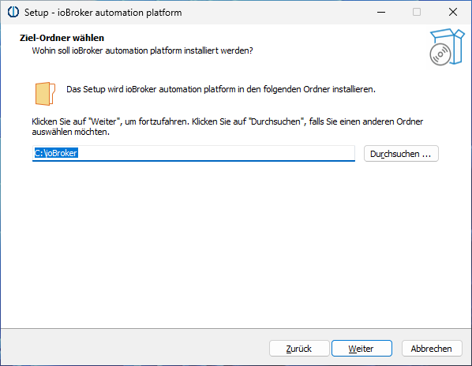

It's usually a good idea to simply use the default value "C:\ioBroker." After clicking "Next," some checks will be performed:

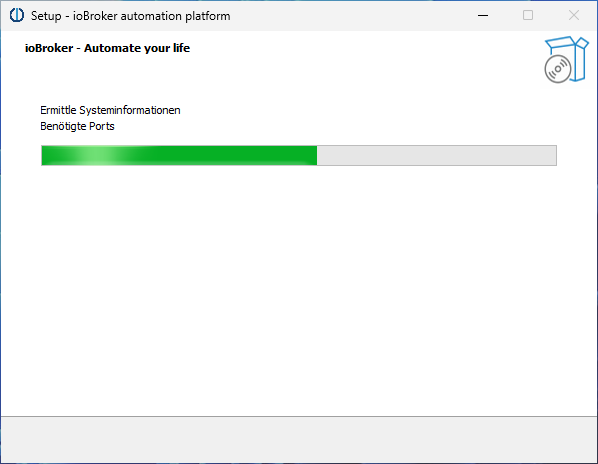

This may take a moment. The verification results will then appear automatically:

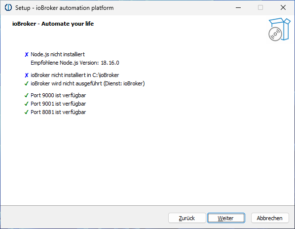

In this example, everything is fine, and we can proceed. If all the necessary requirements are not met, we must first clarify what needs to be done. Ports required for installing and running ioBroker are usually unavailable. Anyone in this situation and unsure what to do can find help in the ioBroker forum at https://forum.iobroker.net/. After clicking "Next," we can select some details:

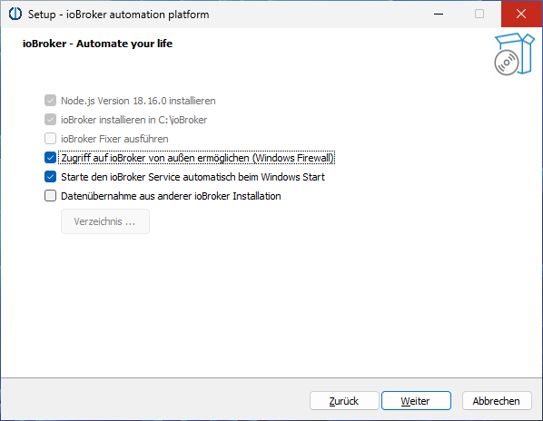

When you first install ioBroker, the first three options are predefined:

1. Node.js, the runtime environment for ioBroker, is downloaded and installed in the recommended version
2. ioBroker itself is installed
3. The ioBroker Fixer cannot be selected

The next two options can be changed, but it is generally recommended to keep the default settings.
Finally, the installer offers the option to adopt the configuration of an existing installation. This requires the entire "iobroker-data" folder, which can be found in the ioBroker folder of an existing ioBroker installation. This can come from an ioBroker installation on Windows or Linux. The data will be imported from this folder during installation; its contents will not be changed.
After clicking "Next," we now see a summary of the planned actions:

   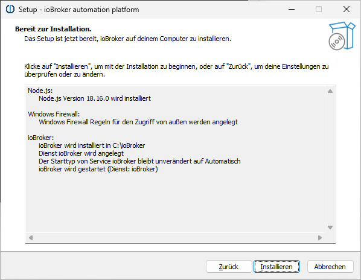

Click on "Install" to start the actual installation:

   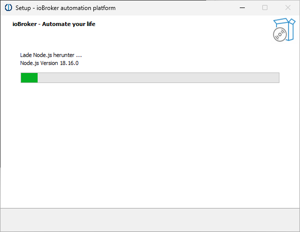

   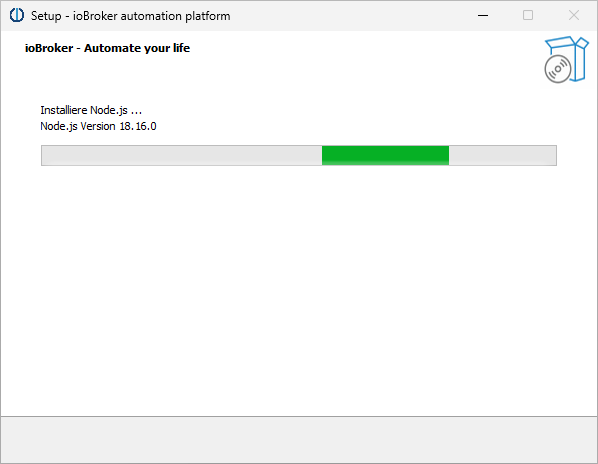

   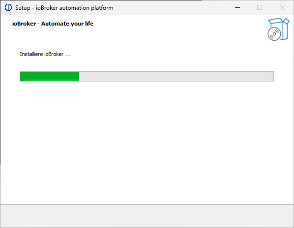

   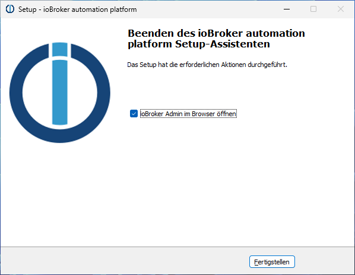

Clicking "Finish" opens a web browser and ioBroker guides you through the first steps of setup.

## Update
!> Updates are usually completely problem-free and secure. However, as a precaution, you should back up your data before performing them.

- Using the Windows Installer, the installed Node.js version can be automatically updated to the recommended level.

To do so, simply launch the installer from the Windows Start menu ("ioBroker Setup") and follow the instructions. Any available update for Node.js will be automatically detected and offered later.

- Since Windows Installer version 3.1.0, the JS controller can also be updated using the Windows Installer.

To do so, simply launch the installer from the Windows Start menu ("ioBroker Setup") and follow the instructions. Any available updates for JS controllers will be automatically detected and offered later.

- It is also possible to update JS controllers manually. However, we strongly recommend performing updates using the Windows Installer.

If you still want to update manually, you can do so with the following commands:

`iob stop`

`iob update`

`iob upgrade self`

`iob start`

## Expert mode
The installer also offers an expert mode, which isn't normally required for regular ioBroker users. It can be activated on the first page of the installer by double-clicking the ioBroker logo and then checking the "Expert Mode" box.

Expert mode offers the following additional features:

- Installation and maintenance of multiple ioBroker servers in parallel on one PC
- Installing JS Controller Alpha Versions

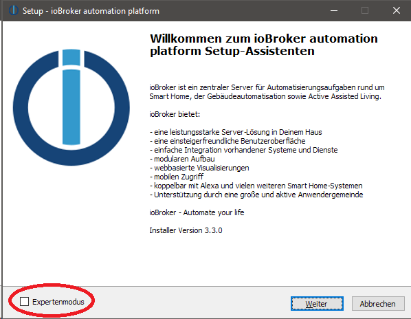

## Troubleshooting
**Problem:** The installation cannot be completed because port 9001 is occupied by a process named "System".

**Possible Solution:** The Intel® Graphics Command Center is known to block port 9001.
Check if there is a Windows service named "Graphics Command Center" or similar on your PC. If so, stop and disable this service.
You should then be able to install ioBroker.

**Problem:** Git was not installed during the ioBroker installation. The log file contains a corresponding error message: `Error browsing source: winget Unexpected error executing command: 0x8a15000f : Data required by the source is missing`

**Possible solution:** Enter the following command in the ioBroker Command window (from the Start menu), then restart the installer and select "Repair".
`powershell -command " Add-AppxPackage -RegisterByFamilyName -MainPackage Microsoft.Winget.Source_8wekyb3d8bbwe"`