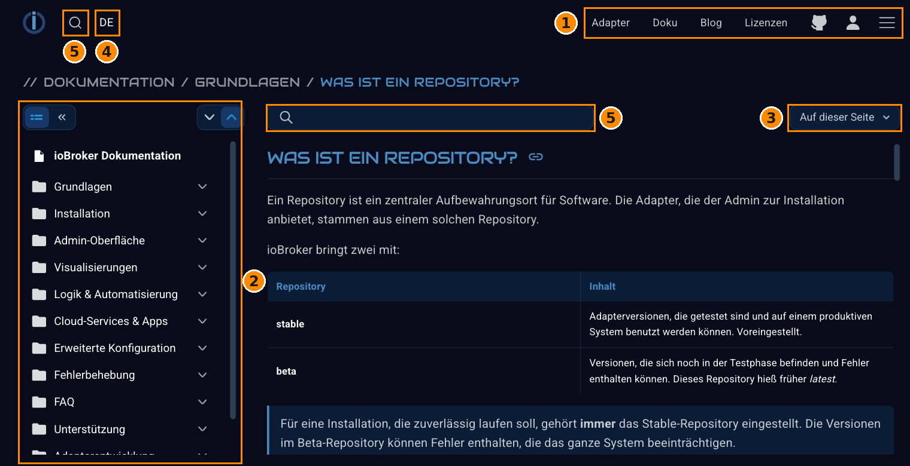
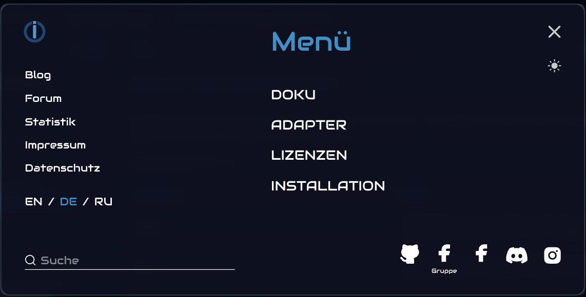

# Structure of the documentation

This documentation is the central resource for all ioBroker users. This page explains how to navigate it.

The website is **responsively** designed: depending on the screen width, controls are grouped or hidden to make room for text. Therefore, the page looks different on a phone than in the images shown here.

## The areas of a page

| No. | Area                                                                                                                |
| --- | ------------------------------------------------------------------------------------------------------------------- |
| 1   | **Main menu** : leads to the other parts of the website.                                                            |
| 2   | **Documentary menu** : the tree of all chapters.                                                                    |
| 3   | **Topic menu** : the headings of the currently open page.                                                           |
| 4   | **Language selection** .                                                                                            |
| 5   | **Search** : above for the entire website, in the documentation area additionally as a filter for the chapter tree. |

Above the sections is the **breadcrumb trail** : it shows where the current page is located in the tree, and each part of it is clickable.

## 1 Main Menu

The most important items are listed at the top. The icon with the three lines on the far right opens the full menu:

In addition to the main sections **– documentation** , **adapters** , **licenses** , and **installation –** you'll also find a blog, forum, statistics, legal notice, and privacy policy. Icons in the bottom right corner link to GitHub, Facebook, Discord, and Instagram.

The sun symbol in the top right corner switches between light and dark appearance.

## 2 Documentation Menu

The tree on the left leads through all chapters. Clicking on a folder expands it, the two arrows above it expand or collapse the entire tree.

The search field above the text filters the tree: After entering the search term, only the chapters that match the search term remain.

The double arrow in the top left corner allows you to hide the tree completely if more space is needed for the text.

## 3 Theme menu

The top right corner **of this page** leads to the headings of the currently opened article:

For longer pages, this is the fastest way to find the section you're looking for.

## 4. Language selection

The documentation is multilingual. The German texts serve as the template; the other languages are created from it and gradually improved by native speakers.

## Where to begin?

- Those who are not yet familiar with ioBroker should start with the [basics](/docs/basics/README.md) .
- The [installation instructions](/docs/install/README.md) describe the process for Linux, Docker, Proxmox, Windows and macOS.
- The [admin interface](/docs/admin/README.md) explains how to use it.
- How data points become processes is explained under [Logic & Automation](/docs/logic/README.md) .
- All adapters are listed individually in the [adapter reference](/adapters) .
- Anyone who wants to write their own adapter can find a starting point in the [developer section](/docs/dev/adapterdev.md) .

This documentation is constantly growing. If something is missing or needs better explanation, [we welcome any help](https://forum.iobroker.net/) .