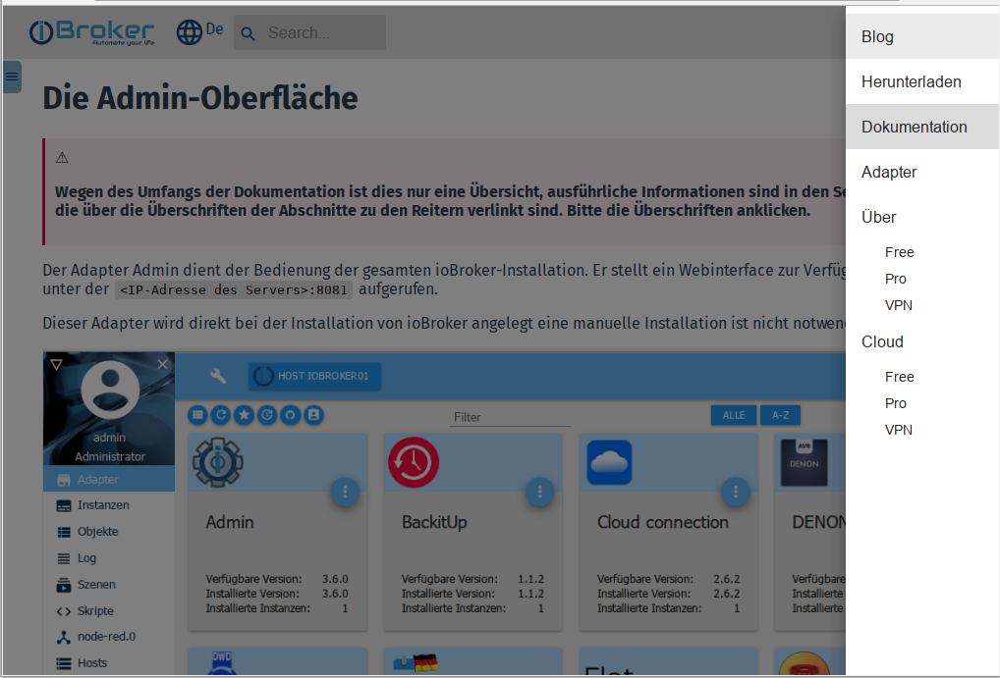
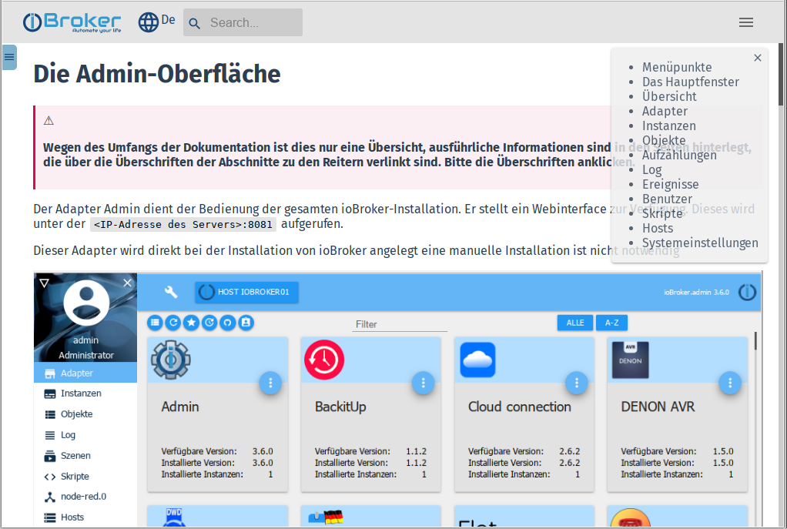
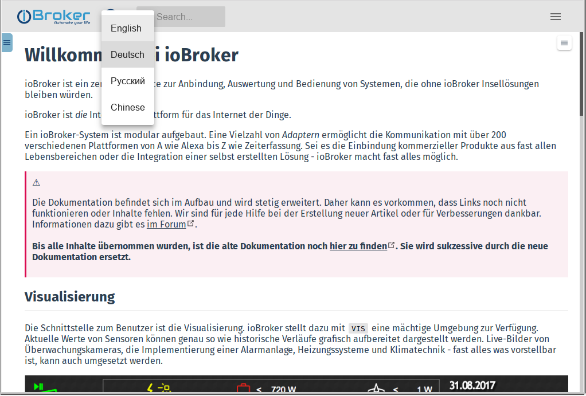

**This documentation is the central reference for all ioBroker users:**

## Page structure
This page has been created in a ***responsive design***. This means that it is displayed differently depending on the resolution of the display of the reading device (PC/tablet/mobile phone) for optimal readability.

At low (effective) resolutions, some controls are hidden to make room for the main windows.

Therefore, the current display may differ from the screenshots.

### Various menus
To get the best possible overview, there are a total of three different menus:

---

#### 1 - Main menu
The main points of this menu are usually visible in the title bar of the page on the PC, the entire menu is hidden at low resolutions.
Then it must be opened by clicking on the burger icon:

After clicking on a menu item, the menu closes automatically to make more space for the content.

---

#### 2 - Documentation menu This menu is usually visible on the PC, but is hidden at low resolutions. Then it must be opened by clicking on the burger icon:

There is a filter field in the top line. By entering a term, the entire menu tree is filtered according to this term and only suitable menu items are displayed.

The menu can be hidden again using the icon with the arrow to make more space for the content.

---

#### 3 - Theme menu
This menu displays the main topics of the selected article so that you can navigate more quickly to the point you are looking for.

The menu can be hidden again using the icon with the **X**.

### Additional controls
#### 4 - Language selection
The website is multilingual. More languages will be added gradually. Some will be generated automatically at first, and native speakers are invited to improve the texts.

The desired language can be selected using the globe icon.

This language list will be expanded if necessary.

#### 5 - Search
This field needs no explanation. Please use it extensively!

---

* For beginners, we recommend reading some basics about ioBroker first.

More on this in the chapter [Basics][].

* There are prepared images for different systems on the [Download][] page.

Detailed installation instructions for some hardware platforms are also available there.

* Information on all adapters is available in the central [Adapter Reference][].
* Creating control rules is described in the [Logic & Automation][] section.

We are grateful for every helping hand. If you would like to contribute to the further development of ioBroker, you can find information in the [Developer area][].

This documentation is constantly being expanded. If you think that something is missing or should be described better, [help us][] to improve the documentation!

[Grundlagen]: https://www.iobroker.net/#de/documentation/basics/README.md

[Download]: https://www.iobroker.net/#de/download

[Adapter-Referenz]: https://www.iobroker.net/#de/adapters

[Logik & Automatisierung]: https://www.iobroker.net/#de/documentation/logic/examples.md

[Developer Bereich]: https://www.iobroker.net/#de/documentation/dev/adapterdev.md

[helfen Sie uns dabei]: https://forum.iobroker.net/viewtopic.php?f=8&t=16933