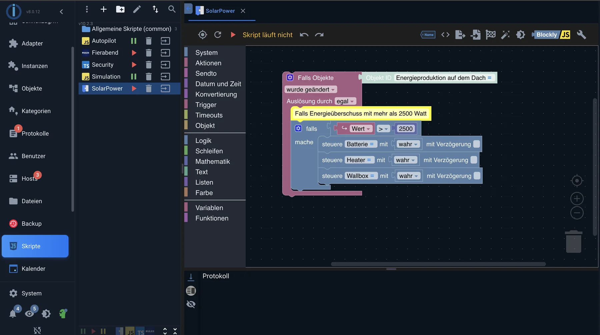

# Blockly

Blockly is a graphical editor: the logic is assembled from building blocks that only snap into place where they belong. Once you've connected a trigger to an action, you've written a working program without typing a single line of code.

Blockly is part of the [JavaScript adapter](/adapters/javascript) . A new _Blockly_ script is created in the Admin section under _Scripts_ .

_On the left is the palette, in the middle the script: a trigger on a state, below it a condition and three actions._

## How a Blockly script is structured

Almost every script begins with a **trigger** , followed by a statement of what should happen. The most common trigger is a change in state, the second most common is a time.

A script can have multiple triggers. Components that lie outside of a trigger are executed exactly once: when the script starts. This is the usual place for initial values.

## The building block groups

The palette on the left is sorted by task. The main groups are:

| group                                         | For what                                                               |
| --------------------------------------------- | ---------------------------------------------------------------------- |
| Trigger                                       | Triggers: Change of state, schedule, astronomical times such as sunset |
| System blocks                                 | Read and write states, create objects, query states                    |
| Action blocks                                 | Log output, HTTP calls, operating system commands, email               |
| SendTo                                        | Messages to other adapters, such as Telegram, Pushover or Signal       |
| Timeouts                                      | Delays, recurring execution, cancellations                             |
| Date and time                                 | Compare and format time points, create time differences                |
| Conversion                                    | Text to number, number to text, rounding, time formats                 |
| Access data                                   | A field from the central access data management system, see below.     |
| Logic, loops, mathematics, text, lists, color | The usual programming blocks                                           |
| Variables and functions                       | Intermediate values and custom, reusable blocks                        |

The complete description of each individual building block can be found in the [Blockly reference of the JavaScript adapter](/adapters/javascript) .

## The most important component: the trigger

The trigger block for states queries three things: **which state** , **what** to react to, and **when** .

In the context of "what," the distinction between _change_ and _update_ is crucial. An update occurs every time an adapter writes the value—even if it remains the same. A change only occurs when the value actually differs. A temperature sensor that reports the same value every 30 seconds will trigger 2880 times a day if it's _an update_ , and only when the temperature changes if it's _a change_ .

The trigger also distinguishes between **ack = false** (a command to a device) and **ack = true** (the device's response). Responding to both creates feedback loops. As a rule of thumb: respond to feedback (`ack = true` ) react, commands (`ack = false` ) send it yourself.

## Passwords do not belong in the script.

A password stored as text within a script module is also included in the export, backup, and every copy of the script. Since version 10.1.1 of the JavaScript adapter, the **"Access Data"** module has been available for this purpose: it retrieves a single field from the central access data management system, which is maintained in the Admin panel under _Basic Settings_ → _Access Data_ . The script then only specifies which access data is being referred to; the value is retrieved upon execution and is immediately updated if it is changed in the Admin panel.

In JavaScript, this corresponds to the object`SECRETS` , approximately`SECRETS.Kamerakennwort.key` The values are decoded, but only readable.

## Blockly in version 13

Version 10.1.0 of the JavaScript adapter (August 2026) replaces Blockly 11 with Blockly 13. The generated code remains the same, and existing scripts continue to run unchanged; the editor itself looks different in some places. Two things are worth noting:

- In the initial versions after this, scripts with named timeouts, intervals, or schedules could no longer be saved, and the comment block was unusable. Both issues have been fixed; Blockly users should update their adapter to at least version 10.1.4.
- Since version 10.1.4, the workspace follows the colors of the selected admin theme. Previously, it was gray in every dark theme.

## From building block to code

The tab above the workspace displays the generated JavaScript code for each Blockly script. This is more than just a gimmick:

- In the event of an error message in the log, the line number of the generated code is shown, not the component.
- Anyone who wants to continue a Blockly script in JavaScript later has the template. The reverse is not possible – JavaScript cannot be used to create building blocks.

## When Blockly no longer wears

Blockly becomes unwieldy as soon as

- The same chain would have to be repeated for ten lamps.
- Data is kept in lists or tables
- The workspace can only be viewed with a strong zoom.

Then it's time to switch to [JavaScript](/docs/logic/javascript.md) . A script doesn't need to be completely migrated: Blockly scripts and JavaScript scripts run side-by-side and exchange information about their states.

## Help with building: the AI assistant

Since version 10 of the JavaScript adapter, the script editor includes a chat window to assist with script building. For Blockly, this means: describe a task in words, and the assistant responds with building blocks. These are first shown as previews and only added to the workspace when a button is clicked; existing building blocks that match the suggestion are replaced, and everything else is appended. Therefore, an existing script is not overwritten.

What else the assistant in the JavaScript editor can do is described under [JavaScript](/docs/logic/javascript.md#der-ki-assistent-im-editor) . The specific conditions are also listed there; the most important one first:

**The language model is not from ioBroker.** The assistant requires its own access, either with one of the supported providers or to a model on your own network. Without a registered key, the function will not work.

And regardless of who wrote the suggestion: generated building blocks are a suggestion, not a result. They should be reviewed and tested before being applied to the heating system.