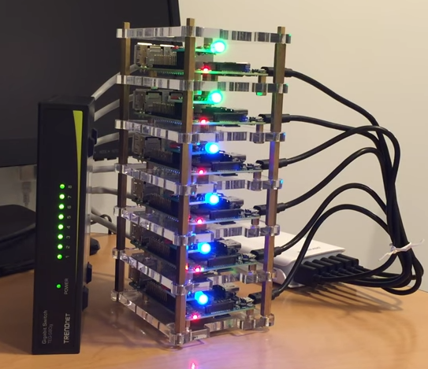

# Performance monitoring
The starting point for a performance analysis within ioBroker is the object list in the admin.
System information about the host(s) (ioBroker is multi-host capable) and the individual adapters is provided there. This information can be accessed by switching the object list to expert mode:

## Performance values of hosts
In ioBroker terms, a host is a computer that runs an ioBroker js controller process.
In a multi-host environment, this can be several computers to distribute the load.
Even the operating system used can be different.
A nice task for Raspberry Pi cluster stacks, for example, to cope with the 1GB RAM hardware limit.

The ioBrokers js controller coordinates the starting and stopping of the adapters and carries out other system management tasks in the background. In the admin, performance values for the respective host computer and the js controller can be found under the ID `system.host.<Name_des_Hostrechners>`.

Here is a list of the individual key figures and their meaning:

| Key figure | Data type | Unit | Description |
|----------|----------|---------|--------------|
| **alive** | Logic | none | Indicates whether the ioBroker js controller is active on the host |
| **diskFree** | Number | MiB | Free space on the logical drive where ioBroker is installed *bi = binary multiple (1 MB = 1,000,000 bytes) < (1 MiB = 1,048,576 bytes = 1 × 1024 × 1024 bytes)* |
| **diskSize** | Number | MiB | Total size of the logical disk on which ioBroker is installed |
| **diskWarning** | Number | % | You can enter a percentage value here. A warning is displayed in the admin if the free space on the disk falls below this value (e.g. 20). This is particularly useful if the history adapter is active.  |
| **freemem** | Number | MB | Total available host RAM system memory |
| **inputCount** | Number | /15s | Number of changes in the state values. An input event can be triggered, for example, by creating or setting a value |
| **load** | Number | % | Total system load of the CPU, averaged over one second. Don't be surprised, under Windows this value is always 0 |
| **mem** | Number | % | Memory usage. Ratio of free memory to total system memory |
| **memHeapTotal** | Number | MB | Size of heap memory reserved by the js controller |
| **memHeapUsed** | Number | MB | Size of the heap memory used by the js controller |
| **memRss** | Number | MB | Resident set, total size of memory used by the js controller in RAM |
| **outputCount** | Number | /15s | Output events include actions such as comparing values, writing a value to the states DB, events based on subscriptions or logging an adapter to obtain information about .connected| or .alive states, for example. This is how the 8 events are created that are typically found in the instance list for the event output value. |
| **uptime** | Number | s | Uptime of the ioBroker on this host since the last restart |

The following diagram shows symbolically how heap, code and stack contribute to the total memory usage **memRss** of a nodejs process:

If the master js controller itself provides the object and state database for the entire system, you can use this figure to easily determine the difference in memory consumption between 300 and 3000 ioBroker objects. For example, on my Windows system, this value fluctuates between 75 and 128MB for 3500 objects and 2700 states. The garbage collection integrated in nodejs says hello.
If, on the other hand, I use Redis as the state database, the memory consumption for the js controller drops to 50MB.
(Now Redis needs an additional 25MB = 75MB again ;))

If the number of state changes exceeds the processing capacity of dependent event consumers (e.g. JavaScript with on: triggers), a queue builds up in the in-memory databases.
This can be seen in the memory consumption of the js controller. As soon as the system load drops again and the event consumers are given sufficient time to process the outstanding value changes, the value of memRss returns to the original value:

As is often the case in this environment, it is not possible to make precise statements about the cause of errors based on fixed values.
What often helps, however, is observing a system that is functioning correctly (= reference values) and then comparing **the same system** under error conditions. In addition, it is very useful to record one or two data points in the history, for example to record trends and outliers.

## Performance values of adapters
Each adapter has its own performance metrics.
They are stored under the ID `system.adapter.<Name_des_Adapters>.<Instanz>` and differ slightly from those of the host.

| Key figure | Data type | Unit | Description |
|----------|----------|---------|--------------|
| **alive** | Logic | none | Indicates whether the adapter is active |
| **connected** | Logic | none | Indicates whether the adapter has reported within the last 30 seconds |
| **inputCount** | Number | /15s | Number of changes in the state values. An input event can be triggered, for example, by creating or setting a value |
| **memHeapTotal** | Number | MB | Size of heap memory reserved by the adapter |
| **memHeapUsed** | Number | MB | Size of heap memory used by the adapter |
| **memRss** | Number | MB | Resident set, total size of memory used by the adapter in RAM |
| **inputCount** | Number | /15s | Number of changes in the state values. An input event can be triggered, for example, by creating or setting a value |
| **outputCount** | Number | /15s | Output events include actions such as comparing values, writing a value to the states DB, events based on subscriptions or logging an adapter to obtain information about .connected or .alive states, for example. This is how the 8 events are created that are typically found in the instance list for the event output value. |
| **uptime** | Number | s | Adapter uptime since adapter start |

If, for example, the JavaScript adapter suddenly jumps from 100 **inputCount** events to several thousand after a script change, there is a strong suspicion that you have built a trigger loop, i.e. a ring reference, into your script.

It is also useful to look at **memRss**, for example to identify memory leaks caused by scripts or in adapters. With **alive** and **connected** you can easily visualize the status of the adapter in vis or suppress the display of incorrect data if the adapter cannot provide new values.

## Outlook and question
I'll just show you a picture as a look into the future (and into my development environment):

With the adapters, I miss the display of the CPU load **cpu** caused by the individual adapter.
After all, you want to know who is the culprit in the system without having to install additional monitoring adapters that are too resource-hungry. Since nodejs is single-threaded, the display here refers to one CPU core. More than 100% is not possible here.

Even using CPUs with multiple cores won't help if an adapter is constantly showing high values.
The only things that will help in this case are a faster CPU (popularly known as a higher clock speed), optimizing the program code, or splitting the load across multiple adapters (if possible).

The **cputime** indicator allows you to evaluate the total processor time that the adapter has used since it started.
It provides information about the frequency or intensity (keyword: computationally intensive) with which a program uses the processor.
This total is practically always lower than the total runtime of the adapter **uptime**, since the adapter hardly sends commands to the processor continuously, even with intensive use.

Here you can see how the different metrics interact and how the Javascript adapter reacts to a sudden wave of requests in Flot:

By the way, the JavaScript adapter was already so busy that it could no longer accept all events immediately.
An event queue was formed.

So that we can find out a little more about the load on the <u>host</u> and especially about the master of all adapters, the js-controller, I have also provided some performance counters for this. The following configuration shows a possible future appearance of the host performance counters.

As mentioned, this is subject to review by Bluefox and only applies from js-Controller 1.5.x at the earliest:

To summarize the meaning of the data points:

| Key figure | Data type | Unit | Data source | Description |
|----------|----------|---------|-------------|--------------|
| **alive** | Logic | none | js-controller | Indicates whether the ioBroker js controller is alive on the host. Automatically switches to false 25 seconds after death |
| **cpu** | Number | % utilization of a core | js-controller | Specifies the utilization of the core on which the js-controller is running. Much more than 100% is not possible here, since nodejs is single-threaded |
| **cputime** | Number | s | js-controller | The processor time (CPU time) is the measured time in seconds in which the js-controller has actually sent commands to the processor since the last program start. This sum is practically always lower than the entire runtime (uptime) of the program, since even with intensive use the program hardly ever sends commands to the processor continuously. |
| **diskFree** | Number | MiB | | Free space on the logical drive where ioBroker is installed *bi = binary multiple (1 MB = 1,000,000 bytes) < (1 MiB = 1,048,576 bytes = 1 × 1024 × 1024 bytes)* |
| **diskSize** | Number | MiB | | Total size of the logical disk on which ioBroker is installed |
| **diskWarning** | Number | % | | You can enter a percentage value here. A warning is displayed in the admin if the free space on the disk falls below this value (e.g. 20). This is particularly useful if the history adapter is active.  |
| **freemem** | Number | MB | | Total available host RAM system memory |
| **inputCount** | Number | /15s | js-controller | Number of changes in the state values. An input event can be triggered, for example, by creating or setting a value |
| **load** | Number | | | Total system load across all CPU cores, averaged over one second each. E.g. computer with 8 CPU cores -> value 7.9 = system almost overloaded, 0.1 = nothing happening; 4 cores -> value 3.9 = overload - if permanent, 0.1 = nothing happening |
| **mem** | Number | % | | Memory usage. Ratio of free memory to total system memory |
| **memHeapTotal** | Number | MB | js-controller | Size of heap memory reserved by the js-controller |
| **memHeapUsed** | Number | MB | js-controller | Size of the heap memory used by the js-controller |
| **memRss** | Number | MB | js-controller | Resident set, total size of memory used by the js-controller in RAM |
| **outputCount** | Number | /15s | js-controller | Output events include actions such as comparing values, writing a value to the states DB, events due to subscriptions or logging. This is how the 10+ events come about here too |
| **memAvailable** | Number | MB | js-controller | (Only on *nix systems) Free memory available for new memory requests without the system having to start swapping out used memory. Calculated from MemFree, Active(file), Inactive(file), SReclaimable and the lower thresholds from `/proc/zoneinfo`.  See [https://git.kernel.org](https://git.kernel.org/pub/scm/linux/kernel/git/torvalds/linux.git/commit/?id=34e431b0ae398fc54ea69ff85ec700722c9da773) |
| **memAvailable** | Number | MB | js-controller | (Only on *nix systems) Free memory available for new memory requests without the system having to start swapping out used memory. Calculated from MemFree, Active(file), Inactive(file), SReclaimable and the lower thresholds from `/proc/zoneinfo`.  See [https://git.kernel.org](https://git.kernel.org/pub/scm/linux/kernel/git/torvalds/linux.git/commit/?id=34e431b0ae398fc54ea69ff85ec700722c9da773) |