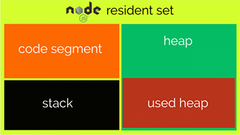

# Performance monitoring
The starting point for a performance analysis within ioBroker is the object listing in the admin.
System information about the host or hosts (ioBroker is multihost-capable) and about the individual adapters is provided there. You can access this information by switching the object listing to expert mode:

## Host performance values
A host, in ioBroker parlance, is a machine running an ioBroker js controller process.
In a multihost environment, this can also be multiple computers to distribute the load.
Even the respective operating system used may differ.
A nice task for e.g. Raspberry Pi cluster stacks to cope with the 1GB RAM hardware limit.

The ioBrokers js controller coordinates the starting and stopping of the adapters and performs other system management tasks in the background. In the admin you can find performance values for the respective host computer and for the js controller under the ID `system.host.<Name_des_Hostrechners>`.

Here is a list of the individual key figures and their meaning:

| measure | data type | unit | Description |
|----------|----------|---------|--------------|
| **alive** | logic | no | Indicates whether the ioBroker js controller is active on the host |
| **diskFree** | number | MiB | Free space on the logical drive where ioBroker is installed *bi = binary multiple (1 MB = 1,000,000 bytes) < (1 MiB = 1,048,576 bytes = 1 × 1024 × 1024 bytes)* |
| **diskSize** | number | MiB | Total size of the logical disk where ioBroker is installed |
| **diskWarning** | number | % | You can enter a percentage here. A warning is displayed in Admin if the free space on the data medium falls below this value (e.g. 20). This is particularly useful when the history adapter is active.  |
| **freemem** | number | MB | Total available host RAM system memory |
| **inputCount** | number | /15s | Number of changes in state values. An input event can, for example, be triggered by creating or setting a value |
| **load** | number | % | Total system load of the CPU, averaged over one second. Don't be surprised, under Windows this value is always 0 |
| **meme** | number | % | memory usage. Ratio between free memory and total system memory |
| **memHeapTotal** | number | MB | Size of heap memory reserved by js controller |
| **memHeapUsed** | number | MB | Size of heap used by js controller |
| **memRss** | number | MB | resident set, total amount of memory used by the js controller in RAM |
| **outputCount** | number | /15s | Output events include actions such as comparing values, writing a value to the States DB, events due to subscriptions or logging an adapter, for example to get information about .connected|or .alive states. This is also how the 8 events come about, which are typically in the event output value in the instance list. |
| **uptime** | number | s | Runtime of ioBroker on this host since last restart |

The following diagram symbolically shows how heap, code, and stack contribute to the total memory usage **memRss** of a nodejs process:

If the master js controller itself provides the object and state database for the entire system, you can use this key figure to determine the difference between 300 and 3000 ioBroker objects in terms of memory consumption. For example, on my Windows system, this value fluctuates between 75 and 128MB with 3500 objects and 2700 states. Greetings from the garbage collection integrated in nodejs.
On the other hand, if I use Redis as the state database, the memory consumption for the js controller drops to 50MB.
(Now Redis needs an additional 25MB = 75MB again ;))

If the number of state changes exceeds the processing capacity of dependent event consumers (e.g. Javascript with on: triggers), a queue builds up in the in-memory databases.
This can be seen from the memory consumption of the js controller. As soon as the system load drops again and the event consumers are given enough time to process the pending value changes, the value of memRss returns to the original value:

As is so often the case in this environment, it is not possible to make precise statements about the cause of errors on the basis of fixed values.
However, what often helps is observing a fault-free system (= reference values) and then comparing **the same system** under fault conditions. In addition, it is very useful if you record one or the other data point in the history, e.g. to record tendencies and outliers.

## Performance values of adapters
Each adapter has its own performance metrics.
They are each stored under the ID `system.adapter.<Name_des_Adapters>.<Instanz>` and differ slightly from those of the host.

| measure | data type | unit | Description |
|----------|----------|---------|--------------|
| **alive** | logic | no | Indicates whether the adapter is active |
| **connected** | logic | no | Indicates whether the adapter has reported within the last 30 seconds |
| **inputCount** | number | /15s | Number of changes in state values. An input event can, for example, be triggered by creating or setting a value |
| **memHeapTotal** | number | MB | Size of heap memory reserved by the adapter |
| **memHeapUsed** | number | MB | Size of heap memory used by the adapter |
| **memRss** | number | MB | Resident Set, total amount of memory used by the adapter in RAM |
| **inputCount** | number | /15s | Number of changes in state values. An input event can, for example, be triggered by creating or setting a value |
| **outputCount** | number | /15s | Output events include actions such as comparing values, writing a value to the States DB, events due to subscriptions or logging an adapter, for example to get information about .connected or .alive states. This is also how the 8 events come about, which are typically in the event output value in the instance list. |
| **uptime** | number | s | Adapter runtime since adapter start |

If, for example, the JavaScript adapter suddenly jumps from 100 **inputCount** events to several thousand after a script change, there is a strong suspicion that a trigger loop, i.e. a ring reference, has been built into the script.

It also makes sense to look at **memRss**, for example to detect memory leaks caused by scripts or in adapters. With **alive** and **connected** you can visualize the status of the adapter very nicely in vis or suppress the display of incorrect data if the adapter cannot deliver any new values.

## Outlook and question
I'll just show you a picture as a glimpse into the future (and into my development environment):

With the adapters, the display of the CPU load **cpu** caused by the individual adapter is missing.
After all, you want to know who the culprit is in the system, even without the resource-hungry installation of additional monitoring adapters. Since nodejs is single-threated, the display here refers to one CPU core. More than 100% is not possible here.

The use of CPUs with multiple cores does not help if an adapter constantly displays high values here.
Only a faster CPU (popularly a higher clock), an optimization of the program code or the distribution of the load over several adapters (if possible) are expedient in this case.

The **cputime** key figure lets you evaluate the total processor time that has been used by the adapter since it was started.
It provides information about the frequency or intensity (keyword computationally intensive) with which a program uses the processor.
This sum is practically always lower than the total runtime of the adapter **uptime**, since the adapter hardly ever sends commands to the processor without a break, even when used intensively.

Here you can see how the various key figures interact and how the Javascript adapter reacts to a sudden wave of requests in Flot:

Incidentally, the Javascript adapter was already so busy here that it could no longer accept all events immediately.
An event queue formed.

So that we can also find out a little more about the load on the <u>host</u> and there especially about the master of all adapters, the js-controller, I have also provided some performance counters for this. The following compilation shows a possible future appearance of the host performance counters.

As I said, this is subject to the check by Bluefox and at the earliest from js-Controller 1.5.x:

As a summary, the meaning of the data points:

| measure | data type | unit | Data Source | Description |
|----------|----------|---------|-------------|--------------|
| **alive** | logic | no | js controller | Indicates whether the ioBroker js controller is active on the host. Automatically switches to false | 25 seconds after dying |
| **cpu** | number | % utilization of a core | js controller | Indicates the utilization of the core running the js-controller. Much more than 100% is not possible here, since nodejs is single-threaded |
| **cputtime** | number | s | js controller | The processor time (English CPU time) describes the measured time in seconds in which the js-controller has actually sent commands to the processor since the last program start. This sum is practically always lower than the total runtime (uptime) of the program, as this hardly ever sends commands to the processor without a break, even when used intensively. |
| **diskFree** | number | MiB | | Free space on the logical drive where ioBroker is installed *bi = binary multiple (1 MB = 1,000,000 bytes) < (1 MiB = 1,048,576 bytes = 1 × 1024 × 1024 bytes)* |
| **diskSize** | number | MiB | | Total size of the logical disk where ioBroker is installed |
| **diskWarning** | number | % | | You can enter a percentage here. A warning is displayed in Admin if the free space on the data medium falls below this value (e.g. 20). This is particularly useful when the history adapter is active.  |
| **freemem** | number | MB | | Total available host RAM system memory |
| **inputCount** | number | /15s | js controller | Number of changes in state values. An input event can, for example, be triggered by creating or setting a value |
| **load** | number | | | Total system load across all CPU cores, averaged over one second each. E.g. computer with 8 CPU cores -> value 7.9 = system almost overloaded, 0.1 = nothing going on; 4 cores -> value 3.9 = overload - if permanent, 0.1 = nothing going on |
| **meme** | number | % | | memory usage. Ratio between free memory and total system memory |
| **memHeapTotal** | number | MB | js controller | Size of heap memory reserved by js-controller |
| **memHeapUsed** | number | MB | js controller | Size of heap used by js-controller |
| **memRss** | number | MB | js controller | resident set, total amount of memory used by js-controller in RAM |
| **outputCount** | number | /15s | js controller | Output events include actions such as comparing values, writing a value to the States DB, events due to subscriptions or logging. This is how the 10+ events come about here too |
| **memAvailable** | number | MB | js controller | (On *nix systems only) Free memory available for new memory requests without the system having to start swapping out used memory. Calculated from MemFree, Active(file), Inactive(file), SReclaimable and the lower thresholds from `/proc/zoneinfo`.  See [https://git.kernel.org](https://git.kernel.org/pub/scm/linux/kernel/git/torvalds/linux.git/commit/?id=34e431b0ae398fc54ea69ff85ec700722c9da773) |
| **memAvailable** | number | MB | js controller | (On *nix systems only) Free memory available for new memory requests without the system having to start swapping out used memory. Calculated from MemFree, Active(file), Inactive(file), SReclaimable and the lower thresholds from `/proc/zoneinfo`.  See [https://git.kernel.org](https://git.kernel.org/pub/scm/linux/kernel/git/torvalds/linux.git/commit/?id=34e431b0ae398fc54ea69ff85ec700722c9da773) |