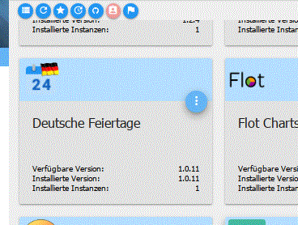

# Basics of using adapters
The installation of adapters and instances at ioBroker takes place in several stages.

These terms are often confused. This page aims to shed some light on the matter by explaining how the most important administrative tasks at ioBroker are to be carried out and what they mean.

## Administrative tasks
### Installing a new adapter
The actual installation loads the data required for adapter use from the server to the local host. This data remains “up-to-date” at the time of installation until it is updated.

**About the Admin**

This function is not available via the admin, it is automatically added when an instance is created (instantiation).

**About the console**

``iobroker install AdapterName``

### Creating an instance of an adapter
In order to use an adapter in ioBroker, you need one (or more) instances of this adapter. These instances are configured in the admin via the Instances tab.

**About the Admin**

If you want to create an instance of an adapter, you can do this by clicking the (+) in the bottom left of the tile of the corresponding adapter in the Admin tab.

**About the console**

``iobroker add AdapterName``

If the necessary files for the adapter are not yet on the host, iobroker install AdapterName is automatically executed first. Only then is the instance created.

***Via the console using npm (only for experts!)***

``cd /opt/iobroker``

``npm install iobroker.AdapterName``

**This version should only be used if all other methods fail for whatever reason.**

Attention! On newer installations, using npm install directly will cause permission problems after installation or will fail. It is recommended to use the iobroker commands instead.!!

### Upgrading an adapter
If a new version of an adapter is available, it can be updated. It also happens that adapters require a specific version of another adapter. Therefore, it is always a good idea to keep all adapters up to date

**About the Admin**

If an adapter has been upgraded, the title bar of the corresponding tile changes to green. The new version number then appears in green under “available version” on the tile, with the upgrade icon to the left of it. If you now want to upgrade this adapter, click on this icon.

Two processes then run in the background: the actual upgrade of the adapter files and then the upload of the files to the instances.

**About the console**

``iobroker upgrade AdapterName``

### Uploading adapter files
This function is only required in special cases. If the procedure described above is used, this function is not necessary.

only when experienced users who know what they are doing change files themselves, or when a beta version is loaded from Github, this function is necessary

Via the admin To do this, the expert mode must be activated in the admin tab. After that, further icons will appear in the tile. The upward-pointing arrow (3rd icon from the right) carries out this upload.

**About the console**

``iobroker upload AdapterName``

### Downgrading an adapter
If there are problems with a new version, you can also downgrade an adapter.

**About the Admin**

To downgrade, you must first switch to expert mode and then call up the list of available versions:

This list shows all versions released by the developer for this feature.

Please click on the desired version there.

**About the console**

``iobroker upgrade AdapterName@ver.si.on``

Where ***AdapterName*** is the name of the desired adapter according to the list in iobroker update, and ***ver.si.on*** is the appropriately formatted version number.

***Via the console using npm (only for experts!)***

``cd /opt/iobroker``

``npm install iobroker.AdapterName@ver.si.on``

**This version should only be used if all other methods fail for whatever reason.**

Attention! On newer installations, using npm install directly will cause permission problems after installation or will fail. It is recommended to use the iobroker commands instead.!!

## Additional important information
### The adapter list in the admin
This actually only contains a list of the adapters present in the selected repository (main settings). What is shown here is not yet on the host.

This list is updated on the server daily at around 2:00 a.m. and updated online when the admin is called. If there is no connection to the server, for whatever reason, this list only contains the adapters that are already installed or cannot be loaded at all.

### The different installation sources
The question keeps cropping up as to why a certain version is mentioned but is not offered as an update. That is why the background to this is explained here again:

**There are three stages of adapter release**

* Repository stable, everything stable and tested
* Repository latest, not yet fully tested
* Github, developer, partly beta versions or even unfinished

versions 

These stages can all have the same version if not much is changed, but there can also be larger jumps in the different repositories or Github.

**The repository** from which you want to receive your adapter versions is specified in the system settings on the subpage [main settings](../admin/settings.md#Haupteinstellungen).

The available repositories are listed on the subpage [storage locations](../admin/settings.md#Verwahrungsorte).

**The developer or beta versions** from Github are installed via [Octocat symbol](../admin/adapter.md#die-icons-im-einzelnen) #5.

Either simply in the pulldown menu ***Github***, or by entering the address of the Github repository under the tab ***any*** This occurs especially with “external” adapter developers.

**An installation of GitHub should only be carried out after consultation with the developer.**

### Installing Github
( only for experts! )

Installation from Github should only be carried out by experts. There are only beta versions here, or what is even worse, unfinished versions. Installing them can destroy the entire ioBroker installation!

If an update is carried out via GitHub (Octocat icon) anyway (or recommended by the repository maintainer for troubleshooting via the forum), the new files are only saved locally and not added to the instances. Therefore, for versions of the js-controller below 1.5, an upload must be carried out manually afterwards.

To do this, the expert mode must be activated in the Admin tab. Then further icons appear in the tile. The upward-pointing arrow (3rd icon from the right) carries out this upload.