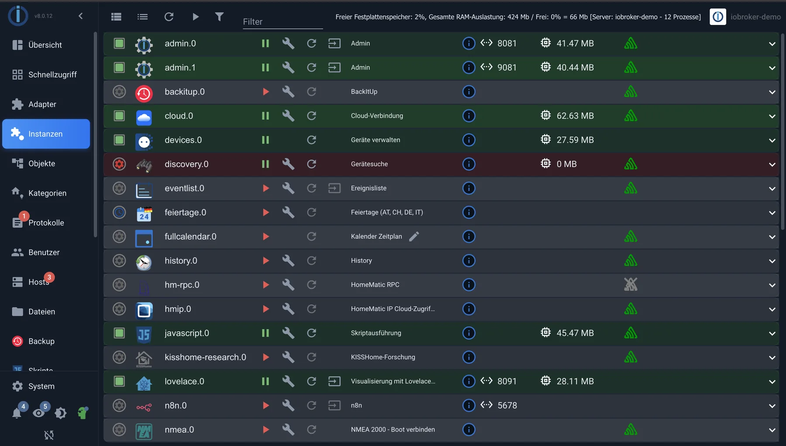

# Tour of the surface

The admin panel has many tabs, and at first glance, it looks like there are more than there actually are. In fact, you'll only need four of them in everyday use. This tour explains what those are and what the others are for. A detailed description of each tab can be found in the [Admin Interface](/docs/admin/README.md) chapter.

## The structure

The page consists of three areas: on the left the **menu bar** with the tabs, to the right of it the **main window** and above it a **toolbar** , the content of which depends on the currently open tab.

The **system** settings are located at the bottom left. The [system settings](/docs/admin/settings.md) are configured there, and next to it is the switch for expert mode.

_The three areas: on the left the tabs, at the top the toolbar of the open tab, in the middle the main window, here the list of instances._

## The four you need every day

| Equestrian                           | For what                                                                              |
| ------------------------------------ | ------------------------------------------------------------------------------------- |
| [adapter](/docs/admin/adapter.md)    | Add new connections and update existing ones.                                         |
| [Instance](/docs/admin/instances.md) | The ongoing connections: configure, start, stop, and see if they are running.         |
| [objects](/docs/admin/objects.md)    | The tree of all data points. Here you can check if a value has arrived.               |
| [Protocols](/docs/admin/log.md)      | This is what the system has to say. The menu item turns red if an error has occurred. |

When something isn't working, the order is almost always the same: instances (is it running?), objects (is a value arriving?), logs (what is the system saying?).

## The rest

| Equestrian                                           | For what                                                                                                   |
| ---------------------------------------------------- | ---------------------------------------------------------------------------------------------------------- |
| [Overview and quick access](/docs/admin/overview.md) | System status at a glance and tiles for all surfaces.                                                      |
| [Categories](/docs/admin/enums.md)                   | Spaces and functions. It looks like minor details, but it's the basis for visualization and voice control. |
| [user](/docs/admin/users.md)                         | Who is allowed to register and what they are allowed to do.                                                |
| [Hosts](/docs/admin/hosts.md)                        | The computer itself, updates of the js-controller, system messages.                                        |
| [files](/docs/admin/files.md)                        | The file storage, for example for images in a visualization.                                               |
| Backup                                               | This comes from the BackItUp adapter, see [Data Backup](/docs/config/backup.md) .                          |

Additional tabs are added with the installed adapters, such as _scripts_ , _calendars_ , or _devices_ .

## Expert mode

A head icon is located in the bottom left corner of the menu bar. It toggles **expert mode** on and off, and also indicates the current status: white means off, green means on.

Important to understand: It doesn't change anything about your system and doesn't allow you to do anything that was previously prohibited. It's like a pair of glasses, not a door. When switched off, the admin panel shows what's needed for everyday use; when switched on, it also shows everything that would otherwise be in the way.

Additional information is added, depending on the rider:

| Equestrian                | What the expert mode additionally shows                                                                                                                |
| ------------------------- | ------------------------------------------------------------------------------------------------------------------------------------------------------ |
| objects                   | the namespace`system.` with the internal objects, the column with access rights, and the creation of own objects outside of`0_userdata.0` and`alias.0` |
| Instance                  | Additional columns and settings: memory usage, protocol level, scheduled restart, boot order                                                           |
| adapter                   | Installation from GitHub, from a file or in a specific version, including deleting an adapter.                                                         |
| Protocols, hosts, dialogs | additional columns, filters and fields                                                                                                                 |

There are two switches, and this regularly causes confusion:

- The **head icon** in the bottom left corner only applies to the current browser session. After closing the window, it reverts to the state defined by the system settings.
- In the [system settings,](/docs/admin/settings.md) _expert mode_ determines how the administrator starts when the system is opened.

A good rule of thumb for troubleshooting: If a manual mentions a setting you can't find anywhere, first activate expert mode. In nine out of ten cases, it was simply hidden.

Hidden does not mean protected. In expert mode, objects that an adapter needs to function can be deleted. The administrator will ask for confirmation once, but only a [backup](/docs/config/backup.md) can undo this.

Initially, it's not needed. You only need what it reveals when you're investigating a problem or looking for an attitude that doesn't exist in everyday life.

## If you lack the space

The arrow at the top of the menu bar shrinks it down to icons. On a tablet, this is the difference between usable and unusable.

## What happens next?

Next comes the tab you'll spend the most time in at the beginning: [Manage adapters](/docs/tutorial/adapter.md) .