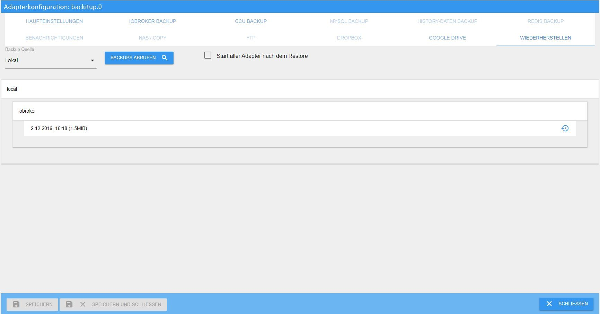

# Basics
How do you correctly restore the ioBroker installation on a Linux system?

### Foreword:
Since some users have a lot of trouble with a restore, this is a step-by-step guide for restoring after a crash, or after a hardware change, system change or something else.

Basically, one thing can be said in advance: if done correctly, a restore can be completed in just a few minutes and no one needs to be afraid of it.

At the end, all data is available again and a new system has been set up.

### Preparation:
For preparation, a working ioBroker installation is mandatory.

There are two ways to achieve this.
Either take a finished image from [download area](https://www.iobroker.net/#de/download), set up your own Linux OS and install ioBroker according to this [Instructions](https://www.iobroker.net/#de/documentation/install/linux.md).

### Next step
If the old system had stored the states and/or objects in Redis, the new system must first be equipped with the Redis server.

If you are not sure whether Redis was used and you still have access to the old system, use the command `iobroker status` to retrieve the required information. The output looks like this when using Redis:

```
iobroker is running on this host.

At least one iobroker host is running.

Objects type: redis
States  type: redis
```

If Objects type and/or States type is "redis", you must install the Redis server on the new system.
If both types are "file", the Redis server is not required.

If you no longer have access to the old system and you don't know what exactly was configured before, then be sure to install the Redis server beforehand.

#### Redis installed:
To do this, go to the terminal using Putty and execute the following commands:

```
sudo apt-get update
sudo apt-get install redis-server
sudo usermod -a -G redis iobroker
sudo reboot now
```

Next, you should run the installer fix in case all the rights on the system are not correct.
This step is only a recommendation and is not absolutely necessary.

```
curl -sL https://iobroker.net/fix.sh | bash –
```

With the small tool "htop" you can easily see all running processes, which is not only interesting for the restore but can be very useful in general.
This is installed as follows:

Run the following command in the console:

```
sudo apt-get install htop
```

Once this has been done, the actual restore can begin.

### Restore:
There are also 2 options here:

#### **1. Automatic restore with Backitup**
Since no Linux knowledge is required here and the whole thing is done via the Iobroker web interface, the automatic restore variant is first used using [Backitup](https://github.com/simatec/ioBroker.backitup/blob/master/README.md) .

To do this, the Backitup adapter must be installed.
This is done via the "Adapter" tab. Search for Backitup there and install an instance using the (+).

Once the installation is complete, save the “ioBroker backup” you created previously from the old system to your new system using an sftp program such as FileZilla or WinSCP in the path /opt/iobroker/backups.

Backitup can also restore from NAS, Dropbox or Google Drive, but the local option has the least chance of problems.

If you already have experience with mounting the NAS, you can also use this, especially since you can then directly access the existing directory of the old installation.
This tutorial, however, refers to a locally stored backup.

If ioBroker backup was saved successfully, Backitup will now open and the “Restore” tab will open.
There, set the “Backup source” to Local and then save.


If ALL instances are to start automatically after the restore, the option “Start all adapters after the restore” must be activated and then saved.
If the backup is to be restored on a different host, this option should not be used, as the IP addresses may need to be adjusted before the individual instances start.

After saving, the existing backups on the local path can be retrieved using the “Retrieve Backups” button.

The backup you just copied via FTP should appear in the list under “iobroker”.
Now select this.



After the selection, there is a message that iobroker will be stopped for the restore and then started again.


Here you have started the actual recovery process.


Another tab will now open in your browser where you can follow the recovery process just like on the console in the Backitup WebUI.


After the restore has been successfully completed, you will also receive the message in the restore web UI.


The restoration may take some time depending on the performance of the system and the size of the old ioBroker installation.
Normally, the restore should be completed after about 10-15 minutes and ioBroker should be restarted automatically.


In very rare cases, ioBroker does not start automatically after a restore.
If this is the case, you can start iobroker manually using the following command via the console.

```
iobroker start
```

Now ioBroker should start again and in the “Log” tab you can see that all adapters that were installed on the old system are currently being reinstalled by npm.

You have to be a little patient here and just let iobroker do its thing.
In the instances you can see which adapters are gradually being installed.
All adapters that are still being installed or are in the waiting loop do not yet have an icon in the instances.
Please do not restart ioBroker, at most refresh the view with F5 from time to time until all instances have an icon.

Depending on the size of the installation and the speed of your computer and internet connection, this can easily take 2-3 hours.

Congratulations, the newly installed system with all settings, scripts, visualizations, etc. is now ready.

With Backitup it is now possible to restore further data if it was previously backed up on the old system.
You can restore the Redis database, the Zigbee database, the mySql database and your history data using the same steps as described above.

The list of retrieved backups would then look like this example.


*****************************************************************************************************************************************

#### **2. manual restore with the terminal commands**
First, a few commands have to be issued via Putty or similar.

First, a backup folder must be created:

```
sudo mkdir /opt/iobroker/backups
```

Here too, the backup created on the old system and, if applicable, Redis backup, zigbee backup, etc. are then saved in the /opt/iobroker/backups folder using an sftp program such as FileZilla or WinSCP.

If states and objects were stored in the Redis DB, the backed up Redis database should be restored here first.
If only the states were running under Redis, this does not necessarily have to be done in advance.

Once this is done, stop your ioBroker as follows:

```
iobroker stop
```

Afterwards please check if everything is stopped with the following commands:

```
iobroker status
```

If all outputs are correct and iobroker has been stopped, the restore can now be performed via the console using the following commands:

```
cd /opt/iobroker
iobroker restore <Dateiname eures Backups>
```

!> **It is very important to note that only an ioBroker backup can be restored using this method.
A Redis backup, Zigbee backup, mySql backup, or the history data cannot be restored using this command**.

Backitup is required for this because these were specifically created with Backitup.

This may take a few minutes depending on your system. The progress is displayed in the terminal.
When the restore is complete, restart ioBroker with the following command:

```
iobroker start
```

Here, too, all adapters are now reinstalled individually by ioBroker via npm.
This can take a while depending on the size of your installation, the internet speed and the performance of the system.
The current status can be tracked in the “Log” tab.

That's it, the system is now reinstalled and all settings, scripts, visualizations, etc. are restored.

### Conclusion:
Basically, both variants lead to the same result.
If you have little experience with terminal commands and feel unsure, you are on the safe side with Backitup.

However, if you want to see exactly what is happening on your system, you should choose the manual option via the console. Here you can see every single process in detail in the terminal.