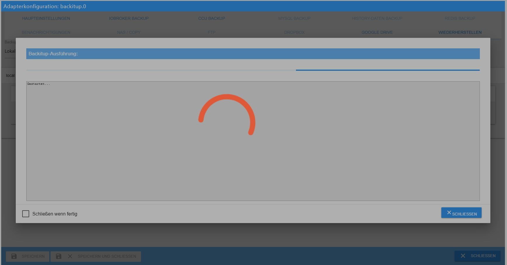
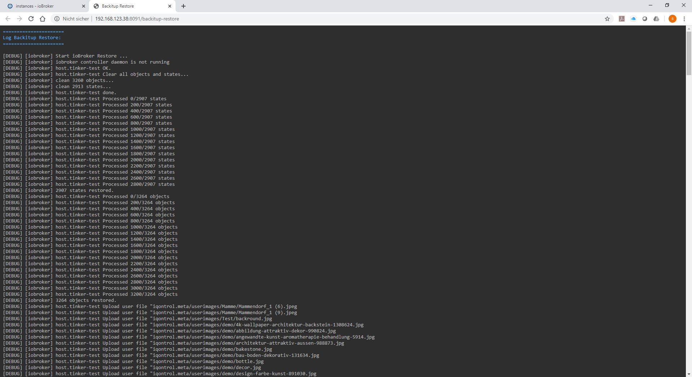
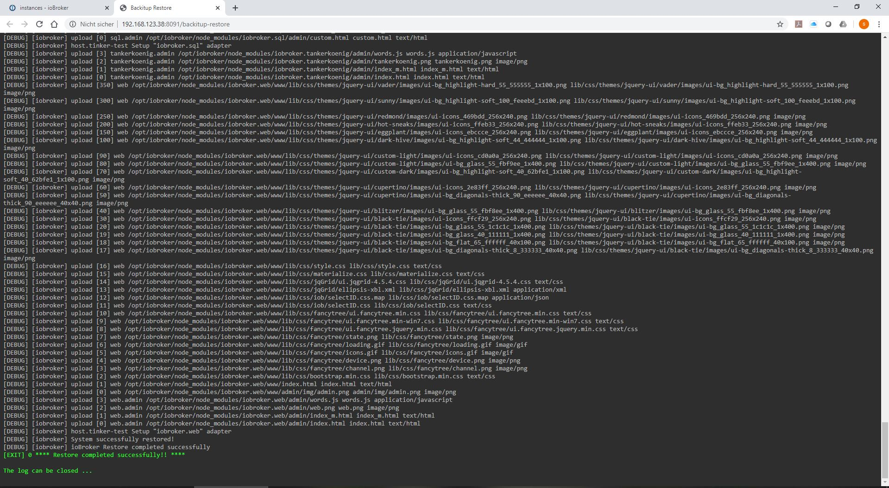

# Basics
What is the correct way to restore the ioBroker installation on a Linux system?

### Foreword:
Since some users find it very difficult to restore, here are step-by-step instructions for restoring after a crash, or after a hardware change, system change or other.

Basically, one thing can be said in advance: a restore is done in a few minutes if done correctly and nobody needs to be afraid of it.

At the end, all data is available again and a new system was set up.

### Preparation:
An operable ioBroker installation is absolutely necessary for the preparation.

There are 2 ways to achieve this.
Either take a finished image from [download area](https://www.iobroker.net/#de/download), set up your own Linux OS and install ioBroker after this [Instructions](https://www.iobroker.net/#de/documentation/install/linux.md).

### Next Step
If the old system stored the states and/or objects in Redis, the new system must first be equipped with the Redis server.

If you are not sure whether Redis was used and you still have access to the old system, then use the `iobroker status` command to call up the required information". When using Redis, the output looks as follows:

```
iobroker is running on this host.

At least one iobroker host is running.

Objects type: redis
States  type: redis
```

If the Objects type and/or States type says "redis", you must install the Redis server on the new system.
If it says "file" for both types, the Redis server is not required.

If you no longer have access to the old system and you don't know exactly what was previously configured, then definitely install the Redis server in advance.

#### Redis installed:
Go to the terminal with Putty and run the following commands:

```
sudo apt-get update
sudo apt-get install redis-server
sudo usermod -a -G redis iobroker
sudo reboot now
```

Next, you should run the Installer Fix if all the rights on the system do not fit somewhere.
This step is only a recommendation and is not mandatory.

```
curl -sL https://iobroker.net/fix.sh | bash –
```

With the small tool "htop" you can see all running processes very well, which is not only interesting for the restore but can be very useful in general.
this is installed as follows:

Run the following command in the console:

```
sudo apt-get install htop
```

After this has been done, the actual restore can take place.

### Restore:
There are also 2 options here:

#### **1. Automatic restore with Backup**
Since no Linux knowledge is required here, and the whole thing is done via the web interface of Iobroker, the variant of the automatic restore is carried out first using [backup](https://github.com/simatec/ioBroker.backitup/blob/master/README.md) .

To do this, the adapter backup must be installed.
This is done via the "Adapter" tab. Search for Backitup there and install an instance using the (+).

Once the installation is complete, you store your "ioBroker Backup" previously created from the old system on your new system with an sftp program such as FileZilla or WinSCP in the path /opt/iobroker/backups.

Backitup can also perform a restore from NAS, Dropbox, or Google Drive, but the local variant has the least potential for problems.

If you already have experience with mounting from the NAS, this can also be used, especially since you can then access the existing directory of the old installation directly.
However, this tutorial refers to a locally stored backup.

If ioBroker Backup was successfully stored, Backitup will now open and the Restore tab will open.
Set the "Backup source" to local and then save.


If ALL instances are to start automatically after the restore, the option "Start all adapters after the restore" must be activated and then saved.
If the backup is to be restored on a different host, this option should not be used, as the IP addresses may have to be adjusted before the individual instances are started.

After saving, the existing backups can be called up on the local path using the "Retrieve backups" button.

The backup you just FTPed should appear in the list under iobroker.
Now select this.


After the selection, there is a note that iobroker will be stopped for the restore and then restarted.


Here you have started the actual recovery process.



Another tab will open in your browser where you can follow the restore process like on the console in Backitup's WebUI.



After the restoration has been successfully completed, you will also receive the message in the restore's WebUI.



Depending on the performance of the system and the size of the old ioBroker installation, the restoration may take some time.
Normally, the restore should be completed after about 10-15 minutes and ioBroker should be started again automatically.


In very rare cases it happens that ioBroker does not start automatically after restore.
If this is the case, you can start the iobroker manually with the following command via the console.

```
iobroker start
```

Now ioBroker should start again and in the "Log" tab you can see that all adapters that were installed on the old system are currently being reinstalled by npm.

A little patience has to be applied here and just let iobroker do it.
In the instances you can see which adapters are installed one by one.
All adapters that are still being installed or are in the queue do not yet have an icon in the instances.
Please do not restart ioBroker, at most refresh the view with F5 from time to time until all instances are provided with an icon.

Depending on the size of the installation and the speed of your computer and internet connection, this can easily take 2-3 hours.

Congratulations, now the newly installed system is complete with all settings, scripts, visualizations, etc.

With Backitup, there is now the option of restoring additional data if it was previously backed up on the old system.
You can restore the Redis database, Zigbee database, mySql database and your history data with the same steps as above.

The list of retrieved backups would then look like this example.


*****************************************************************************************************************************************

#### **2. manual restore with the terminal commands**
First, a few commands must be issued using Putty or something similar.

First, a backup folder must be created:

```
sudo mkdir /opt/iobroker/backups
```

Here, too, the backup created on the old system and, if necessary, Redis Backup, zigbee backup, etc.
placed in the /opt/iobroker/backups folder.

If states and objects were saved in the Redis DB, the saved Redis database should be restored here first.
If only the states ran under Redis, this does not necessarily have to be in advance.

Once this is done, stop your ioBroker as follows:

```
iobroker stop
```

Then please check whether everything is stopped with the following commands:

```
iobroker status
```

If all outputs are correct and iobroker has been stopped, the restore can now be executed via the console with the following commands:

```
cd /opt/iobroker
iobroker restore <Dateiname eures Backups>
```

!> **It is very important that only an ioBroker backup can be restored with this method.
A Redis backup, Zigbee backup, mySql backup, or the history data cannot be created with this command**.

Backitup is required for this, as these were specially created with Backitup.

Depending on the system, this can now take a few minutes. The progress is shown in the terminal.
When the restore is complete, start ioBroker again with the following command:

```
iobroker start
```

Again, all adapters are now individually reinstalled by ioBroker via npm.
This may take a while depending on the size of your installation, internet speed and system performance.
The current status can be followed in the "Log" tab.

It is now done and the system is reinstalled and all settings, scripts, visualizations, etc. restored.

### Conclusion:
In principle, both variants lead to the same result.
If you have little experience with terminal commands and feel insecure, you are on the safe side with Backitup.

However, if you want to see exactly what is happening on your system, you should choose the manual version via the console. Here you can see each individual process in detail in the terminal.