# Included widgets

vis and vis-2 come with five widget sets included. These are immediately available in the palette after installation and do not require any additional adapters.

| Sentence | Contents                                                          |
| -------- | ----------------------------------------------------------------- |
| `basic`  | Text, number, image, frame, navigation: the basic building blocks |
| `jqui`   | Buttons, input fields, selection lists, sliders, dialogs          |
| `jqplot` | a pointer instrument                                              |
| `swipe`  | Page switching via finger swipe and a carousel                    |
| `tabs`   | Riders within a view                                              |

This allows you to build a complete user interface. Only when you want something more visually appealing or specialized are the [widget sets](/docs/viz/widgetsets.md) from the adapter directory added.

The names of the building blocks are not translated and appear in English in the palette, even in a German interface. Therefore, this page refers to them as they appear there.

## basic

The phrase for anything that indicates a value or holds a page together.

### Numbers, text and time

|                                                                            | Widget                                       | Shows                                                       |
| -------------------------------------------------------------------------- | -------------------------------------------- | ----------------------------------------------------------- |
| 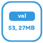                   | `Number`                                     | a numerical value, with unit and selectable decimal place   |
| 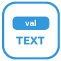                  | `String`                                     | a string                                                    |
| 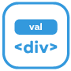     | `String (unescaped)`                         | the same, with the included HTML code also being displayed. |
| 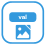       | `String img src`                             | an image whose address is in the data point                 |
| 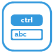              | `Input val`                                  | an input field that also writes the value                   |
| 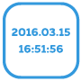            | `Timestamp` ,`Timestamp Value` ,`TimesValue` | a timestamp in various formats                              |
| 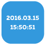         | `Last change Timestamp`                      | when the value last changed                                 |
| 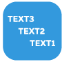                | `ValueList Text`                             | one of several texts, depending on the value                |
| 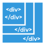        | `ValueList HTML`                             | the same, but with HTML instead of plain text               |
| 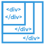 | `ValueList HTML Style`                       | the same with its own CSS specification for each value      |

### Yes and no

|                                                                        | Widget                  | Shows                                                                              |
| ---------------------------------------------------------------------- | ----------------------- | ---------------------------------------------------------------------------------- |
| 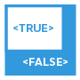             | `Bool HTML`             | two different texts for true and false                                             |
| 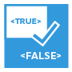 | `Bool HTML` (switching) | the same, switches when the area is clicked                                        |
| 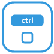 | `Bool Checkbox`         | a checkbox that also switches                                                      |
| 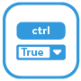     | `Bool Select`           | a drop-down menu with two entries                                                  |
|        | `Bool SVG`              | a drawing that sets a value when clicked                                           |
| 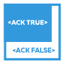                 | `AckFlag HTML`          | Whether the last value was confirmed; a troubleshooting tool                       |
| 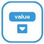           | `HTML State`            | a text that is at 0 or`false` It disappears completely; good for service messages. |

### Images, frames and external content

|                                                                 | Widget      | Shows                                       |
| --------------------------------------------------------------- | ----------- | ------------------------------------------- |
| 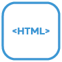                | `HTML`      | any HTML code                               |
|                                                                 | `Svg shape` | a simple shape: circle, rectangle, line     |
|               | `Image`     | an image, optionally reloaded regularly     |
|     | `Image 8`   | one of eight images, depending on its value |
| 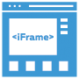            | `iFrame`    | a foreign website in the window             |
|  | `iFrame 8`  | eight pages, switchable via a value         |
|           | `Border`    | a frame, optionally with a title bar        |
|                 | `Note`      | a notepad                                   |
| 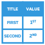          | `Table`     | a table from a data point                   |

### Navigation and views

|                                                                                | Widget              | Does                                                                       |
| ------------------------------------------------------------------------------ | ------------------- | -------------------------------------------------------------------------- |
|                             | `link`              | makes the entire area a reference                                          |
| 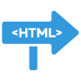          | `HTML navigation`   | switches to a different view, with a transition effect                     |
|             | `view in widget`    | embeds an entire view; the usual way to implement a shared navigation bar. |
|  | `view in widget 8`  | displays one of eight views, depending on the value.                       |
|                                                                                | `Dialog`            | opens a view in a window                                                   |
| 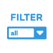          | `filter - dropdown` | Shows and hides widgets based on their filter term                         |

### Tools

|                                                                           | Widget              | Does                                                                               |
| ------------------------------------------------------------------------- | ------------------- | ---------------------------------------------------------------------------------- |
|              | `Full Screen`       | toggles the browser's full-screen mode                                             |
| 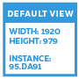 | `Screen Resolution` | Displays the screen size and names the appropriate view; only useful during setup. |
|              | `HTML logout`       | logs the user out                                                                  |
| 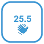               | `Gesture indicator` | displays recognized swipe gestures                                                 |

In **vis-2** , four building blocks are missing that were present in vis 1:`Red Number` ,`Bulb on/off` ,`Bar` and`Speech2Text` Anyone taking over an old project should ideally replace them with building blocks from [Material](/docs/viz/widgets-material.md) or [Collection](/docs/viz/widgets-collection.md) .

## jqui

This is the set of controls. Everything that is clicked, typed, or dragged is found here. The elements look like jQuery UI: simple and somewhat old-fashioned, but reliable.

### buttons

|                                                                      | Widget                              | Does                                                           |
| -------------------------------------------------------------------- | ----------------------------------- | -------------------------------------------------------------- |
| 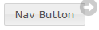          | `Button`                            | switches to a different view                                   |
| 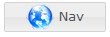 | `navigation - Icon`                 | the same as a symbol                                           |
| 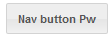     | `navigation - Pw`                   | the same, but only after entering a password.                  |
| 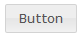  | `Button State`                      | writes a fixed value to a data point                           |
| 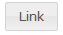          | `Button Link` ,`Button Link _blank` | opens an address, in the same or in a new window               |
| 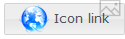        | `Icon link`                         | the same as a symbol                                           |
| 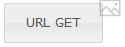      | `Icon HTTP GET`                     | Calls up an address in the background without leaving the page |

### Input

|                                                                           | Widget                      | Does                                           |
| ------------------------------------------------------------------------- | --------------------------- | ---------------------------------------------- |
| 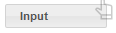                    | `Input`                     | Text field, writes on every change             |
| 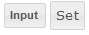           | `ctrl - Input + Set-Button` | Text field, only writes when button is pressed |
| 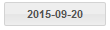         | `ctrl - Input Date`         | Date selection                                 |
| 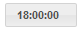 | `ctrl - Input Datetime`     | Date and time                                  |

### Select and control

|                                                                            | Widget                   | Does                                     |
| -------------------------------------------------------------------------- | ------------------------ | ---------------------------------------- |
| 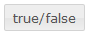                       | `Html Bool`              | displays and toggles a yes/no value.     |
| 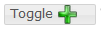          | `Icon Toggle`            | the same with two symbols                |
| 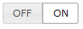               | `Radiobuttons on/off`    | two buttons for on and off               |
| 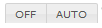      | `Radiobuttons ValueList` | One button per value from a list         |
| 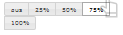    | `Radiobuttons 25%`       | fixed levels 0, 25, 50, 75, 100          |
| 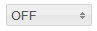               | `Select ValueList`       | a drop-down menu for longer lists        |
| 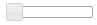         | `Slider horizontal`      | Slider, horizontal                       |
| 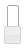  | `Slider vertical`        | Slider, vertical                         |
| 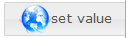      | `ctrl - Icon State`      | Symbol that sets a value when clicked    |
| 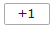 | `ctrl - Icon Increment`  | Symbol that changes a value by an amount |

### Dialogues

|                                                                                     | Widget                                     | Does                                |
| ----------------------------------------------------------------------------------- | ------------------------------------------ | ----------------------------------- |
| 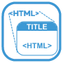                        | `HTML - Dialog`                            | opens a window with its own content |
| 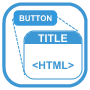                    | `Icon - Dialog`                            | the same, triggered via a symbol    |
| 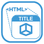              | `container - HTML - view in jqui Dialog`   | opens an entire view as a window    |
| 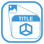     | `container - Icon - view in jqui Dialog`   | the same via a symbol               |
| 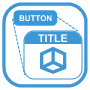 | `container - Button - view in jqui Dialog` | the same via a button               |
| 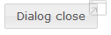                 | `Button dialog close`                      | closes the open window              |

## jqplot

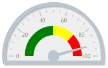

A single widget,`MeterGauge` A pointer instrument with colored sections. For more options, there are separate sets; see [Pointer Instruments](/docs/viz/widgetsets.md) .

## swipe

|                                                          | Widget             | Does                                               |
| -------------------------------------------------------- | ------------------ | -------------------------------------------------- |
|        | `swipe Navigation` | Switches between views when you swipe your finger. |
|  | `Carousel`         | shows several views in succession, like a carousel |

Both are primarily intended for telephones and wall tablets.

## tabs

A widget,`SliderTabs` : multiple views behind tabs, which can be switched between at the top.

## What applies to everyone

The settings that each of these widgets has (name, position, visibility, CSS, signals) are described under [Widget Settings](/docs/viz/widgets.md) .