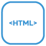
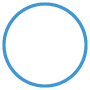
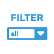
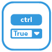

#Basic
| widgets | Images | description

| [`HTML`](#html-frame) | |This widget displays arbitrary HTML code.|
| [`Svg Shape`](#svg-shape) | |Represents a shape|
| [`iFrame`](#iframe) | |This widget includes an iFrame|
| [`Image`](#image) | |This widget displays an image.|
| [`links`](#link) | |This widget corresponds to the "static - HTML" widget but is also a clickable link over its entire area. Can be used for navigating between views or for external links.|
| [`Border`](#border) | |Represents a frame, optionally with title and title bar|
| [`iFrame8`](#iframe8) | |Displays up to 8 images in iFrames|
| [`View in widget`](#view-in-widget) | |This widget can display views within views. Useful for e.g. navigation: You set up a view with navigation elements and then integrate them into any number of other views.|
| [`view in widget 8`](#view-in-widget-8)] | |Displays one of 8 views depending on a state.|
| `Image 8` | |Displays one of 8 images depending on a state.|
| [`HTML navigation`](#html-navigation) | |This widget is used to create a navigation between the views. Corresponds to the "static - link" widget, but can only be used for navigating between the views and also offers the option of using animated effects when changing views.|
| [`filter - dropdown`](#filter-dropdown) | ||
| [`Number`](#number) | |This widget represents a numerical value|
| [`String`](#string) | |This widget represents a string type data point.|
| [`String (unescaped)`](#string--unescpaped-) | |This widget represents a data point of the character string type. In contrast to the "hm_val - String" widget, no special characters are "escaped" - i.e. the variable can also contain HTML code and this is then displayed.|
| [`String img src`](#string-img-src) | |A variable of the character string type can be assigned to this widget, a URL contained there is then displayed as an image|
| `Timestamp` | ||
| [`Last change timestamp`](#last-change-timestamp) | ||
| [`ValueList Text`](#valuelist-text) | |This widget represents a variable of type list of values.|
| [`ValueListHTML`](#valuelist-html) | |This widget represents a variable of the value list type. Corresponds to the widget "hm_val - ValueList Text, but it is not "escaped", i.e. HTML code can be entered in valuelist.|
| [`ValueList HTML Style`](#valuelist-html-8) | |This widget represents a variable of the value list type. Corresponds to the widget "hm_val - ValueList HTML, but offers the option of using 8 different values (0-7) and 8 different CSS specifications.|
| [`BooleanHTML`](#bool-html) | |This widget displays bool values.|
| `AckFlag HTML` | ||
| [`Boolean check box`](#bool-checkbox) | |This widget displays bool values as a simple checkbox and also allows to toggle the value.|
| [`Boolean Select`](#bool-select) | |This widget displays bool values as a dropdown and also allows to toggle the value.|
| [`Boolean HTML Control`](#bool-html-control) | |This widget displays boolean values and also allows switching the value to click within the widget area.|
| [`Boolean SVG`](#bool-svg) | |This widget sets a value when clicked within the widget area.|
| [`HTML State`](#html-state) | |This widget disappears when the value of the associated data point is 0 or false. Clever e.g. for displaying service messages|
| [`Red Number`](#hide-on-0-false) | |Display a numeric value in the style of the iOS notification icons. Disappears at value 0.|
| [`Bulb on/off`](#bulb-on-off) | |This widget represents a value as a switched off or lit lightbulb on a black background. Can be used for bool and float values (dimmer).|
| [`Bulb on/off control`](#bulb-on-off-control)| |This widget represents a value as a switched off or lit lightbulb on a black background. Can be used for bool and float values (dimmer).|
| [`Bar`](#bar-horizontal) | |This widget displays a value from 0-100 as a horizontal bar.|
| `Note` | ||
| `json Table` | ||
| `HTML logout` | ||
| `Gesture indicator` | ||
| `Speech to text` | ||
| `Full Screen` | ||
| `Screen Resolution` | ||
| `Screen Resolution` | ||

### HTML frame
This widget renders any HTML code. It is also possible to use Javascript inside the widget.

| attribute|description|
|-----|----|
| `ObjectId`|Id of an object to be displayed that contains HTML|
| Prefix html|HTML code to render before the object|
| Append Html|HTML code to be rendered after the object|

**Example:** 

### SVG Shape
This widget simply renders a geometric shape with some shapes predefined.

| attribute|description|
|-----|----|
| type|geometric shape|
| line color|shape border color|
| Fill color|Fill color|
| linewidth||
| Rotate|Angle of rotation from initial position in degrees|
| Width Scale|Scales the width between 0 and 100%|
| Altitude Scale|Scales the altitude between 0 and 100%|

**Example:** 

### IFrame
Represents an iFrame

| attribute|description|
|-----|----|
| source|path to source (website, image); this can be defined locally or by URL|
| No sandbox|:construction:|
| update time|:construction:|
| Update on wakeup|:construction:|
| Update at view change|:construction:|
| Do not add to URL|:construction:|
| Scroll X|:construction:|
| Scroll Y|:construction:|
| No frame|:construction:|

**Example:** 

### Images
This widget displays an image.

| attribute|description|
|-----|----|
| source|path to source in local file system|
| Stretch|Fit Image to Dimensions of Frame|
| update time|:construction:|
| Update on wakeup|:construction:|
| Update at view change|:construction:|
| Do not add to URL|:construction:|
| Allow user interactions|:construction:|

**Example:** 

### Link
This widget corresponds to the "HTML Frame" widget, but is also a clickable link over its entire area. Can be used for navigating between views or for external links.

| attribute|description|
|-----|----|

| `html`|Self-explanatory ;) ...insert the HTML code here for the formatted display of text.
| `link`|The link URL. To use a link to another view, simply enter the view name preceded by the hash symbol (#) | `target`|The target of the link. Leave blank to stay in same browser window; if you want to open a new window enter _blank. More options: _self (same tab), _parent(), _top()

**Example:** 

###Borders
This widget simply represents a frame - no other function, just text and color. This can be used to group widgets.

| attribute|description|
|-----|----|

| Title|Self-explanatory | Top Caption Font|Title Font | Top Caption Color|Caption Color | Title Background|Title Text Background Color | Title-Top-Distance|Distance of the title from the top edge | Title-Left-Spacing|Spacing of the title from the left margin | Head Height|Height of a bar from the top | Head Color|Bar Color

**Example:** 

### View in widget 8
Displays one of 8 views depending on a state.

| attribute|description|
|-----|----|

| `persistent`|Views that have been rendered once are no longer removed from the DOM

### IFrame 8
Displays one of 8 iFrames depending on a state.

### HTML navigation
This widget is used to build a navigation between the views. Corresponds to the "static - link" widget, but can only be used for navigating between the views and also offers the option of using animated effects when changing views.

| attribute|description|
|-----|----|

| `html`|Self-explanatory ;) ...insert the HTML code here | `nav_view`|The name of the view to which navigation is to be entered here | `hide_effect`|The name of a jQueryUI effect can be entered here, which is used when leaving the view. Effects available are: Blind, Bounce, Clip, Drop, Explode, Fade, Fold, Highlight, Puff, Pulsate, Scale, Shake, Size, Slide and Transfer.
| `hide_duration`|Duration of the effect in ms | `show_effect`|see above, the same - but this time for showing the new view | `show_duration`|See above, time in ms for showing the new view

### Filters - dropdown
### Number
This widget represents a numerical value (can be used for both integers and floats)

| attribute|description|
|-----|----|

| `html_prepend`|Text or HTML code that is displayed in front of the numerical value | `html_append`|Text or HTML code that is displayed behind the numerical value | `digits`|Number of displayed decimal places | `factor`|Factor by which the numerical value is multiplied

###string
This widget represents a string type data point.

| attribute|description|
|-----|----|

| `html_prepend`|Text or HTML code that is displayed before the string.
| `html_append`|Text or HTML code that is displayed after the string.

### String (unescaped)
This widget represents a data point of the character string type. In contrast to the "hm_val - String" widget, no special characters are "escaped" - i.e. the variable can also contain HTML code and this is then displayed.

| attribute|description|
|-----|----|

| html_prepend|Text or HTML code to be displayed before the string.
| html_append|Text or HTML code to be displayed after the string.

### String img src
A variable of the character string type can be assigned to this widget, and a URL contained there is then displayed as an image.

| attribute|description|
|-----|----|

| `html_prepend`|Text or HTML code that is displayed in front of the image.
| `html_append`|Text or HTML code that is displayed behind the image.

### Last change timestamp
Displays the last timestamp of the connected state.

### ValueListText
This widget represents a value list type variable.

| attribute|description|
|-----|----|

| `valuelist`|A semicolon separated list of texts for the respective values.
| `html_prepend`|Text or HTML code that is displayed in front of the image.
| `html_append`|Text or HTML code that is displayed behind the image.

### ValueList HTML
This widget represents a variable of the value list type. Corresponds to the widget "hm_val - ValueList Text, but it is not "escaped", i.e. HTML code can be entered in valuelist.

| attribute|description|
|-----|----|

| `valuelist`|A semicolon separated list of HTML code for the respective values.
| `html_prepend`|Text or HTML code that is displayed in front of the image.
| `html_append`|Text or HTML code that is displayed behind the image.

### ValueList HTML 8
This widget represents a variable of the value list type. Corresponds to the "ValueList HTML" widget, but offers the option of using 8 different values (0-7) and 8 different CSS specifications.

| attribute|description|
|-----|----|

| `html_append`|Text or HTML code displayed behind the image|

| `html_append`|Text or HTML code to be displayed behind the image|
| value0 to value7|Text or HTML code for the values 0 to 7 | style0 to style7|CSS specifications for the values 0 to 7 |

### Boolean HTML
This widget represents bool values.

| attribute|description|
|-----|----|

| `html_prepend`|Text or HTML code that is displayed in front of the image.
| `html_append`|Text or HTML code that is displayed behind the image.
| `html_true`|Text or HTML code that is displayed if true.
| `html_false`|Text or HTML code that is displayed in the case of False.

### Boolean check box
This widget displays bool values as a simple checkbox and also allows to toggle the value.

| attribute|description|
|-----|----|

| `html_prepend`|Text or HTML code that is displayed in front of the checkbox.
| `html_append`|Text or HTML code that is displayed behind the checkbox.

### Boolean Select
This widget displays boolean values as a dropdown and also allows to toggle the value.

| attribute|description|
|-----|----|

| `html_prepend`|Text or HTML code that is displayed in front of the image.
| `html_append`|Text or HTML code that is displayed behind the image.
| `text_true`|Text for the true case | `text_false`|Text for false case

### Boolean HTML Control
This widget displays boolean values and also allows the value to be toggled on click within the widget area.

| attribute|description|
|-----|----|

| `html_prepend`|Text or HTML code that is displayed in front of the image.
| `html_append`|Text or HTML code that is displayed behind the image.
| `text_true`|Text for the true case | `text_false`|Text for false case

### Boolean SVG
###HTML State
This widget sets a value when clicked within the widget area.

| attribute|description|
|-----|----|

| `html`|Text or HTML code displayed | `value`|Value to be set

### Hide on 0/false
This widget disappears when the value of the associated data point is 0 or false. Clever for displaying service messages, for example

### Red Number
Display a numeric value in the style of iOS notification icons. Disappears at value 0.

### Bulb on/off
This widget represents a value as a switched off or lit lightbulb on a black background. Can be used for bool and float values (dimmer).

### Bulb on/off
This widget represents a value as an off or lit lightbulb on a black background. Clicking on the widget toggles the value.

### Twist grip
This widget represents a twist grip sensor with the original Homematic icons.

### TFK
This widget represents a door/window contact with the original Homematic icons.

### Bar Horizontal
This widget displays a value from 0-100 as a horizontal bar.

| attribute|description|
|-----|----|

| `factor`|Factor by which the value is multiplied. Example: 100 must be entered for a dimmer (which goes from 0.00 to 1.00).
| `color`|CSS property background-color of the bar | `border`|CSS property border of the bar | `shadow`|CSS property box-shadow of the bar | `reverse`|If true is entered here, the bar is displayed from right to left instead of left to right.

### Bar Vertical
Corresponds to the widget "hm_val - Bar Horizontal, but vertical instead of horizontal.

| attribute|description|
|-----|----|

| `factor`|Factor by which the value is multiplied. Example: 100 must be entered for a dimmer (which goes from 0.00 to 1.00).
| `color`|CSS property background-color of the bar | `border`|CSS property border of the bar | `shadow`|CSS property box-shadow of the bar | `reverse`|If true is entered here, the bar is displayed from bottom to top instead of top to bottom