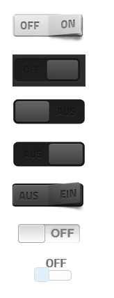

# Fancyswitch
This set represents some switches that mostly function in the same way.
They represent Boolean states and can also switch them.

|Widget | Image | Description |
|------------------------|-------|--------------|
|Switch light off/on | |Light gray rocker switch |
|Slider dark on/off | |Slider with 'on'/'off' label |
|Slider dark on/off | |Slider with 'off'/'on' label |
|Dark rocker switch on/off |  |Dark rocker switch with 'off'/'on' label; optionally also in light style |
|Giva Labs iButton | | White slider with 'on'/'off' label |
|Taitem jqui Toggleswitch| | White slider with 'on'/'off' label outside the slider |
|Taitem jqui Toggleswitch| | White slider with 'on'/'off' label outside the slider |

## Description of properties
|Attribute|Description|Subject|
|----|----|---|
|ObjectId|Id of an object to be displayed that contains HTML|Switch, Slider, Slider, Seesaw |
|Invert|Invert switching state|Switch, slider, slider, rocker |
|False value|Value that corresponds to the false/off state|Switch, slider, rocker |
|True value|Value that corresponds to the state false/off|Switch, slider, slider, rocker |
|Auto-Off|Represents button function: after an adjustable time the switch returns to its original state|Switch, slider, slide, rocker |
|Light style|Brighter display of the switch|Dark rocker switch off/on |
|Leverage Size||Giva Labs iButton |
|Container size||Giva Labs iButton |
|Dragging allowed|Switch can be dragged (not just pushed)|Giva Labs iButton |
|Animation|Switching is animated|Giva Labs iButton |
|Switch duration|Data point is only switched with a delay|Giva Labs iButton |
|Highlight switch|Sliding area of the switch is also shown in color|Taitem jqui Toggleswitch |
|Widget width|Width of the switch, independent of label|Taitem jqui Toggleswitch |
|Prepend html|HTML code to be displayed before the object|Taitem jqui Toggleswitch |
|Append HTML|HTML code to be displayed after the object|Taitem jqui Toggleswitch |

**Example:** 