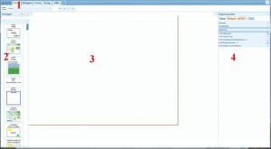
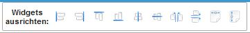
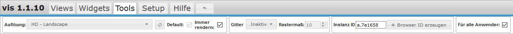
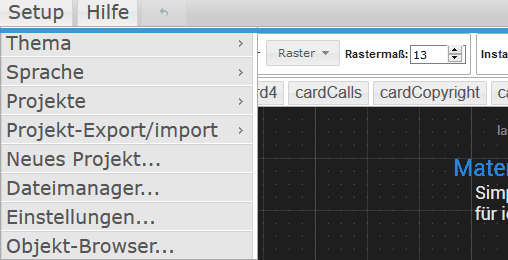
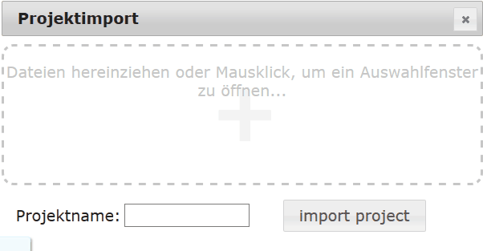
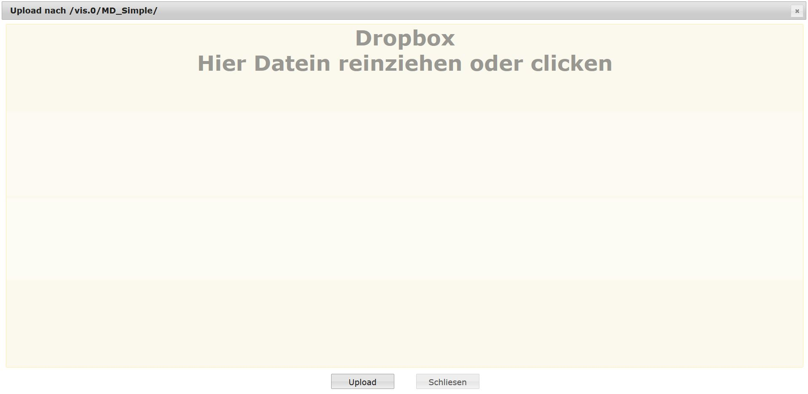
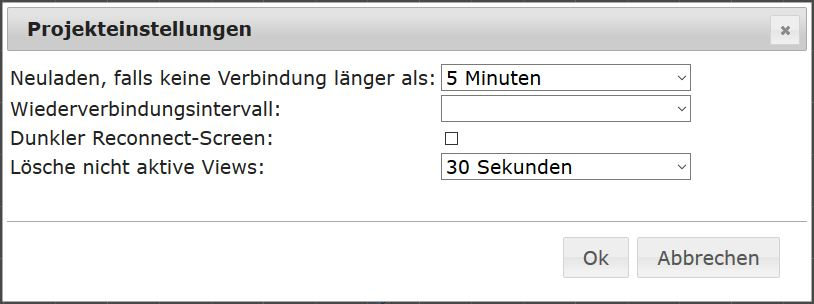
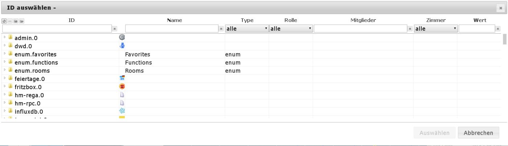
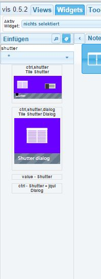

?> ***This page is currently being revised.***.   Help ioBroker and expand this article. Please note the [ioBroker Style Guide](https://www.iobroker.net/#de/documentation/community/styleguidedoc.md) so that the changes can be adopted more easily.

**Visualizations with VIS**

VIS is ioBroker's main visualization tool and offers extensive options for visualizing a smart home.

## Configuration
VIS requires the WEB adapter, which is installed automatically when VIS is installed. Apart from entering the license, which can be obtained at https://iobroker.net/, no further configuration is necessary. This license is free for private use.  There can only be one VIS instance.

## Operation
After installation, the adapter is called via `<IPdesServers>:8082/vis/index.html` or via the hyperlink in the Instances tab of the admin adapter and the visualization is displayed.

When you first start the application, a DemoView is created automatically.

There are several views in a project.
On each view, several widgets can be freely placed for display or operation. The visualization is created and configured using the editor.
The editor is called up using `<IPdesServers>:8082/vis/edit.html`.
After closing the editor using the close window icon ( (x) top right), the last edited view is shown in the function view.
This can be called up at any time using `<IPdesServers>:8082/vis/index.html#ViewName` The editor is divided into different areas.

* * *

## The tabs in the header area (1)
### Views
If this tab is selected, you can select the view to be edited from the existing ones in the pull-down menu below.

The four icons to the right are self-explanatory and refer to the views.
After clicking on the workspace, the view in the properties sidebar on the right changes to the Views tab and shows the settings for the view.

### Widgets
If the Widgets tab is activated, the toolbar below changes 

The tools for editing widgets are displayed.

#### Pull-down menu
Here you can select a widget for editing, or the selected widget will be displayed here.

#### Icon bar
The three icons for delete, copy and info become active when a widget is selected.

#### Align widgets

If you select multiple widgets by holding down the mouse button (or by Ctrl-clicking), you can then use these icons to align groups (left-aligned, right-aligned, top-aligned, bottom-aligned, centered, vertically aligned).
You can also position multiple widgets at the same distance (horizontally and vertically), and use the last two icons to adjust the size of multiple widgets.
If you select a widget, the view in the properties sidebar on the right changes to the Widget tab and shows the settings for this widget.
With the multiple selection option, you can change the properties of multiple widgets at the same time using the right sidebar.

#### All widgets
The two widgets make it easier to edit views.
The first ensures that the values of the widgets are not updated, the second prevents widgets from being moved.

#### Export widget
If a widget is activated, you can use this button to export the widget's CSS code.

#### Import widget
Conversely, you can import widgets that are not included in the scope of vis.
After clicking on a widget, the view in the properties sidebar on the right changes to the Widget tab and shows the settings for the selected widget.

### Tools
If the Tools tab is activated, the toolbar below changes 

#### Resolution
Many preset screen resolutions of mobile devices are displayed here, but there is also a "User-defined" option that allows you to make your own settings.
If you select something here, a frame is drawn on the workspace that corresponds to the selected screen resolution.

#### Default
If _default_ is checked, the active view is made the default view and is loaded if the VIS view is loaded with the resolution set above.
**Example:** The _iPad Portrait_ display is selected and the _Default_ box is checked in the _Start_ view. Let's assume that a view called _Weather_ has been loaded from the project in landscape format on an iPad. If the iPad is now turned to portrait format, the _Start_ view previously set as the default (_default_) for this resolution (portrait format) is automatically displayed.
This makes it possible to control the view by movement on mobile devices (for example "back to the main menu" or _up_ shows a different view than _landscape_).

#### Grid
here you have the options _inactive_, _elements_ and _grid_. If you select elements, the widgets will snap to a neighboring element when you move the mouse. With grid you can also specify a grid size (in px) in which the widgets will then snap.

#### Instance ID
A unique ID is displayed here, which can be addressed with a script, for example via VIS [Control Command](https://github.com/iobroker/ioBroker.vis/blob/master/README.md#control-interface).

#### Browser ID
If you click this button, a new ID is created in the previous field. This means that each browser on each device can be individually identified.

#### Export
Here you can export your view, for example to use it in another installation. When you click the button, a window opens in which the view is offered in text form. You can put this data into the clipboard with Ctrl-C and load it into an editor and then save it

#### Import
After clicking, an empty window opens. Here you can copy a text file obtained via the _export_ function. Then enter a name for the view in the bottom left and click the _import_ button. From then on, the new view is available. This function is suitable for importing examples from the forum.

### Set up

#### Theme
Here you can select a color scheme for the editor.

#### Language
The operating language for the editor can be set

#### Projects
Projects are collections of [Views](http://www.iobroker.net/?page_id=1193&lang=de).
The project _main_ is created by default and is called via `<IPdesServers>:8082/vis/index.html#ViewName`.
The project files are located in the ioBroker installation in the folder `_ioBroker-Ordner_/iobroker-data/files/vis.0/main`.

#### Project export/import
Projects can be exported as a whole (e.g. to share with other users): A zip file is created that contains the images used, the stylesheet vis-user.css and the actual definitions vis-views.json.
There is also the option to export the project anonymously. :construction: To import other projects, simply drag the zip file of an export described above onto the window and enter a name for the new project: 

#### New project...
A new project can be created here.
A window opens and asks you to enter a project name.
After confirming, the editor loads the new project at this address: `<IPdesServers>:8082/vis/_projektname_/index.html#ViewName.` The files of the new project are located in the ioBroker installation under `_ioBroker-Ordner_/iobroker-data/files/vis.0/projektname`.
**Tip**: You can duplicate a project folder and edit the duplicate in the VIS Editor `<IPdesServers>:8082/vis/_projektname_duplikat_/index.html`.

#### Application
When loading a project, all [views] :construction: (http://www.iobroker.net/?page_id=1193&lang=de) of this [project] :construction: (http://www.iobroker.net/?page_id=188&lang=de&preview_id=188&preview_nonce=d845a20ee2&preview=true#Projekt) are loaded.
Sometimes this is not useful and slows down the system.
You can therefore group together views that belong together in different projects.
It makes sense, for example, to separate them according to end devices with different screen resolutions.
You can create a _smartphone_ project and create views in it that are optimized for touch operation and vertical orientation.
By deliberately reducing the number of widgets, the project remains small in terms of data volume and therefore loads quickly even when you are on the move (e.g. via VPN and mobile phone).
Another project, _Wall tablet_, which is only displayed on the tablet on the wall, does not need to load views from the _Smartphone_ project.
The main project _main_ for displaying all data is usually only displayed and edited from the desktop PC.
Data volume and computing speed usually do not play a role here.
If views are to be used in several projects, they can be copied using the command [export](http://www.iobroker.net/?page_id=188&lang=de&preview_id=188&preview_nonce=d845a20ee2&preview=true#exportieren) :construction:/ [import](http://www.iobroker.net/?page_id=188&lang=de&preview_id=188&preview_nonce=d845a20ee2&preview=true#importieren) :construction:.
Linking from one project to another via navigation widgets is not possible.
**Tip**: It can also be useful to create a test project when experimenting with CSS commands.

#### File Manager... (6)
After selecting this menu item, files can be easily copied into or out of the ioBroker file system without the need for additional programs.
The file manager opens:  [caption id="attachment_6007" align="aligncenter" width="799"] *The images are only sample images and are copyrighted by the respective companies.[/caption]

The behavior is similar to any file manager.
Use the blue "left arrow" button to move up one level in the hierarchy, and click on a folder to enter it.
Use the "Folder+" icon to create a new folder.
When you have reached the desired directory, select a file, use the blue arrow to download it to your computer, and click the green arrow to open the "Dropbox".
 Files can be easily stored here using drag & drop and then uploaded to the ioBroker server by clicking on the _**Upload**_ button.
Alternatively, you can click anywhere in the area and a file selection will open.
The file list will be emptied and if you do not want to upload any more files, you can leave the Dropbox using the **_Close_** button.

#### Settings... (7)

* _**Reload if no connection longer than:**_ The active view is completely reloaded,

if the connection between the frontend (tablet) and the server was interrupted for longer than the preset time.
To prevent this, this time can also be set to _**never**_.

* _**Reconnection interval:**_ The time in which the frontend should try to

to reach the server.

* _**Dark reconnect screen:**_ Typically the page is white when attempting to reload the view.

To avoid this being a problem in dark rooms, the screen can be switched to dark using this checkbox.

* _**Delete inactive views from RAM:**_ To free up valuable memory on the frontend,

In order to save memory space, which is usually only 1GB on cheap tablets, views that have not been needed for a long time can be removed from the RAM.
If the corresponding view is reloaded, however, this will take longer.
This option sets the time that unused views should be kept in the RAM.

#### Object Browser... (8)
 You can search for an object here.
This is placed in the clipboard after clicking the _**Select**_ button.
The filter fields above the column headers can be used to find things more quickly.

### Help (5)
Here you can find an overview of the keyboard commands under _Shortcuts_ and a short information under _About the project_.

### Undo button (6)
With this button you can undo the last action(s) step by step.

* * *

## The widget sidebar (2)
It is used to select widgets.
The widgets are displayed as icons and can be dragged and dropped onto the workspace, or positioned at position 0,0 on the workspace using the _Insert_ button.

The field under the _Insert_ button is a filter field.
Here you can enter a term to search the icons for it.
All icons that contain this term are displayed.
If you delete the last filter (or the \*), you get a pull-down list with the possible search terms.
Below is the selection field for the widget sets.
The asterisk (*) stands for all widget sets.
When filtering by term, all widget sets are automatically searched.
Otherwise, the pull-down menu also offers the various widget sets as filters.

* * *

## The work surface (3)
This is where the widgets for the view are positioned. This can be done with the mouse or the arrow keys.
If the Widgets tab is active, some alignment help is also available.

* * *

## The Settings Sidebar (4)
All settings for the views and widgets are entered here using the corresponding tabs.
The CSS tab also offers advanced users the opportunity to integrate their own developments.

* Data point assignment
* Widget size
* Font size and color
* Background
* Frame, line color, type, thickness
* css parameters

In order to display data points or perform actions, the data point must be assigned to the widget.
This entry can be found in the _General_ section.