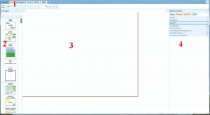
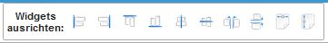
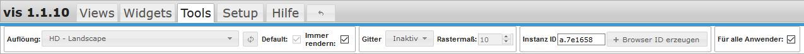
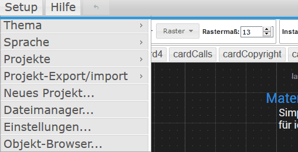
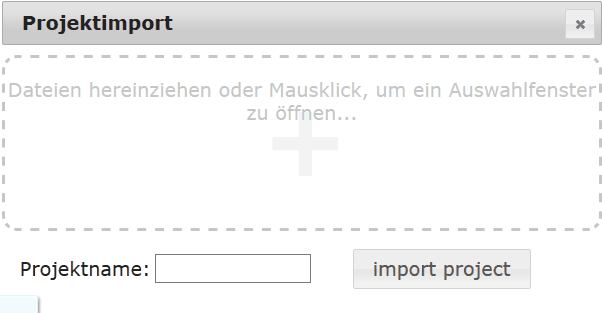
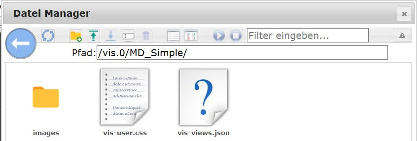
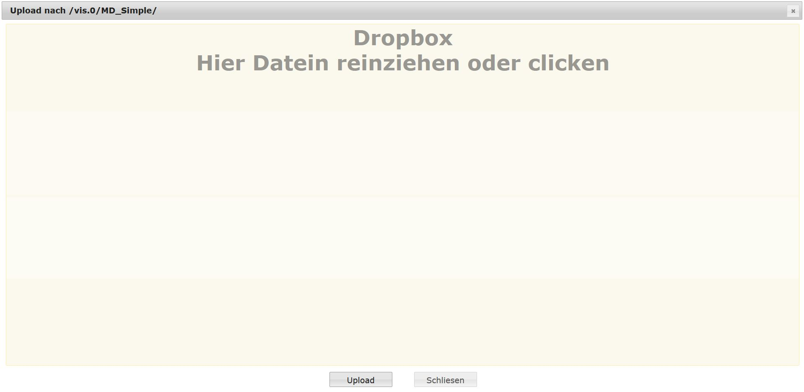
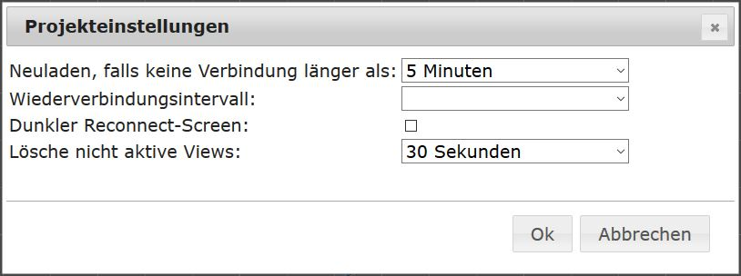
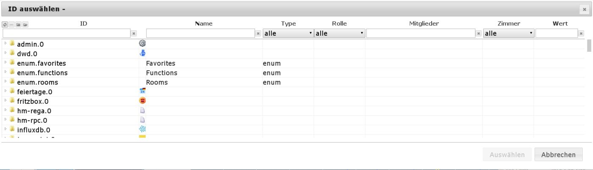
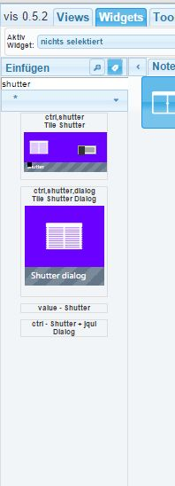

# vis

**vis** For a long time, ioBroker's visualization was: an interface where you can assemble your own user interfaces using building blocks instead of code.

!> **For a new project [vis-2](/adapters/vis-2) the right choice.** It is the successor and is being further developed. This page describes the editor of the original vis. Much of it still applies in vis-2, but the interface looks different. An overview of the visualizations and their strengths can be found at [overview](/docs/viz/README.md).

## configuration

Vis needs the adapter. **web**, which is automatically included during installation. Otherwise, nothing needs to be configured except the license. This is set up in the account on
[iobroker.net](https://iobroker.net) Managed and free for private use. Details on how this works can be found at
[Adapter licenses](/docs/licenses/adapter.md).

It can only **one** Give a vis instance.

## operation

After installation, the adapter is accessed via `<IPdesServers>:8082/vis/index.html`
The visualization can be accessed via the hyperlink in the Instances tab of the admin adapter.

A demo view is automatically created the first time the program is accessed.

A project contains multiple views. Each view allows for the free placement of several widgets, which are used for display or interaction. The visualization is created and configured via the editor. The editor is accessed via `<IPdesServers>:8082/vis/edit.html` The editor is accessed after closing it via the close-window icon (x) in the upper right corner. The last edited view is displayed in the function view. This can be accessed at any time with `<IPdesServers>:8082/vis/index.html#ViewName`
The editor is divided into different areas.

---

## The riders in the head area (1)

### Views

If this tab is selected, you can choose the view to be edited from the existing ones in the pull-down menu below.\

The four icons to the right are self-explanatory and relate to the views. After clicking on the workspace, the view in the properties sidebar on the right switches to the Views tab and displays the settings for the view.

### Widgets

When the Widgets tab is activated, the toolbar below it changes.

The tools for editing widgets are displayed.

#### Pulldown menu

Here you can select a widget for editing, or the selected widget will be displayed here.

#### Icon bar

The three icons for delete, copy and info become active when a widget is selected.

#### Align widgets

By clicking and dragging (or Ctrl-clicking) multiple widgets, you can then use these icons to align groups (left-aligned, right-aligned, top-aligned, bottom-aligned, centered, vertically centered). You can also position multiple widgets with equal spacing (horizontally and vertically), and adjust the size of multiple widgets using the last two icons. Selecting a widget switches the view in the properties sidebar on the right to the Widget tab, displaying the settings for that widget. The multi-selection feature allows you to modify the properties of several widgets simultaneously via the right sidebar.

#### All widgets

The two widgets are used to simplify the editing of views. The first prevents the widget values from being updated, the second prevents widgets from being moved.

#### Export widget

If a widget is activated, you can use this button to export the widget's CSS code.

#### Import widget

Conversely, you can import widgets here that are not included in vis. After clicking on a widget, the view in the properties sidebar on the right switches to the Widget tab and displays the settings for the selected widget.

### Tools

When the Tools tab is activated, the underlying toolbar changes.

#### resolution

Many preset screen resolutions for mobile devices are displayed here, but there's also an "User-defined" option that allows you to configure your own settings. Selecting something here will draw a frame on the workspace corresponding to the chosen screen resolution.

#### default

If _default_ If checked, the active view will be made the default view and loaded if the VIS view is loaded with the resolution set above.
**Example:**
The ad will be displayed _iPad Portrait_ selected and in the view _start_ the box
_default_ Checked. Let's assume that the project has now been converted into a view named \[name] on an iPad. _Weather_ It was loaded in landscape mode. If the iPad is then rotated to portrait mode, the previously used default resolution for that portrait mode will be automatically applied._default_) defined view _start_ displayed. With appropriately mobile devices, control via movement is possible (for example, "back to main menu" or _high_ shows a different view than _across_).

#### Grid

Here are the possibilities _inactive_, _elements_ and _Gri&#x64;_&#x57;hen elements are selected, the widgets snap to an adjacent element when moved with the mouse. With grid settings, you can also specify a grid size (in pixels) within which the widgets will then snap.

#### Instance ID

A unique ID is displayed here, which can be verified, for example, via VIS. [Control Command](https://github.com/iobroker/ioBroker.vis/blob/master/README.md#control-interface) can be addressed with a script.

#### Browser ID

Clicking this button generates a new ID in the previous field. This allows each browser on each device to be individually identified.

#### export

Here you can export your view to use it, for example, in another installation. Clicking the button opens a window displaying the view in text format. You can copy this data to the clipboard using Ctrl+C, paste it into a text editor, and then save it.

#### import

After clicking, an empty window opens. Here you can select a function. _export_ Copy the received text file into the window. Then enter a name for the view in the lower left corner and click the button. _import_ Click it. The new view will then be available. This function is suitable for importing examples from the forum.

### Set up

#### Theme

Here you can choose from a color scheme for the editor.

#### Language

The operating language for the editor can be set.

#### Projects

Projects are collections of [Views](/docs/viz/vis.md#views)By default, the project _Main_ created and is over `<IPdesServers>:8082/vis/index.html#ViewName`
The project files are located in the ioBroker installation folder. `_ioBroker-Ordner_/iobroker-data/files/vis.0/main`.

#### Project export/import

Projects can be exported as a whole (e.g., to share with other users):\
A zip file is created containing the images used, the stylesheet vis-user.css and the actual definitions vis-views.json.\
Additionally, there is an option to export the project anonymously. :construction:\
To import other projects, simply drag the zip file of an export described above onto the window and specify a name for the new project:\

#### new project...

Here you can create a new project. A window will open prompting you to enter a project name. After confirmation, the editor will load the new project at this address: `<IPdesServers>:8082/vis/_projektname_/index.html#ViewName.`\
The files for the new project are located in the ioBroker installation under
`_ioBroker-Ordner_/iobroker-data/files/vis.0/projektname`.\
**Tip**A project folder can be duplicated and the duplicate edited in the VIS Editor.
`<IPdesServers>:8082/vis/_projektname_duplikat_/index.html`.

#### Application

When loading a project, all [Views](/docs/viz/vis.md#views) This project is loaded along with other data. Sometimes this isn't practical and slows down the system. Therefore, you can group related views into different projects. For example, it makes sense to separate them by device type with different screen resolutions. This way, you can create a project _Smartphone_ Create a new environment and within it, define views optimized for touch operation and vertical orientation. By deliberately reducing the number of widgets, the project remains small in terms of data volume and therefore loads quickly even when working remotely (e.g., via VPN and mobile data). Another project _wall tra&#x79;_&#x54;he project, which is only displayed on the tablet on the wall, does not need to load any views from the \_Smartphone\_ project. The main project _Main_ Views are typically displayed and edited only from a desktop PC. Data volume and processing speed are usually irrelevant in this case. If views are to be used in multiple projects, they can be managed using the commands. **export** and **import** in the rider
[Tools](/docs/viz/vis.md#tools) They can be copied. Linking from one project to another via navigation widgets is not possible.\
**Tip**It can also be useful to create a test project when experimenting with CSS commands.

#### File manager... (6)

After selecting this menu item, files can be conveniently copied into or out of the ioBroker file system without the need for any additional programs. The file manager will open:

The images shown are examples and are copyrighted by their respective companies.

The behavior is similar to any file manager. The blue "left arrow" button allows you to navigate up one hierarchy level, while clicking on a folder takes you inside it. A new folder can be created using the "Folder+" icon. Once you've reached the desired directory, you can select a file, download it to your computer using the blue arrow, and open Dropbox by clicking the green arrow.

Files can be easily placed here via drag and drop and then saved by clicking the button. _**Upload**_ The files can be uploaded to the ioBroker server. Alternatively, you can click anywhere on the screen, which will open a file selection dialog. The file list will clear, and if you don't want to upload any more files, you can exit Dropbox using the button. **_Close_**.

#### Settings... (7)

- _**Reload if no connection lasts longer than:**_ The active view is completely reloaded if the connection between the frontend (tablet) and the server has been interrupted for longer than the preset time. To prevent this, this time can also be adjusted. _**never**_ be asked.
- _**Reconnection interval:**_ The time the frontend should attempt to reach the server.
- _**Dark reconnect screen:**_ The page is usually white when attempting to reload the view. To prevent this from being distracting in dark environments, the screen can be switched to dark mode using this checkbox.
- _**Deleting inactive views from RAM:**_ To save valuable RAM on the front end, which is usually only 1GB on budget tablets, views that haven't been used for a while can be removed from RAM. However, reloading these views will then take longer. This option lets you set how long unused views should be kept in RAM.

#### Object browser... (8)

\
You can search for an object here. It will be displayed after clicking the button. _**Choose**_ The information has been copied to the clipboard. For faster retrieval, the filter fields above the column headers can be used.

### Help (5)

Here you will find under _Shortcuts_ an overview of the keyboard commands and under _about the project_ A brief update.

### Undo button (6)

This button allows you to undo the last action(s) step by step.

---

## The widget sidebar (2)

It is used to select widgets. The widgets are displayed as icons and can be dragged and dropped onto the workspace, or selected using the button. _Insert_ be positioned at position 0,0 of the work surface.\

The field below the button _Insert_ This is a filter field. Here you can enter a term to search the icons for it. All icons containing that term will be displayed. If you clear the last filter (or the \*), you get a drop-down list of possible search terms. Below that is the selection field for the widget phrases.\
The asterisk (\*) represents all widget sets.\
When filtering by terms, all widget sets are automatically searched. Otherwise, the pull-down menu also offers the different widget sets as filters.

---

## The work surface (3)

This is where you position the widgets for the view. You can do this with the mouse or the arrow keys. If the Widgets tab is active, some alignment aids are also available.

---

## The settings sidebar (4)

Here, all settings for the views and widgets are entered via the corresponding tabs. Additionally, the CSS tab offers advanced users the option to integrate their own custom developments.

- Data point assignment
- Widget size
- Font size and color
- background
- Frame, line color, style, thickness
- CSS parameters

To display data points or perform actions, the data point must be assigned to the widget. This entry is in the section _Generally_ to find.