# Collection widgets for vis-2

Where [Material](/docs/viz/widgets-material.md) represents finished devices, such as thermostats, blinds, and vacuum cleaners, **Collection** provides the controls themselves: buttons, selection fields, sliders, and tables. This set is the obvious choice whenever a page needs something that isn't covered by a pre-made device widget.

One basic principle runs through all the building blocks: they don't ask for a fixed data type, but rather use whatever the data point provides. The same group of buttons operates a switch with`true` /`false` , an operating mode with the numbers 0 to 3 and a scene with text values.

The adapter is installed[`vis-2-widgets-collection`](/adapters/vis-2-widgets-collection) Then reload the editor. The building blocks will appear in the palette under **Collection** .

## The widgets

|                                                                          | Widget           | For what                                                                                                      |
| ------------------------------------------------------------------------ | ---------------- | ------------------------------------------------------------------------------------------------------------- |
| 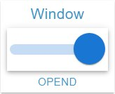             | **Switch**       | A toggle switch for a yes/no value, labeled left or right.                                                    |
| 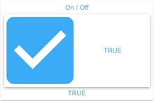         | **Checkbox**     | The same as a checkbox if it should be less conspicuous.                                                      |
| 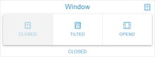 | **Button group** | Several buttons next to each other, one of which remains pressed, for operating modes, window states, scenes. |
| 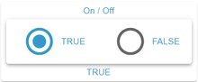   | **Radio group**  | The same selection as a list with round buttons.                                                              |
| 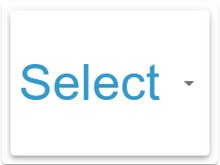          | **Selection**    | A drop-down menu for when the list of buttons becomes too long.                                               |
| 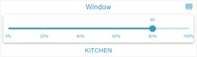             | **slider**       | A numerical value between two boundaries, optionally horizontal or vertical, with step size and scale.        |
| 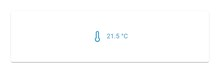               | **input**        | A text field for strings and numbers, for example for target values or names.                                 |
| 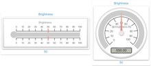               | **Gauge**        | A pointer instrument or scale for a measured value, available in several designs.                             |
| 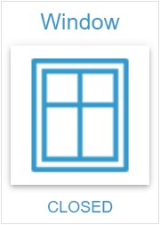           | **Condition**    | Displays a value with its symbol, unit, and color, without changing it.                                       |
| 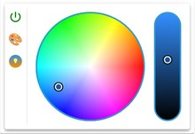               | **Light**        | Color wheel and brightness control for a lamp, significantly simpler than its material counterpart.           |
| 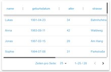     | **JSON table**   | Turns a data point containing a JSON list into a sortable table with page sheets.                             |
| 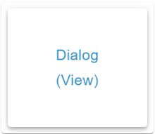             | **dialog**       | Opens a different view as a window on top of the page.                                                        |

The thirteenth component, **Theme Configuration** , displays nothing. It sets the appearance of the entire project: colors, font, font sizes, line height, corner radii, and spacing. Anyone who wants to design a consistent look for a page without having to adjust each widget individually should place this widget on a view once and configure everything there.

## Things to pay attention to

**Value list.** For button, radio, and selection groups, the value corresponding to each label is entered manually. It's advisable to check the object tree beforehand to see which values the data point actually accepts.

**Writing direction.** All interactive widgets write without confirmation. For things where a mistake would be costly, such as gates and heating locks, the dialog with PIN verification is the better choice.

**The set is growing. The** collection is constantly being expanded; the list above reflects the status as of version 2.6. After an update, it's worth taking a look at the palette.