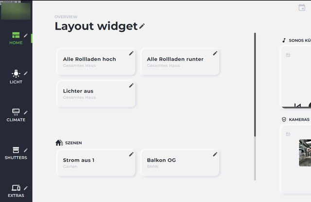
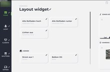
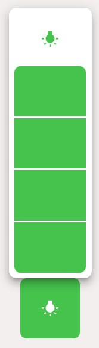
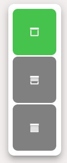
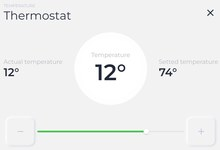
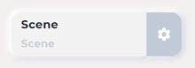
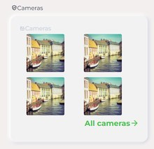
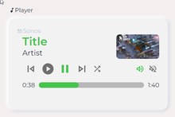
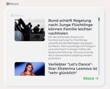

# JägerDesign widgets for vis-2

Most widget sets provide individual building blocks from which you assemble a page. **JägerDesign** delivers a complete design: a layout widget builds the entire page, including the sidebar, header, and tile area, and the other building blocks automatically fit into it correctly. For those who don't want to design but simply want to enter their devices, this is the quickest way to create a page that looks presentable.

The design was created in collaboration with a design studio for a villa in Baden-Württemberg. It is now open to everyone.

## How much it costs and why

**JägerDesign is the only paid widget set in the adapter directory.** All others are free. The difference lies in the effort behind it: The set is not a collection of existing components, but a completely designed concept created from scratch by a design studio and maintained ever since. The license fee covers this work.

What the license includes:

- **For life.** A one-time payment, no ongoing costs.
- **Bound to the installation's UUID** , **transferable up to three times** , so changing computers is no problem. To transfer the installation, simply send a message to <info@iobroker.net> .
- It is managed on **iobroker.net** , just like the licenses for vis-2 and KNX. Details and pricing can be found in the [product overview](/productoverview) and under [adapter licenses](/docs/licenses/adapter.md) .

**Trying it out beforehand is possible without a license.** The widgets can be inserted and viewed in the vis-2 editor. They are only not displayed without a license in the running visualization, the runtime. So you can calmly build and examine an entire page before making a decision.

## The widgets

|                                                                         | Widget         | For what                                                                                                                                                    |
| ----------------------------------------------------------------------- | -------------- | ----------------------------------------------------------------------------------------------------------------------------------------------------------- |
|          | **layout**     | The framework: a sidebar with the sections (lighting, climate, blinds, scenes, cameras), a header, and a tile area. Everything else is contained within it. |
|        | **Condition**  | The basic tile: a data point with symbol, text and switching function.                                                                                      |
|          | **dimmer**     | Turn the light on and off and adjust the brightness.                                                                                                        |
|         | **louvre**     | Roller shutter with position and control buttons.                                                                                                           |
|  | **thermostat** | Target and actual temperature with operating mode.                                                                                                          |
|            | **scene**      | Calls up a scene, such as "Evening" or "All off".                                                                                                           |
|        | **Cameras**    | Multiple camera images side by side, with a larger view available on click.                                                                                 |
|          | **Player**     | Title, image and operation of a player.                                                                                                                     |
|              | **News**       | Messages and notices in the header of the page.                                                                                                             |

## Things to pay attention to

**It's a cohesive design.** The building blocks are coordinated and look best together. While it's possible to place individual JägerDesign tiles on an otherwise differently designed page, it rarely works.

**The adapter is called**[`vis-2-widgets-jaeger-design`](/adapters/vis-2-widgets-jaeger-design) **and only runs under vis-2** , not under vis-1.

**During installation** , you will need to accept the license terms. Then reload the editor.