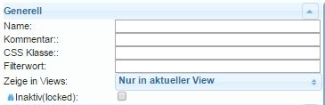
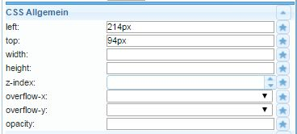

# Widgets
## Generally
In this context, widgets ('device, thing') are display elements that display numbers, text, images or diagrams in various ways and offer interaction options.

## IoBroker.vis widgets
There are different widget sets for visualization in ioBroker with vis.

-------------------------------------------------------------------------------
-------------------------------------------------------------------------------

### The basic settings of widgets
#### Generally

| Attribute|Description|
|-----|----|

| Name|You can enter a unique name for this widget here | Comment|You can enter a short description here | CSS class|:construction: | Filter word|:construction: | Show in views|You can select whether this widget should only appear in the current view or in several.
| Inactive (locked)|:construction:

#### **Visibility**
The visibility of a widget can be made dependent on the state of a data point.

| Attribute|Description|
|----|----|

| `Object ID`|The ID of the data point that should control the visibility of the selected widget is entered here. The data point can be searched for using the button.
| Condition|The widget becomes visible if the condition entered here for the above data point...
| Value for the condition|...corresponds to the value entered here.

#### **Generally**
 The 'General' section is specific to each widget and is described in more detail for each widget.
In this section, the desired data point is assigned to the widget in the Object ID field.

*** The **CSS settings** of the widget can be found in the following menu items and can be customized to your own requirements:

#### **CSS general**

| Attribute|Description|
|-----|----|

| `left`|Distance from the left edge of the view | `top`|Distance from the top edge of the view | `width`|Width of the widget | `height`|Height of the widget | `z-index`|Specifies the level in which the widget is located (0= on the background, positive values= the higher the value, the further forward) | `overflow-y`|

| `overflow-y`|
| `opacity`|Transparency (0=opaque ->image invisible .. 1=transparent ->image visible) |

#### CSS Font & Text

| Attribute|Description|
|-----|----|

| `color`|Font color (via selection dialog or color code) | `text-align`|Alignment of the text (left, right, centered) | `text-shadow`|Color of the text shadow | `font-family`|Font | `font-style`|Character set type (normal, italic, oblique, initial, inherit) | `font-variant`|Character set variant (normal, small caps, ...) | `font-weight`|Character set weight | `font-size`|Font size | `line-height`|Line spacing | `letter-spacing`|Character spacing | `word-spacing`|Word spacing

#### **CSS background**

| Attribute | Description |
|-----|-----|

| `background` |Here several of the following properties can be specified together | `-color` |Color of the background | `-image` |Background image | `-repeat` |Specifies whether a background is repeated across the entire width and/or height of an element.
| `-attachement` |Specifies whether a background image is fixed or moves when scrolling | `-position` |Alignment of the background image (https://www.w3schools.com/cssref/pr_background-position.asp) | `-size` |Size of the background image | `-clip` |Controls the overlap with the edge | `-origin` |Coordinate system origin for image coordinates

#### **CSS Border**

|Attribute|Description|
|----|----|
|`-width`|Border thickness| |
|`-color`|Border color|
|`-radius`|Corner radius of the border; can be at most half of the shorter distance of the widget|
|`-radius`|Corner radius of the border; can be at most half of the shorter distance of the widget|

| Attribute|Description|
|-----|----|

| `-width`|Border thickness | `-style`|Border line type | `-color`|Border color | `-radius`|Border corner radius; can be at most half of the shorter distance of the widget

#### CSS shadows and spacing

|Attribute|Description|
|----|----|
|`padding`|Offset from the edge of the widget box|
|`padding-top`|Offset on the upper side|
|`padding-right`|Offset on the right side|
|`padding-bottom`|Offset on the bottom side|
|`box-shadow`|Widget box shadow color|
|`margin-top`|Top margin around the widget (auto, %, px, pt, cm)|
|`margin-right`|Right border around the widget|
|`margin-bottom`|Bottom border around the widget|
|`margin-left`|Left border around the widget|
|`margin-left`|Left margin around the widget|

| Attribute|Description|
|-----|----|

| `padding`|Offset from widget box edge | `padding-left`|Offset on left side | `padding-top`|Offset on top side | `padding-right`|Offset on right side | `padding-bottom`|Offset on bottom side | `box-shadow`|Color of widget box shadow | `margin-top`|Top margin around widget (auto, %, px, pt, cm) | `margin-right`|Right margin around widget | `margin-bottom`|Bottom margin around widget | `margin-left`|Left margin around widget