# Widget sets

A widget is a building block on a vis page: a switch, a diagram, a clock, a tile. The available building blocks depend on which **widget sets** are installed. Each set is a separate adapter. After installation, its building blocks automatically appear in the editor's palette, sorted by the set's name.

Widgets are **only available for vis and vis-2** . The other interfaces build themselves from the devices and categories and have no selection options: [Devices adapter](/docs/viz/devices.md) and [Lovelace](/docs/viz/lovelace.md) . Anyone using one of these doesn't need this page. **webui** has its own building blocks, but no widget sets in this sense.

This page describes **where all widget sets are located.** The complete and always up-to-date list can be found in the [adapter overview](/adapters) under the **"Visualization Widgets"** group; in addition, there are the **"Visualization"** group for the user interfaces themselves and **the "Visualization Icons"** group for the icon collections. Each entry links to the adapter's page with its version, author, and instructions.

Widget sets do not create data points and do not run continuously. They only deliver files that vis loads when a page is opened. Therefore, no instance needs to be created: install, reload the editor, and you're done.

The images on this page are taken from the adapters themselves. They are the same preview images that are also visible in the editor's palette.

Be economical! Every installed set is loaded when a page is opened. A dozen sets for just three used building blocks will noticeably slow down the visualization, especially on a wall-mounted tablet.

## What vis-2 already brings

vis-2 comes with five sets that do not need to be installed separately:

| Sentence | For what                                                                                      |
| -------- | --------------------------------------------------------------------------------------------- |
| `basic`  | Text, number, image, frame, switch, navigation: the basic building blocks. Around 40 widgets. |
| `jqui`   | Buttons, sliders, input fields and dialogs in jQuery UI style.                                |
| `jqplot` | Simple diagrams made from recorded values.                                                    |
| `swipe`  | Pages that can be switched with a finger.                                                     |
| `tabs`   | Tabs within a view.                                                                           |

This allows you to build a complete page without any additional adapters. The individual components are described under [Included Widgets](/docs/viz/basic.md) .

## Sentences for vis-2

### material

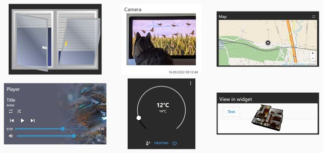

The comprehensive all-purpose set for vis-2: switches, thermostat, blinds, camera, door lock, historical measurement data, music player, vacuum cleaner. The components are coordinated and adapt to both light and dark themes. This is the perfect starting point for anyone starting out with vis-2.

19 widgets · bluefox · last updated 05/2026 · [detailed description](/docs/viz/widgets-material.md) ·[`vis-2-widgets-material`](/adapters/vis-2-widgets-material)

### Collection

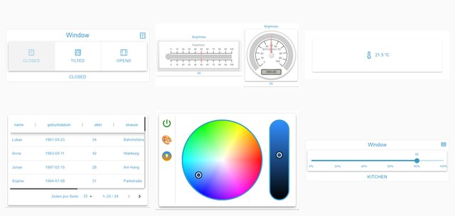

A diverse and constantly growing collection from the community: button groups, selection fields, sliders, JSON tables, color wheels, pointer instruments, dialogs. A useful addition to materials when a control element is missing.

13 widgets · Steiger04 · last updated 07/2026 · [detailed description](/docs/viz/widgets-collection.md) ·[`vis-2-widgets-collection`](/adapters/vis-2-widgets-collection)

### Material Design for vis-2

The redesigned Material Design widgets, this time built directly for vis-2 and no longer via the old vis building blocks. It is based on Scrounger's work and largely covers his set: tiles, lists, tables, charts, sliders, and icon selection.

49 widgets · typhosj · since 09/2026 · [Material Design](/docs/viz/widgets-materialdesign.md) ·[`vis2-materialdesign`](/adapters/vis2-materialdesign)

### JägerDesign

Pre-designed building blocks for lighting, heating, blinds, cameras, and messaging, plus a layout widget that transforms them into a complete page with a sidebar. A fully designed overall layout instead of individual elements.

**The only paid widget set in the directory.** It's not a custom-built system, but a design created by a design studio; the license covers this work. It's valid for life and is tied to the installation's UUID. You can try it out without a license: the widgets will be displayed in the editor, but will disappear once the visualization is running. Pricing and terms are listed in the [product overview](/productoverview) .

9 widgets · bluefox · last updated 04/2026 · [detailed description](/docs/viz/widgets-jaeger.md) ·[`vis-2-widgets-jaeger-design`](/adapters/vis-2-widgets-jaeger-design)

### inventwo for vis-2

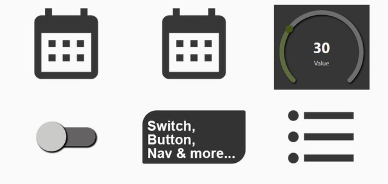

Calendar, appointment list, value lists, universal tile, radial controller and other building blocks in the inventwo design. The counterpart to the older [inventwo design](#inventwo-design) for vis 1.

11 widgets · jkvarel · last updated 09/2026 · [detailed description](/docs/viz/widgets-inventwo.md) ·[`vis-2-widgets-inventwo`](/adapters/vis-2-widgets-inventwo)

### Technology

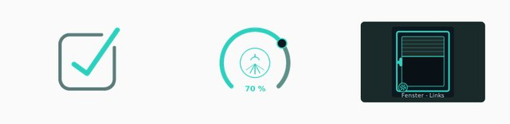

Windows, shutters, switches and dimmers: few building blocks, but cleanly drawn and with many intermediate states.

3 Widgets · Sefina-DS · since 06/2026 ·[`vis-2-widgets-technic`](/adapters/vis-2-widgets-technic)

### Gauges

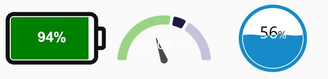

Pointer instruments: battery level, fill level, color scale.

3 Widgets · bluefox · last updated 08/2025 ·[`vis-2-widgets-gauges`](/adapters/vis-2-widgets-gauges)

### energy

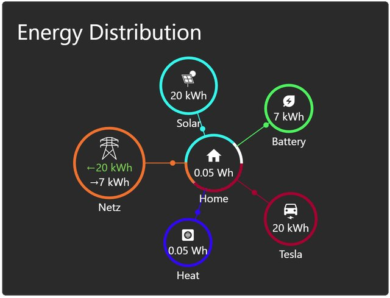

Energy flow between grid, photovoltaics, storage, heat pump and car, including consumption comparisons over a selectable period. Requires recorded values from a trend adapter.

4 Widgets · bluefox · last updated 08/2026 ·[`vis-2-widgets-energy`](/adapters/vis-2-widgets-energy)

### Weather and heating

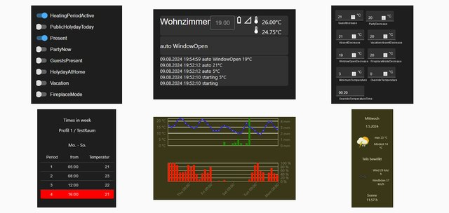

Weather forecast and complete heating control: room overview, time profiles, window status, evaluation of the last weeks.

11 widgets · rg-engineering · last updated 07/2026 ·[`vis-2-widgets-weather-and-heating`](/adapters/vis-2-widgets-weather-and-heating)

### RSS feed

News and feeds on the user interface, optionally as a list, ticker or individual message.

5 Widgets · oweitman · last updated 07/2026 ·[`vis-2-widgets-rssfeed`](/adapters/vis-2-widgets-rssfeed)

### ovarian

A single widget that freely formats the content of a data point, intended as a tool for custom solutions.

1 Widget · oweitman · last updated 10/2025 ·[`vis-2-widgets-ovarious`](/adapters/vis-2-widgets-ovarious)

### Sweet Home 3D

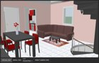

Displays a floor plan drawn with SweetHome 3D as a spatial model and controls lights and devices within it.

1 Widget · bluefox · last updated 07/2024 ·[`vis-2-widgets-sweethome3d`](/adapters/vis-2-widgets-sweethome3d)

### Sentences relating to a specific adapter

These sentences are only meaningful in conjunction with the adapter of the same name; they represent its data and serve no other purpose.

| Sentence                                                                                                                                          | Belongs to                                       | Status  |
| ------------------------------------------------------------------------------------------------------------------------------------------------- | ------------------------------------------------ | ------- |
| 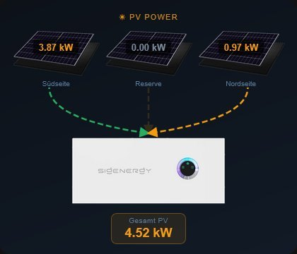[`vis-2-widgets-sigenergy`](../../de/viz/adapters/vis-2-widgets-sigenergy)                             | Sigenergy inverters and storage systems          | 09/2026 |
| [`vis-2-widgets-radar-trap`](../../de/viz/adapters/vis-2-widgets-radar-trap)                         | Speed camera and route warnings from`radar-trap` | 12/2024 |
| [`vis-2-widgets-automatic-feeder`](../../de/viz/adapters/vis-2-widgets-automatic-feeder) | Automatic feeder`automatic-feeder`               | 09/2026 |
| [`vis-2-widgets-tibberlink`](/adapters/vis-2-widgets-tibberlink)                                                                                  | Electricity prices from`tibberlink`              | 07/2026 |

## Sentences from vis 1

These sentences originate from the time of vis 1. Most can also be used in vis-2 because vis-2 can still display the old building blocks. However, they will look the same as in vis 1 and will not follow the theme of vis-2.

For a new page in vis-2, it's worth first looking at the sentences above. The older sentences are primarily relevant for existing projects.

### Material Design

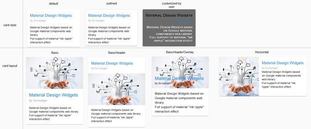

The most common set of rules for vis 1, according to Google's Material Design, includes tiles, lists, tables, charts, sliders, a custom set of icons, and a consistent color scheme. The latest version dates from 2021.

The further development has been released as a separate adapter for vis-2, see [Material Design for vis-2](#material-design-für-vis-2) .

46 Widgets · Scrounger · Last updated 06/2021 · [Detailed description](/docs/viz/widgets-materialdesign.md) ·[`vis-materialdesign`](/adapters/vis-materialdesign)

### Material Advanced

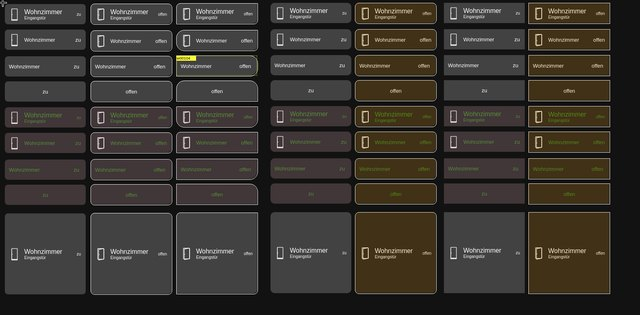

Standardized building blocks for windows, doors, lighting, heating and roller shutters, all built according to the same pattern and configured via a common properties list.

26 widgets · EdgarM73 · last updated 09/2023 ·[`vis-material-advanced`](/adapters/vis-material-advanced)

### HQ widgets

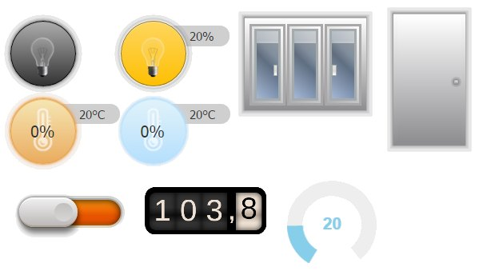

Tiles in the style of a control room: lamps, shutters, doors, temperatures, each with its own color indicating its status. One of the oldest sets and still well-maintained today.

20 widgets · bluefox · last updated 04/2026 ·[`vis-hqwidgets`](/adapters/vis-hqwidgets)

### inventwo Design

A fully designed package with its own visual language, from which a complete dark interface can be built. It continues to be maintained and now also includes components for vis-2.

jkvarel · last updated 06/2026 · [detailed description](/docs/viz/widgets-inventwo.md) ·[`vis-inventwo`](/adapters/vis-inventwo)

### HomeKit tiles

Tiles in the style of Apple HomeKit, with the colors and symbols commonly used there.

19 widgets · Standard user · Last updated 01/2026 ·[`vis-homekittiles`](/adapters/vis-homekittiles)

### metro

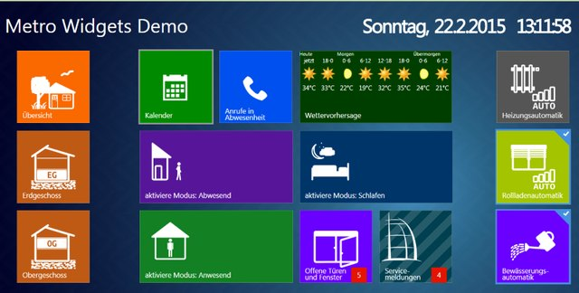

Large colored tiles in the Metro style, as introduced by Windows 8.

28 widgets · hobbyquaker · last updated 02/2022 ·[`vis-metro`](/adapters/vis-metro)

### JQui MFD

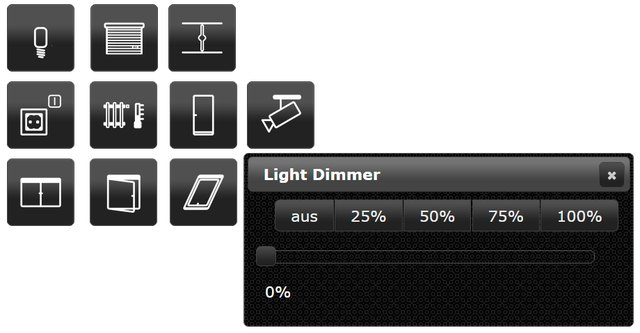

Switches, indicators, and symbols based on the drawings of the OpenAutomationProject. The classic layout for clean, technical-looking pages.

29 widgets · hobbyquaker · last updated 01/2026 ·[`vis-jqui-mfd`](/adapters/vis-jqui-mfd)

### LCARS

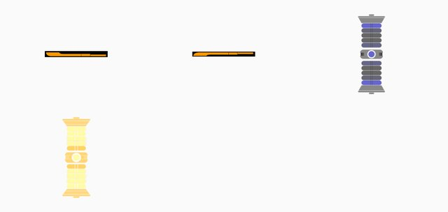

The interface from Star Trek, for those who like it: bars, buttons and a warp core as a progress indicator.

21 widgets · hobbyquaker · last updated 06/2023 ·[`vis-lcars`](/adapters/vis-lcars)

### material

Seven tiles for light, windows, blinds, and temperature, each with its own design. Not to be confused with **Material Design** or **Material** for vis-2.

7 Widgets · nisiode · last updated 01/2025 ·[`vis-material`](/adapters/vis-material)

### Plumb

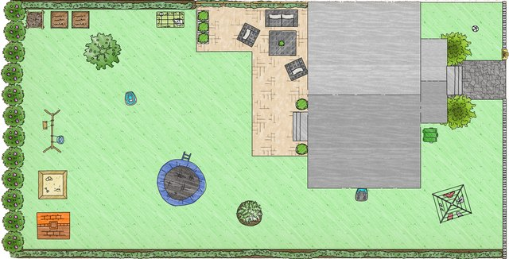

Pipes, pumps, valves and connecting lines. Intended for schematic drawings of a heating system, a cistern or a garden irrigation system.

19 widgets · smiling\_Jack · last updated 03/2019 ·[`vis-plumb`](/adapters/vis-plumb)

### Time and weather

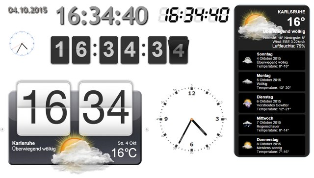

Analog and digital clocks, date, sunrise and sunset times, and a multi-day weather forecast with a changing background image. Requires a weather adapter, for example.`daswetter` or`weatherunderground` .

8 widgets · bluefox · last updated 07/2022 ·[`vis-timeandweather`](/adapters/vis-timeandweather)

### Weather

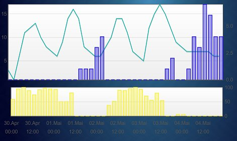

A more detailed weather presentation with trend curves, also based on`daswetter` or`weatherunderground` .

1 Widget · René G. · last 10/2025 ·[`vis-weather`](/adapters/vis-weather)

### Colorpicker

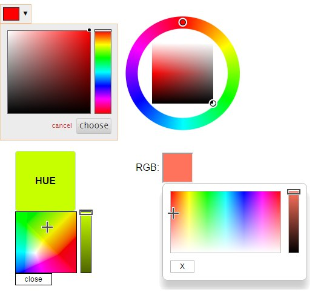

Color selection for RGB lamps in several designs: color wheel, color field, hue control, white balance.

9 widgets · bluefox · last updated 11/2025 ·[`vis-colorpicker`](/adapters/vis-colorpicker)

### Pointer instruments

Three sentences with a similar purpose. Which one is suitable is primarily a matter of taste.

| Sentence                                           |                                                       | Status  |
| -------------------------------------------------- | ----------------------------------------------------- | ------- |
| [`vis-justgage`](/adapters/vis-justgage)           | 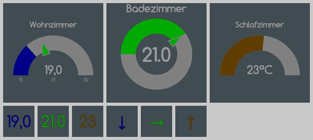           | 03/2024 |
| [`vis-canvas-gauges`](/adapters/vis-canvas-gauges) | 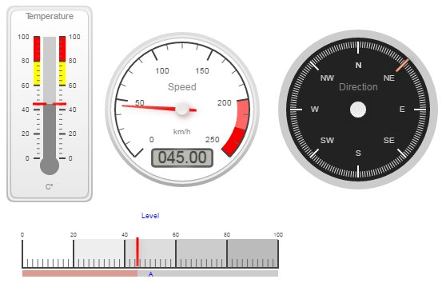 | 09/2022 |
| [`vis-rgraph`](/adapters/vis-rgraph)               | 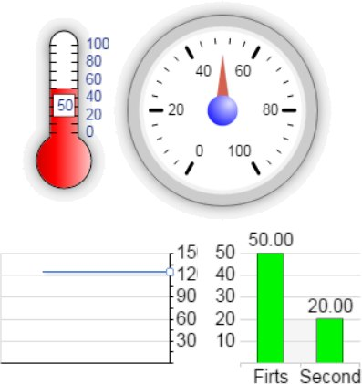               | 10/2015 |

### Diagrams and trends

| Sentence                                                                      |                                           | Status  |
| ----------------------------------------------------------------------------- | ----------------------------------------- | ------- |
| [`vis-history`](/adapters/vis-history) Table and bar chart of recorded values | 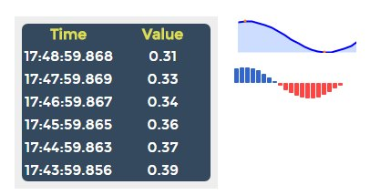 | 10/2019 |
| [`vis-bars`](/adapters/vis-bars) : simple bar graphs                          | 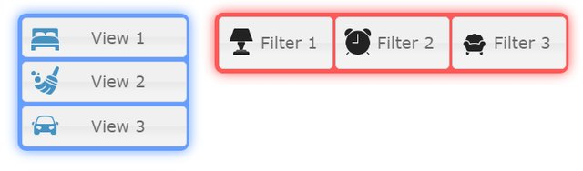       | 05/2017 |

The adapters are needed for correct diagrams.`echarts` or`flot` the better choice; both bring their own building blocks for vis.

### maps

| Sentence                                                                                |                                   | Status  |
| --------------------------------------------------------------------------------------- | --------------------------------- | ------- |
| [`vis-map`](/adapters/vis-map) Locations on a map, for example from the adapter `radar` | 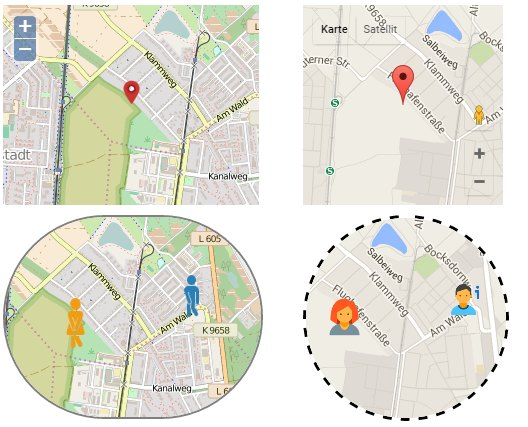 | 07/2024 |
| [`vis-mapwidgets`](/adapters/vis-mapwidgets) : newer map components, also for vis-2     |                                   | 08/2026 |

### More

| Sentence                                         | For what                                                       |                                                   | Status  |
| ------------------------------------------------ | -------------------------------------------------------------- | ------------------------------------------------- | ------- |
| [`vis-players`](/adapters/vis-players)           | Controls for Sonos, Winamp and other players                   | 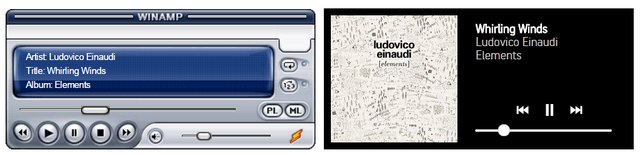         | 05/2020 |
| [`vis-keyboard`](/adapters/vis-keyboard)         | On-screen keyboard and numeric keypad for wall-mounted tablets | 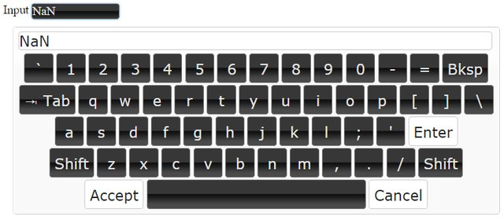       | 10/2025 |
| [`vis-fancyswitch`](/adapters/vis-fancyswitch)   | Toggle switches and rocker switches with animation             | 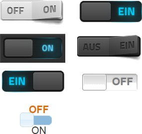 | 10/2017 |
| [`vis-jsontemplate`](/adapters/vis-jsontemplate) | Tables and lists from JSON data, also for vis-2                |                                                   | 07/2026 |
| [`vis-3dmodel`](/adapters/vis-3dmodel)           | shows a 3D model made in Blender                               |                                                   | 04/2021 |

## Writings

Two adapters do not provide building blocks, but only fonts that can then be selected in each widget.

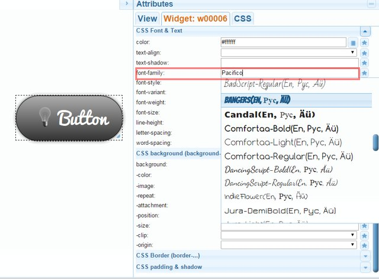

[`vis-google-fonts`](/adapters/vis-google-fonts) brings along Google fonts,[`vis-material-webfont`](/adapters/vis-material-webfont) The symbolic typeface of Material Design.

## Symbol collections

Symbols are not building blocks, but images that can be selected in many widgets. Once a collection is installed, it becomes available in the symbol selection dialog.

[MFD as PNG](/adapters/icons-mfd-png) and [as SVG](/adapters/icons-mfd-svg) · [Material as PNG](/adapters/icons-material-png) and [as SVG](/adapters/icons-material-svg) · [Ultimate](/adapters/icons-ultimate-png) · [Smarthome](/adapters/icons-smarthome) · [Eclipse SmartHome Classic](/adapters/icons-eclipse-smarthome-classic) · [Open Icon Library](/adapters/icons-open-icon-library-png) · [FatCow](/adapters/icons-fatcow-hosting) · [Freepic](/adapters/icons-freepic) · [icons8](/adapters/icons-icons8) · [Addictive Flavor](/adapters/icons-addictive-flavour-png) · [Icontwo](/adapters/vis-icontwo)

## Select and install

All sets are located in the [Adapter](/docs/admin/adapter.md) tab under **Visualization Widgets** , and the symbol collections are under **Visualization Symbols** . After installation, reload the editor; the new set will then appear in the palette.

The **"Status"** entry indicates the month of the last publication in the adapter directory. It says nothing about whether a sentence works; many older sentences have been working reliably for years. It only indicates how likely help is to be found when encountering a problem.