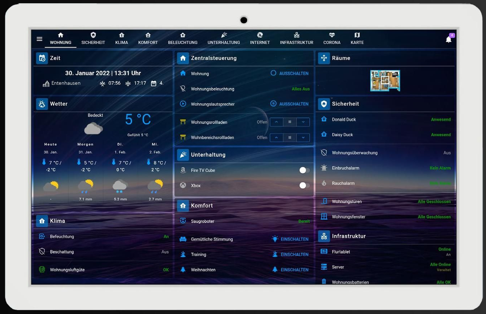
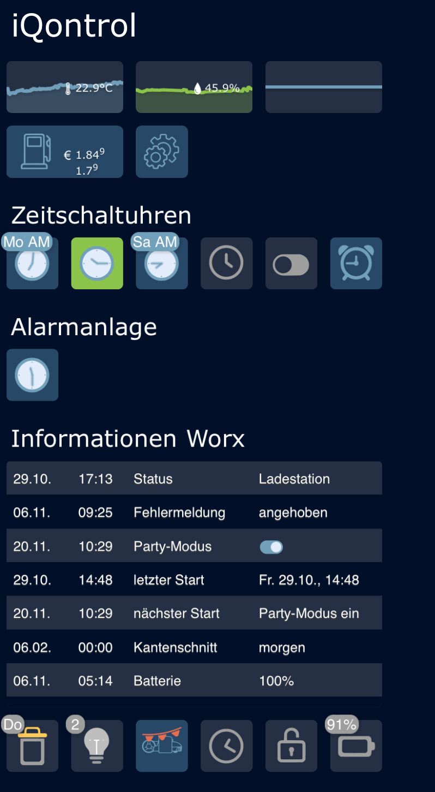
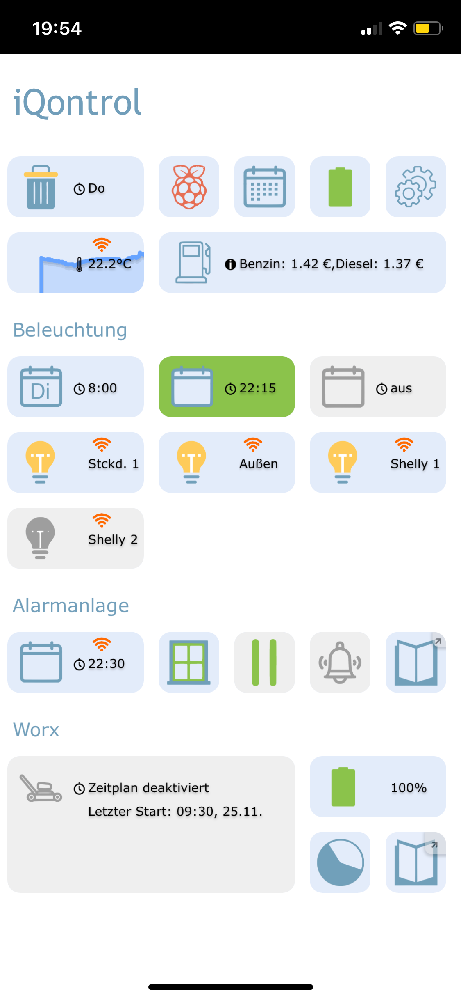

# Добро пожаловать
## Обратите внимание на текущую документацию
?> Документация находится в разработке и постоянно расширяется. Поэтому может случиться так, что ссылки еще не работают или контент отсутствует. Мы благодарны за любую помощь в создании новых статей или улучшений. Информация об этом доступна здесь [на форуме][].   **Пока все содержимое не будет принято, старая документация по-прежнему [можно найти здесь](https://www.iobroker.net/docu/). Она будет последовательно заменена этой новой документацией.**

   

# IoBroker - Автоматизируйте свою жизнь
ioBroker — это программное решение для автоматизации вашего дома. Он позволяет подключать самые разные системы умного дома, которые без ioBroker оставались бы изолированными решениями, и, таким образом, всесторонне контролировать их.

Таким образом, ioBroker является **интеграционной платформой для Интернета вещей и позволяет интегрировать коммерческие продукты практически из всех сфер жизни или интегрировать собственное решение.

Система ioBroker имеет модульную структуру и может быть расширена для удовлетворения индивидуальных требований путем установки отдельных [адаптеров][].

Более 450 адаптеров реализуют интеграцию различных платформ, систем и устройств от A для Alexa до Z для Zigbee и многих других вариантов автоматизации.

 

## IoBroker соединяет разные системы умного дома

На этом рисунке показано, как ioBroker координирует и соединяет различные системы умного дома и другие службы (например, календарь) в качестве центральной системы.
Адаптеры, доступные в ioBroker, могут обмениваться данными, среди прочего, с централизованно управляемыми календарями или системами умного дома конкретных производителей (которые подключены к локальной или беспроводной локальной сети). Таким образом, программное обеспечение ioBroker может считывать информацию о состоянии или запускать управляющие действия.

 

### Пример приложения имитация присутствия
 

В этом примере приложения показано, как две независимые системы умного дома Philipps Hue и Homematic IP объединяются с помощью ioBroker для реализации имитации присутствия.

Подключив две системы умного дома к программному обеспечению ioBroker, ioBroker может изменять состояние ламп Hue (вкл/выкл) и ставней (вверх/вниз). Время отпуска определяется путем подключения календаря к ioBroker.

Используя логические модули (программирование логики адаптера) в ioBroker, пользователь теперь может реализовать следующий процесс всего за несколько шагов:

- Если в календаре введена запись «Праздник», все лампы HUE включаются в 18:00.
- В 22:00 все жалюзи закрыты, а все лампы Hue выключены.
- В 08:00 утра все ставни снова подняты.

Используя доступные адаптеры визуализации, пользователь может создавать отдельные страницы состояния и управления для своих ламп и жалюзи Hue, к которым можно получить доступ с мобильных устройств из дома или в отпуске (например, с помощью облачных сервисов ioBroker или VPN).

 

 

# Сильные стороны ioBroker
## Независимая платформа
ioBroker можно установить практически на все аппаратные платформы (одноплатные компьютеры, такие как Raspberry Pi, серверы, NAS, серверы со средами виртуализации, такие как Proxmox, настольные компьютеры, ...) под управлением Linux, OSX, Windows, Docker.

Простая процедура установки из одной строки (однострочный установщик) обеспечивает удобную установку под Linux и, таким образом, быстрый старт в ioBroker.

 

## Масштабируемость
Если со временем необходимо подключить дополнительные системы умного дома, это может быть реализовано пользователем в любое время с помощью дополнительных адаптеров во время работы.
Сам ioBroker также является масштабируемым: несколько серверов ioBroker могут быть подключены для формирования многохостовой системы. Можно даже смешивать платформы операционных систем и связывать одноплатные компьютеры с большими многоядерными серверами.

 

## Индивидуальное программирование процессов
С помощью логических адаптеров ioBroker предлагает возможность создавать отдельные процессы и сценарии.
В сценарии, например, значение может отслеживаться адаптером (отпуск заносится в календарь на сегодня) и может запускаться действие (включать все источники света Hue в 18:00).

В ioBroker эти отдельные процессы могут быть реализованы путем перетаскивания строительных блоков (графическое программирование) в «Правила» или «Блокно» или в классической форме с помощью «Javascript» или «Typescript» в виде письменного исходного кода.

Дальнейшие объяснения логических модулей, а также дальнейшее представление других логических модулей, таких как Node-Red или адаптер сцены, объясняются в этой документации в разделе «Логика и автоматизация».

 

## Визуализация
Несколько адаптеров визуализации предлагают пользователю возможность графического представления параметров управления и информации о состоянии. Затем эти отдельные визуализации можно отображать и управлять ими на планшете, смартфоне или компьютере.

Некоторые адаптеры визуализации и их основные свойства кратко представлены ниже.

### ВИС
[со стороны адаптера] []

С адаптером VIS (визуализация) ioBroker предоставляет мощный инструмент для создания индивидуальных визуализаций. Текущие значения с датчиков могут отображаться графически так же, как и исторические тренды. Живые изображения с камер наблюдения, реализация системы сигнализации, систем отопления и кондиционирования — также можно реализовать практически все, что только можно вообразить.

При использовании VIS пользователь имеет максимальную свободу выбора при реализации. Готовые строительные блоки для простоты использования помогают пользователю собрать пользовательский интерфейс. Но возможно не только отображение информации. Устройства также можно быстро контролировать через интерфейс визуализации. Работу интерфейса можно адаптировать к самым разным конечным устройствам — от смартфонов и настенных планшетов с сенсорными функциями до ПК — все можно реализовать простым перетаскиванием.

 

  

 

### Интерфейс материалов
Интерфейс React и Material UI.

[Материал стороны адаптера][]

 

### Джарвис
[Страница адаптера Jarvis][]

Jarvis — это визуализация в стиле Material Design, основанная на пользовательском интерфейсе материалов. Jarvis предоставляет структуру и модули, которые используются для визуализации, но могут быть очень гибко настроены.

Jarvis отзывчив и адаптируется к размеру экрана и предлагает стандартизированный дизайн, так что визуализацию можно собрать за короткое время.

Макет может быть гибко настроен. Макет можно разделить на любое количество вкладок. Каждая вкладка может быть либо отображена в полноэкранном режиме, либо разделена на отдельные столбцы (столбцы).

 

 

### IQControl
Достигните своей цели быстро, но при этом гибко, вот что отличает iQontrol:

- Создайте Vis один раз и используйте его везде: от ПК до планшета и мобильного телефона, iQontrol работает на всех конечных устройствах - либо в браузере, либо в виде веб-приложения (можно сохранить на главном экране, а затем использовать как приложение)
- iQontrol динамически адаптируется ко всем разрешениям (отзывчивый дизайн)
- Супер быстрое время загрузки
- Со стандартными настройками вы сможете быстро достичь своей цели
- С другой стороны, с расширенными настройками и виджетами у вас есть высокий уровень гибкости и возможностей настройки (в некоторых установках вы больше не узнаете, что это на самом деле iQontrol)

Видео [демонстрационное видео iQontrol][]

  

 

 

 

### Лавлейс
[адаптер со стороны ловеласа][]

С помощью адаптера Lovelace пользовательский интерфейс HomeAssistant Lovelace можно использовать для ioBroker. Lovelace имеет адаптивный дизайн и, таким образом, автоматически адаптируется к макету экрана ПК, планшета или смартфона.

В Lovelace для просмотра/управления доступны устройства со своими свойствами, которые хранятся в ioBroker (например, вкл/выкл для лампы, яркость, цветовая температура).

Редактор Lovelace (принцип WYSIWYG — принцип What you see is what you get) позволяет легко создавать современные пользовательские интерфейсы всего за несколько шагов. Доступны пользовательские карты и редактор YAML для реализации более сложных требований и пожеланий. Вдохновение для пользовательского интерфейса Lovelace можно собрать в мире HomeAssistant, а затем реализовать в ioBroker.

   

# Кто стоит за ioBroker?
ioBroker — это проект с открытым исходным кодом, разработанный сообществом ioBroker и администрируемый [Bluefox][] как владелец проекта.

Многие разработчики и многие другие помощники работают над центральными компонентами системы ioBroker, многочисленными адаптерами, поддержкой социальных сетей, документацией и многим другим на добровольной основе в свободное время.
Благодаря большому и полезному сообществу решение каждой проблемы было найдено до сих пор.

ioBroker придерживается децентрализованного подхода, при котором каждый адаптер поддерживается в собственном репозитории GitHub. Соответствующий разработчик адаптера принимает решения о своем адаптере в значительной степени самостоятельно. Запросы функций или сторонние расширения функций, такие как «запросы на вытягивание», конечно же, принимаются во внимание.

Некоторые разработчики также объединили усилия в сообществе адаптеров ioBroker, чтобы гарантировать, что даже если у отдельных разработчиков больше нет времени на свои адаптеры, их можно будет продолжать поддерживать.

У сообщества открытого исходного кода нет контрактной поддержки, но вместе мы решили все проблемы до сих пор!

Решения о направлении центральных компонентов и всего проекта обсуждаются в основной команде, а затем реализуются.

Основная команда разработчиков ioBroker состоит из:

* [синий лис][]
* [Аполлон77][]
* [foxriver76][]
* [AlCalzone][]

Вы можете найти список [разработчиков ioBroker][] на форуме ioBroker.

 

# Лицензии и стоимость
Многие проекты ioBroker вместе с исходным кодом доступны на [GitHub][]. В большинстве случаев исходный код распространяется под лицензией MIT. Иногда, однако, используются такие лицензии, как GPL, CC BY-NC или другие, что необходимо учитывать, но не имеет большого значения для конечного пользователя! Разработчик адаптера сам определяет лицензию на соответствующий адаптер.

В очень редких случаях (в настоящее время <5 адаптеров) для использования адаптера требуется лицензия (иногда платная). Например, ioBroker GmbH предоставляет бесплатную лицензию для частного использования адаптера «VIS», но для коммерческого использования требуется платная лицензия.
Обзор и заказ лицензии на эти адаптеры осуществляется на этой странице [iobrokerPrices][]. Там же указана стоимость коммерческого использования этих адаптеров.

 

# Как финансируется ioBroker?
Все основные компоненты и почти все остальные адаптеры доступны бесплатно, а исходный код подавляющего большинства адаптеров находится в открытом доступе на GitHub.

Поскольку проект с открытым исходным кодом не может приносить никакого дохода, например, для покупки серверов, для этих целей требуется официальная форма компании, ioBroker GmbH. Помимо прочего, ioBroker GmbH также предлагает коммерческую поддержку программного обеспечения ioBroker или продает, например, сервер ioBroker.

ioBroker GmbH бесплатно предоставляет инфраструктуру (например, сервер форума) для проекта сообщества и уже приобрела услуги по разработке в прошлом, которые использовались при разработке проектов с открытым исходным кодом (например, Admin5).

ioBroker Free Cloud также является бесплатным сервисом, предоставляемым сообществу компанией ioBroker GmbH. Pro Cloud и услуга IoT — это коммерческие предложения от ioBroker GmbH, стоимость которых покрывает только эксплуатационные расходы.

 

# Удаленный доступ к вашей установке ioBroker через ioBroker Cloud
Удаленное администрирование локально установленной системы ioBroker 24/7 возможно для пользователя или для системных интеграторов через дополнительный облачный доступ. Контроль доступа может свободно настраиваться пользователем с помощью пользователей и групп.
На следующем рисунке кратко показаны продукты ioBroker Cloud Service.

 

# Сообщество
С 2014 года ioBroker заручился широкой поддержкой со стороны тысяч пользователей и разработчиков благодаря своим многочисленным преимуществам. На специально созданном [Форуме][] пользователи и разработчики встречаются и обмениваются опытом и предложениями. На сервере ioBroker [Discord][] можно обмениваться опытом в чате, а сеансы отладки в режиме реального времени могут проводиться в короткие сроки для отслеживания текущих проблем.

Коллекция ссылок официальных сообществ ioBroker:

- Форум ioBroker: [Форум][]
- Серверы Discord ioBroker: [Discord][]
- Группа Facebook «ioBroker SmartHome и IoT»: [FacebookioBrokerSmartHomeIoT][]
- Группа Facebook «ioBroker и умный дом, международная»: [FacebookioBrokerSmartHomeIoTInternational][]

 

# Статистика ioBroker
На [ioBrokerStatistics][] вы найдете обзорную страницу с интересной статистикой ioBroker.

[Grundlagen]: https://www.iobroker.net/#de/documentation/basics/README.md

[Adaptern]: https://www.iobroker.net/#de/adapters/adapters.md

[hier zu finden]: https://www.iobroker.net/docu/

[im Forum]: https://forum.iobroker.net/category/186/dokumentations-support

[GitHub]: https://github.com/ioBroker

[Forum]: https://forum.iobroker.net

[Telegram]: https://t.me/iobrokergermany

[Discord]: https://discord.gg/sGWE65zF

[FacebookIoBrokerSmartHomeIoT]: https://www.facebook.com/groups/440499112958264

[FacebookIoBrokerSmartHomeIoTInternational]: https://www.facebook.com/groups/iobrokerinternational

[iobrokerPreise]: https://iobroker.net/www/pricing

[Bluefox]: https://github.com/GermanBluefox

[Apollon77]: https://github.com/Apollon77

[foxriver76]: https://github.com/foxriver76

[AlCalzone]: https://github.com/AlCalzone

[ioBrokerStatistics]: https://www.iobroker.net/#de/statistics

[Adapterseite Material]: https://www.iobroker.net/#de/adapters/adapterref/iobroker.material/README.md

[Adapterseite Jarvis]: https://www.iobroker.net/#de/adapters/adapterref/iobroker.jarvis/README.md

[Adapterseite vis]: https://www.iobroker.net/#de/adapters/adapterref/iobroker.vis/README.md

[Adapterseite lovelace]:https://www.iobroker.net/#de/adapters/adapterref/iobroker.lovelace/README.md

[iQontrol Demo Video]: https://www.youtube.com/watch?v=QHgmrzMmcX4&list=PL8epyNz8pGEv6-R8dnfXm-m5aBlZFKOBG&index=1

[ioBroker Developer]: https://forum.iobroker.net/groups/developer