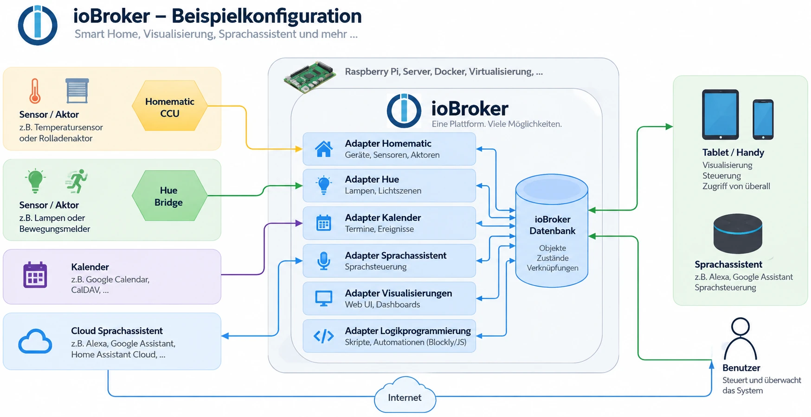

# Что такое ioBroker?

ioBroker — это программное обеспечение, которое объединяет устройства и сервисы разных производителей в единую систему. Считывайте значения, управляйте устройствами, автоматизируйте процессы: всё в одном месте, независимо от производителя конкретного устройства.

## Упростите себе жизнь: Умный дом

Разве не было бы практичнее считывать показания температуры, потребления или состояния переключения устройств разных производителей в одном центральном месте? Разве не нужно было бы помнить о включении или выключении устройств при достижении определенных условий или состояний?

Вот что может предложить «умный дом» – именно такое удобство. А при желании он может предложить еще больше: автоматизацию и возможность удаленного доступа ко всему этому.

### Решение: ioBroker — автоматизируйте свою жизнь

**ioBroker** — это программное решение для автоматизации вашего дома. Оно позволяет интегрировать широкий спектр систем «умного дома», которые в противном случае оставались бы изолированными, обеспечивая таким образом комплексный контроль.

Таким образом, **ioBroker** — это **интеграционная** платформа для Интернета вещей (IoT), позволяющая интегрировать бесплатные и коммерческие продукты практически из всех сфер жизни, а также собственные разработки.

**Система ioBroker** имеет модульную структуру и может быть расширена в соответствии с индивидуальными требованиями путем установки отдельных плагинов, которые мы называем адаптерами.

Благодаря более чем 600 адаптерам, ioBroker позволяет интегрировать различные платформы, системы и устройства — от A (например, Alexa) до Zigbee — и предлагает множество других возможностей для автоматизации.

#### Что такое адаптеры?

**Адаптеры** — это **плагины** (программные модули, небольшие программы), написанные на JavaScript для Node.js, которые специально разработаны для определенных устройств, типов устройств, устройств конкретных производителей или других сервисов, таких как запросы к веб-сайтам.

Эти адаптеры обеспечивают связь между физическими устройствами (например, умными розетками, реле, дистанционными термометрами и подобными устройствами) и центральной системой ioBroker. Они способны считывать значения, измеренные устройствами, и управлять ими, часто через Wi-Fi в пределах домашней сети.

Другие адаптеры предназначены для графического отображения измеренных значений, таких как температура, мощность, потребление или состояния переключения, на диаграммах. Адаптеры визуализации также предлагают дополнительные функции, такие как интеграция изображений (например, с камер видеонаблюдения), метеорологических данных и многого другого.

Кроме того, существуют адаптеры, предлагающие функции для математических вычислений или логических операций (например, сравнений). Их также можно использовать для создания небольших программ и определения правил, необходимых для автоматизации.

Поскольку JavaScript является одним из наиболее распространенных языков программирования, существует множество готовых модулей, и часто новые можно разработать с относительно небольшими усилиями. Поэтому, если адаптера не хватает, подходящий обычно можно разработать быстро. Активное **сообщество разработчиков ioBroker** всегда радо поддержать новых разработчиков.

**Совет:** [Обзор доступных адаптеров](/adapters)

### ioBroker объединяет самые разнообразные системы «умного дома».

На этом графике показано, как ioBroker, как центральная система, координирует и соединяет широкий спектр систем «умного дома» и других сервисов, таких как календари. Адаптеры, доступные в ioBroker, позволяют взаимодействовать с централизованно управляемыми календарями или системами «умного дома» от конкретных производителей, подключенными через локальную сеть (LAN) или беспроводную сеть (WLAN). Это позволяет программному обеспечению ioBroker получать информацию о состоянии или выполнять действия управления.

### Пример применения: имитация присутствия.

В этом примере приложения показано, как две независимые системы умного дома, Philips Hue и Homematic IP, объединяются с помощью ioBroker для создания имитации присутствия.

Подключив две системы «умного дома» к программному обеспечению ioBroker, ioBroker может изменять состояние светильников Hue (вкл/выкл) и жалюзи (подняты/опущены). Время отпуска определяется путем подключения к календарю в ioBroker.

Используя логические модули (адаптеры логического программирования) в ioBroker, пользователь теперь может реализовать следующий процесс всего за несколько шагов:

- Если в календаре указано «Отпуск», все лампы HUE будут включены в 18:00.
- В 22:00 все рольставни закрываются, а все лампы Hue выключаются.
- В 8:00 утра все рольставни снова поднимаются.

Используя доступные адаптеры визуализации, пользователь может создавать отдельные страницы состояния и управления для своих ламп и рольставней Hue, к которым можно получить доступ с мобильных устройств из дома или во время отпуска (например, через облачные сервисы ioBroker или VPN).

## Преимущества ioBroker

### Независимый от производителя и открытый

ioBroker интегрирует устройства, протоколы и онлайн-сервисы через адаптеры, независимо от производителя конкретного устройства. Zigbee, Z-Wave, KNX, Modbus, MQTT, облачные сервисы производителей, голосовые помощники: всё, что может быть преобразовано адаптером, становится частью одной системы. Это означает, что вы не привязаны к какому-либо конкретному производителю и можете заменять устройства, не перестраивая свои автоматизации.

### Модульная конструкция

ioBroker состоит из упрощенного ядра и адаптеров, которые вы устанавливаете по отдельности. Это означает, что вы устанавливаете только то, что вам действительно нужно. Каждый экземпляр адаптера работает независимо; если один выходит из строя, остальные продолжают работать, и вы можете остановить, перезапустить или перенастроить их по отдельности.

### Работает практически на любом оборудовании.

ioBroker можно установить практически на все аппаратные платформы, работающие под **управлением Linux, macOS, Windows или Docker** . Это включает в себя одноплатные компьютеры (например, Raspberry Pi), серверы, NAS-устройства, серверы с виртуальными средами (например, Proxmox), настольные компьютеры и аналогичные устройства.

Простая процедура установки в одну строку (однострочный установщик) обеспечивает удобную установку под Linux и OSX, что позволяет быстро начать работу с ioBroker.

### Всё, что касается поверхности

Вам не нужно редактировать никакие конфигурационные файлы. Установка адаптеров, настройка экземпляров, просмотр объектов, создание пользователей, чтение логов: всё это происходит в административном интерфейсе в браузере.

### Индивидуальное программирование процессов

С помощью логических адаптеров ioBroker предоставляет возможность создавать пользовательские рабочие процессы и скрипты. Например, скрипт может отслеживать значение из адаптера (например, «Отпуск внесен в календарь сегодня») и запускать действие (например, «Включить все лампы Hue в 18:00»).

Для простых процессов достаточно графических инструментов: мастер правил типа «Если это, то то» и Blockly, где вы собираете строительные блоки. Те, кому нужно больше, могут писать код на JavaScript или TypeScript, использовать Node-RED или интегрировать собственные модули Node.js. Все методы приводят к одним и тем же данным и могут использоваться параллельно.

Более подробное описание логических блоков, а также введение в Node-RED или адаптер сцен можно найти в главе [«Логика и автоматизация»](/docs/logic/README.md) .

### js-контроллер как ядро

js-контроллер — это сердце системы. Он управляет объектами и состояниями, запускает и отслеживает экземпляры, а также поддерживает связь между всеми компонентами. Адаптеры не взаимодействуют друг с другом, а через это ядро. Это обеспечивает открытость системы: новому адаптеру нужно понимать только общий язык, а не каждое другое устройство.

### Масштабируемость до многохостовой системы

Если со временем потребуется подключить дополнительные системы «умного дома», их можно будет добавить в любое время с помощью дополнительных адаптеров, пока система работает.

Сам ioBroker также масштабируем: несколько серверов ioBroker можно соединить для формирования многохостовой системы. Это даже позволяет использовать разные платформы операционных систем и объединять одноплатные компьютеры с большими многоядерными серверами. Это снижает нагрузку на отдельные компьютеры и одновременно повышает надежность.

### Redis как необязательная база данных.

По умолчанию ioBroker хранит объекты и состояния в файлах. Для более крупных систем вместо них можно использовать Redis. Это значительно ускоряет доступ и является стандартным подходом, когда множество состояний записывается быстро одно за другим.

### Пользователи и права

Вы создаете пользователей и группы, а также определяете, кто может видеть и управлять чем. В доме, где проживает несколько человек, или в учреждении, управляемом кем-то другим, это разница между «каждый может делать все» и интерфейсом, который показывает каждому человеку именно то, что ему нужно.

### Ваши данные останутся с вами.

ioBroker работает в вашей домашней сети. Значения, история и правила хранятся на вашем компьютере, а не у стороннего поставщика. Необходимость дополнительного облачного хранилища от производителя зависит от конкретного устройства; сама система в нём не нуждается. Существуют отдельные методы удалённого доступа, которые вы можете включить по мере необходимости.

### Визуализация на ваш вкус

Существует несколько способов доступа к интерфейсу, которым вы пользуетесь ежедневно: vis-2, webui, Lovelace, адаптер Devices и другие. В следующем разделе мы их рассмотрим.

### Открытый исходный код и сильное сообщество

ioBroker — это проект с открытым исходным кодом и бесплатный. Его разработка публична, и большая часть адаптеров создается сообществом. На форуме, особенно в немецкоязычном разделе, вы найдете помощь, примеры и руководства, обычно в течение нескольких часов. Более подробную информацию можно найти ниже в разделе «Сообщество».

## Визуализация

В конечном итоге, кому-то необходимо иметь возможность управлять чем-либо: страницей в браузере, на планшете, закрепленном на стене, или на телефоне, где отображаются и контролируются помещения, устройства и измерения. ioBroker сам по себе не предоставляет этот интерфейс; он создается с помощью адаптера. И таких адаптеров много, и они используют совершенно разные подходы.

Некоторые элементы вы рисуете сами, по одному, пока всё не будет выглядеть именно так, как вы хотите:

- **vis-2** и его предшественник **vis** , наиболее распространенный
- **webui** — это автономная система, состоящая из веб-компонентов.

Остальные формируются на основе информации, уже имеющейся у системы об устройствах:

- **Адаптер устройств** , который создает готовое представление на основе настроенных устройств.
- **Lovelace** — интерфейс Home Assistant.

Кроме того, имеются адаптеры для выполнения отдельных задач: **электронные** и **гибкие** диаграммы, схемы **потока энергии** для отображения пути электричества по дому и более шестидесяти других.

Наличие нескольких интерфейсов, расположенных рядом, не представляет проблемы; на самом деле, это весьма практично при проведении экспериментов. В главе [«Визуализация»](/docs/viz/README.md) объясняется, какой подход подходит кому и как начать работу.

## Кто стоит за ioBroker?

ioBroker — это проект с открытым исходным кодом, разработанный сообществом ioBroker и управляемый компанией [Bluefox](https://github.com/GermanBluefox) , являющейся владельцем проекта.

Многие разработчики и другие помощники добровольно посвящают свое свободное время разработке центральных компонентов системы ioBroker, многочисленных адаптеров, поддержке в социальных сетях, документации и многому другому.\
&#x20;Благодаря большому и отзывчивому сообществу, на данный момент найдено решение каждой проблемы.

ioBroker использует децентрализованный подход, при котором каждый адаптер поддерживается в собственном репозитории GitHub. Это позволяет разработчику соответствующего адаптера принимать в значительной степени независимые решения относительно своего адаптера. Запросы на расширение функциональности и внешние расширения функций, отправленные в виде «запросов на слияние», разумеется, принимаются во внимание.

Кроме того, некоторые разработчики объединили усилия в сообществе разработчиков адаптеров ioBroker, чтобы гарантировать, что даже если у отдельных разработчиков больше не будет времени на поддержку своих адаптеров, они смогут продолжать их поддерживать.

В рамках договорных обязательств по поддержке со стороны сообщества разработчиков открытого программного обеспечения нет, но вместе нам пока удалось решить все проблемы!

Решения, касающиеся основных компонентов и проекта в целом, обсуждаются в рамках основной команды, а затем реализуются.

В состав команды разработчиков ядра ioBroker входят:

- [Синяя лиса](https://github.com/GermanBluefox)
- [Аполлон77](https://github.com/Apollon77)
- [foxriver76](https://github.com/foxriver76)
- [АльКальцоне](https://github.com/AlCalzone)

Список [разработчиков ioBroker](https://forum.iobroker.net/groups/developer) можно найти на форуме ioBroker.

## ioBroker.net и ioBroker.pro — сравнение платформ.

ioBroker предоставляет две независимые платформы (сервера), каждая из которых выполняет различные функции:

### 1. ioBroker.net

- **Управление лицензиями адаптеров** _(например, vis-2, KNX, виджеты JägerDesign)_
- **Бесплатный удалённый доступ** через **облачный адаптер** с ограниченной функциональностью: _только отображение визуализаций в браузере, отсутствие возможности редактирования, ограниченный объём передаваемых данных._

### 2. ioBroker.pro

- **Использование интеллектуальных помощников** _(например, Amazon Alexa, Google Assistant)_ через **IoT-адаптер**
- **Расширенный удаленный доступ** через **облачный адаптер** с полным функционалом: _отображение в браузере и в приложении, а также редактирование визуализаций, включая административную панель и редактор визуализаций._
- Возможность отправлять данные по **протоколу HTTPS в собственный экземпляр ioBroker с помощью запросов GET или POST** .

#### Технические примечания

- Для **удалённого доступа** (например, для просмотра и редактирования изображений или доступа к административной панели) необходим **облачный адаптер** .\
  &#x20;Эта функция используется как на ioBroker.net, так и на ioBroker.pro, при этом её функциональность различается в зависимости от платформы и лицензии.

- **Для голосового управления** (например, Amazon Alexa или Google Assistant) требуется **IoT-адаптер** . **Навык ioBroker.assistant** или **пользовательские навыки** можно использовать только с активным IoT-адаптером.

## Как финансируется ioBroker?

Все основные компоненты и почти все остальные адаптеры доступны бесплатно, а исходный код подавляющего большинства адаптеров находится в открытом доступе на GitHub.

Поскольку проект с открытым исходным кодом не может приносить доход, например, на приобретение серверов, для этих целей необходима формальная юридическая структура: ioBroker GmbH. Среди прочего, ioBroker GmbH также предоставляет коммерческую поддержку программного обеспечения ioBroker и продает серверы ioBroker.

Компания ioBroker GmbH предоставляет инфраструктуру (например, сервер форума) бесплатно для проекта сообщества, а также ранее приобретала услуги разработчиков, которые использовались при разработке проектов с открытым исходным кодом (например, административной панели).

Бесплатное облачное решение ioBroker Free Cloud также является бесплатным сервисом, предоставляемым сообществу компанией ioBroker GmbH. Облачное решение Pro Cloud и сервис IoT — это коммерческие предложения от ioBroker GmbH, стоимость которых едва покрывает операционные расходы.

## Лицензии

Практически всё в ioBroker бесплатно. Исходный код находится в открытом доступе на [GitHub](https://github.com/ioBroker) , в большинстве случаев под лицензией MIT. Платить нужно только то, что влечет за собой текущие расходы: три адаптера, требующие **лицензии** (vis-2, KNX, виджеты JägerDesign), и облачные сервисы, для которых доступны **лицензии доступа** .

Подробности о том, как это работает, что включает в себя лицензия и почему используются два сервера, объяснены в главе [«Лицензии»](/docs/licenses/README.md) . Цены и пакеты указаны в разделе [«Обзор лицензий»](/productoverview) .

## Поддержите наш проект!

Дальнейшее развитие и поддержка ioBroker в значительной степени осуществляются волонтерами. Если вам нравится ioBroker и вы хотели бы поддержать нашу работу, мы будем благодарны за любую помощь:

- Приобретая лицензию, вы напрямую поддерживаете развитие и инфраструктуру.
- Если вам не требуется лицензия, мы также будем благодарны за добровольное пожертвование: [Сделайте пожертвование прямо сейчас через PayPal.](https://www.paypal.com/donate?campaign_id=MJBDJ9TGBQ7GN)

Спасибо за ваш вклад!

## Сообщество

С 2014 года ioBroker завоевал широкую поддержку тысяч пользователей и разработчиков благодаря своим многочисленным преимуществам. Пользователи и разработчики встречаются на специальном [форуме](https://forum.iobroker.net) для обмена опытом и предложениями. На сервере ioBroker [в Discord](https://discord.gg/sGWE65zF) можно делиться опытом в чате в режиме реального времени, а также проводить оперативные сессии отладки для решения текущих проблем.

Подборка ссылок на официальные сообщества ioBroker:

- Форум ioBroker: [Форум](https://forum.iobroker.net)
- Сервер ioBroker в Discord: [Discord](https://discord.gg/sGWE65zF)
- Группа в Facebook "IoBroker SmartHome and IoT": [FacebookIoBrokerSmartHomeIoT](https://www.facebook.com/groups/440499112958264)
- Группа в Facebook "ioBroker and smart home international": [FacebookIoBrokerSmartHomeIoTInternational](https://www.facebook.com/groups/iobrokerinternational)

## статистика ioBroker

На [сайте ioBrokerStatistics](/statistics) вы найдете обзорную страницу с некоторыми интересными статистическими данными ioBroker.

[Grundlagen]: /docs/basics/README.md
[Adaptern]: /adapters
[hier zu finden]: /docs
[im Forum]: https://forum.iobroker.net/category/186/dokumentations-support
[GitHub]: https://github.com/ioBroker
[Forum]: https://forum.iobroker.net
[Telegram]: https://t.me/iobrokergermany
[Discord]: https://discord.gg/sGWE65zF
[FacebookIoBrokerSmartHomeIoT]: https://www.facebook.com/groups/440499112958264
[FacebookIoBrokerSmartHomeIoTInternational]: https://www.facebook.com/groups/iobrokerinternational
[Bluefox]: https://github.com/GermanBluefox
[Apollon77]: https://github.com/Apollon77
[foxriver76]: https://github.com/foxriver76
[AlCalzone]: https://github.com/AlCalzone
[ioBrokerStatistics]: /statistics
[ioBroker Developer]: https://forum.iobroker.net/groups/developer