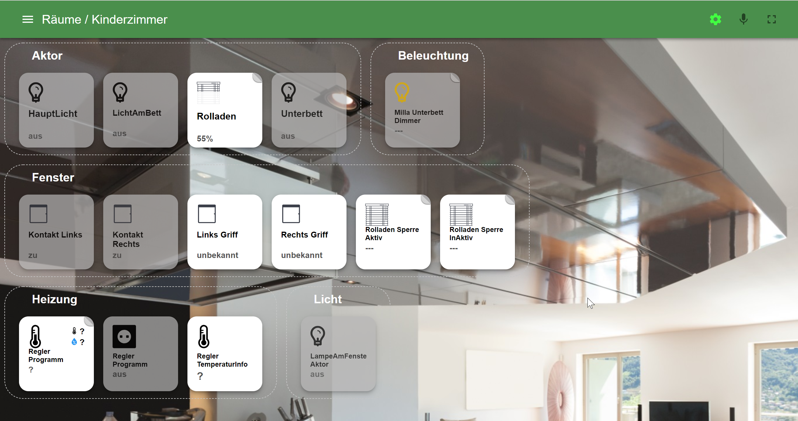

## Сделайте свою жизнь проще: Умный дом
Разве не было бы практично централизованно и в одном месте считывать температуры, значения потребления или состояния переключения устройств разных производителей? Разве мы не должны помнить о включении и выключении устройств при достижении определенных условий или состояний?

Такое удобство может предложить умный дом – умный дом.
И при желании он предлагает даже больше: автоматизацию и возможность удаленного доступа ко всем этим вещам.

### Решение: ioBroker — автоматизируйте свою жизнь
**ioBroker** — это программное решение для автоматизации вашего дома.
Это позволяет интегрировать широкий спектр систем умного дома, которые оставались бы изолированными без ioBroker, что обеспечивает комплексный контроль.

Таким образом, **ioBroker** является **платформой** интеграции Интернета вещей (IoT) и обеспечивает интеграцию бесплатных и коммерческих продуктов практически из всех сфер жизни, а также интеграцию самостоятельно созданных решений.

**Система ioBroker** является модульной и может быть расширена по индивидуальным пожеланиям путем установки отдельных плагинов, которые мы называем адаптерами.

Имея более 600 адаптеров, ioBroker обеспечивает интеграцию различных платформ, систем и устройств от A, таких как Alexa, до Z, таких как Zigbee, и предлагает множество других вариантов автоматизации.

#### Что такое адаптеры?
**Адаптеры** — это **плагины** (программные модули, небольшие программы), написанные на JavaScript для Node.js, которые были специально разработаны для конкретных устройств, типов устройств, устройств определенных производителей или других служб, например для запроса веб-сайтов.

Эти адаптеры обеспечивают соединение между физическими устройствами (например, управляемыми розетками, реле, дистанционными термометрами и т.п.) и центральной системой ioBroker. Вы можете считывать значения, измеренные устройствами, и управлять устройствами, что часто происходит через WLAN в вашей собственной домашней сети.

Другие адаптеры предназначены для графического отображения измеренных значений, таких как температура, мощность, значения потребления или состояния переключения, в виде диаграмм.
Адаптеры визуализации также предлагают другие возможности, такие как интеграция изображений (например, с камер наблюдения), данных о погоде и многое другое.

Существуют также адаптеры, предлагающие функции для математических вычислений или логических операций (например, сравнения).
Их также можно использовать для создания небольших программ и определения правил, необходимых для автоматизации.

Поскольку JavaScript является одним из наиболее широко используемых языков программирования, уже существует множество готовых модулей, а новые часто можно разработать с относительно небольшими усилиями.
Если адаптер отсутствует, обычно можно быстро разработать подходящий.
Активное **сообщество разработчиков ioBroker** будет радо поддержать новых разработчиков в любое время.

**Совет:** [Обзор доступных адаптеров](https://www.iobroker.net/#de/adapters/adapters.md)

### IoBroker объединяет самые разные системы умного дома

На этом рисунке показано, как ioBroker, как центральная система, координирует и соединяет широкий спектр систем умного дома и других служб, таких как календари.
Адаптеры, доступные в ioBroker, обеспечивают связь с централизованно управляемыми календарями или системами «умного дома» конкретного производителя, которые подключены через LAN или WLAN.
Это позволяет программному обеспечению ioBroker получать информацию о состоянии или выполнять управляющие действия.

### Пример применения имитации присутствия
В этом примере приложения показано, как две независимые системы умного дома Philipps Hue и Homematic IP объединяются с помощью ioBroker для реализации имитации присутствия.

Подключив две системы умного дома к программному обеспечению ioBroker, ioBroker может изменять состояния ламп Hue (вкл/выкл) и рольставней (вверх/вниз). Время отпуска распознается путем подключения календаря к ioBroker.

Используя логические блоки (программирование логики адаптера) в ioBroker, пользователь теперь может реализовать следующий процесс всего за несколько шагов:

- Если в календаре внесена запись «Отпуск», все лампы HUE включатся в 18:00.
- В 22:00 все ставни закроются и все освещение в Хюэ погаснет.
- В 8 часов утра все ставни снова поднимутся.

Используя доступные адаптеры визуализации, пользователь может создавать индивидуальные страницы состояния и управления для своих ламп Hue и рольставней, доступ к которым можно получить с мобильных устройств из дома или во время отпуска (например, с помощью облачных сервисов ioBroker или VPN).

## Сильные стороны ioBroker
### Независимость от платформы
ioBroker можно установить практически на все аппаратные платформы, работающие под управлением Linux, OSX, Windows или Docker в качестве операционной системы. Возможны одноплатные компьютеры (например, Raspberry Pi), серверы, NAS или серверы со средой виртуализации (например, Proxmox, настольные компьютеры и т. д.).

Простая процедура установки, состоящая из одной строки (однострочный установщик), обеспечивает удобную установку под Linux и OSX и, таким образом, быстрый запуск ioBroker.

### Масштабируемость
Если со временем потребуется подключение дополнительных систем умного дома, пользователь может реализовать их в любой момент с помощью дополнительных адаптеров в ходе текущей эксплуатации.
Сам ioBroker также масштабируем: можно подключить несколько серверов ioBroker, чтобы сформировать многохостовую систему. Можно даже смешивать платформы операционных систем и связывать одноплатные компьютеры с большими многоядерными серверами.

###Индивидуальное программирование процессов
Благодаря логическим адаптерам ioBroker предлагает возможность создания отдельных процессов и сценариев.
В сценарии, например, значение может отслеживаться с помощью адаптера (отпуск вносится в календарь на сегодня) и может быть инициировано действие (включение всех ламп Hue в 18:00).

В ioBroker эти отдельные процессы могут быть реализованы путем перетаскивания строительных блоков (графическое программирование) в «Правилах» или «Блочно» или могут быть реализованы в классической форме с помощью «Javascript» или «Typescript» в виде написанного исходного кода. .

Дальнейшие объяснения логических блоков, а также дальнейшее введение в другие логические блоки, такие как Node-Red или адаптер сцены, описаны в разделе «Логика и автоматизация» этой документации.

## Визуализация
Несколько адаптеров визуализации предлагают пользователю возможность графически реализовать параметры управления и информацию о состоянии.
Эти отдельные визуализации затем можно отображать и управлять ими на планшете, смартфоне или компьютере.

Некоторые адаптеры визуализации и их основные свойства кратко представлены ниже.

### ВИС
[Видна сторона адаптера](https://www.iobroker.net/#de/adapters/adapterref/iobroker.vis/README.md)

Благодаря адаптеру VIS (визуализация) ioBroker предоставляет мощный инструмент для создания индивидуальных визуализаций. Текущие значения датчиков могут отображаться как графически, так и в виде исторических кривых. Живое изображение с камер наблюдения, реализация системы сигнализации, систем отопления и кондиционирования воздуха – практически все, что только можно себе представить, также может быть реализовано.

Используя VIS, пользователь имеет максимальную свободу проектирования во время реализации. Готовые строительные блоки для простоты использования помогают пользователю собрать пользовательский интерфейс. Но возможно не только отображение информации. Устройствами также можно быстро управлять через интерфейс визуализации. Работу интерфейса можно адаптировать к широкому спектру устройств — от смартфонов и настенных планшетов с сенсорными функциями до ПК — всего можно добиться простым перетаскиванием.

 

### Интерфейс материала
Интерфейс React и Material UI.

[Материал стороны адаптера](https://www.iobroker.net/#de/adapters/adapterref/iobroker.material/README.md)

### Джарвис
[Страница адаптера Джарвиса](https://www.iobroker.net/#de/adapters/adapterref/iobroker.jarvis/README.md)

Jarvis — это визуализация Material Design, основанная на пользовательском интерфейсе Material. Jarvis предоставляет структуру и модули, которые используются для визуализации, но могут быть настроены очень гибко.

Jarvis отзывчив, адаптируется к размеру экрана и предлагает стандартизированный дизайн, позволяющий быстро создать визуализацию.

Планировку можно гибко настроить. Макет можно разделить на любое количество вкладок. Каждая вкладка может быть либо отображена в полноэкранном режиме, либо разделена на отдельные столбцы.

 

### IQcontrol
Достигайте своей цели быстро, но при этом гибко – вот что отличает iQontrol:

- Создайте Vis один раз и используйте его везде: от ПК, планшета до мобильного телефона, iQontrol работает на всех устройствах — либо в браузере, либо в виде веб-приложения (можно сохранить на главном экране, а затем воспринимать как приложение)
- iQontrol динамически адаптируется ко всем разрешениям (адаптивный дизайн)
- Супер быстрое время загрузки
- Благодаря стандартным настройкам вы сможете быстро достичь своей цели
- Однако благодаря расширенным настройкам и виджетам у вас есть высокий уровень гибкости и возможностей настройки (в некоторых установках вы больше не узнаете, что это на самом деле iQontrol)

Видео [Демо-видео iQontrol][]

    

### Ловелас
[Адаптер боковой ловелас](https://www.iobroker.net/#de/adapters/adapterref/iobroker.lovelace/README.md)

С адаптером Lovelace пользовательский интерфейс HomeAssistant Lovelace можно использовать для ioBroker. Lovelace имеет адаптивный дизайн и поэтому автоматически адаптируется к макету экрана вашего ПК, планшета или смартфона.

В Lovelace напрямую доступны для просмотра/управления устройства с их свойствами, которые хранятся в ioBroker (например, включение/выключение лампы, яркость, цветовая температура).

Редактор Lovelace (принцип WYSIWYG — принцип «что видишь, то и получаешь») позволяет легко создавать современные пользовательские интерфейсы всего за несколько шагов. Доступны пользовательские карточки и редактор YAML для реализации более сложных требований и пожеланий. Вдохновение для пользовательского интерфейса Lovelace можно собрать в мире HomeAssistant, а затем реализовать в ioBroker.

## Кто стоит за ioBroker?
ioBroker — это проект с открытым исходным кодом, разработанный сообществом ioBroker и администрируемый [Блюфокс](https://github.com/GermanBluefox) как владельцем проекта.

Многие разработчики и многие другие помощники добровольно тратят свое свободное время на разработку основных компонентов системы ioBroker, множества адаптеров, поддержки социальных сетей, документации и многого другого.
Благодаря большому и отзывчивому сообществу на данный момент найдено решение для каждой проблемы.

ioBroker придерживается децентрализованного подхода, при котором каждый адаптер хранится в собственном репозитории GitHub.
Соответствующий разработчик адаптера принимает решения относительно своего адаптера в значительной степени самостоятельно.
Запросы на дополнительную функциональность или внешние расширения функций в виде «запросов на включение», конечно, принимаются во внимание.

Некоторые разработчики также объединили усилия в сообществе адаптеров ioBroker, чтобы гарантировать, что даже если у отдельных разработчиков больше нет времени на свои адаптеры, их можно будет поддерживать.

Контрактной поддержки со стороны сообщества открытого исходного кода нет, но вместе мы решили все проблемы!

Решения по направлениям для центральных компонентов и всего проекта обсуждаются основной командой, а затем реализуются.

Команда разработчиков ioBroker Core состоит из:

* [Bluefox](https://github.com/НемецкийBluefox)
* [Apollon77](https://github.com/Apollon77)
* [foxriver76](https://github.com/foxriver76)
* [AlCalzone](https://github.com/AlCalzone)

Список [Разработчик ioBroker](https://forum.iobroker.net/groups/developer) можно найти на форуме ioBroker.

### Лицензии и стоимость
Многие проекты ioBroker доступны вместе с исходным кодом на [GitHub](https://github.com/ioBroker).
В подавляющем большинстве случаев исходный код находится под лицензией MIT.
Однако иногда используются такие лицензии, как GPL, CC BY-NC или другие, что необходимо учитывать, но сами по себе они не имеют большого значения для конечных пользователей! Разработчик адаптера сам определяет лицензию для соответствующего адаптера.

В очень редких случаях (на данный момент менее 5 адаптеров) для использования адаптера требуется (иногда платная) лицензия.
Например, ioBroker GmbH предоставляет бесплатную лицензию для частного использования адаптера «VIS», однако для коммерческого использования необходима платная лицензия.
Обзор и заказ лицензии на эти адаптеры можно найти на этой странице [iobrokerЦены](https://iobroker.net/www/pricing).
Там же указана стоимость коммерческого использования этих адаптеров.

### Как финансируется ioBroker?
Все центральные компоненты и почти все остальные адаптеры доступны бесплатно, а исходный код подавляющего большинства адаптеров находится в открытом доступе на GitHub.

Поскольку проект с открытым исходным кодом не может приносить доход, например, на покупку серверов, для этих вещей необходима официальная корпоративная форма ioBroker GmbH.
ioBroker GmbH также предлагает, среди прочего, коммерческую поддержку программного обеспечения ioBroker или продает, например, сервер ioBroker.

ioBroker GmbH бесплатно предоставляет инфраструктуру (например, сервер форума) для проекта сообщества и уже приобрела в прошлом услуги по разработке, которые пошли на разработку проектов с открытым исходным кодом (например, администратора).

ioBroker Free Cloud — это также бесплатный сервис, предоставляемый сообществу компанией ioBroker GmbH. Pro-Cloud и служба IOT являются коммерческими предложениями от ioBroker GmbH, стоимость которых лишь покрывает эксплуатационные расходы.

## Удаленный доступ к вашей установке ioBroker через ioBroker Cloud
Удаленное управление локально установленной системой ioBroker возможно круглосуточно для пользователя или системных интеграторов через дополнительный облачный доступ. Контроль доступа может свободно настраиваться пользователем с помощью пользователей и групп.
На следующем рисунке показан обзор продуктов облачной службы ioBroker.

## Сообщество
С 2014 года ioBroker заручился широкой поддержкой тысяч пользователей и разработчиков благодаря своим многочисленным преимуществам. Пользователи и разработчики встречаются в специально созданном [форум](https://forum.iobroker.net) и обмениваются друг с другом опытом и предложениями. На сервере ioBroker [Раздор](https://discord.gg/sGWE65zF) можно обмениваться опытом в живом чате, а сеансы отладки в режиме реального времени можно проводить в кратчайшие сроки, чтобы разобраться в сути текущих проблем.

Сборник ссылок из официальных сообществ ioBroker:

- Форум ioBroker: [Форум](https://forum.iobroker.net)
- Сервер Discord ioBroker: [Discord](https://discord.gg/sGWE65zF)
- Группа Facebook «ioBroker SmartHome и IoT»: [FacebookioBrokerSmartHomeIoT](https://www.facebook.com/groups/440499112958264)
- Группа Facebook «ioBroker и умный дом по всему миру»: [FacebookioBrokerSmartHomeIoTInternational](https://www.facebook.com/groups/iobrokerinternational)

## Статистика ioBroker
На [ioBrokerStatistics](https://www.iobroker.net/#de/statistics) вы найдете обзорную страницу с интересной статистикой ioBroker.

[Grundlagen]: https://www.iobroker.net/#de/documentation/basics/README.md

[Adaptern]: https://www.iobroker.net/#de/adapters/adapters.md

[hier zu finden]: https://www.iobroker.net/docu/

[im Forum]: https://forum.iobroker.net/category/186/dokumentations-support

[GitHub]: https://github.com/ioBroker

[Forum]: https://forum.iobroker.net

[Telegram]: https://t.me/iobrokergermany

[Discord]: https://discord.gg/sGWE65zF

[FacebookIoBrokerSmartHomeIoT]: https://www.facebook.com/groups/440499112958264

[FacebookIoBrokerSmartHomeIoTInternational]: https://www.facebook.com/groups/iobrokerinternational

[iobrokerPreise]: https://iobroker.net/www/pricing

[Bluefox]: https://github.com/GermanBluefox

[Apollon77]: https://github.com/Apollon77

[foxriver76]: https://github.com/foxriver76

[AlCalzone]: https://github.com/AlCalzone

[ioBrokerStatistics]: https://www.iobroker.net/#de/statistics

[Adapterseite Material]: https://www.iobroker.net/#de/adapters/adapterref/iobroker.material/README.md

[Adapterseite Jarvis]: https://www.iobroker.net/#de/adapters/adapterref/iobroker.jarvis/README.md

[Adapterseite vis]: https://www.iobroker.net/#de/adapters/adapterref/iobroker.vis/README.md

[Adapterseite lovelace]:https://www.iobroker.net/#de/adapters/adapterref/iobroker.lovelace/README.md

[iQontrol Demo Video]: https://www.youtube.com/watch?v=QHgmrzMmcX4&list=PL8epyNz8pGEv6-R8dnfXm-m5aBlZFKOBG&index=1

[ioBroker Developer]: https://forum.iobroker.net/groups/developer