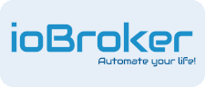

# Бренд и внешний вид

Название, логотип, цвета и шрифт ioBroker для всех, кто разрабатывает что-либо с этим названием: авторы адаптеров, пресса, лекции, видеоролики.

## написание

**ioBroker** пишется одним словом, с маленькой буквой i и заглавной B. Всегда, даже в начале предложения.

| Правильный                 | Неверно                                            |
| -------------------------- | -------------------------------------------------- |
| ioBroker                   | IoBroker, IOBroker, Iobroker, io broker, io broker |
| ioBroker.vis, ioBroker.iot | ioBroker VIS, IoBroker-IoT                         |

В доменных именах и именах пакетов все пишется строчными буквами: `iobroker.net`, `iobroker.pro`, `npm i iobroker.javascript` Названия адаптеров отображаются так, как они указаны в репозитории, то есть строчными буквами: `javascript`, `node-red`, `scenes`.

## логотип

Три компонента, которые можно использовать по отдельности:

- **Логотип** , круг с буквой «i», где мало места: фавикон, иконка приложения, фотография профиля, шапка сайта.
- **Словесный знак** , надпись _ioBroker_ , где впервые появляется логотип бренда и где ему отведено место.
- **Объединенный бренд** , в котором графический знак заменяет _io_ : версия для баннеров, обложек и рекламных материалов.
- **Слоган** _«Автоматизируйте свою жизнь!»_ расположен под товарным знаком и не переведен.

### Скачать

Нажатие на выбранный формат загрузит файл.

|                                                                                    | бренд              | формат                                                                                                                                                                                                                                |
| ---------------------------------------------------------------------------------- | ------------------ | ------------------------------------------------------------------------------------------------------------------------------------------------------------------------------------------------------------------------------------- |
|              | логотип            | <a href="/brand/iobroker-bildmarke.svg" download="iobroker-bildmarke.svg"> SVG</a> ,<a href="/brand/iobroker-bildmarke-512.png" download="iobroker-bildmarke-512.png"> PNG 512 px </a>                                                |
|  | Словесный знак     | <a href="/brand/iobroker-wortmarke-zweifarbig.svg" download="iobroker-wortmarke-zweifarbig.svg"> SVG</a> ,<a href="/brand/iobroker-wortmarke-zweifarbig-1200.png" download="iobroker-wortmarke-zweifarbig-1200.png"> PNG 1200 px </a> |
|    | Объединенный бренд | <a href="/brand/iobroker-kombiniert.svg" download="iobroker-kombiniert.svg"> SVG</a> ,<a href="/brand/iobroker-kombiniert-1200.png" download="iobroker-kombiniert-1200.png"> PNG 1200 px</a>                                          |
|                                                                                    | Всё вместе         | <a href="/brand/iobroker-logos.zip" download="iobroker-logos.zip"> ZIP</a>                                                                                                                                                            |

## Цвета

Бренд представлен в двух оттенках синего:

| роль        | Ценить    | За что                                                          |
| ----------- | --------- | --------------------------------------------------------------- |
| Бренд синий | `#1D90CA` | Идентификационные линии, ссылки, номера, активные элементы      |
| Темно-синий | `#005894` | Кнопки, заголовки и текст, заполненные цветом, на светлом фоне. |

Области выделяются на фоне в четыре этапа. Они заменяют рамки: карта выделяется за счет своей области, а не за счет линии.

| Уровень   | Темный    | Яркий     |
| --------- | --------- | --------- |
| Страница  | `#080B1C` | `#FFFFFF` |
| Область   | `#031D38` | `#E6EEF7` |
| Элитный   | `#052E57` | `#D6E4F2` |
| Наложение | `#06386B` | `#C8DAEC` |

## Письмо

| Письмо           | За что                                              | Сокращения      |
| ---------------- | --------------------------------------------------- | --------------- |
| **Аудиоширокий** | Заголовки, кнопки, номера, идентификационные строки | Обычный         |
| **Робото**       | Основной текст, подписи, таблицы                    | Обычный, Жирный |

Audiowide — это голос бренда, и его следует использовать экономно: в заголовке, кнопке, номере. Целый абзац, написанный в стиле Audiowide, — это ошибка.