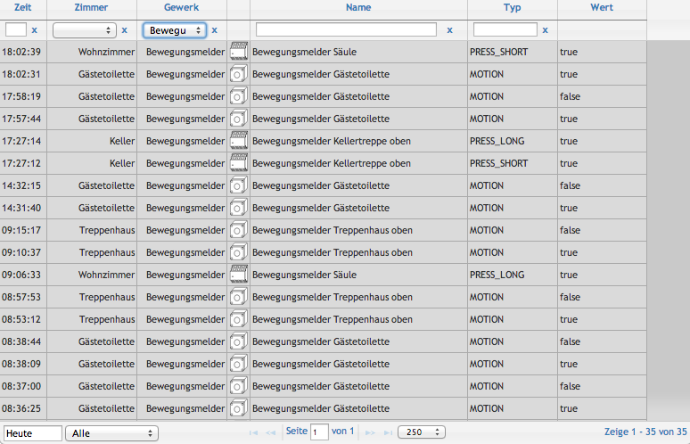
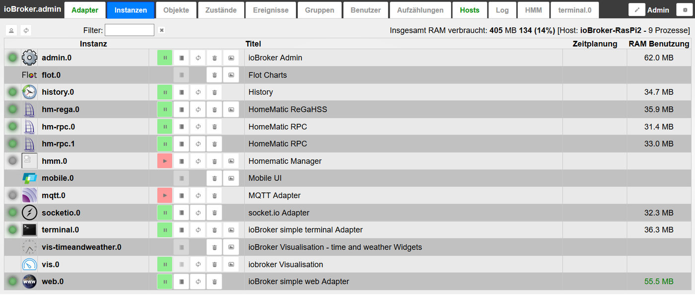
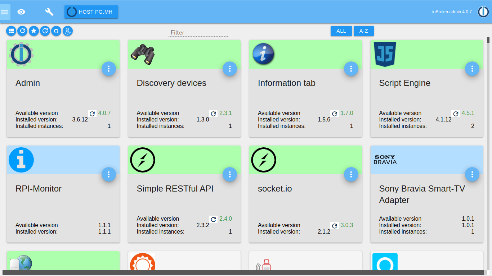
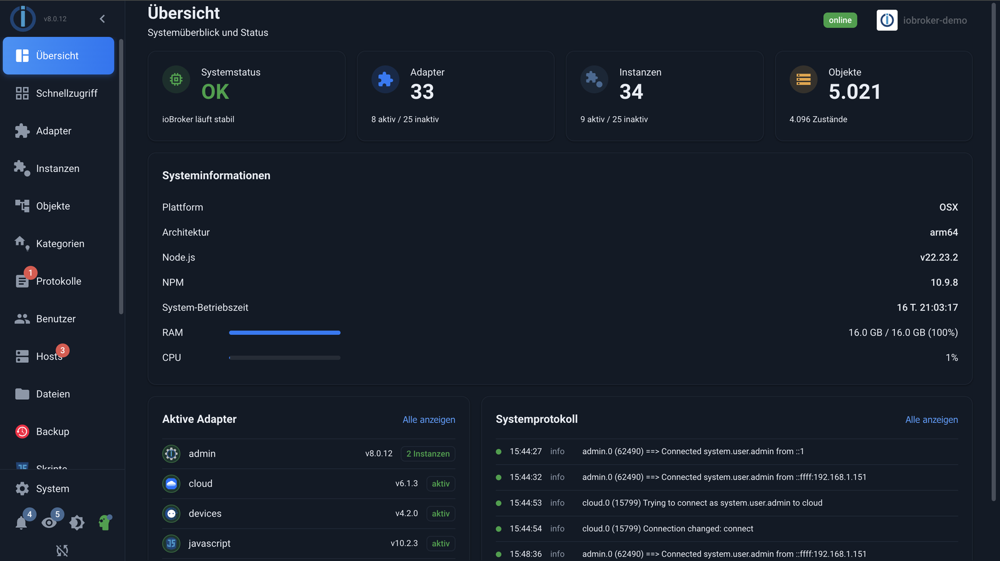

# История ioBroker

Всё началось с простого желания: визуализации собственного дома. Из этого выросла платформа, которая сейчас работает во многих тысячах домов, предлагая адаптеры практически для всех типов устройств и сообщество, которое больше, чем сам проект. На этой странице рассказывается история того, как всё это происходило год за годом.

## 2013: CCU.IO, краеугольный камень

Все началось с Homematic и желания наконец-то получить четкое представление о своих устройствах. Себастьян Рафф заложил основу для проекта CCU.IO в этом году. Он имел решающее значение для интеграции систем Homematic, и поэтому его архитектура в значительной степени основывалась на Homematic.

Мы познакомились благодаря CCU.IO, и вместе с этим зародилась идея, лежащая в основе всего остального: открытая и гибкая платформа для домашней автоматизации, не привязанная к одному производителю.

_CCU.IO, 2013. Время, комната, сделка, имя, тип, значение: столбцы того времени описывали то же самое, что ioBroker теперь называет объектами и состояниями._

## 2014 год: CCU.IO становится ioBroker

Год спустя проектом пользовались около 150 человек, и при таком количестве пользователей стали очевидны его ограничения. CCU.IO имел серьезные концептуальные недостатки, которые препятствовали бы долгосрочной поддержке и дальнейшему развитию. Значения хранились в JSON-файле; это был стандарт проекта, а для системы, предназначенной для роста, это тупик.

Именно поэтому мы решили создать ioBroker. С самого начала мы сосредоточились на высокомодульной структуре, которая позволяет гибко адаптировать и расширять систему, вместо того чтобы пытаться исправить существующую, органично развивающуюся архитектуру. JSON-файл был заменен выделенной базой данных, сначала CouchDB, а затем Redis. ioBroker задумывался как платформа, способная решать задачи будущего.

Себастьян Рафф покинул проект в 2014 году. Его фонд поддержал все последующие проекты.

## 2016: Речь и дистанционное управление

В этом году ioBroker меняет подход к использованию благодаря двум новым функциям. Интеграция с Alexa обеспечивает голосовое управление дома, а первое облачное решение позволяет получать доступ из любой точки мира без необходимости открывать какие-либо порты на маршрутизаторе.

В том же году к основной команде присоединяется Инго Фишер ( [@apollon77](https://github.com/Apollon77) ). Проект превращается в группу.

## 2017: Компания, занимающаяся инфраструктурой.

Серверы, домены, репозитории, сертификаты: чем больше людей используют ioBroker, тем меньше эта инфраструктура зависит от какого-либо отдельного человека. Поэтому при поддержке Ортвина Тишлера создается компания, стоящая за ioBroker, задача которой – обеспечить безопасность инфраструктуры проекта.

Мориц Хойзингер ( [@foxriver76](https://github.com/foxriver76) ) присоединяется к основной команде.

## Между тем: фундамент растет

Годы между ключевыми этапами — это годы, когда фундамент становится стабильным. Опыт, полученный во время работы в Siemens, пригодился в проекте и изменил взгляд на удобство сопровождения и процессы. Для пользовательских интерфейсов был выбран React, а для основной системы была добавлена более надежная стратегия тестирования. Инго и Мориц работали над js-контроллером, сердцем системы, а административный интерфейс постепенно эволюционировал до того вида, который он имеет сегодня.

_Администратору примерно в 2015 году был нужен только список экземпляров, и этого было достаточно._

_В состав Admin 4 входят плитки, внешний вид материалов и каталог адаптеров._

_Сегодня: обзор, отображающий состояние системы, адаптеры, экземпляры и журналы событий._

## 2022: vis-2

В этом году начинается работа над [ioBroker.vis-2](https://github.com/ioBroker/ioBroker.vis-2) , новой системой визуализации, и в том же году принимается личное решение: уход из Siemens и полная сосредоточенность на ioBroker. vis-2 выпускается позже в том же году.

## 2024 год: десять лет и встреча в Золингене.

С 2014 по 2024 год ioBroker отмечал свой десятый юбилей. Эта знаменательная дата отмечалась не онлайн, а впервые лично: 9 ноября 2024 года в мастерской Gläserne Werkstatt (Стеклянная мастерская) в Золингене состоялась первая крупная встреча сообщества ioBroker. На встрече присутствовало около 160 человек, были представлены доклады, и многие впервые увидели лица тех, кого знали по форуму. Встречу организовали Инго Фишер и его команда при поддержке Shelly и Solingen Digital.

## Кто создает ioBroker?

ioBroker — это результат работы множества людей: над ядром, адаптерами, документацией, форумом и переводами. В сообществе люди знают друг друга по инициалам:

[@bluefox](https://github.com/GermanBluefox) , [@Apollon77](https://github.com/Apollon77) , [@foxriver76](https://github.com/foxriver76) , [@AlCalzone](https://github.com/AlCalzone) , [@arteck](https://github.com/arteck) , [@Garfonso](https://github.com/Garfonso) , [@simatec](https://github.com/simatec) , [@Firestorm](https://github.com/Feuersturm) , [@](https://github.com/Eistee82) Istee82 , [@Dutchman](https://github.com/DutchmanNL) , [@eric2905](https://github.com/Eric2905) , [@UncleSam](https://github.com/UncleSamSwiss) , [@Jey-Cee](https://github.com/Jey-Cee) , [@mcm1957](https://github.com/mcm1957) , [@ldittmar81](https://github.com/ldittmar81) , [@oelison](https://github.com/oelison) , [@klein0r](https://github.com/klein0r) , [@Homoran](https://github.com/Homoran)

и множество других энтузиастов.

## История продолжается

Представленный здесь обзор в первую очередь является приглашением: ioBroker развивается вместе с людьми, которые принимают участие. Ежедневная помощь предлагается на [форуме](https://forum.iobroker.net/) , и любой желающий внести свой вклад может найти возможность сделать это в разделе [«Принять участие](/docs/community/README.md) ».