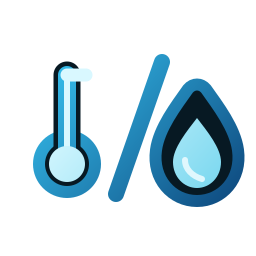

# ioBroker.absolutehumidity

## Адаптер абсолютной влажности для ioBroker

Абсолютную влажность можно рассчитать на основе фактической температуры и относительной влажности.

## Метод расчета

Адаптер использует эмпирические формулы приближения Магнуса для расчета давления насыщенного пара на основе температуры и относительной влажности.

- Абсолютная влажность рассчитывается исходя из давления насыщенного пара с использованием приближения Магнуса/Болтона и закона идеального газа. Результат представляется в г/м³.
- Температура точки росы рассчитывается с использованием формулы Магнуса с коэффициентами Зонтага. Результат выводится в °C.

Небольшие отклонения от таблиц, доступных онлайн, ожидаемы, поскольку в разных таблицах часто используются разные наборы коэффициентов Магнуса, Тетенса, Зоннтага, Болтона или Бака.

Страница приложения интерактивна и позволяет рассчитывать абсолютную влажность, температуру точки росы и давать рекомендации по вентиляции на основе данных, записанных аналоговым или ручным способом. Просто введите значения, и результат отобразится автоматически.

## Установка

Пока адаптер ещё не добавлен в стабильный репозиторий, его можно установить вручную из NPM. Примечание: НИКОГДА не устанавливайте его из GitHub.

Ссылка для установки: <https://github.com/BenAhrdt/ioBroker.absolutehumidity>

## Создайте вкладку на панели вкладок.

Используйте значок булавки, чтобы создать вкладку на панели вкладок. Используйте кнопку "+ Добавить устройство", чтобы добавить устройство.

## Добавить устройство

Для добавления устройства необходимо присвоить ему имя и выбрать два состояния: температуру и относительную влажность. При желании можно указать, следует ли также (снова) включать эти два значения в объекты адаптера.

## Вид плитки

Плитки для наружного использования отображаются зеленым цветом, а для внутреннего — синим. В режиме просмотра плитки отсортированы в порядке возрастания влажности, то есть от сухих к более влажным. (Если первой появляется зеленая плитка, возможно, стоит проветрить помещение).

## Вид объекта

## Ссылка на форум Iobroker

<https://forum.iobroker.net/topic/85455/test-adapter-absolut-humidity>

## Сотрудничество

Адаптер был разработан в сотрудничестве с Йоргом Фрёнером.

## Changelog
<!--
	Placeholder for the next version (at the beginning of the line):
	### **WORK IN PROGRESS**
-->
### 0.1.6 (2026-09-28)
* Rename the visible Device Manager references to Config Manager in the adapter configuration and translations.
* Add delayed device configuration backups with manual restore and startup recovery when no device configuration exists.

### 0.1.5 (2026-09-27)
* Update the repository-check dependencies and test the adapter on Node.js 26.

### 0.1.4 (2026-09-21)
* Keep long Device Manager measurements readable with a smaller value font and at most two decimal places.

### 0.1.3 (2026-09-21)
* Restore the regular adapter configuration page with interactive outdoor and indoor preview cards, and provide a link to the Device Manager in Config Manager.

### 0.1.2 (2026-09-20)
* Keep the Device Manager in the adapter configuration instead of a separate Admin tab. Render the four live measurements through one shared HTML row template per card; Admin's read-only numeric state control otherwise adds a progress indicator for percent and bounded states.

## License
MIT License

Copyright (c) 2026 BenAhrdt <github@ben-schmidt.net>

Permission is hereby granted, free of charge, to any person obtaining a copy
of this software and associated documentation files (the "Software"), to deal
in the Software without restriction, including without limitation the rights
to use, copy, modify, merge, publish, distribute, sublicense, and/or sell
copies of the Software, and to permit persons to whom the Software is
furnished to do so, subject to the following conditions:

The above copyright notice and this permission notice shall be included in all
copies or substantial portions of the Software.

THE SOFTWARE IS PROVIDED "AS IS", WITHOUT WARRANTY OF ANY KIND, EXPRESS OR
IMPLIED, INCLUDING BUT NOT LIMITED TO THE WARRANTIES OF MERCHANTABILITY,
FITNESS FOR A PARTICULAR PURPOSE AND NONINFRINGEMENT. IN NO EVENT SHALL THE
AUTHORS OR COPYRIGHT HOLDERS BE LIABLE FOR ANY CLAIM, DAMAGES OR OTHER
LIABILITY, WHETHER IN AN ACTION OF CONTRACT, TORT OR OTHERWISE, ARISING FROM,
OUT OF OR IN CONNECTION WITH THE SOFTWARE OR THE USE OR OTHER DEALINGS IN THE
SOFTWARE.